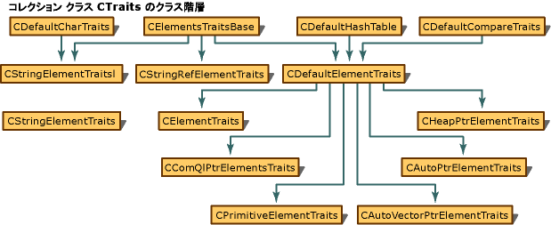

# ATL コレクション クラス
ATL は、格納およびデータにアクセスするための多くのクラスを提供します。 どのクラスを使用する場合など、いくつかの要因によって異なります。  
  
-   格納するデータの量  
  
-   データへのアクセスの効率とパフォーマンス  
  
-   インデックスまたはキーでデータにアクセスする機能  
  
-   データを並べ替える方法  
  
-   各ユーザーの好み  
  
## 小さなコレクション クラス  
 ATL は、少数のオブジェクトを処理するための次のような配列クラスを提供します。 ただし、これらのクラスが限定され、ATL で内部的に使用するために設計されました。 プログラムで使用することは推奨されません。  
  
|クラス|データ ストレージの種類|  
|-----------|--------------------------|  
|[CSimpleArray](../atl/reference/csimplearray-class.md)|少数のオブジェクトを処理するため、配列クラスを実装します。|  
|[CSimpleMap](../atl/reference/csimplemap-class.md)|少数のオブジェクトを処理するためのマップ クラスを実装します。|  
  
## 汎用コレクション クラス  
 以下のクラスは、配列、リスト、およびマップを実装し、汎用コレクション クラスとして提供されます。  
  
|クラス|データ ストレージの種類|  
|-----------|--------------------------|  
|[CAtlArray](../atl/reference/catlarray-class.md)|配列を実装します。|  
|[CAtlList](../atl/reference/catllist-class.md)|リストを実装します。|  
|[CAtlMap](../atl/reference/catlmap-class.md)|データを参照して、キーまたは値でそれにより、マップ構造体を実装します。|  
|[CRBMap](../atl/reference/crbmap-class.md)|赤、黒のアルゴリズムを使用してマップ構造体を実装します。|  
|[CRBMultiMap](../atl/reference/crbmultimap-class.md)|赤、黒のマルチ マップ構造体を実装します。|  
  
 これらのクラスは、デバッグ ビルドで使用すると、多くのプログラミング エラーがトラップされますが、パフォーマンス、ためこれらのチェックは実行されません製品版ビルドで。  
  
## 特殊化されたコレクション クラス  
 専門的なコレクション クラスは、メモリ ポインターとのインターフェイス ポインターを管理するためも用意されています。  
  
|クラス|目的|  
|-----------|-------------|  
|[CAutoPtrArray](../atl/reference/cautoptrarray-class.md)|スマート ポインターの配列を構築するときに役立つメソッドを提供します。|  
|[CAutoPtrList](../atl/reference/cautoptrlist-class.md)|スマート ポインターのリストを構築するときに役立つメソッドを提供します。|  
|[CComUnkArray](../atl/reference/ccomunkarray-class.md)|ストア`IUnknown`ポインターへのパラメーターとして使用するものでは、 [IConnectionPointImpl](../atl/reference/iconnectionpointimpl-class.md)テンプレート クラス。|  
|[CHeapPtrList](../atl/reference/cheapptrlist-class.md)|ヒープのポインターのリストを構築するときに役立つメソッドを提供します。|  
|[CInterfaceArray](../atl/reference/cinterfacearray-class.md)|COM インターフェイス ポインターの配列を構築するときに役立つメソッドを提供します。|  
|[CInterfaceList](../atl/reference/cinterfacelist-class.md)|COM インターフェイス ポインターのリストを構築するときに役立つメソッドを提供します。|  
  
## コレクション クラスの選択  
 使用可能なコレクション クラスは、次の表に示すように、さまざまなパフォーマンス特性を提供します。  
  
-   2 および 3 の列は、各クラスの順序付けと特性にアクセスします。 表に使用されている用語 "順序付け" とは、項目を挿入または削除した順によってコレクション内の項目の位置が決まることを意味します。項目がその内容によって並べ替えられることを意味するのではありません。 用語 "インデックス付き" は、通常の配列内の項目と同様に、コレクション内の項目を整数インデックスによって取得できることを意味します。  
  
-   4 と 5 列では、各クラスのパフォーマンスについて説明します。 頻繁にコレクションに項目を挿入するアプリケーションでは、項目の挿入速度が特に重要です。他のアプリケーションでは、検索速度の方がより重要になる場合があります。  
  
-   6 列目は、各形状で項目の重複が許可されるかどうかを表しています。  
  
-   指定したコレクション クラスの操作のパフォーマンスは、操作と、コレクション内の要素の数を完了に必要な時間の間のリレーションシップとして表現されます。 までの時間が、オペレーション線形に増加する数の要素の増加は、o (n) アルゴリズムとして説明されています。 これに対し、一定期間が少なくなり、要素数が増えるとして増加する操作は O (ログ) アルゴリズムとして説明します。 そのため、パフォーマンスの観点から O (ログ) アルゴリズムがよりも多いほど、要素数が増えるの o (n) アルゴリズム。  
  
### コレクションの形状と特徴  
  
|形式|順序あり|インデックスを作成|挿入します。   要素|検索   指定された要素|重複   要素|  
|-----------|--------------|--------------|---------------------------|--------------------------------------|-----------------------------|  
|リスト|[はい]|×|高速 (定数時間)|低速の o (n)|[はい]|  
|配列|[はい]|整数 (定数時間) による|最後に挿入する場合を除く低速の o (n)|低速の o (n)|[はい]|  
|マップ|×|キー (定数時間)|高速 (定数時間)|高速 (定数時間)|いいえ (キー)、はい (値)|  
|赤、黒のマップ|○ (キー)|キー O (ログ) に|高速 O (ログ)|高速 O (ログ)|×|  
|赤、黒の Multimap|○ (キー)|キー O(log n) (キーごとの複数の値) に|高速 O (ログ)|高速 O (ログ)|[はい] (キーごとの複数の値)|  
  
## CTraits オブジェクトを使用します。  
 ATL コレクション クラスは、広範囲のユーザー定義データ型を格納するために使用できる、比較などの重要な機能をオーバーライドすることができます、可能性があります。 CTraits クラスを使用してこれを実現します。  
  
 CTraits クラスに似ていますが、MFC コレクション クラスのヘルパー関数です。 よりも柔軟性参照してください[コレクション クラスのヘルパー](../mfc/reference/collection-class-helpers.md)詳細についてはします。  
  
 コレクション クラスを構築するときに、CTraits クラスを指定するオプションがあります。 このクラスは、コレクション クラスを作成するその他のメソッドによって呼び出されたときの比較などの操作を実行するコードが格納されます。 たとえば、リスト オブジェクトには、独自のユーザー定義の構造が含まれています、場合、のみ特定のメンバー変数を比較する等値テストを再定義します。 この方法では、リスト オブジェクトの検索方法をさらに便利な方法で動作します。  
  
## 例  
  
### コード  
 [!code-cpp[NVC_ATL_Utilities#112](../atl/codesnippet/cpp/atl-collection-classes_1.cpp)]  
  
## コメント  
 CTraits クラスの一覧は、次を参照してください。[コレクション クラス](../atl/collection-classes.md)です。  
  
 次の図は、CTraits クラスのクラス階層を示します。  
  
   
  
## コレクション クラスのサンプル  
 次のサンプルでは、コレクション クラスを示しています。  
  
-   [MMXSwarm サンプル](../visual-cpp-samples.md)  
  
-   [DynamicConsumer サンプル](../visual-cpp-samples.md)  
  
-   [UpdatePV サンプル](../visual-cpp-samples.md)  
  
-   [マーキーのサンプル](../visual-cpp-samples.md)  
  
## 参照  
 [概念](../atl/active-template-library-atl-concepts.md)   
 [コレクション クラス](../atl/collection-classes.md)

