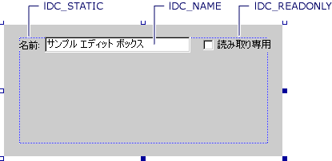

# <a name="example-implementing-a-property-page"></a>例: プロパティ ページの実装
この例では、ビルドを表示し、変更することができます) のプロパティのプロパティ ページ、[ドキュメント クラス](../mfc/document-classes.md)インターフェイスです。  
  
 この例がに基づいて、[例](../visual-cpp-samples.md)です。  
  
 この例を完了するには説明します。  
  
- [ATL プロパティ ページ クラスの追加](#vcconusing_the_atl_object_wizard)クラスの追加 ダイアログ ボックスと ATL プロパティ ページ ウィザードを使用します。  
  
- [ダイアログ リソースを編集](#vcconediting_the_dialog_resource)の興味深いプロパティ用に新しいコントロールを追加することによって、**ドキュメント**インターフェイスです。  
  
- [メッセージ ハンドラーを追加](#vcconadding_message_handlers)サイトのプロパティ ページを保持するユーザーによって行われた変更を通知します。  
  
-   いくつか追加`#import`ステートメントおよびで typedef、[ハウスキーピング](#vcconhousekeeping)セクションです。  
  
- [オーバーライドのために](#vcconoverriding_ipropertypageimpl_setobjects)プロパティ ページに渡されるオブジェクトを検証します。  
  
- [オーバーライドのために](#vcconoverriding_ipropertypageimpl_activate)プロパティ ページのインターフェイスを初期化します。  
  
- [オーバーライド IPropertyPageImpl::Apply](#vcconoverride_ipropertypageimpl_apply)を最新のプロパティ値を持つオブジェクトを更新します。  
  
- [プロパティ ページを表示する](#vccontesting_the_property_page)単純なヘルパー オブジェクトを作成します。  
  
- [マクロを作成する](#vcconcreating_a_macro)プロパティ ページをテストします。  
  
##  <a name="vcconusing_the_atl_object_wizard"></a> ATL プロパティ ページ クラスの追加  
 最初と呼ばれる DLL サーバー用の新しい ATL プロジェクトを作成`ATLPages7`です。 使用できるように、 [ATL プロパティ ページ ウィザード](../atl/reference/atl-property-page-wizard.md)プロパティ ページを生成します。 プロパティ ページ、**短い名前**の**DocProperties**に切り替えて、**文字列**ページを次の表に示すように、プロパティ固有 ページの項目を設定します。  
  
|アイテム|[値]|  
|----------|-----------|  
|Title|TextDocument|  
|ドキュメント文字列|VCUE TextDocument プロパティ|  
|ヘルプ ファイル|*\<空白 >*|  
  
 ウィザードのこのページで設定した値が返されますプロパティ ページのコンテナーを呼び出したときに**文字列**です。 コンテナーに依存することは通常はユーザーに、ページを識別する後の文字列に動作します。 タイトルは、通常、ページ上部のタブに表示されます。 および、ドキュメント文字列は (ただし、標準的なプロパティ フレームは、この文字列をまったく使用しない)、ステータス バーまたはツールヒントに表示される可能性です。  
  
> [!NOTE]
>  ここで設定した文字列は、ウィザードによって、プロジェクト内の文字列リソースとして格納されます。 ページのコードが生成された後に、この情報を変更する必要がある場合は、リソース エディターを使用してこれらの文字列を簡単に編集できます。  
  
 をクリックして**OK**ウィザードで、プロパティ ページを生成します。  
  
##  <a name="vcconediting_the_dialog_resource"></a> ダイアログ リソースの編集  
 これで、プロパティ ページが生成されたら、いくつかのコントロール、ページを表すダイアログ リソースを追加する必要があります。 エディット ボックス、静的テキスト コントロール、およびチェック ボックスを追加し、次に示すように、その Id を設定します。  
  
   
  
 これらのコントロールは、ドキュメント、および読み取り専用状態のファイル名を表示する使用されます。  
  
> [!NOTE]
>  ダイアログ リソースはフレームやコマンドのボタンは含まれません。 また、想定するようなタブが適用されます。 これらの機能を呼び出すことによって作成されたものなどのプロパティ ページ フレームによって提供される[持つ](http://msdn.microsoft.com/library/windows/desktop/ms678437)します。  
  
##  <a name="vcconadding_message_handlers"></a> メッセージのハンドラーを追加します。  
 所定の制御、状態を更新する、ダーティ ページのコントロールのいずれかの値が変更されたときにメッセージ ハンドラーを追加できます。  
  
 [!code-cpp[NVC_ATL_Windowing#73](../atl/codesnippet/cpp/example-implementing-a-property-page_1.h)]  
  
 このコードを呼び出して、編集コントロールまたはチェック ボックスをオンに加えられた変更に応答[IPropertyPageImpl::SetDirty](../atl/reference/ipropertypageimpl-class.md#setdirty)ページが変更されたサイトのページに通知します。 サイトのページを有効または無効に応答が通常、**適用**プロパティ ページ フレームのボタンをクリックします。  
  
> [!NOTE]
>  独自のプロパティ ページでは、正確にどのプロパティで変更されたユーザーによって変更されていないプロパティの更新を回避できますを追跡する必要があります。 この例では、元のプロパティ値の追跡は、変更を適用する際に、UI から現在の値と比較してそのコードを実装します。  
  
##  <a name="vcconhousekeeping"></a> ハウスキーピング  
 いくつかの追加`#import`DocProperties.h ステートメントについて、コンパイラが認識できるように、**ドキュメント**インターフェイス。  
  
 [!code-cpp[NVC_ATL_Windowing#74](../atl/codesnippet/cpp/example-implementing-a-property-page_2.h)]  
  
 参照する必要もあります、`IPropertyPageImpl`基底クラスは、次の追加`typedef`を**CDocProperties**クラス。  
  
 [!code-cpp[NVC_ATL_Windowing#75](../atl/codesnippet/cpp/example-implementing-a-property-page_3.h)]  
  
##  <a name="vcconoverriding_ipropertypageimpl_setobjects"></a> オーバーライドするために  
 最初の`IPropertyPageImpl`メソッドをオーバーライドする必要のあるは[SetObjects](../atl/reference/ipropertypageimpl-class.md#setobjects)です。 ここでは、1 つのオブジェクトのみが渡されていると、サポートしていることを確認するコードを追加します、**ドキュメント**予期しているインターフェイス。  
  
 [!code-cpp[NVC_ATL_Windowing#76](../atl/codesnippet/cpp/example-implementing-a-property-page_4.h)]  
  
> [!NOTE]
>  オブジェクトのファイル名を設定するユーザーを許可するために、このページの 1 つのオブジェクトのみをサポートするために理にかなって-任意の 1 つの場所で 1 つのファイルが存在できます。  
  
##  <a name="vcconoverriding_ipropertypageimpl_activate"></a> オーバーライドするために  
 次の手順では、ページが最初に作成したときに、基になるオブジェクトのプロパティ値を持つプロパティ ページを初期化します。  
  
 ここでは、ページのユーザーの変更を適用すると、比較のための初期プロパティ値に使用することもありますので、クラスには次のメンバーを追加する必要があります。  
  
 [!code-cpp[NVC_ATL_Windowing#77](../atl/codesnippet/cpp/example-implementing-a-property-page_5.h)]  
  
 基本クラスの実装、[アクティブ化](../atl/reference/ipropertypageimpl-class.md#activate)メソッドは、このメソッドをオーバーライドして基底クラスの呼び出し後に、独自の初期化を追加できるように、ダイアログ ボックスとそのコントロールの作成を担当します。  
  
 [!code-cpp[NVC_ATL_Windowing#78](../atl/codesnippet/cpp/example-implementing-a-property-page_6.h)]  
  
 このコードの COM メソッドを使用して、**ドキュメント**で関心のあるプロパティを取得するインターフェイスです。 提供されている Win32 API ラッパーを使用して、 [CDialogImpl](../atl/reference/cdialogimpl-class.md)と、ユーザーに、プロパティの値を表示する基本クラスです。  
  
##  <a name="vcconoverride_ipropertypageimpl_apply"></a> IPropertyPageImpl::Apply をオーバーライドします。  
 ユーザーは、オブジェクトに変更を適用する場合、プロパティ ページのサイトが呼び出す、[適用](../atl/reference/ipropertypageimpl-class.md#apply)メソッドです。 このコードの反転を実行**Activate** — 一方**Activate**オブジェクトから値を受け取り、それらのプロパティ ページで、コントロールへのプッシュを**適用**プロパティ ページ上のコントロールからの値を取得し、それらをオブジェクトにプッシュします。  
  
 [!code-cpp[NVC_ATL_Windowing#79](../atl/codesnippet/cpp/example-implementing-a-property-page_7.h)]  
  
> [!NOTE]
>  照合[方](../atl/reference/ipropertypageimpl-class.md#m_bdirty)初期確認をオブジェクトの不要な更新を回避する場合は、この実装の先頭に**適用**1 回以上呼び出されます。 メソッドの呼び出しで加えられた変更だけになることを確認するプロパティ値の対象としてチェックも、**ドキュメント**です。  
  
> [!NOTE]
> **ドキュメント**公開**FullName**読み取り専用プロパティとして。 プロパティ ページに加えられた変更に基づいて、ドキュメントのファイル名を更新するには、使用する必要が、**保存**メソッドを別の名前でファイルを保存します。 したがって、プロパティ ページのコードはありません自体を制限を取得するか、プロパティを設定します。  
  
##  <a name="vccontesting_the_property_page"></a> プロパティ ページを表示します。  
 このページを表示するには、単純なヘルパー オブジェクトを作成する必要があります。 ヘルパー オブジェクトが簡略化するメソッドを提供、**持つ**1 つのページを表示するための API が 1 つのオブジェクトに接続します。 このヘルパーをデザインする Visual Basic から使用できるようにします。  
  
 使用して、[クラスの追加 ダイアログ ボックス](../ide/add-class-dialog-box.md)と[ATL シンプル オブジェクト ウィザード](../atl/reference/atl-simple-object-wizard.md)新しいクラスを生成して使用する`Helper`短い名前として。 作成した後は、次の表に示すように、メソッドを追加します。  
  
|アイテム|[値]|  
|----------|-----------|  
|メソッド名|`ShowPage`|  
|パラメーター|`[in] BSTR bstrCaption, [in] BSTR bstrID, [in] IUnknown* pUnk`|  
  
 `bstrCaption`パラメーターは、ダイアログ ボックスのタイトルとして表示されるキャプション。 `bstrID`パラメーターは、CLSID または ProgID プロパティ ページの表示を表す文字列。 `pUnk`パラメーターになります、`IUnknown`プロパティ ページで構成するプロパティを持つオブジェクトのポインター。  
  
 次に示すように、メソッドを実装します。  
  
 [!code-cpp[NVC_ATL_Windowing#80](../atl/codesnippet/cpp/example-implementing-a-property-page_8.cpp)]  
  
##  <a name="vcconcreating_a_macro"></a> マクロを作成します。  
 プロジェクトを作成したら、プロパティ ページと、単純なマクロを作成して、Visual Studio 開発環境で実行することを使用して、ヘルパー オブジェクトをテストできます。 このマクロは、ヘルパーを作成オブジェクト、し、呼び出すその**ShowPage**の ProgID を使用して、メソッド、 **DocProperties**プロパティ ページ、 **IUnknown**ドキュメントのポインターVisual Studio エディターで現在アクティブにします。 このマクロに必要なコードは、次に示します。  
  
```  
Imports EnvDTE  
Imports System.Diagnostics  
 
Public Module AtlPages  
 
    Public Sub Test()  
    Dim Helper  
    Helper = CreateObject("ATLPages7.Helper.1")  
 
    On Error Resume Next  
    Helper.ShowPage(_ 
    ActiveDocument.Name,
    _ 
 "ATLPages7Lib.DocumentProperties.1",
    _ 
    DTE.ActiveDocument _)  
    End Sub  
 
End Module  
```  
  
 このマクロを実行すると、ファイル名と、現在アクティブなテキスト ドキュメントの読み取り専用の状態を示すプロパティ ページが表示されます。 ドキュメントの読み取り専用の状態は、開発環境でドキュメントに書き込む機能のみが反映されます。ディスク上のファイルの読み取り専用の属性には影響しません。  
  
## <a name="see-also"></a>関連項目  
 [プロパティ ページ](../atl/atl-com-property-pages.md)   
 [例](../visual-cpp-samples.md)

