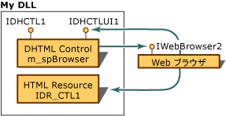

# DHTML コントロール プロジェクトの要素の識別
DHTML コントロール コードのほとんどが正確にそのような ATL コントロールに対して作成されます。 ジェネリック コードの基本を理解するには、使用、 [ATL チュートリアル](../atl/active-template-library-atl-tutorial.md)、セクションを参照して[ATL プロジェクトを作成する](../atl/reference/creating-an-atl-project.md)と[ATL COM オブジェクトの基本事項](../atl/fundamentals-of-atl-com-objects.md)です。  
  
 DHTML コントロールは、ATL コントロールに似ていますを除く。  
  
-   コントロールが実装する標準のインターフェイスだけでなく、C++ コードと HTML のユーザー インターフェイス (UI) の間の通信に使用される追加のインターフェイスを実装します。 HTML UI は、このインターフェイスを使用して C++ コードを呼び出します。  
  
-   UI コントロールの HTML リソースを作成します。  
  
-   メンバー変数を介して DHTML オブジェクト モデルへのアクセスを許可する`m_spBrowser`、型のスマート ポインターは[IWebBrowser2](https://msdn.microsoft.com/library/aa752127.aspx)です。 DHTML オブジェクト モデルの一部にアクセスするのにには、このポインターを使用します。  
  
 次の図は、DLL、DHTML コントロール、Web ブラウザー、および HTML リソース間のリレーションシップを示しています。  
  
   
  
> [!NOTE]
>  このグラフィックの名前は、プレース ホルダーです。 HTML リソースと、コントロールに公開されるインターフェイスの名前は、ATL コントロール ウィザードで割り当てた名前に基づいています。  
  
 この図に、要素です。  
  
-   **DLL** ATL プロジェクト ウィザードを使用して作成された DLL です。  
  
-   **DHTML コントロール**(`m_spBrowser`)、DHTML コントロール、ATL オブジェクト ウィザードを使用して作成します。 このコントロールは、Web ブラウザーのオブジェクトのインターフェイス、Web ブラウザーのオブジェクトとそのメソッドにアクセス**IWebBrowser2**です。 コントロール自体は、コントロールに必要なその他の標準のインターフェイスに加え、次の 2 つインターフェイスを公開します。  
  
    -   **IDHCTL1**コンテナーでのみ使用される、コントロールによって公開されるインターフェイス。  
  
    -   **IDHCTLUI1** C++ コードと HTML のユーザー インターフェイスの間で通信するためのディスパッチ インターフェイスです。 Web ブラウザーでは、コントロールを表示するのにコントロールのディスパッチ インターフェイスを使用します。 呼び出すことによって、コントロールのユーザー インターフェイスからこのディスパッチ インターフェイスのさまざまなメソッドを呼び出すことができます`window.external`、その後に起動するこのディスパッチ インターフェイスでメソッド名。 アクセスは`window.external`このコントロールの UI を構成する HTML 内のスクリプト タグからです。 リソース ファイル内の外部メソッドの呼び出しの詳細については、次を参照してください。 [DHTML からの C++ コードを呼び出す](../atl/calling-cpp-code-from-dhtml.md)です。  
  
-   **IDR_CTL1** HTML リソースのリソース ID です。 そのファイル名は、DHCTL1UI.htm をここでです。 DHTML コントロールでは、標準の HTML タグとテキスト エディターを使用して編集できる外部ウィンドウ ディスパッチ コマンドを含む HTML リソースを使用します。  
  
-   **Web ブラウザー** Web ブラウザーが HTML リソース内の HTML に基づいた、コントロールの UI を表示します。 Web ブラウザーへのポインター **IWebBrowser2**インターフェイスは、DHTML オブジェクト モデルへのアクセスを許可する DHTML コントロールで使用できます。  
  
 ATL コントロール ウィザードでは、HTML リソースおよび .cpp ファイルの両方で既定のコードを持つコントロールを生成します。 コンパイルし、ウィザードで生成されたコントロールを実行し、Web ブラウザーまたは ActiveX コントロール テスト コンテナーのいずれかのコントロールを表示できます。 次の図は、テスト コンテナーに表示される 3 つのボタンと ATL DHTML コントロールの既定値を示しています。  
  
   
  
 参照してください[ATL DHTML コントロールを作成する](../atl/creating-an-atl-dhtml-control.md)DHTML コントロールの構築を開始します。 参照してください[プロパティのテストおよびテスト コンテナーでイベント](../mfc/testing-properties-and-events-with-test-container.md)テスト コンテナーにアクセスする方法についてはします。  
  
## 参照  
 [DHTML コントロールのサポート](../atl/atl-support-for-dhtml-controls.md)

