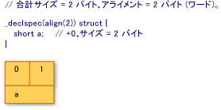

# 構造体の配置例
次の 4 つ例では、固定された構造体または共用体、および対応する数値は、その構造体または共用メモリ内のレイアウトを示してを宣言します。 図内の各列は、メモリのバイトを表し、列の数がそのバイトの変位を示します。 各図の 2 行目の名前は、宣言内の変数の名前に対応します。 影付きの列は、指定された配置を実現するために必要なが埋め込みを示しています。  
  
   
例 1  
  
   
例 2  
  
   
例 3  
  
   
例 4  
  
## 参照  
 [型とストレージ](../build/types-and-storage.md)