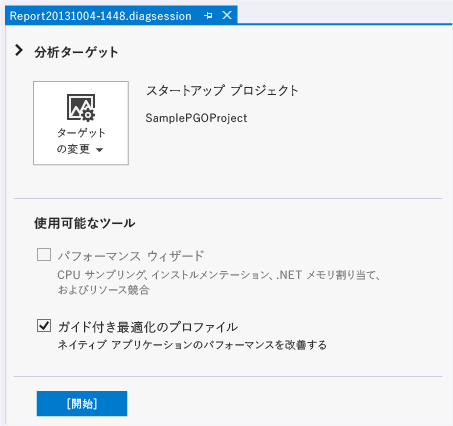
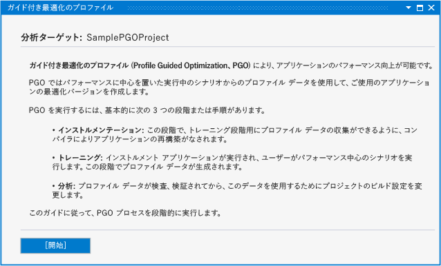
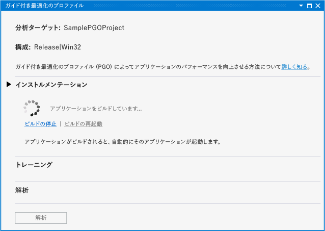
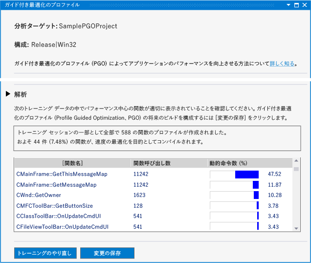
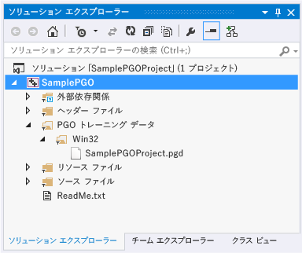
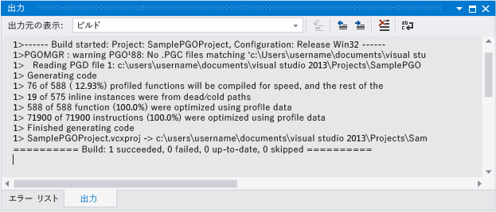

# パフォーマンスと診断ハブでのガイド付き最適化のプロファイル
[!INCLUDE[vs2017banner](../../assembler/inline/includes/vs2017banner.md)]

パフォーマンスと診断ハブで Visual C\+\+ 用ガイド付き最適化のプロファイル プラグインを使用すると、アプリの開発時に、ガイド付き最適化のプロファイル エクスペリエンスを合理化できます。  Visual Studio のWeb サイトから、[プラグインをダウンロード](http://go.microsoft.com/fwlink/p/?LinkId=327915)できます。  
  
 ガイド付き最適化のプロファイル \(PGO: Profile Guided Optimization\) を使用すると、ユーザーとの対話を最適化した形で、x86 および x64 のネイティブ アプリのビルドを作成できます。  PGO は複数手順のプロセスです。まず、プロファイリング用にインストルメント化されたアプリ ビルドを作成します。次に、インストルメント化されたアプリを通常のユーザー操作のシナリオで実行することにより、"トレーニング" を実行します。  キャプチャされたプロファイル データを保存して、プログラム全体を最適化するためのガイドとして結果を使用し、アプリを再構築します。  これらの手順を個々に Visual Studio またはコマンド ラインで実行することもできますが、PGO プラグインを使用すると、プロセスを一元化および単純化することができます。  PGO プラグインにより、必要なオプションがすべて設定され、各手順のガイドおよび分析結果が示されます。また、その結果を使用してビルドを構成することで、各関数のサイズまたは速度が最適化されます。  PGO プラグインを使用すると、コードの変更に伴って、アプリのトレーニングを再実行し、ビルド最適化データを更新することも容易になります。  
  
## 必須コンポーネント  
 パフォーマンスと診断ハブで使用するには、[PGO プラグインをダウンロード](http://go.microsoft.com/fwlink/p/?LinkId=327915)し、Visual Studio にインストールする必要があります。  
  
## チュートリアル: PGO プラグインを使用してアプリを最適化する  
 まず、Visual Studio で基本的な Win32 デスクトップ アプリを作成します。  最適化対象のネイティブ アプリが既にある場合は、それを使用できるため、この手順を省略できます。  
  
#### アプリを作成するには  
  
1.  メニュー バーで **\[ファイル\]**、**\[新規\]**、**\[プロジェクト\]** の順にクリックします。  
  
2.  **\[新しいプロジェクト\]** ダイアログ ボックスの左ペインで、**\[インストール済み\]**、**\[テンプレート\]**、**\[Visual C\+\+\]** の順に展開し、**\[MFC\]** をクリックします。  
  
3.  中央のペインで、**\[MFC アプリケーション\]** をクリックします。  
  
4.  **\[名前\]** ボックスにプロジェクトの名前 \(「SamplePGOProject」など\) を入力します。  **\[OK\]** を選択します。  
  
5.  **\[MFC アプリケーション ウィザード\]** ダイアログ ボックスの **\[概要\]** ページで、**\[完了\]** をクリックします。  
  
 次に、アプリのビルド構成を \[リリース\] に設定します。これにより、PGO ビルドおよびトレーニングの手順用の準備が完了します。  
  
#### ビルド構成を設定するには  
  
1.  メニュー バーで **\[ビルド\]**、**\[構成マネージャー\]** の順に選択します。  
  
2.  **\[構成マネージャー\]** ダイアログ ボックスで、**\[アクティブ ソリューション構成\]** ドロップダウン ボタンをクリックし、**\[リリース\]** をクリックします。  **\[閉じる\]** をクリックします。  
  
 メニュー バーで **\[分析\]**、**\[パフォーマンスと診断\]** の順にクリックし、パフォーマンスと診断ハブを開きます。  これにより、プロジェクトの種類に応じた分析ツールのある診断セッション ページが開きます。  
  
   
  
 **\[使用可能なツール\]** で、**\[ガイド付き最適化のプロファイル\]** チェック ボックスをオンにします。  **\[開始\]** をクリックして、PGO プラグインを開始します。  
  
   
  
 **\[ガイド付き最適化のプロファイル\]** ページには、アプリのパフォーマンスを向上させるためにプラグインで使用される手順の説明が記載されています。  **\[開始\]** をクリックします。  
  
   
  
 トレーニングの一部としてアプリのスタートアップ フェーズを含めるかどうかを選択するには、**\[Instrumentation\]** \(インストルメンテーション\) セクションの **\[Training is initially enabled\]** \(初期設定でトレーニングを有効にする\) チェック ボックスを使用します。  このチェック ボックスをオフにした場合、トレーニングを明示的に有効にするまで、実行中のインストルメント化されたアプリでは、トレーニング データが記録されません。  
  
 特殊なコンパイラ オプションを使用してアプリをビルドするには、**\[Instrument\]** \(インストルメント\) をクリックします。  コンパイラにより、生成されたコードにプローブ命令が挿入されます。  これらの命令により、トレーニング フェーズでプロファイル データが記録されます。  
  
   
  
 インストルメント化されたアプリのビルドが完了すると、アプリは自動的に起動されます。  
  
 ビルド時にエラーまたは警告が発生した場合は修正し、**\[Restart Build\]** \(ビルドの再起動\) をクリックして、インストルメント化されたビルドを再起動します。  
  
 アプリが起動したら、**\[Training\]** \(トレーニング\) セクションの **\[Start Training\]** \(トレーニングの開始\) リンクおよび **\[Pause Training\]** \(トレーニングの一時停止\) リンクを使用して、プロファイル情報を記録するタイミングを制御できます。  **\[Stop Application\]** \(アプリケーションの停止\) リンクおよび **\[Start Application\]** \(アプリケーションの開始\) リンクを使用すると、アプリを停止し、再起動できます。  
  
   
  
 トレーニングでは、ユーザー シナリオに従った操作を行い、PGO プラグインでコードを最適化するために必要なプロファイル情報をキャプチャします。  トレーニングを完了したら、アプリを閉じるか、**\[Stop Application\]** \(アプリケーションの停止\) リンクをクリックします。  分析の手順を開始するには、**\[Analyze\]** \(分析\) をクリックします。  
  
 分析が完了すると、ユーザー シナリオ トレーニング フェーズでキャプチャされたプロファイル情報のレポートが **\[Analysis\]** \(分析\) セクションに表示されます。  このレポートを使用して、アプリから最も頻繁に呼び出され、最も長い時間が消費された関数を調べることができます。  PGO プラグインでは、この情報を使用して、速度を最適化するアプリ関数およびサイズを最適化するアプリ関数を判断します。  PGO プラグインでは、トレーニングで記録したユーザー シナリオに応じて、最も高速で最小サイズのアプリを作成できるように、ビルドの最適化が構成されます。  
  
   
  
 必要なプロファイル情報をトレーニングでキャプチャできたら、**\[Save Changes\]** \(変更の保存\) をクリックすることで、分析済みのプロファイル データをプロジェクトに保存し、今後のビルドの最適化に役立てることができます。  プロファイル データを破棄し、トレーニングを最初からやり直すには、**\[Redo Training\]** \(トレーニングの再実行\) をクリックします。  
  
 プロファイル データ ファイルは、プロジェクトの **\[PGO Training Data\]** \(PGO トレーニング データ\) フォルダーに保存されます。  このデータは、アプリのコンパイラ ビルド最適化設定を制御するために使用されます。  
  
   
  
 コンパイル時にアプリが選択的に最適化されるように、分析の後、PGO プラグインによってプロジェクトのビルド オプションが設定されます。  引き続き同じプロファイル データを使用して、アプリの変更およびビルドを行うことができます。  アプリケーションのビルド時には、プロファイル データを使用して最適化された関数および命令の数を示すレポートが出力されます。  
  
   
  
 開発時に大幅なコード変更を行った場合、最適化の効果を最大限に高めるには、アプリを再トレーニングする必要があります。  ビルドにより出力されたレポートに、プロファイル データを使用して最適化された関数または命令が 80% 未満であると示されている場合は、アプリの再トレーニングを行うことをお勧めします。