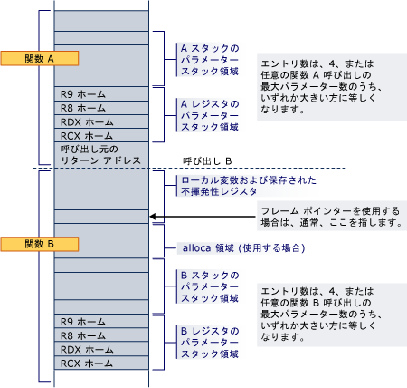

# スタック割り当て
[!INCLUDE[vs2017banner](../assembler/inline/includes/vs2017banner.md)]

関数のプロローグは、ローカル変数、保存済みのレジスタ、スタック パラメーター、およびレジスタ パラメーターにスタック領域を割り当てます。  
  
 パラメーター領域は、\(alloca を使用する場合でも\) 必ずスタックの底部にあるため、どの関数呼び出し中も常にリターン アドレスに隣接します。  パラメーター領域には、最低 4 つのエントリが含まれますが、呼び出される可能性のあるすべての関数が必要とするすべてのパラメーターを保持するだけの十分な領域が常に確保されています。  パラメーター自体がスタックに戻されない場合でも、常にレジスタのパラメーターに領域が割り当てられています。したがって、呼び出し先については、そこで使用するそのパラメーターすべてに領域が割り当て済みであることが保証されます。  ホーム アドレスがレジスタの引数に必要なため、呼び出し先の関数が引数リスト \(va\_list\) または個々の引数のアドレスを受け取る必要がある場合は、連続領域が使用できます。  また、この領域は、サンクの実行中におよびデバッグ オプションとしてレジスタの引数を保存するために便利な場所を提供します \(たとえば、レジスタの引数をプロローグ コード内でそのホーム アドレスに格納すると、デバッグ中の引数を簡単に検索できます\)。  呼び出し先の関数のパラメーターの数が 3 つ以下の場合でも、これらの 4 つのスタック割り当ては、呼び出し先の関数によって効率的に所有され、パラメーター レジスタ値を保存する以外の目的のために、呼び出し先の関数によって使用される場合があります。  したがって、呼び出し元は、関数呼び出しにおけるスタックのこの領域内の情報を保存しない場合もあります。  
  
 領域を関数に動的に割り当てる場合 \(alloca\)、スタックの固定部分のベースをマークするために不揮発性レジスタをフレーム ポインターとして使用して、そのレジスタをプロローグ内で保存および初期化する必要があります。  ただし、alloca を使用すると、同じ呼び出し先から同じ呼び出し元への呼び出しに、そのレジスタ パラメーターに対して異なるホーム アドレスが設定される場合があります。  
  
 プロローグ内 \(たとえば、リターン アドレスをプッシュした後\) や、フレーム関数の特定のクラスの [関数の型](../build/function-types.md) で示される場合を除き、スタックは常に 16 バイトでアライメントされています。  
  
 次の例は、関数 A が非リーフ関数 B を呼び出す場合のスタックのレイアウトを示しています。  関数 A のプロローグで、B が必要とするすべてのレジスタとスタック パラメーターにスタックの底部の領域を割り当て済みです。  呼び出しがリターン アドレスをプッシュし、B のプロローグがそのローカル変数、不揮発性レジスタ、およびその関数を呼び出すために必要な領域に領域を割り当てます。  関数 B が alloca を使用する場合、ローカル変数または不揮発性レジスタ保存領域とパラメーター スタック領域との間に領域が割り当てられます。  
  
   
  
 関数 B が別の関数を呼び出すと、リターン アドレスは RCX のホーム アドレスのすぐ下にプッシュされます。  
  
## 参照  
 [スタックの使用](../build/stack-usage.md)