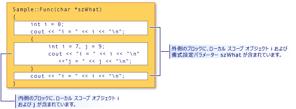

# スコープ (Visual C++)
[!INCLUDE[vs2017banner](../assembler/inline/includes/vs2017banner.md)]

C\+\+ の名前は、プログラムの特定の領域でのみ使用できます。  この領域は名前の "スコープ" と呼ばれます。  スコープは、静的なオブジェクトを表さない名前の "有効期間" を決定します。  スコープも、クラス コンストラクターおよびデストラクターが呼び出されたとき、およびスコープに対してローカルな変数が初期化されたときに名前の可視性を決定します。  \(詳細については、「[コンストラクター](../cpp/constructors-cpp.md)」および「[デストラクター](../cpp/destructors-cpp.md)」を参照してください\)。 スコープは 5 種類あります。  
  
-   ローカル スコープ   ブロック内で宣言された名前は、そのブロックと、そのブロックで囲まれているブロック内でのみ、および宣言の後でのみアクセス可能です。  関数の最も外側のブロックのスコープでは、関数への仮引数の名前は、関数本体の外側のブロック内で宣言された場合と同様に、ローカル スコープを持ちます。  次のコードがあるとします。  
  
    ```  
    {  
        int i;  
    }  
    ```  
  
     `i` の宣言は中かっこで囲まれたブロックにあるため、コードが最後の中かっこの前にアクセスしないため、`i` にはローカル スコープがあり、アクセス可能ではありません。  
  
-   **関数スコープ** ラベルは関数スコープを含む単なる名前です。  これらは関数内のどの位置でも使用できますが、その関数の外部からはアクセスできません。  関数の仮引数 \(関数定義で指定された引数\) は、関数本体の最も外側のブロックのスコープ内にあると見なされます。  
  
-   **ファイル スコープ** すべてのブロックまたはクラスの外で宣言したどの名前にも、ファイル スコープがあります。  宣言の後、翻訳単位内の任意の場所でアクセスできます。  静的オブジェクトを宣言しないファイル スコープを持つ名前は、グローバル名とも呼ばれます。  
  
     C\+\+ では、ファイル スコープは、名前空間スコープとも呼ばれます。  
  
-   **クラス スコープ** クラス メンバーの名前にクラス スコープがあります。  クラス メンバー関数には、メンバー選択演算子 \(**.** または **–\>**\)、またはオブジェクトまたはそのクラスのオブジェクトへのポインターに対するメンバーへのポインター演算子 \(**.\*** または **–\>\***\) を使用してのみアクセスできます。非静的クラス メンバーのデータは、そのクラスのオブジェクトに対してローカルであると見なされます。  クラス宣言の例を次に示します。  
  
    ```  
    class Point  
    {  
        int x;  
        int y;  
    };  
    ```  
  
     クラス メンバー `x` および `y` は、`Point` クラスのスコープ内にあると見なされます。  
  
-   関数プロトタイプ内で宣言されている**プロトタイプ スコープ**名は、プロトタイプの末尾までのみ表示されます。  次のプロトタイプは、3 つの名前 \(`strDestination`、`numberOfElements`、`strSource`\) を宣言します。これらの名前は、プロトタイプの最後にスコープの外に出ます。  
  
    ```  
    errno_t strcpy_s( char *strDestination, size_t numberOfElements, const char *strSource );  
    ```  
  
## 名前の隠ぺい  
 囲まれたブロック内で名前を宣言すると、その名前が非表示になります。  次の図では、内側のブロックで `i` が再宣言されています。そのため、外側のブロック スコープでは `i` に関連付けられた変数が隠し変数になります。  
  
   
ブロック スコープおよび名前の非表示  
  
 このプログラムの出力を次の図に示します。  
  
```  
i = 0  
i = 7  
j = 9  
i = 0  
```  
  
> [!NOTE]
>  `szWhat` 引数は、この関数のスコープ内にあると見なされます。  したがって、この関数の外側のブロックで宣言されたものとして処理されます。  
  
## クラス名の非表示  
 関数、オブジェクト、変数、または列挙子を同じスコープ内で宣言することで、クラス名を非表示にできます。  ただし、**class** キーワードを先頭に付加すれば、非表示にしたクラス名にアクセスできます。  
  
```  
// hiding_class_names.cpp  
// compile with: /EHsc  
#include <iostream>  
using namespace std;  
  
// Declare class Account at file scope.  
class Account  
{  
public:  
    Account( double InitialBalance )  
        { balance = InitialBalance; }  
    double GetBalance()  
        { return balance; }  
private:  
    double balance;  
};  
  
double Account = 15.37;            // Hides class name Account  
  
int main()  
{  
    class Account Checking( Account ); // Qualifies Account as   
                                       //  class name  
  
    cout << "Opening account with balance of: "  
         << Checking.GetBalance() << "\n";  
}  
//Output: Opening account with balance of: 15.37  
```  
  
> [!NOTE]
>  クラス名 \(`Account`\) を呼び出すときは、ファイル スコープ変数 Account と区別するため、class キーワードを使用する必要があります。  スコープ解決演算子 \(::\) の左側がクラス名の場合は、この規則が適用されません。  スコープ解決演算子の左側の名前は、常にクラス名と見なされます。  
  
 次に、`Account`class キーワードを使用して、 **型のオブジェクトへのポインターを宣言する方法を例示します。**  
  
```  
class Account *Checking = new class Account( Account );  
```  
  
 上記のステートメントで、初期化子の \(かっこで囲まれた\) `Account` はファイル スコープで **double** 型です。  
  
> [!NOTE]
>  この例のように、識別子名を再使用するのは適切なプログラミング方法ではありません。  
  
 ポインターの詳細については、「[派生型](http://msdn.microsoft.com/ja-jp/aa14183c-02fe-4d81-95fe-beddb0c01c7c)」を参照してください。  クラス オブジェクトの宣言と初期化については、「[クラス、構造体、および共用体](../Topic/Classes%20and%20Structs%20\(C++\).md)」を参照してください。  フリー ストア演算子 **new** および **delete** の使用方法については、「[特殊なメンバー関数](../misc/special-member-functions-cpp.md)」を参照してください。  
  
## ファイル スコープによる名前の非表示  
 ブロック スコープで同じ名前で明示的に宣言して、ファイル スコープを持つ名前を非表示にすることができます。  ただし、スコープ解決演算子 \(`::`\) を使用して、ファイル スコープ名にアクセスできます。  
  
```  
// file_scopes.cpp  
// compile with: /EHsc  
#include <iostream>  
  
int i = 7;   // i has file scope, outside all blocks  
using namespace std;  
  
int main( int argc, char *argv[] ) {  
   int i = 5;   // i has block scope, hides i at file scope  
   cout << "Block-scoped i has the value: " << i << "\n";  
   cout << "File-scoped i has the value: " << ::i << "\n";  
}  
```  
  
  **Block\-scoped i has the value: 5**  
**File\-scoped i has the value: 7**   
## 参照  
 [基本的な概念](../cpp/basic-concepts-cpp.md)