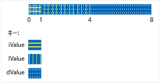

# <a name="unions"></a>Unions
`union` とは、すべてのメンバーが同じメモリの場所を共有するユーザー定義の型です。 これは、任意のどの時点においても、共用体のメンバー一覧にあるオブジェクトがただ 1 つだけ共用体に含まれていることを意味します。 また、共用体のメンバー数には関係なく、最大のメンバーを格納するのに必要なメモリーだけが常に使用されることも意味します。  
  
 共用体は多数のオブジェクトやメモリの制限がある場合、メモリの節約に役立ちます。 ただし、書き込まれた最後のメンバーに常にアクセスするようにする責任はプログラマにあるため、正しく使用するには特に注意が必要です。 重要なコンストラクターを持つメンバーの種類がある場合、追加のコードを記述してそのメンバーの構築および破棄を明示的に実行する必要があります。 共用体を使用する前に、解決すべき問題が、基本クラスと派生クラスを使用することでより適切に表現できないか検討します。  
  
## <a name="syntax"></a>構文  
  
```cpp  
union [name]  { member-list };  
```  
  
#### <a name="parameters"></a>パラメーター  
 `name`  
 共用体に付ける型名。  
  
 `member-list`  
 共用体に含めることができるメンバー。 「解説」を参照してください。  
  
## <a name="remarks"></a>コメント  
  
## <a name="declaring-a-union"></a>共用体の宣言  
 共用体の宣言は `union` キーワードから開始し、メンバー リストを中かっこで囲みます。  
  
```cpp  
// declaring_a_union.cpp  
union RecordType    // Declare a simple union type  
{  
    char   ch;  
    int    i;  
    long   l;  
    float  f;  
    double d;  
    int *int_ptr;  
};   
int main()  
{  
    RecordType t;  
    t.i = 5; // t holds an int  
    t.f = 7.25 // t now holds a float   
}  
```  
  
## <a name="using-unions"></a>共用体の使用  
 前の例では、共用体にアクセスするすべてのコードが、データを保持しているメンバーを知る必要がありました。 この問題の最も一般的な解決策は、共用体を構造体で囲み、共用体に現在格納されているデータの種類を示す列挙メンバーを同じ構造体に追加することです。 これと呼ばれる、*判別共用体*し、次の例は、基本的なパターンを示します。  
  
```cpp  
#include "stdafx.h"  
#include <queue>  
  
using namespace std;  
  
enum class WeatherDataType  
{  
    Temperature, Wind  
};  
  
struct TempData  
{  
    int StationId;  
    time_t time;  
    double current;  
    double max;  
    double min;  
};  
  
struct WindData  
{  
    int StationId;  
    time_t time;  
    int speed;  
    short direction;  
};  
  
struct Input  
{  
    WeatherDataType type;  
    union  
    {  
        TempData temp;  
        WindData wind;  
    };  
};  
  
// Functions that are specific to data types  
void Process_Temp(TempData t) {}  
void Process_Wind(WindData w) {}  
  
// Container for all the data records  
queue<Input> inputs;  
void Initialize();  
  
int main(int argc, char* argv[])  
{  
    Initialize();  
    while (!inputs.empty())  
    {  
        Input i = inputs.front();  
        switch (i.type)  
        {  
        case WeatherDataType::Temperature:  
            Process_Temp(i.temp);  
            break;  
        case WeatherDataType::Wind:  
            Process_Wind(i.wind);  
            break;  
        default:  
            break;  
        }  
        inputs.pop();  
  
    }  
    return 0;  
}  
  
void Initialize()  
{  
    Input first, second;  
    first.type = WeatherDataType::Temperature;  
    first.temp = { 101, 1418855664, 91.8, 108.5, 67.2 };  
    inputs.push(first);  
  
    second.type = WeatherDataType::Wind;  
    second.wind = { 204,1418859354, 14, 27 };  
    inputs.push(second);  
}  
  
```  
  
 前の例で、入力構造体の共用体には名前がないことに注意してください。 これは無名共用体であり、そのメンバーには、構造体の直接のメンバーの場合と同様にアクセスできます。 無名共用体の詳細については、以下のセクションを参照してください。  
  
 もちろん、前の例で示した問題は、共通の基本クラスから派生するクラスを使用して、コンテナー内の各オブジェクトのランタイムの型に基づいてコードを分岐することによっても解決できます。 この結果、コードの維持や理解は容易になりますが、共用体を使用するよりは低速になる場合があります。 また、共用体を使用すると、全く関連のない型を格納することや、共用体変数自体の種類を変更せずに格納されている値の型を動的に変更することができます。 そのため、要素にさまざまな型のさまざまな値を格納する MyUnionType の異種配列を作成できます。  
  
 前の例の `Input` 構造体は誤用されやすいので注意してください。 データを保持するメンバーにアクセスするには、ユーザーが識別子を正しく使用する必要があります。 次の例で示すように、共用体をプライベートにし、特別なアクセス関数を指定することで、誤用を防ぐことができます。  
  
## <a name="unrestricted-unions-c11"></a>無制限の共用体 (C++11)  
 C++03 およびそれ以前では、クラス型を持つ非静的データ メンバーを共用体に含める場合、その型にはユーザーが指定したコンス トラクター、デストラクター、または代入演算子を含めることができませんでした。 C++11 では、これらの制限が削除されています。 共用体にこのようなメンバーを含める場合、コンパイラは、ユーザー指定外の特殊なメンバー関数を削除済みとして自動的にマークします。 共用体がクラスまたは構造体の内部にある無名共用体の場合、ユーザー指定外のクラスまたは構造体の特殊なメンバー関数は削除済みとしてマークされます。 次の例で、この特殊処理が必要なメンバーが共用体のメンバーのいずれかに含まれるケースの処理方法を示します。  
  
```cpp  
// for MyVariant  
#include <crtdbg.h>  
#include <new>  
#include <utility>  
  
// for sample objects and output  
#include <string>  
#include <vector>  
#include <iostream>  
  
using namespace std;  
  
struct A   
{  
    A() = default;  
    A(int i, const string& str) : num(i), name(str) {}  
  
    int num;  
    string name;  
    //...  
};  
  
struct B   
{  
    B() = default;  
    B(int i, const string& str) : num(i), name(str) {}  
  
    int num;  
    string name;  
    vector<int> vec;  
    // ...  
};  
  
enum class Kind { None, A, B, Integer };  
  
#pragma warning (push)  
#pragma warning(disable:4624)  
class MyVariant  
{  
public:  
    MyVariant()  
        : kind_(Kind::None)  
    {  
    }  
  
    MyVariant(Kind kind)  
        : kind_(kind)  
    {  
        switch (kind_)  
        {  
        case Kind::None:  
            break;  
        case Kind::A:  
            new (&a_) A();  
            break;  
        case Kind::B:  
            new (&b_) B();  
            break;  
        case Kind::Integer:  
            i_ = 0;  
            break;  
        default:  
            _ASSERT(false);  
            break;  
        }  
    }  
  
    ~MyVariant()  
    {  
        switch (kind_)  
        {  
        case Kind::None:  
            break;  
        case Kind::A:  
            a_.~A();  
            break;  
        case Kind::B:  
            b_.~B();  
            break;  
        case Kind::Integer:  
            break;  
        default:  
            _ASSERT(false);  
            break;  
        }  
        kind_ = Kind::None;  
    }  
  
    MyVariant(const MyVariant& other)  
        : kind_(other.kind_)  
    {  
        switch (kind_)  
        {  
        case Kind::None:  
            break;  
        case Kind::A:  
            new (&a_) A(other.a_);  
            break;  
        case Kind::B:  
            new (&b_) B(other.b_);  
            break;  
        case Kind::Integer:  
            i_ = other.i_;  
            break;  
        default:  
            _ASSERT(false);  
            break;  
        }  
    }  
  
    MyVariant(MyVariant&& other)  
        : kind_(other.kind_)  
    {  
        switch (kind_)  
        {  
        case Kind::None:  
            break;  
        case Kind::A:  
            new (&a_) A(move(other.a_));  
            break;  
        case Kind::B:  
            new (&b_) B(move(other.b_));  
            break;  
        case Kind::Integer:  
            i_ = other.i_;  
            break;  
        default:  
            _ASSERT(false);  
            break;  
        }  
        other.kind_ = Kind::None;  
    }  
  
    MyVariant& operator=(const MyVariant& other)  
    {  
        if (&other != this)  
        {  
            switch (other.kind_)  
            {  
            case Kind::None:  
                this->~MyVariant();  
                break;  
            case Kind::A:  
                *this = other.a_;  
                break;  
            case Kind::B:  
                *this = other.b_;  
                break;  
            case Kind::Integer:  
                *this = other.i_;  
                break;  
            default:  
                _ASSERT(false);  
                break;  
            }  
        }  
        return *this;  
    }  
  
    MyVariant& operator=(MyVariant&& other)  
    {  
        _ASSERT(this != &other);  
        switch (other.kind_)  
        {  
        case Kind::None:  
            this->~MyVariant();  
            break;  
        case Kind::A:  
            *this = move(other.a_);  
            break;  
        case Kind::B:  
            *this = move(other.b_);  
            break;  
        case Kind::Integer:  
            *this = other.i_;  
            break;  
        default:  
            _ASSERT(false);  
            break;  
        }  
        other.kind_ = Kind::None;  
        return *this;  
    }  
  
    MyVariant(const A& a)  
        : kind_(Kind::A), a_(a)  
    {  
    }  
  
    MyVariant(A&& a)  
        : kind_(Kind::A), a_(move(a))  
    {  
    }  
  
    MyVariant& operator=(const A& a)  
    {  
        if (kind_ != Kind::A)  
        {  
            this->~MyVariant();  
            new (this) MyVariant(a);  
        }  
        else  
        {  
            a_ = a;  
        }  
        return *this;  
    }  
  
    MyVariant& operator=(A&& a)  
    {  
        if (kind_ != Kind::A)  
        {  
            this->~MyVariant();  
            new (this) MyVariant(move(a));  
        }  
        else  
        {  
            a_ = move(a);  
        }  
        return *this;  
    }  
  
    MyVariant(const B& b)  
        : kind_(Kind::B), b_(b)  
    {  
    }  
  
    MyVariant(B&& b)  
        : kind_(Kind::B), b_(move(b))  
    {  
    }  
  
    MyVariant& operator=(const B& b)  
    {  
        if (kind_ != Kind::B)  
        {  
            this->~MyVariant();  
            new (this) MyVariant(b);  
        }  
        else  
        {  
            b_ = b;  
        }  
        return *this;  
    }  
  
    MyVariant& operator=(B&& b)  
    {  
        if (kind_ != Kind::B)  
        {  
            this->~MyVariant();  
            new (this) MyVariant(move(b));  
        }  
        else  
        {  
            b_ = move(b);  
        }  
        return *this;  
    }  
  
    MyVariant(int i)  
        : kind_(Kind::Integer), i_(i)  
    {  
    }  
  
    MyVariant& operator=(int i)  
    {  
        if (kind_ != Kind::Integer)  
        {  
            this->~MyVariant();  
            new (this) MyVariant(i);  
        }  
        else  
        {  
            i_ = i;  
        }  
        return *this;  
    }  
  
    Kind GetKind() const  
    {  
        return kind_;  
    }  
  
    A& GetA()  
    {  
        _ASSERT(kind_ == Kind::A);  
        return a_;  
    }  
  
    const A& GetA() const  
    {  
        _ASSERT(kind_ == Kind::A);  
        return a_;  
    }  
  
    B& GetB()  
    {  
        _ASSERT(kind_ == Kind::B);  
        return b_;  
    }  
  
    const B& GetB() const  
    {  
        _ASSERT(kind_ == Kind::B);  
        return b_;  
    }  
  
    int& GetInteger()  
    {  
        _ASSERT(kind_ == Kind::Integer);  
        return i_;  
    }  
  
    const int& GetInteger() const  
    {  
        _ASSERT(kind_ == Kind::Integer);  
        return i_;  
    }  
  
private:  
    Kind kind_;  
    union  
    {  
        A a_;  
        B b_;  
        int i_;  
    };  
};  
#pragma warning (pop)  
  
int main()  
{  
    A a(1, "Hello from A");  
    B b(2, "Hello from B");  
  
    MyVariant mv_1 = a;  
  
    cout << "mv_1 = a: " << mv_1.GetA().name << endl;  
    mv_1 = b;  
    cout << "mv_1 = b: " << mv_1.GetB().name << endl;  
    mv_1 = A(3, "hello again from A");  
    cout << R"aaa(mv_1 = A(3, "hello again from A"): )aaa" << mv_1.GetA().name << endl;  
    mv_1 = 42;  
    cout << "mv_1 = 42: " << mv_1.GetInteger() << endl;  
  
    b.vec = { 10,20,30,40,50 };  
  
    mv_1 = move(b);  
    cout << "After move, mv_1 = b: vec.size = " << mv_1.GetB().vec.size() << endl;  
  
    cout << endl << "Press a letter" << endl;  
    char c;  
    cin >> c;  
}  
#include <queue>  
#include <iostream>  
using namespace std;  
  
enum class WeatherDataType  
{  
    Temperature, Wind  
};  
  
struct TempData  
{  
    TempData() : StationId(""), time(0), current(0), maxTemp(0), minTemp(0) {}  
    TempData(string id, time_t t, double cur, double max, double min)  
        : StationId(id), time(t), current(cur), maxTemp(max), minTemp(0) {}  
    string StationId;  
    time_t time = 0;  
    double current;  
    double maxTemp;  
    double minTemp;  
};  
  
struct WindData  
{  
    int StationId;  
    time_t time;  
    int speed;  
    short direction;  
};  
  
struct Input  
{  
    Input() {}  
    Input(const Input&) {}  
  
    ~Input()  
    {  
        if (type == WeatherDataType::Temperature)  
        {  
            temp.StationId.~string();  
        }  
    }  
  
    WeatherDataType type;  
    void SetTemp(const TempData& td)  
    {  
        type = WeatherDataType::Temperature;  
  
        // must use placement new because of string member!  
        new(&temp) TempData(td);  
    }  
  
    TempData GetTemp()  
    {  
        if (type == WeatherDataType::Temperature)  
            return temp;  
        else  
            throw logic_error("Can't return TempData when Input holds a WindData");  
    }  
    void SetWind(WindData wd)  
    {  
        // Explicitly delete struct member that has a   
        // non-trivial constructor  
        if (type == WeatherDataType::Temperature)  
        {  
            temp.StationId.~string();  
        }  
        wind = wd; //placement new not required.  
    }  
    WindData GetWind()  
    {  
        if (type == WeatherDataType::Wind)  
        {  
            return wind;  
        }  
        else  
            throw logic_error("Can't return WindData when Input holds a TempData");  
    }  
  
private:  
  
    union  
    {  
        TempData temp;  
        WindData wind;  
    };  
};  
  
```  
  
 共用体には参照を保存できません。 共用体は継承をサポートしていないため、共用体自体を基本クラスとして使用することや、もう 1 つのクラスから継承すること、仮想関数を含めることはできません。  
  
## <a name="initializing-unions"></a>共用体の初期化  
 中かっこで囲まれた式を代入して、同じステートメントで共用体の宣言と初期化を実行できます。 この式は評価され、共用体の最初のフィールドに割り当てられます。  
  
```cpp  
#include <iostream>  
using namespace std;  
  
union NumericType  
{  
    short       iValue;  
    long        lValue;    
    double      dValue;    
};  
  
int main()  
{  
    union NumericType Values = { 10 };   // iValue = 10  
    cout << Values.iValue << endl;  
    Values.dValue = 3.1416;  
    cout << Values.dValue) << endl;  
}  
/* Output:  
 10  
 3.141600  
*/  
  
```  
  
 `NumericType` 共用体は、次の図に示すように、メモリ内に配置されます (概念上)。  
  
   
数値型共用体のデータ ストレージ  
  
## <a name="anonymous_unions"></a>匿名共用体  
 無名共用体はなしで宣言される共用体、*クラス名*または*宣言子リスト*です。  
  
```cpp  
union  {  member-list  }    
```  
  
無名共用体で宣言されている名前は非メンバー変数のように直接使用されます。 そのため、無名共用体で宣言された名前は前後のスコープで一意である必要があります。  
  
名前付きの共用体の制限事項、に加えて無名共用体は、以下の制限の対象は。  
  
-   として宣言する必要がありますも**静的**ファイルまたは名前空間スコープで宣言されている場合。  
  
-   パブリック メンバーしか持つことができません。無名共用体でプライベート メンバーとプロテクト メンバーを指定するとエラーになります。  
  
-   メンバー関数を含めることはできません。  
  
## <a name="see-also"></a>関連項目  
 [クラスと構造体](../cpp/classes-and-structs-cpp.md)   
 [キーワード](../cpp/keywords-cpp.md)   
 [class](../cpp/class-cpp.md)   
 [struct](../cpp/struct-cpp.md)
