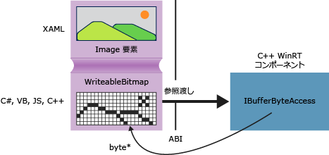

# <a name="obtaining-pointers-to-data-buffers-ccx"></a>データ バッファーへのポインターの取得 (C++/CX)
Windows ランタイム内の [Windows::Storage::Streams::IBuffer](http://msdn.microsoft.com/library/windows/apps/windows.storage.streams.ibuffer.aspx) インターフェイスは、言語に依存せずに、データ バッファーにアクセスするストリーム ベースの方法を提供します。 C++ では、robuffer.h 内で定義されている Windows ランタイム ライブラリの IBufferByteAccess インターフェイスを使用して、基になるバイト配列への生のポインターを取得できます。 この方法により、データの不要なコピーを作成せずに、バイト配列をその場で変更できます。  
  
 次の図では、ソースが [Windows::UI::Xaml::Media::Imaging WriteableBitmap](http://msdn.microsoft.com/%20library/windows/apps/windows.ui.xaml.media.imaging.writeablebitmap.aspx)である XAML イメージ要素を示します。 どの言語で作成されたクライアント アプリケーションも、 `WriteableBitmap` への参照を C++ コードに渡すことができ、その後、C++ はその参照を使用して基になるバッファーでデータを取得できます。 ユニバーサル Windows プラットフォーム アプリで C++ で記述された、Windows ランタイム コンポーネントにパッケージ化することがなく、直接のソース コードで次の例で、関数を使用できます。  
  
   
  
## <a name="getpointertopixeldata"></a>GetPointerToPixelData  
 次のメソッドは、 [Windows::Storage::Streams::IBuffer](http://msdn.microsoft.com/library/windows/apps/windows.storage.streams.ibuffer.aspx) を受け入れ、基になるバイト配列への生のポインターを返します。 この関数を呼び出すには、 [WriteableBitmap::PixelBuffer](http://msdn.microsoft.com/library/windows/apps/windows.ui.xaml.media.imaging.writeablebitmap.pixelbuffer.aspx) プロパティに渡します。  
  
```  
  
#include <wrl.h>  
#include <robuffer.h>  
using namespace Windows::Storage::Streams;  
using namespace Microsoft::WRL;  
typedef uint8 byte;  
// Retrieves the raw pixel data from the provided IBuffer object.  
// Warning: The lifetime of the returned buffer is controlled by  
// the lifetime of the buffer object that's passed to this method.  
// When the buffer has been released, the pointer becomes invalid  
// and must not be used.  
byte* Class1::GetPointerToPixelData(IBuffer^ pixelBuffer, unsigned int *length)  
{  
    if (length != nullptr)  
    {  
        *length = pixelBuffer ->Length;  
    }  
    // Query the IBufferByteAccess interface.  
    ComPtr<IBufferByteAccess> bufferByteAccess;  
    reinterpret_cast<IInspectable*>( pixelBuffer)->QueryInterface(IID_PPV_ARGS(&bufferByteAccess));  
  
    // Retrieve the buffer data.  
    byte* pixels = nullptr;  
    bufferByteAccess->Buffer(&pixels);  
    return pixels;  
}  
```  
  
## <a name="complete-example"></a>コード例全体  
 次の手順が合格する C# でユニバーサル Windows プラットフォーム アプリを作成する方法を示して、 `WriteableBitmap` C++ Windows ランタイム コンポーネント DLL をします。 C++ コードでは、ピクセル バッファーへのポインターを取得し、イメージに対してその場で簡単な変更を実行します。 別の方法として、C# の代わりに、Visual Basic、JavaScript、または C++ のクライアント アプリケーションを作成することもできます。 C++ を使用する場合、コンポーネント DLL は必要ありません。それらのメソッドを MainPage クラスまたは定義した他のクラスに直接追加できます。  
  
#### <a name="create-the-client"></a>クライアントの作成  
  
1.  C# でユニバーサル Windows プラットフォーム アプリを作成するのにには、空のアプリケーション プロジェクト テンプレートを使用します。  
  
2.  MainPage.xaml 内で、次の手順に従います。  
  
    -   次の XAML を使用し、 `Grid` 要素を置換します。  
  
        ```cpp  
        <Grid Background="{StaticResource ApplicationPageBackgroundThemeBrush}">  
                <StackPanel HorizontalAlignment="Left" Margin="176,110,0,0" VerticalAlignment="Top" Width="932">  
                    <Image x:Name="Pic"/>  
                    <Button Content="Process Image" HorizontalAlignment="Stretch" VerticalAlignment="Stretch" Height="47" Click="Button_Click_1"/>  
                </StackPanel>  
            </Grid>  
        ```  
  
3.  MainPage.xaml.cs 内で、次の手順に従います。  
  
    1.  次の名前空間宣言を追加します。  
  
        ```  
        using Windows.Storage;  
        using Windows.Storage.FileProperties;  
        using Windows.UI.Xaml.Media.Imaging;  
        using Windows.Storage.Streams;  
        using Windows.Storage.Pickers;  
        ```  
  
    2.  `WriteableBitmap` メンバー変数を `MainPage` クラスに追加し、 `m_bm`という名前を付けます。  
  
        ```  
        private WriteableBitmap m_bm;  
        ```  
  
    3.  次のコードを使用し、 `OnNavigatedTo` メソッド スタブを置換します。 この結果、アプリケーションの起動時にファイル ピッカーが開きます ( `async` キーワードを関数シグネチャに追加したことに注意してください)。  
  
        ```c#  
        async protected override void OnNavigatedTo(NavigationEventArgs e)  
                {  
                    FileOpenPicker openPicker = new FileOpenPicker();  
                    openPicker.ViewMode = PickerViewMode.Thumbnail;  
                    openPicker.SuggestedStartLocation = PickerLocationId.PicturesLibrary;  
                    openPicker.FileTypeFilter.Add(".jpg");  
                    openPicker.FileTypeFilter.Add(".jpeg");  
                    openPicker.FileTypeFilter.Add(".png");  
  
                    StorageFile file = await openPicker.PickSingleFileAsync();  
                    if (file != null)  
                    {  
                        // Get the size of the image for the WriteableBitmap constructor.  
                        ImageProperties props = await file.Properties.GetImagePropertiesAsync();  
                        m_bm = new WriteableBitmap((int)props.Height, (int)props.Width);  
                        m_bm.SetSource(await file.OpenReadAsync());  
                        Pic.Source = m_bm;  
                    }  
                    else  
                    {  
                      //  Handle error...  
                    }  
                }  
        ```  
  
    4.  ボタン クリックに対応するイベント ハンドラーを追加します `ImageManipCPP` 名前空間参照をまだ作成していないので、エディター ウィンドウで波線が表示される可能性があります)。  
  
        ```  
        async private void Button_Click_1(object sender, RoutedEventArgs e)  
                {  
                    ImageManipCPP.Class1 obj = new ImageManipCPP.Class1();  
                    await obj.Negativize(m_bm);  
                    Pic.Source = m_bm;  
                }  
        ```  
  
#### <a name="create-the-c-component"></a>C++ コンポーネントの作成  
  
1.  既存のソリューションに新しい C++ の Windows ランタイム コンポーネントを追加し、名前を付けます`ImageManipCPP`です。 C# プロジェクト内でそのコンポーネントへの参照を追加するために、 **ソリューション エクスプローラー** でプロジェクトを右クリックし、 **[追加]**、 **[参照]**を選択します。  
  
2.  Class1.h 内で、次の手順に従います。  
  
    1.  `typedef` の直後に位置する 2 行目に、次の `#pragma once`を追加します。  
  
        ```  
        typedef uint8 byte;  
  
        ```  
  
    2.  `WebHostHidden` 宣言の先頭部分のすぐ上に `Class1` 属性を追加します。  
  
        ```  
        [Windows::Foundation::Metadata::WebHostHidden]  
        ```  
  
    3.  次のパブリック メソッド シグネチャを `Class1`に追加します。  
  
        ```  
        Windows::Foundation::IAsyncAction^ Negativize(Windows::UI::Xaml::Media::Imaging::WriteableBitmap^ bm);  
        ```  
  
    4.  前のコード スニペットに示した `GetPointerToPixelData` メソッドから取得したシグネチャを追加します。 このメソッドがプライベートであることを確認します。  
  
3.  Class1.cpp 内で、次の手順に従います。  
  
    1.  次の `#include` ディレクティブ、および名前空間宣言を追加します。  
  
        ```  
  
        #include <ppltasks.h>  
        #include <wrl.h>  
        #include <robuffer.h>  
  
        using namespace Windows::Storage;  
        using namespace Windows::UI::Xaml::Media::Imaging;  
        using namespace Windows::Storage::Streams;  
        using namespace Microsoft::WRL;  
  
        ```  
  
    2.  前のコード スニペットから `GetPointerToPixelData` の実装を追加します。  
  
    3.  `Negativize`の実装を追加します。 このメソッドは、各ピクセルの RGB 値を反転することで、ネガ フィルムに似た効果を作成します。 より大きいイメージの場合、表示が完了するまでに比較的長い時間がかかる可能性があるため、このメソッドを非同期にします。  
  
        ```  
        IAsyncAction^ Class1::Negativize(WriteableBitmap^ bm)  
        {  
            unsigned int length;  
            byte* sourcePixels = GetPointerToPixelData(bm->PixelBuffer, &length);  
            const unsigned int width = bm->PixelWidth;  
            const unsigned int height = bm->PixelHeight;  
  
            return create_async([this, width, height, sourcePixels]  
            {          
                byte* temp = sourcePixels;  
                for(unsigned int k = 0; k < height; k++)  
                {          
                    for (unsigned int i = 0; i < (width * 4); i += 4)  
                    {  
                        int pos = k * (width * 4) + (i);  
                        temp[pos] = ~temp[pos];  
                        temp[pos + 1] = ~temp[pos + 1] / 3;  
                        temp[pos + 2] = ~temp[pos + 2] / 2;  
                        temp[pos + 3] = ~temp[pos + 3];  
                    }  
                }  
            });  
  
        }  
        ```  
  
        > [!NOTE]
        >  AMP または並列パターン ライブラリを使用して操作を並列化すると、このメソッドの実行速度が向上する可能性があります。  
  
4.  画像フォルダーに少なくとも 1 枚の画像があることを確認し、その後 F5 キーを押してプログラムをコンパイルおよび実行します。