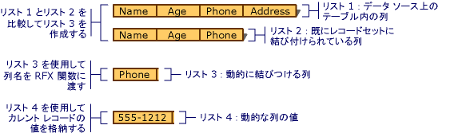

# <a name="recordset-dynamically-binding-data-columns-odbc"></a>レコードセット: データ列を動的に結びつける方法 (ODBC)
このトピックの内容は、MFC ODBC クラスに該当します。  
  
 レコード セットの管理、デザイン時に指定したバインド テーブルの列がデザイン時に不明だった列をバインドすることができる場合します。 このトピックでは、次の内容について説明します。  
  
-   [レコード セットに列を動的にバインドするときに](#_core_when_you_might_bind_columns_dynamically)です。  
  
-   [実行時に列を動的に結びつける方法](#_core_how_to_bind_columns_dynamically)です。  
  
> [!NOTE]
>  このトピックの内容は、バルク行フェッチが実装されていない `CRecordset` の派生オブジェクトを対象にしています。 バルク行フェッチを使用している場合は、一般に説明する方法は推奨されません。 バルク行フェッチの詳細については、次を参照してください。[レコード セット: レコードのフェッチ (ODBC)](../../data/odbc/recordset-fetching-records-in-bulk-odbc.md)です。  
  
##  <a name="_core_when_you_might_bind_columns_dynamically"></a>列を動的に結び付ける必要性  
 デザイン時、MFC アプリケーション ウィザードまたは[MFC ODBC コンシューマー ウィザード](../../mfc/reference/adding-an-mfc-odbc-consumer.md)(から**クラスの追加**)、既知のテーブルと、データ ソースの列に基づくレコード セット クラスを作成します。 データベースは、それら以降、アプリケーションは実行時にそれらのテーブルと列を使用するときをデザインするときの間で変更できます。 または別のユーザー可能性がありますを追加またはテーブルを削除または追加またはアプリケーションのレコード セットが依存しているテーブルから列を削除します。 これは、可能性がありますが、優先でないすべてのデータ アクセス アプリケーションが、自分用の場合は、方法に対応する必要の再設計して、再コンパイルすること以外のデータベース スキーマの変更しますか。 このトピックの目的は、その質問に回答です。  
  
 説明する可能性があります列動的に連結する最も一般的なケース: 実行時に追加の列を処理することは、既知のデータベース スキーマに基づいて、レコード セットで開始された、です。 トピックをさらには、追加の列にマップを前提としています。`CString`フィールド データ メンバー、ほとんどのケースの他のデータ型を管理するために提供するための提案がします。  
  
 追加のコードの量が少ないことができます。  
  
-   [実行時に使用できる列を決定](#_core_how_to_bind_columns_dynamically)です。  
  
-   [実行時に動的に、レコード セットに追加の列をバインド](#_core_adding_the_columns)です。  
  
 レコード セットには、デザイン時にわかって列のデータ メンバーが含まれています。 また少量すべての新しい列をターゲット テーブルに追加されていることを動的に決定する追加のコードにはが含まれています、なる場合は、動的に割り当てられているストレージではなく、レコード セットのデータ メンバーに) これらの新しい列をバインドします。  
  
 このトピックでは、削除されたテーブルや列など、他の動的バインドの場合は説明しません。 その場合は、ODBC API 関数を直接使用する必要があります。 詳細については、ODBC SDK を参照してください。*プログラマーズ リファレンス*MSDN ライブラリの CD にします。  
  
##  <a name="_core_how_to_bind_columns_dynamically"></a>列を動的にバインドする方法  
 列を動的にバインドするには、追加の列の名前に次のトピック (またはを判別できる) 必要があります。 他のフィールド データ メンバーの記憶域の割り当ての名前とその型を指定、および追加する列の数を指定も必要があります。  
  
 次の説明は、次の 2 つの異なるレコード セットを紹介します。 最初は、対象のテーブルからレコードを選択するメイン レコード セットです。 2 番目は、特殊な列レコード セットが、ターゲット テーブルの列に関する情報を取得するために使用します。  
  
###  <a name="_core_the_general_process"></a>一般的なプロセス  
 最も一般的なレベルは、次の手順。  
  
1.  メイン レコード セット オブジェクトを構築します。  
  
     必要に応じて、開いているへのポインターを渡す`CDatabase`オブジェクト、またはその他の何らかの方法で列のレコード セットへの接続情報を提供することがあります。  
  
2.  列を動的に追加する手順を実行します。  
  
     次の列を追加することで説明するプロセスを参照してください。  
  
3.  メイン レコード セットを開きます。  
  
     レコード セットは、レコードを選択し、レコード フィールド エクス (チェンジ RFX) を使用して、静的な列 (レコード セットのフィールド データ メンバーにマップされている) と動的な列 (余分なストレージを割り当てるに対応する) の両方にバインドします。  
  
###  <a name="_core_adding_the_columns"></a>列を追加します。  
 動的に結びつける方法には、実行時に列には、次の手順が必要ですが追加されます。  
  
1.  実行時に、対象のテーブルの列を決定します。 レコード セット クラスのように設計されましたので、テーブルに追加されている列の一覧からその情報を抽出します。  
  
     列名とデータ型) などのターゲット テーブルの列情報のデータ ソースをクエリするように設計列のレコード セット クラスを使用することをお勧めします。  
  
2.  新しいフィールド データ メンバーのストレージを提供します。 メイン レコード セット クラスが不明な列のフィールド データ メンバーを持たないために、(列は、データ型が異なる) 場合、名前、戻り値、および可能性のあるデータ型情報を格納する場所を指定する必要があります。  
  
     1 つは、用にビルドする 1 つ以上のダイナミック リスト、新しい列の名前のいずれか、別の戻り値、およびそのデータ型の 3 つ目 (必要な場合) です。 これらのリストでは、特に値の一覧は、情報とバインディングのために必要な記憶域を提供します。 次の図は、リストの構成を示しています。  
       
動的に結び付ける列のリストを生成する方法  
  
3.  メイン レコード セットの RFX 関数呼び出しを追加`DoFieldExchange`関数の各列を追加します。 Rfx 関数呼び出しのこれらのレコードをフェッチ、追加の列を含む、およびそれらのレコード セット データ メンバーまたは動的に指定されたストレージに列をバインドの作業を行います。  
  
     1 つの方法はメイン レコード セットにループを追加する`DoFieldExchange`リスト内の各列の適切な RFX 関数を呼び出して、新しい列の一覧をループ処理する関数。 Rfx 関数の呼び出しごとに、列名の一覧と、結果の値リストの対応するメンバーでは記憶域の場所から列名を渡します。  
  
###  <a name="_core_lists_of_columns"></a>列のリスト  
 使用する必要がある 4 つのリストは、次の表に表示されます。  
  
 **現在のテーブル列 (リストの図は、1)**現在データ ソースのテーブルの列の一覧です。 この一覧は、レコード セットに現在バインドされている列の一覧を一致があります。  
  
 **バインドのレコード セットの列 (の図にリスト 2)**  
 列の一覧は、レコード セットにバインドされます。 これらの列 RFX ステートメントがある、`DoFieldExchange`関数。  
  
 **動的にバインド列 (リストの図は、3)**  
 レコード セットではなく、テーブルで列の一覧です。 これらは、動的にバインドする列です。  
  
 **動的な列の値 (リストの図は、4)**  
 値の記憶域を含む一覧は、動的に結びつける列から取得します。 このリストの要素は、動的に列のバインドで、一対一に対応します。  
  
###  <a name="_core_building_your_lists"></a>リストの構築  
 注意一般的な方法の詳細を有効にすることができます。 このトピックの残りの手順に示すようにリストを構築する方法を示します[列のリスト](#_core_lists_of_columns)です。 必要な手順します。  
  
-   [レコード セット内にない列の名前を決定する](#_core_determining_which_table_columns_are_not_in_your_recordset)です。  
  
-   [テーブルに新しく追加された列の動的な記憶域を提供する](#_core_providing_storage_for_the_new_columns)です。  
  
-   [新しい列を呼び出す RFX を動的に追加する](#_core_adding_rfx_calls_to_bind_the_columns)です。  
  
###  <a name="_core_determining_which_table_columns_are_not_in_your_recordset"></a>テーブルの列は、レコード セットではなくを決定します。  
 メイン レコード セットに既にバインドされている列の一覧を含むリスト (バインドのレコード セットの列、リストの図は、2 と同様に) を作成します。 メイン レコード セットではなく、データ ソースのテーブルには、列名を含むリストを ("現在のテーブル列とバインドのレコード セットの列から派生する、"動的にバインド列") を作成します。  
  
##### <a name="to-determine-the-names-of-columns-not-in-the-recordset-columns-to-bind-dynamically"></a>レコード セット (動的に列のバインド-) 以外の列の名前を調べる  
  
1.  メイン レコード セットに既にバインドされている列の一覧 (バインドのレコード セットの列) を作成します。  
  
     1 つの方法では、デザイン時にバインドされたレコード セットの列を作成します。 レコード セットの RFX 関数の呼び出しを視覚的に調べることができます`DoFieldExchange`これらの名前を取得します。 次に、名前による初期化を行う配列として、リストを設定します。  
  
     たとえば、3 つの要素でバインドのレコード セットの列 (リスト 2) を示します。 バインドのレコード セットの列には、現在のテーブル列のリスト 1 に示すように、Phone 列がありません。  
  
2.  メイン レコード セットにバインドされていない列の一覧 (動的に列のバインド-) を作成するには、現在のテーブル列とバインドのレコード セットの列を比較します。  
  
     1 つは、実行時間 (現在のテーブルの列) と、並列でレコード セット (バインドのレコード セットの列) に既にバインドされている列の一覧で、テーブル内の列の一覧をループします。 動的に列のバインドには、現在のテーブルの列バインドのレコード セットの列には表示されませんに任意の名前を配置します。  
  
     たとえば、図に示す動的にバインド列 (リスト 3) 1 つの要素を持つ: バインドのレコード セットの列 (リスト 2) ではなく現在のテーブル列 (一覧 1) で見つかった、Phone 列です。  
  
3.  それぞれの列名に動的に結びつける列の一覧で、格納されている (動的に列のバインド-) に対応するデータ値を格納するための (一覧の図は、4) のように動的な列の値のリストを作成します。  
  
     このリストの要素は、フィールド データ メンバーに新しいレコード セットの役割を果たします。 これらは、動的な列がバインドされている記憶域の場所です。 リストの詳細については、次を参照してください。[列のリスト](#_core_lists_of_columns)です。  
  
###  <a name="_core_providing_storage_for_the_new_columns"></a>新しい列の記憶域を提供します。  
 次に、記憶域の場所を動的にバインドする列を設定します。 概念は、各列の値を格納するリストの要素を提供します。 これらの格納場所は、通常のバインドされた列を格納するレコード セットのメンバー変数を並列です。  
  
##### <a name="to-provide-dynamic-storage-for-new-columns-dynamic-column-values"></a>新しい列 (動的な列の値) の動的な記憶域を提供するには  
  
1.  動的な列の値を並列に動的に列のバインドの各列のデータの値を格納するをビルドします。  
  
     たとえば、図に示す動的な列の値 (4) はリスト要素が 1 つ:`CString`オブジェクトの現在のレコードの実際の電話番号を含む:「555-1212」です。  
  
     最も一般的な場合は、動的な列の値が型の要素を持つ`CString`します。 さまざまなデータ型の列を扱う場合は、さまざまな型の要素を含めることができるリストが必要です。  
  
 前述の手順の結果は次の 2 つの主要なリスト: 動的に列のバインドの列と動的な列の値を含む現在のレコードの列の値の名前を含むです。  
  
> [!TIP]
>  新しい列がすべて同じデータ型のない場合は、余分な並列何らかの方法で列リストでそれぞれ対応する要素の型を定義するコンテナーの項目の一覧をする可能性があります。 (値を使用することができます**リスト**、**必要に応じて**など、場合、この対象とします。 これらの定数は、AFXDB で定義されます。H.)列のデータ型を表す方法に基づいてリストの種類を選択します。  
  
###  <a name="_core_adding_rfx_calls_to_bind_the_columns"></a>列をバインドする rfx 関数呼び出しの追加  
 RFX の呼び出しでは、新しい列を配置することによって発生する、動的バインドの最後に、配置、`DoFieldExchange`関数。  
  
##### <a name="to-dynamically-add-rfx-calls-for-new-columns"></a>Rfx 関数呼び出しの新しい列を動的に追加するには  
  
1.  メイン レコード セットの`DoFieldExchange`メンバー関数の新しい列 (動的に列のバインド-) の一覧をループ処理するコードを追加します。 各ループでは、動的に列のバインド"および"動的な列の値から列の結果値を列名を抽出します。 列のデータ型に適した RFX 関数呼び出しにこれらの項目を渡します。 リストの詳細については、次を参照してください。[列のリスト](#_core_lists_of_columns)です。  
  
 多くの場合で、`RFX_Text`関数呼び出しを抽出する`CString`オブジェクト リストから、次のコードをここでは動的に列のバインド行と同様に、`CStringList`と呼ばれる`m_listName`動的な列の値は、と`CStringList`と呼ばれる`m_listValue`:  
  
```  
RFX_Text( pFX,   
            m_listName.GetNext( posName ),   
            m_listValue.GetNext( posValue ));  
```  
  
 RFX 関数の詳細については、次を参照してください。[マクロとグローバル](../../mfc/reference/mfc-macros-and-globals.md)で、*クラス ライブラリ リファレンス*です。  
  
> [!TIP]
>  新しい列が別のデータ型の場合は、ループ内、switch ステートメントを使用して、種類ごとに適切な RFX 関数を呼び出します。  
  
 ときにフレームワーク`DoFieldExchange`中に、**開く**静的な列は、これらの列をバインド rfx 関数を呼び出す、レコード セットに列をバインドするプロセスです。 ループは、動的な列の RFX 関数を繰り返し呼び出します。  
  
## <a name="see-also"></a>参照  
 [レコード セット (ODBC)](../../data/odbc/recordset-odbc.md)   
 [レコードセット: 大量のデータの処理 (ODBC)](../../data/odbc/recordset-working-with-large-data-items-odbc.md)