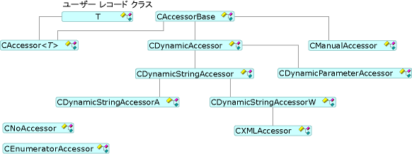

# アクセサーと行セット
アクセサーと行を設定し、データの取得、OLE DB テンプレートを使用して、 [CAccessorRowset](../../data/oledb/caccessorrowset-class.md)クラスです。 このクラスは、さまざまな種類の複数のアクセサーを処理できます。  
  
## アクセサーの種類  
 派生してすべてのアクセサー [CAccessorBase](../../data/oledb/caccessorbase-class.md)です。 `CAccessorBase`パラメーターと列のバインドの両方を提供します。  
  
 次の図は、アクセサーの種類を示します。  
  
   
アクセサー クラス  
  
-   [CAccessor](../../data/oledb/caccessor-class.md)デザイン時にデータベースのソースの構造がわかっている場合にこのアクセサーを使用します。 `CAccessor`静的にバッファーを含むデータベース レコードをデータ ソースにバインドします。  
  
-   [CDynamicAccessor](../../data/oledb/cdynamicaccessor-class.md)このアクセサーはデザイン時に、データベースの構造を認識していない場合に使用します。 `CDynamicAccessor`呼び出し`IColumnsInfo::GetColumnInfo`データベース列の情報を取得します。 作成し、アクセサーと、バッファーを管理します。  
  
-   [CDynamicParameterAccessor](../../data/oledb/cdynamicparameteraccessor-class.md)不明なコマンドの種類を処理するためこのアクセサーを使用します。 コマンドを準備するときに`CDynamicParameterAccessor`からパラメーター情報を取得することができます、`ICommandWithParameters`プロバイダーがサポートされている場合、インターフェイス`ICommandWithParameters`です。  
  
-   [CDynamicStringAccessor](../../data/oledb/cdynamicstringaccessor-class.md)、 [CDynamicStringAccessorA](../../data/oledb/cdynamicstringaccessora-class.md)、および[CDynamicStringAccessorW](../../data/oledb/cdynamicstringaccessorw-class.md)データベース スキーマの知識があるない場合に、これらのクラスを使用します。 `CDynamicStringAccessorA`ANSI 文字列としてデータを取得します`CDynamicStringAccessorW` Unicode 文字列としてデータを取得します。  
  
-   [CManualAccessor](../../data/oledb/cmanualaccessor-class.md)このクラスでは、プロバイダーは、型を変換できる場合どのようなデータ型を使用できます。 コマンドのパラメーターと結果の列の両方を処理します。  
  
 次の表は、OLE DB テンプレートのアクセサーの種類でのサポートをまとめたものです。  
  
|アクセサーの種類|動的|パラメーターを処理します。|バッファー|複数のアクセサー|  
|-------------------|-------------|--------------------|------------|------------------------|  
|`CAccessor`|×|[はい]|ユーザー|[はい]|  
|`CDynamicAccessor`|はい|×|OLE DB テンプレート|×|  
|`CDynamicParameterAccessor`|はい|[はい]|OLE DB テンプレート|×|  
|`CDynamicStringAccessor[A,W]`|はい|×|OLE DB テンプレート|×|  
|`CManualAccessor`|はい|[はい]|ユーザー|[はい]|  
  
## 行セットの種類  
 OLE DB テンプレート (上記の図を参照してください) の行セットの 3 種類のサポート: 単一の行セット (によって実装される[CRowset](../../data/oledb/crowset-class.md))、行セットを一括 (によって実装される[CBulkRowset](../../data/oledb/cbulkrowset-class.md))、(実装行セットの配列とによって[CArrayRowset](../../data/oledb/carrayrowset-class.md))。 1 つの行の処理時に 1 つの行セットのフェッチ`MoveNext`と呼びます。 一括行セットは、複数の行ハンドルをフェッチできます。 配列行セットとは、配列の構文を使用してアクセスできる行セットです。  
  
 次の図は、行セットの種類を示します。  
  
   
行セット クラス  
  
 [スキーマ行セット](../../data/oledb/obtaining-metadata-with-schema-rowsets.md)データのデータにアクセスできませんを保存せずにメタデータと呼ばれる、データ ストアに関する情報にアクセスします。 スキーマ行セットが、データベースの構造がコンパイル時に不明を実行時に取得する必要がある状況に用いられます。  
  
## 参照  
 [OLE DB コンシューマー テンプレート](../../data/oledb/ole-db-consumer-templates-cpp.md)