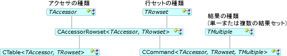

# コマンドとテーブル
[!INCLUDE[vs2017banner](../../assembler/inline/includes/vs2017banner.md)]

コマンドとテーブルを使用して、行セットにアクセスできます。つまり、行セットを開き、コマンドを実行し、列をバインドできます。  [CCommand](../../data/oledb/ccommand-class.md) クラスと [CTable](../../data/oledb/ctable-class.md) クラスは、それぞれコマンド オブジェクトとテーブル オブジェクトをインスタンス化します。  次の図に示すように、これらのクラスは [CAccessorRowset](../Topic/CAccessorRowset%20Class.md) の派生クラスです。  
  
   
コマンド クラスとテーブル クラス  
  
 前の表では、`TAccessor` は「[アクセサーと行セット](../../data/oledb/accessors-and-rowsets.md)」に示されている任意の種類のアクセサーになります。  *TRowset* は、「[アクセサーと行セット](../../data/oledb/accessors-and-rowsets.md)」に示されている任意の種類の行セットにすることができます。  *TMultiple* では、結果の種類 \(単一または複数の結果セット\) を指定します。  
  
 [ATL OLE DB コンシューマー ウィザード](../../atl/reference/atl-ole-db-consumer-wizard.md)で、コマンド オブジェクトとテーブル オブジェクトのどちらが必要かを指定します。  
  
-   コマンドを使用しないデータ ソースでは、`CTable` クラスを使用できます。  このクラスは一般に、パラメーターを指定せず、複数の結果を必要としない単純な行セットに使用します。  この単純なクラスは、指定されたテーブル名を使用してデータ ソースのテーブルを開きます。  
  
-   コマンドをサポートするデータ ソースでは、代わりに `CCommand` クラスを使用できます。  コマンドを実行するには、このクラスに対して [Open](../../data/oledb/ccommand-open.md) を呼び出します。  または、`Prepare` を呼び出して、複数回実行するコマンドを準備することもできます。  
  
     **CCommand** には、アクセサーの種類、行セットの種類、および結果の種類 \(既定では `CNoMultipleResults` または `CMultipleResults`\) の 3 つのテンプレート引数があります。  `CMultipleResults` を指定すると、`CCommand` クラスは **IMultipleResults** インターフェイスをサポートし、複数の行セットを処理します。  [DBVIEWER](http://msdn.microsoft.com/ja-jp/07620f99-c347-4d09-9ebc-2459e8049832) サンプルは、複数の結果を処理する方法を示しています。  
  
## 参照  
 [OLE DB コンシューマー テンプレート](../../data/oledb/ole-db-consumer-templates-cpp.md)