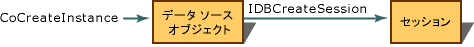

# OLE DB プロバイダー テンプレートのアーキテクチャ
[!INCLUDE[vs2017banner](../../assembler/inline/includes/vs2017banner.md)]

## データ ソースとセッション  
 OLE DB プロバイダー アーキテクチャは、1 つのデータ ソース オブジェクトと 1 つ以上のセッションを含んでいます。  データ ソース オブジェクトは、すべてのプロバイダーがインスタンスとして起動する必要のある初期オブジェクトです。  コンシューマー アプリケーションは、データを必要とする場合にデータ ソース オブジェクトを再作成してプロバイダーを起動します。  データ ソース オブジェクトは、**IDBCreateSession** インターフェイスを使用して、コンシューマーがデータ ソース オブジェクトに接続するためのセッション オブジェクトを作成します。  データ ソース オブジェクトとセッション オブジェクトは、ODBC の **HENV** と **HDBC** にそれぞれ相当します。  
  
   
  
 OLE DB テンプレートは、OLE DB プロバイダー ウィザードによって作成されるソース ファイルを使用して、データ ソース オブジェクトを実装します。  セッションは、OLE DB の **TSession** に相当するオブジェクトです。  
  
## 必須インターフェイスと省略可能なインターフェイス  
 OLE DB プロバイダー テンプレートは、すべての必須インターフェイスに対してあらかじめパッケージ化された実装を提供します。  いくつかの種類のオブジェクトに対して、必須インターフェイスおよび省略可能なインターフェイスが OLE DB により定義されています。  
  
-   [データ ソース](../../data/oledb/data-source-object-interfaces.md)  
  
-   [Session](../../data/oledb/session-object-interfaces.md)  
  
-   [行セット](../Topic/Rowset%20Object%20Interfaces.md)  
  
-   [コマンド](../../data/oledb/command-object-interfaces.md)  
  
-   [トランザクション](../../data/oledb/transaction-object-interfaces.md)  
  
 OLE DB プロバイダー テンプレートは、行オブジェクトとストレージ オブジェクトを実装しないことに注意してください。  
  
 「[OLE DB Version 2.7](https://msdn.microsoft.com/en-us/library/ms722784.aspx)」に従って、上記オブジェクトの必須インターフェイスと省略可能なインターフェイスの一覧を次に示します。  
  
|コンポーネント|インターフェイス|コメント|  
|-------------|--------------|----------|  
|[データ ソース](../../data/oledb/data-source-object-interfaces.md) \([CDataSource](../Topic/CDataSource%20Class.md)\)|\[必須\] **IDBCreateSession**   \[必須\] **IDBInitialize**   \[必須\] `IDBProperties`   \[必須\] `IPersist`   \[省略可能\] **IConnectionPointContainer**   \[省略可能\] **IDBAsynchStatus**   \[省略可能\] **IDBDataSourceAdmin**   \[省略可能\] **IDBInfo**   \[省略可能\] `IPersistFile`   \[省略可能\] **ISupportErrorInfo**|コンシューマーからプロバイダーへの接続。  オブジェクトは、ユーザー ID、パスワード、データ ソース名などの接続のプロパティを指定するために使用されます。  オブジェクトは、データ ソースを管理 \(作成、更新、削除、テーブルなど\) するためにも使用できます。|  
|[セッション](../../data/oledb/session-object-interfaces.md) \([CSession](../../data/oledb/cdataconnection-operator-csession-amp.md)\)|\[必須\] **IGetDataSource**   \[必須\] `IOpenRowset`   \[必須\] **ISessionProperties**   \[省略可能\] **IAlterIndex**   \[省略可能\] **IAlterTable**   \[省略可能\] **IBindResource**   \[省略可能\] **ICreateRow**   \[省略可能\] **IDBCreateCommand**   \[省略可能\] **IDBSchemaRowset**   \[省略可能\] **IIndexDefinition**   \[省略可能\] **ISupportErrorInfo**   \[省略可能\] **ITableCreation**   \[省略可能\] **ITableDefinition**   \[省略可能\] **ITableDefinitionWithConstraints**   \[省略可能\] **ITransaction**   \[省略可能\] **ITransactionJoin**   \[省略可能\] **ITransactionLocal**   \[省略可能\] **ITransactionObject**|セッション オブジェクトは、コンシューマーとプロバイダー間の 1 回のやり取りを表します。  これは、多くのセッションが同時にアクティブになる可能性があるという点で ODBC **HSTMT** に似ています。   セッション オブジェクトは、OLE DB 機能にアクセスするために最初に参照されるオブジェクトです。  コマンド、トランザクション、または行セット オブジェクトにアクセスするには、セッション オブジェクトを経由します。|  
|[行セット](../Topic/Rowset%20Object%20Interfaces.md) \([CRowset](../Topic/CRowset%20Class.md)\)|\[必須\] `IAccessor`   \[必須\] `IColumnsInfo`   \[必須\] **IConvertType**   \[必須\] `IRowset`   \[必須\] `IRowsetInfo`   \[省略可能\] **IChapteredRowset**   \[省略可能\] **IColumnsInfo2**   \[省略可能\] **IColumnsRowset**   \[省略可能\] **IConnectionPointContainer**   \[省略可能\] **IDBAsynchStatus**   \[省略可能\] **IGetRow**   \[省略可能\] `IRowsetChange`   \[省略可能\] **IRowsetChapterMember**   \[省略可能\] **IRowsetCurrentIndex**   \[省略可能\] **IRowsetFind**   \[省略可能\] **IRowsetIdentity**   \[省略可能\] **IRowsetIndex**   \[省略可能\] `IRowsetLocate`   \[省略可能\] **IRowsetRefresh**   \[省略可能\] `IRowsetScroll`   \[省略可能\] `IRowsetUpdate`   \[省略可能\] **IRowsetView**   \[省略可能\] **ISupportErrorInfo**   \[省略可能\] **IRowsetBookmark**|行セット オブジェクトは、データ ソースのデータを表します。  オブジェクトは、そのデータの連結と、データに対する基本操作 \(更新、フェッチ、移動、その他\) を行います。  データを格納および操作するには、行セット オブジェクトが必要です。|  
|[コマンド](../../data/oledb/command-object-interfaces.md) \([CCommand](http://msdn.microsoft.com/ja-jp/52bef5da-c1a0-4223-b4e6-9e464b6db409)\)|\[必須\] `IAccessor`   \[必須\] `IColumnsInfo`   \[必須\] `ICommand`   \[必須\] **ICommandProperties**   \[必須\] `ICommandText`   \[必須\] **IConvertType**   \[省略可能\] **IColumnsRowset**   \[省略可能\] **ICommandPersist**   \[省略可能\] **ICommandPrepare**   \[省略可能\] `ICommandWithParameters`   \[省略可能\] **ISupportErrorInfo**   \[省略可能\] **ICommandStream**|コマンド オブジェクトは、クエリなどのデータ操作を行います。  パラメーター化されたステートメントまたはパラメーター化されていないステートメントを処理できます。   コマンド オブジェクトは、パラメーターと出力列の連結の処理も行います。  連結は、行セット内の列をどのように取得するかに関する情報を含む構造体です。  これには、序数、データ型、長さ、ステータスなどの情報が含まれます。|  
|[トランザクション](../../data/oledb/transaction-object-interfaces.md) \(省略可能\)|\[必須\] **IConnectionPointContainer**   \[必須\] **ITransaction**   \[省略可能\] **ISupportErrorInfo**|トランザクション オブジェクトは、データ ソースに対する分割不可能な作業単位を定義し、それらの作業単位が相互にどのように関連するかを指定します。  このオブジェクトは、OLE DB プロバイダー テンプレートによって直接にはサポートされません。つまり、独自のオブジェクトを作成する必要があります。|  
  
 詳細については、次のトピックを参照してください。  
  
-   [プロパティ マップ](../../data/oledb/property-maps.md)  
  
-   [ユーザー レコード](../../data/oledb/user-record.md)  
  
## 参照  
 [OLE DB プロバイダー テンプレート](../../data/oledb/ole-db-provider-templates-cpp.md)   
 [OLE DB Interfaces](https://msdn.microsoft.com/en-us/library/ms709709.aspx)