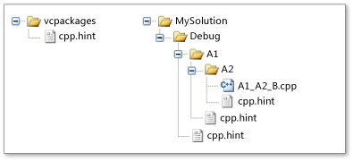

# ヒント ファイル
[!INCLUDE[vs2017banner](../assembler/inline/includes/vs2017banner.md)]

A *ヒント ファイル* により、Visual Studio 統合開発環境 (IDE) は、関数およびマクロの名前など、Visual C の識別子を解釈します。 Visual C プロジェクト、IDE の開く *解析システム* プロジェクト内の各ソース ファイル内のコードを分析し、すべての識別子に関する情報を収集します。 IDE では、その情報を使用して、機能をサポートし、 **クラス ビュー** ブラウザーと **ナビゲーション バー**します。  
  
 導入された解析システム [!INCLUDE[cpp_dev10_long](../Token/cpp_dev10_long_md.md)], 、C と C++ 構文の理解が、マクロを含むステートメントが誤って解釈することができます。 ステートメントは、マクロが書き込まれると、構文的に正しいするソース コードが発生した場合、誤って解釈されることができます。 ソース コードがコンパイルされ、プリプロセッサが置き換えられます、ステートメントが構文的に正しいなれる、 [マクロ識別子](../preprocessor/hash-define-directive-c-cpp.md) をその定義でします。 解析のシステムのヒント ファイルを使用してマクロを解釈するので、プロジェクトを作成することがなく動作します。 そのため、参照、機能のなど **クラス ビュー** は直ちに使用できます。  
  
 ヒント ファイルには、ユーザーがカスタマイズできる *ヒント*, 、C と C++ のマクロ定義と同じ構文であります。 Visual C には、ほとんどのプロジェクトのための十分なは、組み込みのヒント ファイルが含まれていますが、Visual Studio の識別子の処理方法を向上させるために、独自のヒント ファイルを作成できます。  
  
> [!IMPORTANT]
>  変更のヒント ファイルを追加するか、.sdf ファイルや変更を有効にするためにソリューション内の VC.db ファイルを削除する必要があります。  
  
## <a name="scenario"></a>シナリオ  
 次のコードでとを確認するソース ファイルであると仮定、 **クラス ビュー** ブラウザーです。  `STDMETHOD` マクロという名前のメソッドを宣言して `myMethod` を 1 つのパラメーターを受け取るをへのポインターを返す、 **HRESULT**します。  
  
```  
// Source code file.  
STDMETHOD(myMethod)(int parameter1);  
```  
  
 次のマクロ定義では、別のヘッダー ファイルにします。  
  
```  
// Header file.  
#define STDMETHOD(method) HRESULT (STDMETHODCALLTYPE * method)  
#define STDMETHODCALLTYPE __stdcall  
#define HRESULT void*  
```  
  
 STDMETHOD という名前の関数が宣言するように見えるために、解析システムは、ソース コードを解釈できないし、その宣言構文が正しくない 2 つのパラメーター リストがあるためです。 解析のシステムには、定義を調査するヘッダー ファイルが開かない、 `STDMETHOD`, 、`STDMETHODCALLTYPE`, 、および `HRESULT` マクロです。 解析のシステムで解釈できないため、 `STDMETHOD` マクロ、ステートメント全体を無視し、解析を継続します。  
  
 解析のシステムでは、プロジェクトが 1 つまたは複数の重要なヘッダー ファイルに依存しているヘッダー ファイルは使用しません。 任意のヘッダー ファイルが変更された場合は、解析システムをすべてのプロジェクトで、IDE のパフォーマンスが低下するヘッダー ファイルを再確認する必要があります。 解析のシステムが処理する方法を指定するヒントを使用する代わりに、 `STDMETHOD`, 、`STDMETHODCALLTYPE`, 、および `HRESULT` マクロです。  
  
 知る方法のヒントをする必要がありますか。 ヒントを実行する場合に、どのような作成するべきでしょうか。 ヒントが必要である 1 つの符号が場合は、ビュー内の識別子の **クラス ビュー** のビューと整合性がありません、 **エディター**します。 たとえば、 **クラス ビュー** 表示しない] がわかっているクラスのメンバーが存在する可能性がありますか、メンバーの名前が正しくありません。 一般的な問題を解決するヒントの種類の詳細については、どのようなマクロを必要とするヒントを参照してくださいでしょうか。このトピックで後述する「します。  
  
## <a name="architecture"></a>アーキテクチャ  
 ヒント ファイルが物理ディレクトリに関連付けに示すように、論理ディレクトリではなく **ソリューション エクスプ ローラー**します。 ヒント ファイルを影響を与えるヒント ファイルをプロジェクトに追加する必要はありません。 解析のシステムは、ソース ファイルを解析する場合にのみ、ヒント ファイルを使用します。  
  
 すべてのヒント ファイルの名前は **cpp.hint**します。 そのため、多くのディレクトリがヒント ファイルを含めることができますが、1 つだけのヒント ファイルが特定のディレクトリで発生することができます。  
  
 0 個以上のヒント ファイルによって、プロジェクトを受けることができます。 ヒント ファイルがない場合は、解析システムを解読できないソース コードを無視するエラーの復旧方法を使用します。 それ以外の場合、解析システムでは、次の方法を使用して検索し、ヒントを収集します。  
  
### <a name="search-order"></a>検索順序  
 解析のシステムでは、次の順序でヒント ファイルのディレクトリを検索します。  
  
-   Visual C のインストール パッケージを格納されているディレクトリ (**vcpackages**)。 このディレクトリには、よく使われるシステム ファイル内のシンボルをなどについて説明する組み込みのヒント ファイルが含まれています。 **windows.h**します。 その結果、プロジェクトに必要なヒントのほとんどが自動的に継承します。  
  
-   ソース ファイルのルート ディレクトリからソース ファイル自体を含むディレクトリへのパス。 一般的な Visual C プロジェクトでは、ルート ディレクトリには、ソリューションまたはプロジェクト ファイルが含まれています。  
  
     このルールの例外は場合、 *ストップ ファイル* ソース ファイルのパスにします。 ストップ ファイルが検索順序の詳細に制御を提供し、名前は任意のファイルは、 **cpp.stop**します。 ルート ディレクトリから開始するのではなく解析システムは、ソース ファイルが格納されているディレクトリに stop ファイルを含むディレクトリから検索します。 一般的なプロジェクトでストップ ファイルは必要ありません。  
  
### <a name="hint-gathering"></a>ヒントの収集  
 ヒント ファイルは、0 個以上含まれています。 *ヒント*します。 ヒントが定義されているか、C と C++ マクロと同じように削除します。 つまり、 `#define` プリプロセッサ ディレクティブを作成するか、ヒントを再定義と `#undef` ディレクティブは、ヒントを削除します。  
  
 解析のシステムの前に説明した検索の順序で各ヒント ファイルを開きを一連の各ファイルのヒントを蓄積 *有効ヒント*, 、し、効果的なヒントを使用して、コード内の識別子を解釈します。  
  
 解析のシステムは、次の規則を使用して、ヒントを蓄積します。  
  
-   新しいヒントは、既に定義されていない名前を指定する場合、新しいヒントは、効果的なヒントに名前を追加します。  
  
-   新しいヒントは、既に定義されている名前を指定する場合、新しいヒントには、既存のヒントが再定義します。  
  
-   新しいヒントがある場合、 `#undef` ディレクティブを指定する既存の効果的なヒント、新しいヒントは、既存のヒントを削除します。  
  
 最初のルールでは、効果的なヒントが既に開かれているヒント ファイルから継承されたことを意味します。 最後の 2 つのルールは、検索の順序で後で発生するヒントが以前に発生したヒントをオーバーライドできますを意味します。 たとえば、ソース ファイルを含むディレクトリでヒント ファイルを作成する場合は、前のヒントをオーバーライドできます。  
  
 ヒントを収集する方法の説明図を参照してください、 `Example` このトピックで後述します。  
  
### <a name="syntax"></a>構文  
 ヒントは作成され、プリプロセッサ ディレクティブを作成し、マクロを削除すると同じ構文を使用して削除します。 実際には、解析システムは、ヒントを評価するのに C/C++ プリプロセッサを使用します。 プリプロセッサ ディレクティブの詳細については、次を参照してください。 [#define ディレクティブ (c/c++)](../preprocessor/hash-define-directive-c-cpp.md) と [#undef ディレクティブ (c/c++)](../preprocessor/hash-undef-directive-c-cpp.md)します。  
  
 のみ独特な構文要素は、 `@<`, 、`@=`, 、および `@>` 置換文字列。 これらは、ヒント ファイル固有の置換文字列でのみ使用される *マップ* マクロです。 マップとは、データ、関数、またはイベントを他のデータ、関数、またはイベント ハンドラーに関連するマクロのセットです。 たとえば、 `MFC` マップを使用して作成 [メッセージ マップ](../mfc/reference/message-maps-mfc.md), 、および `ATL` マップを使用して作成 [オブジェクトのマップ](../atl/reference/object-map-macros.md)します。 ヒント ファイル固有の置換文字列では、マップの開始、中間、および終了要素を示しています。 マップ マクロの名前だけは重要です。 そのため、各置換文字列には、マクロの実装意図的に非表示にします。  
  
 ヒントは、次の構文を使用します。  
  
|構文|説明|  
|------------|-------------|  
|`#define` *ヒント名前* *置換文字列*<br /><br /> `#define` *ヒント名前* `(` *パラメーター*, ...`)`*置換文字列*|新しいヒントを定義または既存のヒントを再定義するプリプロセッサ ディレクティブです。 ディレクティブの後は、プリプロセッサはすべてを置き換えます。 *ヒント名前* でソース コードで *置換文字列*します。<br /><br /> 2 番目の構文形式では、関数のようなヒントを定義します。 プリプロセッサは最初に一致する各を置き換えます関数に似たヒントは、ソース コードで発生する場合 *パラメーター* で *置換文字列* を対応する引数をソース コード、および置換 *ヒント名前* と *置換文字列*します。|  
|`@<`|特定のヒント ファイル *置換文字列* マップ要素のセットの先頭を指定します。|  
|`@=`|特定のヒント ファイル *置換文字列* の中間のマップ要素を示します。 マップには、複数のマップ要素ができます。|  
|`@>`|特定のヒント ファイル *置換文字列* マップ要素のセットの末尾を示します。|  
|`#undef` *ヒント名前*|既存のヒントを削除するプリプロセッサ ディレクティブです。 によって、ヒントの名前が提供される、 *ヒント名前* 識別子。|  
|`//` *コメント*|単一行コメント。|  
|`/*` *コメント* `*/`|複数行のコメントです。|  
  
## <a name="what-macros-require-a-hint"></a>どのようなマクロのヒントが必要ですか?  
 解析システム マクロの特定の種類を妨げることができます。 このセクションでは、問題を引き起こす可能性のあるマクロの種類とその問題を解決するために作成できるヒントの種類について説明します。  
  
### <a name="disruptive-macros"></a>中断を伴うマクロ  
 いくつかのマクロは、解析システムをソース コードを誤って解釈する可能性がありますが、ブラウズ エクスペリエンスを損なうことがなく無視できます。 たとえば、ソース コード注釈言語 ([SAL](../c-runtime-library/sal-annotations.md)) プログラミングのバグを検出するのに役立つ C++ 属性にマクロを解決します。 コードを参照するので、SAL 注釈は無視する場合は、注釈を非表示にするためのヒント ファイルを作成することができます。  
  
 次のソース コードで、パラメーターの型の `FormatWindowClassName()` 関数は、 `PXSTR`, 、パラメーター名は `szBuffer`です。 ただし、解析システム ミス、 `_Pre_notnull_` と `_Post_z_` パラメーターの型またはパラメーター名のいずれかの SAL 注釈。  
  
 **ソース コード:**  
  
```  
static void FormatWindowClassName(_Pre_notnull__Post_z_ PXSTR szBuffer)  
```  
  
 **方法:** 定義は Null  
  
 存在しないかのように SAL 注釈を扱う方法がこのような状況に対応する方法です。 これを行うには、置換文字列が null のヒントを指定します。 解析のシステムが、コメントを無視する結果として、および **クラス ビュー** ブラウザーは表示されません。 (Visual C には、SAL 注釈を非表示にする組み込みのヒント ファイルが含まれています)。  
  
 **ヒント ファイル:**  
  
```  
#define _Pre_notnull_  
```  
  
### <a name="concealed-cc-language-elements"></a>C と C++ の非表示の文字列の言語要素  
 解析のシステムがソース コードを誤って解釈され、一般的な理由は、マクロが C と C++ を非表示に [区切り](../cpp/punctuators-cpp.md) または [キーワード](../cpp/keywords-cpp.md) トークンです。 つまり、マクロを含めることが、区切り記号のペアの片方など `<>`, 、`[]`, 、`{}`, 、および `()`です。  
  
 次のソース コードで、 `START_NAMESPACE` マクロには、対になっていない左中かっこが非表示になります (`{`)。  
  
 **ソース コード:**  
  
```  
#define START_NAMESPACE namespace MyProject {  
```  
  
 **方法:** コピーを送信  
  
 マクロのセマンティクスがこの閲覧エクスペリエンスに不可欠な場合は、マクロと同じであるヒントを作成します。 解析のシステムでは、ヒント ファイル内の定義にマクロが解決されます。  
  
 ソース ファイル内のマクロにその他のマクロが含まれている場合、マクロ解釈されるように有効ヒントのセットに既に存在する場合にのみ注意してください。  
  
 **ヒント ファイル:**  
  
```  
#define START_NAMESPACE namespace MyProject {  
```  
  
### <a name="maps"></a>マップ  
 マップは、開始要素、終了要素、および 0 個以上の中間要素を指定するマクロで構成されます。 解析のシステムには、各マップ マクロは、C と C++ 言語の要素を非表示にし、多くの別々 のマクロの間で完全な C と C++ ステートメントの構文を分散するためのマップが正しく解釈されません。  
  
 次のソース コードを定義、 `BEGIN_CATEGORY_MAP`, 、`IMPLEMENTED_CATEGORY`, 、および `END_CATEGORY_MAP` マクロです。  
  
 **ソース コード:**  
  
```  
#define BEGIN_CATEGORY_MAP(x)\  
static const struct ATL::_ATL_CATMAP_ENTRY* GetCategoryMap() throw() {\  
static const struct ATL::_ATL_CATMAP_ENTRY pMap[] = {  
#define IMPLEMENTED_CATEGORY( catid ) { _ATL_CATMAP_ENTRY_IMPLEMENTED, &catid },  
#define END_CATEGORY_MAP()\  
   { _ATL_CATMAP_ENTRY_END, NULL } };\  
   return( pMap ); }  
```  
  
 **方法:** を特定するマップ要素  
  
 開始、中間 (存在する場合)、および最後のヒントを指定 map の要素。 特別なマップの置換文字列を使用して `@<`, 、`@=`, 、および `@>`です。 詳細については、次を参照してください。、 `Syntax` 」セクションを参照します。  
  
 **ヒント ファイル:**  
  
```  
// Start of the map.  
#define BEGIN_CATEGORY_MAP(x) @<  
// Intermediate map element.  
#define IMPLEMENTED_CATEGORY( catid ) @=  
// Intermediate map element.  
#define REQUIRED_CATEGORY( catid ) @=  
// End of the map.  
#define END_CATEGORY_MAP() @>  
```  
  
### <a name="composite-macros"></a>複合マクロ  
 複合マクロには、1 つ以上の解析システムを混乱させるマクロの種類が含まれています。  
  
 次のソース コードを含む、 `START_NAMESPACE` マクロで、名前空間スコープの開始を指定するには、および `BEGIN_CATEGORY_MAP` マクロで、マップの開始を指定します。  
  
 **ソース コード:**  
  
```  
#define NSandMAP START_NAMESPACE BEGIN_CATEGORY_MAP  
```  
  
 **方法:** コピーを送信  
  
 ヒントの作成、 `START_NAMESPACE` と `BEGIN_CATEGORY_MAP` 、マクロのヒントを作成し、 `NSandMAP` マクロは、ソース コードの前に示したのと同じです。 または、悪影響のあるマクロおよび空白のみの場合、複合マクロ置換文字列が null の定義は、ヒントを定義できます。  
  
 この例では、次の前提としています: `START_NAMESPACE` でこのトピックの説明に従って、ヒントは既に、 `Concealed C/C++ Language Elements` 小見出しします。 見なす `BEGIN_CATEGORY_MAP` 前述のヒントを持つ `Maps`です。  
  
 **ヒント ファイル:**  
  
```  
#define NSandMAP START_NAMESPACE BEGIN_CATEGORY_MAP  
```  
  
### <a name="inconvenient-macros"></a>不便なマクロ  
 いくつかのマクロは解析のシステムで解釈できるが、ソース コードは、マクロは、long 型または複雑なために、読み取ることが困難です。 読みやすさには、マクロの表示を簡略化するヒントを提供できます。  
  
 **ソース コード:**  
  
```  
#define STDMETHOD(methodName) HRESULT (STDMETHODCALLTYPE * methodName)  
```  
  
 **方法:** 単純化  
  
 単純なマクロ定義を表示するヒントを作成します。  
  
 **ヒント ファイル:**  
  
```  
#define STDMETHOD(methodName) void* methodName  
```  
  
## <a name="example"></a>例  
 次の例では、ヒント ファイルからヒントを蓄積する方法を示しています。 ストップ ファイルは、この例では使用されません。  
  
 次の図は、Visual C プロジェクト内の物理ディレクトリの一部を示しています。 ヒント ファイルは、 `vcpackages`, 、`Debug`, 、`A1`, 、および `A2` ディレクトリ。  
  
### <a name="hint-file-directories"></a>ヒント ファイルのディレクトリ  
   
  
### <a name="directories-and-hint-file-contents"></a>ディレクトリとヒント ファイルの内容  
 次に、このヒント ファイル、およびそれらのヒント ファイルの内容を含むプロジェクトのディレクトリを示します。 多くのヒントの一部のみ、 `vcpackages` ディレクトリのヒント ファイルの一覧が表示されます。  
  
-   vcpackages  
  
    ```  
    // vcpackages (partial list)  
    #define _In_  
    #define _In_opt_  
    #define _In_z_  
    #define _In_opt_z_  
    #define _In_count_(size)  
    ```  
  
-   デバッグ  
  
    ```  
    // Debug  
    #undef _In_  
    #define OBRACE {  
    #define CBRACE }  
    #define RAISE_EXCEPTION(x) throw (x)  
    #define START_NAMESPACE namespace MyProject {  
    #define END_NAMESPACE }  
    ```  
  
-   A1  
  
    ```  
    // A1  
    #define START_NAMESPACE namespace A1Namespace {  
    ```  
  
-   A2  
  
    ```  
    // A2  
    #undef OBRACE  
    #undef CBRACE  
    ```  
  
### <a name="effective-hints"></a>効果的なヒント  
 次の表には、このプロジェクトのソース ファイルの有効なヒントが一覧表示します。  
  
-   ソース ファイル: A1_A2_B.cpp  
  
-   効果的なヒント:  
  
    ```  
    // vcpackages (partial list)  
    #define _In_opt_  
    #define _In_z_  
    #define _In_opt_z_  
    #define _In_count_(size)  
    // Debug...  
    #define RAISE_EXCEPTION(x) throw (x)  
    // A1  
    #define START_NAMESPACE namespace A1Namespace {   
    // ...Debug  
    #define END_NAMESPACE }  
    ```  
  
 次の注意事項は、上記の一覧に適用します。  
  
-   効果的なヒントがからは、 `vcpackages`, 、`Debug`, 、`A1`, 、および `A2` ディレクトリ。  
  
-    **#Undef** ディレクティブで、 `Debug` ヒント ファイルの削除、 `#define _In_` のヒント、 `vcpackages` ディレクトリのヒント ファイルです。  
  
-   ヒント ファイルで、 `A1` ディレクトリを再定義 `START_NAMESPACE`します。  
  
-    `#undef` のヒント、 `A2` ディレクトリのヒントを削除する `OBRACE` と `CBRACE` で、 `Debug` ディレクトリのヒント ファイルです。  
  
## <a name="see-also"></a>関連項目  
 [Visual C プロジェクトに対して作成されるファイルの種類](../ide/file-types-created-for-visual-cpp-projects.md)   
 [作成と Windows 環境の制御](../Topic/Creating%20and%20Controlling%20Environment%20Windows.md)   
 [#define ディレクティブ (C/C++)](../preprocessor/hash-define-directive-c-cpp.md)   
 [#undef ディレクティブ (C/C++)](../preprocessor/hash-undef-directive-c-cpp.md)   
 [SAL 注釈](../c-runtime-library/sal-annotations.md)   
 [メッセージ マップ](../mfc/reference/message-maps-mfc.md)   
 [メッセージ マップ マクロ](../atl/reference/message-map-macros-atl.md)   
 [オブジェクト マップ マクロ](../atl/reference/object-map-macros.md)