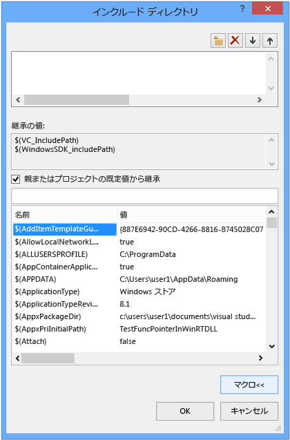

# プロジェクトのプロパティの操作
[!INCLUDE[vs2017banner](../assembler/inline/includes/vs2017banner.md)]

として、IDE でプロジェクトをビルドするために必要なすべての情報が公開されている              *プロパティ*します。 この情報には、アプリケーション名、(DLL、LIB、EXE) などの拡張機能、コンパイラ オプション、リンカー オプション、デバッガーの設定、カスタム ビルド ステップ、およびその他の多くの要素が含まれています。 使用する              *プロパティ ページ* (             **プロジェクトと #124 文字です。プロパティ**) を表示およびこれらのプロパティを変更します。  
  
 プロジェクトを作成するときに、システムは、さまざまなプロパティの値を割り当てます。 既定では多少種類により、プロジェクトとオプションのアプリケーション ウィザードで選択します。 たとえば、ATL プロジェクトが MIDL ファイルに関連するプロパティが存在しない場合は、基本的なコンソール アプリケーションでします。   プロパティ ページで、[全般] ペインで、既定のプロパティのとおりです。  
  
   
  
 アプリケーション名など、一部のプロパティは、対象となるプラットフォームやデバッグまたはリリース ビルドであるかどうかに関係なく、すべてのビルドのバリエーションに適用されます。 ほとんどのプロパティは構成に依存します。   これは、コンパイラがどのような特定のプラットフォームで実行する、プログラムとどのような特定のコンパイラが、適切なコードを生成するために使用するオプションを知っている必要があるためです。 そのため、プロパティを設定すると、どの構成とプラットフォームの新しい値に適用する注意を払う必要があります。  Win32 のデバッグ ビルドにのみ適用、または ARM のデバッグにも適用する必要があり、デバッグ x64 でしょうか。 たとえば、              **最適化** 、既定では、プロパティが              **速度 (/O2)** リリース構成が、デバッグ構成で無効にします。  
  
 プロパティ ページように設計されていますが常に表示、および場合、必要に応じてを変更する構成とプラットフォーム プロパティの値に適用します。 次の図は、上部にあるリスト ボックスのプロパティ ページを構成およびプラットフォーム情報を示します。 [最適化] プロパティがここで設定されている場合にのみ適用されます Win32 のデバッグ ビルドでは、アクティブな構成にするのには、赤の矢印で示すようにします。  
  
   
  
 次の図は、同じプロジェクトのプロパティ ページを示していますが、リリースに、構成が変更されました。 [最適化] プロパティに別の値に注意してください。 また、アクティブな構成は、デバッグではまだことに注意してください。 ここでは、構成のプロパティを設定することができます。アクティブにする必要はありません。  
  
   
  
 プロジェクト システム自体は、ファイル形式との任意の種類のプロジェクトを構築するための規則を定義する MSBuild に基づきます。 MSBuild では、複数の構成とプラットフォームでは、建物の複雑さの大部分を管理するが、その動作についてもう少し理解する必要があります。 これは、カスタム構成を定義または共有を複数のプロジェクトにインポートするプロパティの再利用可能なセットを作成する場合に特に重要です。  
  
 プロジェクトのプロパティは、プロジェクト ファイル (*.vcxproj) に直接、またはその他の .xml ファイルまたは .props ファイルで、プロジェクト ファイルのインポートとこれが既定値を指定することは格納されます。 前述したように、同じ構成の同じプロパティは複数のファイルの別の値割り当てることがあります。 プロジェクトをビルドするときに、MSBuild エンジンは、プロジェクト ファイルと (後述) を適切に定義された順序でインポートされたすべてのファイルを評価します。 各ファイルが評価されると、そのファイルで定義されているプロパティ値は、既存の値をオーバーライドします。  指定されていない任意の値は、前の手順が評価されたファイルから継承されます。  そのため、プロパティ ページ] でプロパティを設定するときにも設定することに注意する重要なできます。 .Props ファイルでプロパティを"X"に設定するプロジェクト ファイルで、プロパティが"Y"に設定されている場合、プロジェクトは"Y"に設定するプロパティを使用して作成します。 同じプロパティは、.cpp ファイルなど、プロジェクトのアイテムでは、"Z"に設定されて場合、MSBuild エンジンでは"Z"の値が使用されます。 詳細については、次を参照してください。              [プロパティの継承](#bkmkPropertyInheritance) この記事で後述します。  
  
## ビルド構成  
 構成とは、任意の名前を付けられたプロパティのグループだけです。 Visual Studio はデバッグ構成とリリース構成を提供し、デバッグ ビルドまたはリリース ビルドに適したさまざまなプロパティを設定します。 使用することができます、                  **Configuration Manager** ビルドのフレーバーを特定のグループのプロパティに便利な方法として、カスタム構成を定義します。  プロパティ マネージャーを使用してプロパティを持つ高度な作業が、プロパティの構成の視覚化に役立つために、ここでは紹介します。 アクセスする                  **ビューと #124 文字です。 プロパティ マネージャー** または                  **ビューと #124 文字です。他のウィンドウと #124 文字です。プロパティ マネージャー** の設定によって異なります。 プロジェクトの構成とプラットフォームの各ペアのノードがあります。 これらの各ノードの下で、その構成によって特定のプロパティが設定されるプロパティ シート (.props ファイル) のノードです。  
  
   
  
 かどうか (上の図を参照してください) のプロパティ ページで、[全般] ペインに移動し、"を設定しないように""を使用して Unicode"ではなく文字セット プロパティを設定し、] をクリックして                  **[ok]**,  、プロパティ マネージャーが表示されますない                  **Unicode のサポート** 他の構成が現在の構成のプロパティ シートが出席することもできます。  
  
 プロパティ マネージャーおよびプロパティ シートの詳細については、次を参照してください。                  [再利用可能なプロパティの構成の作成](#bkmkPropertySheets) この記事で後述します。  
  
> [!TIP]
>  .User ファイルは従来の機能であり構成/プラットフォームに応じて正しく分類されたプロパティを保持するために削除することをお勧めします。  
  
## ターゲット プラットフォーム  
 *ターゲット プラットフォーム* デバイスや実行可能ファイルで実行されるオペレーティング システムの一種です。 複数のプラットフォームでプロジェクトをビルドすることができます。 C++ プロジェクトの使用可能なターゲット プラットフォームは、プロジェクトの種類によって異なります。含まれますが、Win32、x64 に限定されません、ARM、Android、および iOS します。                        **X86** で表示されるターゲット プラットフォーム                  **Configuration Manager** と同じ                  **Win32** ネイティブの C++ プロジェクトでします。 Win32 には、32 ビットの Windows ことを意味し、                  **x64** 64 ビット Windows を意味します。  これら 2 つのプラットフォームの詳細については、次を参照してください。                  [を実行している 32 ビット アプリケーション](https://msdn.microsoft.com/library/windows/desktop/aa384249\(v=vs.85\).aspx)します。  
  
                   **Any CPU** ターゲット プラットフォームの値で表示される                  **Configuration Manager** ネイティブの C++ プロジェクトにも何も起こりませんが C + に関連する/cli CLI とその他の .NET プロジェクトの種類。 詳細については、次を参照してください。                  [/CLRIMAGETYPE (指定の種類の CLR イメージ)](../Topic/-CLRIMAGETYPE%20\(Specify%20Type%20of%20CLR%20Image\).md)します。  
  
## プロパティ ページ  
 前述のように、Visual C プロジェクト システムがに基づいて                  [MSBuild](MSBuild%20Properties.md) XML プロジェクト ファイルの既定の .props で値が格納されているし、.targets ファイル (用 Visual Studio 2015) があることに                     **\< ドライブ>\Program Files (x86)\MSBuild\Microsoft.Cpp\v4.0\V140** および追加できるカスタム .props ファイルです。 これらのファイルを手動で、編集は不可を使用し、代わりに、IDE で、プロパティ ページを使用して、特に MSBuild の非常に精通していない、継承に参加しているすべてのプロパティを変更することを強くお勧めします。  
  
 次の図は、Visual C++ プロジェクトのプロパティ ページを示しています。 左側のウィンドウで、                  **vc++ ディレクトリ***ルール* 選択すると、右側のペインは、そのルールに関連付けられているプロパティを示します。                   `$(...)` 値が残念なことと呼ばれる                  *マクロ*します。 これらは                  *いない* C と C++ のマクロが単にコンパイル時定数です。 マクロは、後ほど、                  [プロパティ ページ マクロ](#bkmkPropertiesVersusMacros) この記事で後述する「)。  
  
   
  
> [!WARNING]
>  以前のバージョンの Visual Studio の                      **[共通プロパティ]** 構成が削除されました。 **[参照の追加]** ダイアログを使用して、マネージ言語と同じ方法でプロジェクトに参照を追加できるようになりました。 参照してください                      [プロジェクトの参照を管理する](../Topic/Managing%20references%20in%20a%20project.md)です。  
  
#### プロジェクトのプロパティを設定するには  
  
1.  ほとんどのシナリオでは、カスタム プロパティ シートを作成しなくても、プロジェクト レベルでプロパティを設定できます。 メイン メニューで                                  **プロジェクトと #124 文字です。プロパティ**, でプロジェクト ノードを右クリックし、または                                  **ソリューション エクスプ ローラー** 選択                                  **プロパティ**します。  
  
2.  使用して、                                  **構成** と                                  **プラットフォーム** 、変更を適用するプロパティ グループを指定する] ダイアログ ボックスの上部にあるボックスの一覧を表示します。 多くの場合                                  **すべてのプラットフォーム** と                                  **すべての構成** は適切な選択です。 一部の構成のプロパティを設定するには、                                  **[プロパティ マネージャー]**でそれらを複数選択し、ショートカット メニューを開いて                                  **[プロパティ]**を選択します。  
  
 **[プロパティ ページ]** ダイアログ ボックスには、現在のプロジェクトに適用するプロパティ ページのみが表示されます。 たとえば、プロジェクトに .idl ファイルが含まれていない場合、MIDL プロパティ ページは表示されません。  
  
 キーを押してプロパティ ページでプロパティを強調表示したときに                  **F1** 対応するコンパイラやリンカー スイッチの詳細については、リファレンス トピックに移動します。  
  
 これらのトピックの詳細については、各プロパティ ページをご覧ください。  
  
-   [[全般] プロパティ ページ (プロジェクト)](../Topic/General%20Property%20Page%20\(Project\).md)  
  
-   [[全般] プロパティ ページ (ファイル)](../Topic/General%20Property%20Page%20\(File\).md)  
  
-   [コマンド ライン プロパティ ページ](../ide/command-line-property-pages.md)  
  
-   [C++ デバッグ構成のプロジェクト設定](../Topic/Project%20Settings%20for%20a%20C++%20Debug%20Configuration.md)  
  
-   [[NMake] プロパティ ページ](../Topic/NMake%20Property%20Page.md)  
  
-   [[リンカー] プロパティ ページ](../Topic/Linker%20Property%20Pages.md)  
  
-   [[リソース] プロパティ ページ](../Topic/Resources%20Property%20Pages.md)  
  
-   [[Midl] プロパティ ページ](../Topic/MIDL%20Property%20Pages.md)  
  
-   [Web 参照] プロパティ ページ](../Topic/Web%20References%20Property%20Page.md)  
  
-   [XML データ ジェネレーター ツール] プロパティ ページ](../Topic/XML%20Data%20Generator%20Tool%20Property%20Page.md)  
  
## 簡単に参照し、すべてのプロパティを検索するには  
                   **オプションはすべて** プロパティ ページ (下にある、                  **構成プロパティと #124 文字です。C/C++** 内のノード、                  **プロパティ ページ** ] ダイアログ ボックス) を参照および現在のコンテキストで使用可能なプロパティを検索する簡単な方法を提供します。 これには特別な検索ボックスと単純な構文が用意されており、結果をフィルター処理できます。  
  
 プレフィックスなし:  
 プロパティ名のみで検索 (大文字と小文字を区別しない部分文字列)。  
  
 '/' または '-' :  
 コンパイラ スイッチのみで検索 (大文字と小文字を区別しないプレフィックス)。  
  
 v:  
 値のみで検索 (大文字と小文字を区別しない部分文字列)。  
  
##   プロパティ ページ マクロ  
 A                  *マクロ* コンパイル時定数またはユーザー定義の値を Visual Studio または MSBuild システムによって定義されている値を参照できますです。 ディレクトリ パスなどのハードコーディングされた値の代わりにマクロを使用することで、コンピューター間や Visual Studio のバージョン間でより簡単にプロパティ設定を共有でき、プロジェクト設定がプロパティ継承に適切に参加できるようにします。 プロパティ エディターを使用すると、すべての利用可能なマクロの値を表示します。  
  
### 定義済みマクロ  
 グローバル マクロ  
 プロジェクト構成のすべての項目に適用されます。 `$(name)`の構文を持ちます。 Visual Studio インストールのルート ディレクトリを格納するグローバル マクロの例は                                  `$(VCInstallDir)`です。 グローバル マクロは、MSBuild の                                  `PropertyGroup` に対応します。  
  
 項目マクロ  
 `%(name)`の構文を持ちます。 ファイルの場合、項目マクロはそのファイルのみに適用されます。たとえば、                                  `%(AdditionalIncludeDirectories)` を使用して、特定のファイルだけに適用するインクルード ディレクトリを指定します。 この種類の項目マクロは、MSBuild の                                  `ItemGroup` のメタデータに対応します。 プロジェクト構成のコンテキストで使用される場合、項目マクロは、特定の種類のすべてのファイルに適用されます。 たとえば、C/C++                                  **[プリプロセッサの定義]** 構成プロパティは、プロジェクトのすべての .cpp ファイルに適用する                                  `%(PreprocessorDefinitions)` 項目マクロを使用できます。 この種類の項目マクロは、MSBuild の                                  `ItemDefinitionGroup` のメタデータに対応します。 詳細については、「                                  [Item Definitions](../Topic/Item%20Definitions.md)」を参照してください。  
  
### ユーザー定義マクロ  
 プロジェクト ビルドで変数として使用する                          *ユーザー定義マクロ* を作成できます。 たとえば、ユーザー定義のマクロを作成して、カスタム ビルド ステップまたはカスタム ビルド ツールに値を渡すことができます。 ユーザー定義マクロは、名前と値のペアです。 プロジェクト ファイル内では、                          **$(***name***)** という表記を使用して、その値にアクセスします。  
  
 ユーザー定義マクロは、プロパティ シートに格納されます。 プロジェクトにプロパティ シートが含まれない場合は、下にある手順に従って、1 つを作成                          [再利用可能なプロパティの構成の作成](#bkmkPropertySheets)します。  
  
##### ユーザー定義マクロを作成するには  
  
1.  **[プロパティ マネージャー]** ウィンドウ (メニュー バーで                                          **[表示]**、                                          **[プロパティ マネージャー]**の順に選択) で、プロパティ シート (名前の末尾が .user) のショートカット メニューを開き、プロパティを選択します。 そのプロパティ シートの                                          **[プロパティ ページ]** ダイアログ ボックスが開きます。  
  
2.  ダイアログ ボックスの左ウィンドウで、                                          **[ユーザー マクロ]**を選択します。 右ウィンドウで                                          **[マクロの追加]** をクリックすると、                                          **[ユーザー マクロの追加]** ダイアログ ボックスが表示されます。  
  
3.  ダイアログ ボックスで、マクロの名前と値を指定します。 オプションで、                                          **[ビルド環境でこのマクロを環境変数に設定する]** チェック ボックスをオンにします。  
  
## プロパティ エディター  
 プロパティ エディターを使用して、特定の文字列プロパティを変更し、値としてマクロを選択できます。 プロパティ エディターにアクセスするには、プロパティ ページのプロパティを選択し、右側のドロップダウン矢印をクリックします。 ドロップダウン リストが含まれている場合                  **\< 編集>**, 、そのプロパティのプロパティ エディターを表示することを選択できます。  
  
   
  
 プロパティ エディターで                  **[マクロ]** をクリックすると、使用できるマクロとその現在の値を表示できます。 次の図は、                  **[マクロ]** がクリックされた後の                  **[追加のインクルード ディレクトリ]** プロパティのプロパティ エディターを示しています。 **[親またはプロジェクトの既定値から継承]** チェック ボックスをオンにして新しい値を追加すると、現在継承されているすべての値に追加されます。 チェック ボックスをオフにすると、継承された値が新しい値に置き換えられます。 ほとんどの場合、チェック ボックスはオンのままにします。  
  
   
  
##   再利用可能なプロパティの構成の作成  
 ユーザー単位またはコンピューター単位で "global" プロパティを設定できますが、お勧めしません。 代わりに、再利用したり他の人と共有する各種類のプロジェクトの設定を保存するために                  **プロパティ マネージャー** を使用して                  *プロパティ シート* を作成することをお勧めします。 また、プロパティ シートは、他の種類のプロジェクトのプロパティ設定が誤って変更されることを防止します。 プロパティ シートがさらに詳しく説明した                  [再利用可能なプロパティの構成の作成](#bkmkPropertySheets)します。  
  
> [!IMPORTANT]
>  **.user ファイルとが問題になる理由**  
>   
>  過去のバージョンの Visual Studio は、.user ファイル名拡張子されに配置されたグローバル プロパティ シートを使用、\< userprofile>\AppData\Local\Microsoft\MSBuild\v4.0\ フォルダーです。 これらのファイルは、ユーザー単位、コンピューター単位でプロジェクト構成のプロパティを設定するため、現在はお勧めしていません。 このような "global" 設定は、特にビルド コンピューター上で複数のプラットフォームを対象とする場合にビルドに影響する可能性があります。 たとえば、MFC プロジェクトと Windows Phone プロジェクトの両方を持つ場合は、.user プロパティはいずれか 1 つに対して無効となります。 再利用可能なプロパティ シートは、より柔軟で堅牢です。  
>   
>  現在も .user ファイルは Visual Studio によってインストールされ、プロパティ継承に参加しますが、既定では空です。 最も良い方法は、プロジェクトがすべてのユーザー単位、コンピューター単位の設定に関係なく動作するように、                      **プロパティ マネージャー** でそれらへの参照を削除することです。これは、SCC (ソース コード管理) 環境で適切な動作が行われるようにするために重要です。  
  
 **プロパティ マネージャー**を表示するには、メニュー バーで                  **[表示]**、                  **[その他のウィンドウ]**、                  **[プロパティ マネージャー]**の順にクリックします。  
  
 複数のプロジェクトに適用する、よく使用される共通のプロパティ セットを持つ場合、                  **プロパティ マネージャー** を使用してそれらを再利用可能な                  *プロパティ シート* ファイルにキャプチャできます。これは慣例により .props ファイル名拡張子を持ちます。 プロパティを最初から設定しなくても済むように、そのシートを新しいプロジェクトに適用できます。 **プロパティ マネージャー**にアクセスするには、メニュー バーで                  **[表示]**、                  **[プロパティ マネージャー]**の順にクリックします。  
  
   
  
 [各 [構成] ノードは、その構成に適用される各プロパティ シートのノード参照してください。 システムでは、プロジェクトを作成するときに、アプリケーション ウィザードで選択したオプションに基づいて値を設定するプロパティ シートを追加します。 任意のノードを右クリックし、そのノードに適用されるプロパティを表示するプロパティを選択します。  すべてのプロパティ シートでは、プロジェクトの「マスター」のプロパティ シート (ms.cpp.props) に自動的にインポートされ、プロパティ マネージャーに表示される順序で評価されます。 評価順序を変更することを行うことができます。 後で評価されるプロパティ シートでは、既に評価シート内の値を上書きします。  
  
 **[新しいプロジェクト プロパティ シートの追加]** を選択し、次に、たとえば MyProps.props プロパティ シートを選択すると、プロパティ ページ ダイアログ ボックスが表示されます。 これは MyProps プロパティ シートに適用されることに注意してください。行った変更は、プロジェクト ファイル (.vcxproj) ではなくシートに書き込まれます。  
  
 .vcxproj ファイルで同じプロパティが直接設定されている場合、プロパティ シートのプロパティはオーバーライドされます。  
  
 必要に応じて何度でもプロパティ シートをインポートできます。 ソリューション内の複数のプロジェクトが同じプロパティ シートから設定を継承することができ、プロジェクトは複数のシートを持つことができます。 プロパティ シート自体は別のプロパティ シートから設定を継承できます。  
  
 また、複数の構成に対して 1 つのプロパティ シートを作成できます。 これを行うには、各構成のプロパティ シートを作成し、そのうちの 1 つのショートカット メニューを開き、                  **[既存のプロパティ シートの追加]**を選択し、他のシートを追加します。 ただし、1 つの共通のプロパティ シートを使用する場合は、プロパティを設定するときにシートが適用されるすべての構成セットが取得されることや、IDE では指定されたプロパティ シートから継承されるプロジェクトまたは他のプロパティ シートが表示されないことに注意してください。  
  
 多くのプロジェクトを持つ大規模なソリューションでは、ソリューション レベルでプロパティ シートを作成すると便利な場合があります。 ソリューションにプロジェクトを追加する場合、プロジェクトにそのプロパティ シートを追加するには                  **プロパティ マネージャー** を使用します。 プロジェクト レベルでの必要に応じて、新規プロパティ シートを追加してプロジェクト固有の値を設定できます。  
  
> [!IMPORTANT]
>  既定では、.props ファイルはプロジェクト項目として作成されていないため、ソース管理に含まれません。 ソース管理に含める場合は、ソリューション項目として手動でファイルを追加できます。  
  
#### プロパティ シートを作成するには  
  
1.  メニュー バーで                                  **[表示]**、                                  **[プロパティ マネージャー]**の順にクリックします。 **プロパティ マネージャー** が開きます。  
  
2.  プロパティ シートのスコープを定義するには、適用する項目を選択します。 これは、特定の構成または別のプロパティ シートです。 この項目のショートカット メニューを開き、                                  **[新しいプロジェクト プロパティ シートの追加]**を選択します。 名前と場所を指定します。  
  
3.  **プロパティ マネージャー**で新しいプロパティ シートを開き、含めるプロパティを設定します。  
  
##   プロパティの継承  
 プロジェクト プロパティは、レイヤー化されています。 各レイヤーは前のレイヤーの値を継承しますが、継承された値は、プロパティを明示的に設定することによりオーバーライドできます。 基本的な継承ツリーを次に示します。  
  
1.  MSBuild CPP ツールセットの既定の設定 (.vcxproj ファイルによってインポートされる ..\Program Files\MSBuild\Microsoft.Cpp\v4.0\Microsoft.Cpp.Default.props)  
  
2.  プロパティ シート  
  
3.  .vcxproj ファイル (既定値とプロパティ シートの設定をオーバーライド可能)。  
  
4.  項目メタデータ  
  
> [!TIP]
>  プロパティ ページで、                      `bold` のプロパティは、現在のコンテキストで定義されます。 通常フォントのプロパティが継承されます。  
  
 プロジェクト ファイル (.vcxproj) は、ビルド時に他のプロパティ シートをインポートします。 すべてのプロパティ シートがインポートされた後、プロジェクト ファイルが評価され、プロパティ値の最後の定義が使用されます。 指定したプロパティ値がどのように継承されているかを特定するために、拡張されたファイルを表示すると便利な場合があります。 拡張されたバージョンを表示するには、Visual Studio コマンド プロンプトで次のコマンドを入力します (プレースホルダー ファイル名を適宜変更してください)。  
  
 **msbuild /pp:** *temp* **.txt** *myapp* **.vcxproj**  
  
 拡張されたプロジェクト ファイルは大きく、MSBuild に詳しくない場合は理解するのが難しい可能性があります。 プロジェクト ファイルの基本的な構造を次に示します。  
  
1.  IDE では公開されていない基本的なプロジェクトのプロパティ。  
  
2.  ツールセットに依存しない一部の基本的なプロパティを定義する Microsoft.cpp.default.props のインポート。  
  
3.  グローバル構成プロパティ (                          **[構成概要]** ページの                          **[PlatformToolset]** および                          **[プロジェクト]** 既定プロパティとして公開されます)。 これらのプロパティは、次の手順の Microsoft.cpp.props でインポートされるツールセットおよび組み込みプロパティ シートを決定します。  
  
4.  プロジェクトのほとんどの既定値を設定する Microsoft.cpp.props のインポート。  
  
5.  .user を含むすべてのプロパティ シートのインポート。 これらのプロパティ シートは                          **[PlatformToolset]** および                          **[プロジェクト]** 既定プロパティを除くすべてをオーバーライドできます。  
  
6.  プロジェクト構成プロパティの残り。 これらの値は、プロパティ シートの設定をオーバーライドできます。  
  
7.  項目 (ファイル) とそのメタデータ。 これらは、他のプロパティやインポートの前に発生した場合でも、常に MSBuild 評価規則の最後の単語です。  
  
 詳細については、「                  [MSBuild Properties](MSBuild%20Properties.md)」を参照してください。  
  
## 既定のディレクトリ セットへのインクルード ディレクトリの追加  
 プロジェクトにインクルード ディレクトリを追加する場合、すべての既定のディレクトリをオーバーライドしないことが重要です。 ディレクトリを追加するための正しい方法は、"C:\MyNewIncludeDir\" のような新しいパスを追加し、プロパティ値に                  **$(IncludePath)** マクロを追加することです。  
  
## ビルドの環境変数の設定  
 Visual C++ コンパイラ (cl.exe) は、特定の環境変数、特に LIB、LIBPATH、PATH、および INCLUDE を認識します。 IDE でビルドすると、                  [VC++ Directories Property Page](../ide/vcpp-directories-property-page.md) プロパティ ページで設定されたプロパティを使用して環境変数が設定されます。 LIB、LIBPATH、および INCLUDE の値が既に設定されている場合 (たとえば、開発者コマンド プロンプトによって)、それらは対応する MSBuild プロパティの値に置き換えられます。 その後、ビルドによって、VC++ ディレクトリの実行ファイル ディレクトリのプロパティの値が PATH に追加されます。 ユーザー定義マクロを作成して                  **[ビルド環境でこのマクロを環境変数に設定する]**チェック ボックスをオンにすると、ユーザー定義の環境変数を設定できます。  
  
## デバッグ セッションの環境変数の設定  
 プロジェクトの                  **[プロパティ ページ]** ダイアログ ボックスの左ウィンドウで                  **[構成プロパティ]** を展開し、                  **[デバッグ]**を選択します。  
  
 右ウィンドウで                  **[環境]** または                  **[マージ環境]** プロジェクト設定を変更して                  **[OK]** をクリックします。  
  
## 「  
 [作成して、Visual C プロジェクトの管理](../ide/creating-and-managing-visual-cpp-projects.md)