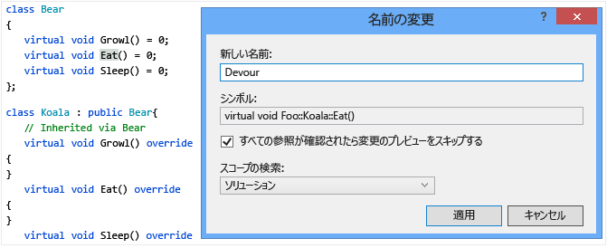
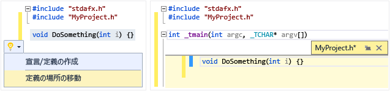
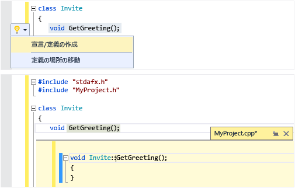
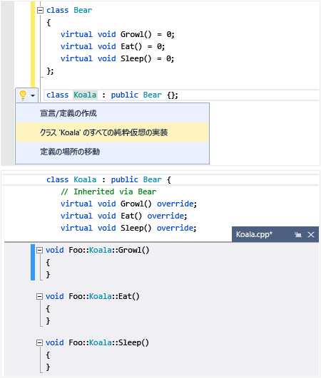
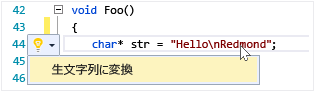
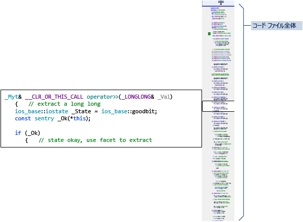

# コードの作成とリファクタリング (C++)
[!INCLUDE[vs2017banner](../assembler/inline/includes/vs2017banner.md)]

Visual C\+\+ コード エディターと IDE は多くのコーディングの補助機能を提供します。  いくつかは C\+\+ に固有で、いくつかは基本的にすべての Visual Studio の言語と同じです。  これらの機能を有効にして構成するオプションは、テキスト エディターの C\+\+ の詳細設定ダイアログにあります \(**\[ツール\] &#124; \[オプション\] &#124; \[テキスト エディター\]&#124; \[C\/C\+\+\] &#124; \[詳細設定\]** または"C\+\+ Advanced" を**クイック起動**に入力\)。  設定するオプションを選択した後は、ダイアログにフォーカスがあるときに **F1** キーを押すと、詳細なヘルプを表示できます。  コードの一般的な書式設定オプションについては、`Editor C++` を **\[QuickLaunch\]** に入力します。  
  
## 新しいコードの追加  
 プロジェクトを作成した後は、生成されたファイルのコーディングを開始できます。  新しいファイルを追加するには、ソリューション エクスプローラーでプロジェクト ノードを右クリックし、**\[追加 &#124; 新規作成\]** を選択します。  
  
 インデント、中かっこの補完、色表示などの書式設定オプションを設定するには、`C++ Formatting` を **\[QuickLaunch\]** ウィンドウに入力します。  
  
### IntelliSense  
 IntelliSense は、メンバー、種類、および関数のオーバーロードについてのインラインの情報を提供する一連の機能の名前です。  入力すると表示されるメンバー リスト ボックスを次の図に示します。  Tab キーを押すと、コード ファイルに、選択した項目のテキストを入力することができます。  
  
   
  
 完全な情報は、「[Visual C\+\+ Intellisense](../Topic/Visual%20C++%20Intellisense.md)」を参照してください。  
  
### スニペットの挿入  
 スニペットは、定義済みのソース コードです。  単一のポイント、選択したテキストの上で右クリックすると、スニペットを挿入するか、選択したテキストをスニペットで囲みます。  次の図は、for ループで選択したステートメントを囲む 3 つの手順を示します。  最終的なイメージの黄色のハイライトは、Tab キーでアクセスできる編集可能なフィールドです。  詳細については、「[コード スニペット](../Topic/Code%20Snippets.md)」を参照してください。  
  
   
  
### クラスの追加  
 クラス ウィザードを使用して、新しいクラスを **\[プロジェクト\]** メニューから追加します。  
  
   
  
### クラス ウィザード  
 クラス ウィザードを使用して、既存のクラスを変更または確認するか、新しいクラスを追加します。  詳細については、「[コード ウィザードを使用した機能の追加 \(C\+\+\)](../ide/adding-functionality-with-code-wizards-cpp.md)」を参照してください。  
  
   
  
## リファクタリング  
 クイック操作のコンテキスト メニュー項目から、またはエディターの[電球](../Topic/Perform%20quick%20actions%20with%20light%20bulbs.md)をクリックすることで、リファクタリングが利用できます。  
  
### 名前の変更  
 指定されたスコープで使用されている場所に関係なく、型や関数や変数の名前を変更します。  次の図では、派生クラスと基本クラスの両方で `Eat` メソッドの名前が `Devour` に変更されています。  
  
   
  
### クイックアクション: 定義の場所の移動  
 1 つまたは複数の関数定義をコード ファイルと同じ名前を持つヘッダー ファイルに移動します。  ファイルがまだ存在しない場合は新しいヘッダーが作成されます。  結果として得られる定義は、\[表示のみ\] ウィンドウにインラインで表示されます。  
  
   
  
### クイック アクション: 宣言\/定義の作成  
 選択したヘッダー宣言に対して、関連付けられたコード ファイルの 1 つ以上の定義を作成します。  
  
   
  
### クイック アクション: クラスのすべての純粋仮想を実装  
 クラス内の継承されたすべての仮想関数に対して、空の実装のスタブをすばやく生成します。  特定の基底クラス内の仮想機能のみを実装するには、派生クラスの宣言内で基底クラスを強調表示します。  
  
   
  
### 未加工の文字列リテラルに変換  
 カーソルを文字列リテラルの上に置くと、**\[クイック アクション\] &#124; \[未加工文字列リテラルへの変換\]** を右クリックして選択し、通常の文字列を C\+\+ 11 の未加工文字列リテラルに変換できます。  
  
   
  
### Extract 関数 \(Visual Studio の拡張機能\)  
 抽出関数の機能を使用して \([Visual Studio ギャラリーの拡張機能](https://visualstudiogallery.msdn.microsoft.com/a081dc8c-c805-4589-9b8b-c2c309a05789) として提供\) 独自の関数にコードのセクションを移動し、コードをその関数の呼び出しで置き換えます。  
  
   
  
## 移動して理解する  
  
### QuickInfo  
 変数上にカーソルを置き、型情報を表示します。  QuickInfo  
  
   
  
### ドキュメントを開く \(ヘッダーに移動\)  
 `#include` ディレクティブでヘッダー名を右クリックして、ヘッダー ファイルを開きます。  
  
   
  
### 定義をここに表示  
 変数または関数宣言の上にカーソルを置き、右クリックして **\[ピークの定義\]** を選択し、その定義のインライン ビューを表示します。  詳細については、「[定義をここに表示 \(Alt\+F12\)](../Topic/How%20to:%20View%20and%20Edit%20Code%20by%20Using%20Peek%20Definition%20\(Alt+F12\).md)」を参照してください。  
  
   
  
### 定義に移動  
 変数または関数宣言の上にカーソルを置き、右クリックして **\[定義へ移動\]** を選択し、オブジェクトが定義されているドキュメントを開きます。  
  
### 呼び出し階層の表示  
 関数呼び出しを右クリックし、呼び出すすべての関数とそれが呼び出すすべての関数の再帰的な一覧を表示します。  一覧内の各関数は、同じ方法で展開できます。  詳細については、「[呼び出し階層](../Topic/Call%20Hierarchy.md)」を参照してください。  
  
   
  
### ヘッダーの切り替え\/コード ファイル  
 右クリックし、\[ヘッダーの切り替え\/コード ファイル\] を選択して、ヘッダー ファイルとその関連付けられたコード ファイルを切り替えます。  
  
### アウトライン  
 ソース コード ファイルの任意の場所を右クリックし、**\[アウトライン\]** を選択して、定義やカスタムの領域を縮小または展開し、興味のある部分のみを簡単に参照できるようにします。  詳細については、「[アウトライン](../Topic/Outlining.md)」を参照してください。  
  
   
  
### スクロール バーのマップ モード  
 スクロール バーのマップ モードでは、実際には現在の場所を離れずに、迅速にスクロールしてコード ファイルを参照することができます。  または、コード マップ上の任意の場所をクリックして、その場所に直接移動します。  
  
   
  
### インクルード ファイルのグラフを生成  
 プロジェクト内のコード ファイルを右クリックし、**\[インクルード ファイルのグラフを生成\]** を選択して、他のファイルによって含まれているファイルのグラフを表示します。  
  
   
  
### F1 ヘルプ  
 任意の型、キーワード、または関数の上または直後にカーソルを置き、F1 キーを押して、関連する MSDN リファレンスのトピックに直接移動します。  F1 は、エラー リストや多くのダイアログ ボックスの項目でも機能します。  
  
### クイック起動  
 Visual Studio の任意のウィンドウまたはツールを簡単に移動するには、UI の右上隅の \[クイック起動\] ウィンドウで、名前を入力します。  入力するにつれて、自動補完の一覧がフィルターされます。  
  
 