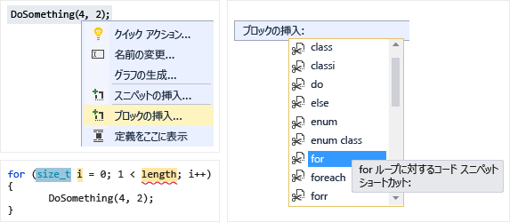
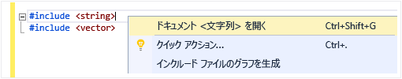
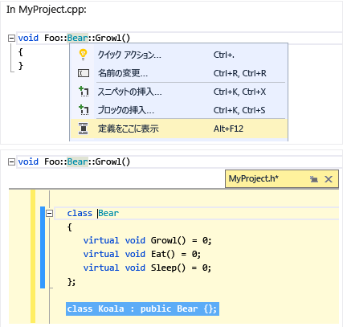
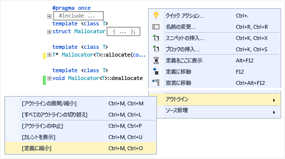

# コードの作成とリファクタリング (C++)

Visual C++ コード エディターと IDE は多くのコーディングの補助機能を提供します。 いくつかは C++ に固有で、いくつかは基本的にすべての Visual Studio の言語と同じです。 共有機能の詳細については、次を参照してください。[コード エディターとテキスト エディターでコードを記述](/visualstudio/ide/writing-code-in-the-code-and-text-editor)です。 有効にして、C++ 固有の機能を構成するためのオプションがある、[テキスト エディターの C++ の詳細設定](/visualstudio/ide/reference/options-text-editor-c-cpp-advanced)ダイアログ (**ツール &#124;です。オプション &#124;です。テキスト エディター &#124;です。C と C++ &#124;です。高度な**"C++ Advanced"を入力または**サイド**)。 設定するオプションを選択すると、詳細なヘルプを取得キーを押して**F1**ときに、ダイアログにフォーカスがします。 一般的なコードの書式オプション、入力`Editor C++`に**クイック起動**です。

内にあることがあり、将来のバージョンの Visual Studio で含めることはできません、実験用の機能、[テキスト エディターの C++ 試験的](/visualstudio/ide/reference/options-text-editor-c-cpp-experimental)ダイアログ。 Visual Studio 2017 で有効にできます**予測 Intellisense**このダイアログ ボックスでします。

## 新しいコードの追加

プロジェクトを作成した後は、生成されたファイルのコーディングを開始できます。 新しいファイルを追加するには、ソリューション エクスプ ローラーでプロジェクト ノードを右クリックして選択**追加 &#124;です。新しい**です。

インデント、中かっこの補完、および色付けなどのオプションを書式設定を設定するには、次のように入力します。`C++ Formatting`に、**クイック起動**ウィンドウです。

### IntelliSense

IntelliSense は、メンバー、種類、および関数のオーバーロードについてのインラインの情報を提供する一連の機能の名前です。 入力すると表示されるメンバー リスト ボックスを次の図に示します。 Tab キーを押すと、コード ファイルに、選択した項目のテキストを入力することができます。

詳細については、次を参照してください。 [Visual c Intellisense](/visualstudio/ide/visual-cpp-intellisense)です。

### スニペットの挿入

スニペットは、定義済みのソース コードです。 単一のポイント、選択したテキストの上で右クリックすると、スニペットを挿入するか、選択したテキストをスニペットで囲みます。 次の図は、for ループで選択したステートメントを囲む 3 つの手順を示します。 最終的なイメージの黄色のハイライトは、Tab キーでアクセスできる編集可能なフィールドです。 詳細については、「[Code Snippets](/visualstudio/ide/code-snippets)」を参照してください。

### クラスの追加

新しいクラスを追加、**プロジェクト**クラス ウィザードを使用してメニュー。

![Visual C &#43; #43 に新しいクラスを追加します。] (../ide/media/vs2015_cpp_add_class.png "vs2015_cpp_add_class")

### クラス ウィザード

クラス ウィザードを使用して、既存のクラスを変更または確認するか、新しいクラスを追加します。 詳細については、次を参照してください。[コード ウィザード (C++) と機能の追加](../ide/adding-functionality-with-code-wizards-cpp.md)です。

## リファクタリング

リファクタリングが利用できるは、クイック アクション コンテキスト メニューで、[または] をクリックして、[電球](/visualstudio/ide/perform-quick-actions-with-light-bulbs)エディターでします。  いくつかも内にある、**編集 > リファクター**メニュー。  これには次の機能があります。

* [名前の変更](refactoring/rename.md)
* [Extract 関数](refactoring/extract-function.md)
* [純粋仮想の実装](refactoring/implement-pure-virtuals.md)
* [宣言/定義の作成](refactoring/create-declaration-definition.md)
* [Move 関数の定義](refactoring/move-definition-location.md)
* [未加工の文字列リテラルに変換](refactoring/convert-to-raw-string-literal.md)
* [署名の変更](refactoring/change-signature.md)

## 移動して理解する

Visual C では、他の言語と多くのコード ナビゲーション機能を共有します。 詳細については、次を参照してください。[コードの移動](/visualstudio/ide/navigating-code)と[コードの構造を表示する](/visualstudio/ide/viewing-the-structure-of-code)です。

### QuickInfo

変数上にカーソルを置き、型情報を表示します。

### ドキュメントを開く (ヘッダーに移動)

`#include` ディレクティブでヘッダー名を右クリックして、ヘッダー ファイルを開きます。

### 定義をここに表示

変数または関数宣言し、右クリックし、ポインターを合わせる選択**ピークの定義**インライン ビューをその定義の表示にします。 詳細については、次を参照してください。[ピークの定義 (Alt + F12)](/visualstudio/ide/how-to-view-and-edit-code-by-using-peek-definition-alt-plus-f12)です。

### [定義へ移動]

変数または関数宣言、し、右クリックし、ポインターを合わせる選択**定義へ移動**を開くには、オブジェクトが定義されているドキュメントです。

### 呼び出し階層の表示

関数呼び出しを右クリックし、呼び出すすべての関数とそれが呼び出すすべての関数の再帰的な一覧を表示します。 一覧内の各関数は、同じ方法で展開できます。 詳細については、次を参照してください。[呼び出し階層](/visualstudio/ide/reference/call-hierarchy)です。

### ヘッダーの切り替え/コード ファイル

右クリックし、**ヘッダーの切り替え/コード ファイル**ヘッダー ファイルとその関連付けられたコード ファイルを切り替えるにします。

### アウトライン

ソース コード ファイル内の任意の場所を右クリックして選択**アウトライン**を折りたたむか、定義や簡単に興味のある部分のみを参照するカスタムの領域を展開します。 詳細については、「[アウトライン](/visualstudio/ide/outlining)」を参照してください。

### スクロール バーのマップ モード

スクロール バーのマップ モードでは、実際には現在の場所を離れずに、迅速にスクロールしてコード ファイルを参照することができます。 または、コード マップ上の任意の場所をクリックして、その場所に直接移動します。

![Visual C &#43; #43 のコード マップ] (../ide/media/vs2015_cpp_code_map.png "vs2015_cpp_code_map")

### インクルード ファイルのグラフを生成

プロジェクトでコード ファイルを右クリックし、選択**インクルード ファイルのグラフを生成**他のファイルであるファイルが含まれているグラフを表示します。

### F1 ヘルプ

任意の型、キーワード、または関数の上または直後にカーソルを置き、F1 キーを押して、関連する MSDN リファレンスのトピックに直接移動します。 F1 は、エラー リストや多くのダイアログ ボックスの項目でも機能します。

### クイック起動

Visual Studio の任意のウィンドウまたはツールを簡単に移動するには、UI の右上隅の [クイック起動] ウィンドウで、名前を入力します。 入力するにつれて、自動補完の一覧がフィルターされます。

