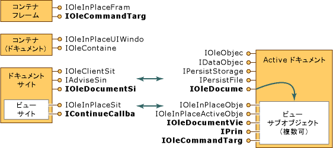

# Active ドキュメント コンテナー
Microsoft Office バインダーまたは Internet Explorer などの active ドキュメント コンテナーでは、さまざまな種類のアプリケーション (強制的に作成し、各アプリケーションの複数のフレームを使用することではなく 1 つのフレーム内で複数のドキュメントを操作することができます。ドキュメントの種類の場合)。  
  
 MFC では、アクティブなドキュメント内のコンテナーを完全にサポートが用意されています、`COleDocObjectItem`クラスです。 MFC アプリケーション ウィザードを使用してを選択して、active ドキュメント コンテナーを作成することができます、 **Active ドキュメント コンテナー**チェック ボックスをオン、**複合ドキュメント サポート**MFC アプリケーション ウィザードのページです。 詳細については、次を参照してください。 [Active ドキュメント コンテナー アプリケーションの作成](../mfc/creating-an-active-document-container-application.md)です。  
  
 Active ドキュメント コンテナーの詳細についてを参照してください。  
  
-   [コンテナーの要件](#container_requirements)  
  
-   [サイトのドキュメント オブジェクト](#document_site_objects)  
  
-   [サイト オブジェクトの表示](#view_site_objects)  
  
-   [オブジェクトの構築](#frame_object)  
  
-   [[ヘルプ] メニューのマージ](../mfc/help-menu-merging.md)  
  
-   [プログラムによる印刷](../mfc/programmatic-printing.md)  
  
-   [コマンド ターゲット](../mfc/message-handling-and-command-targets.md)  
  
##  コンテナーの要件  
 Active ドキュメント コンテナーでの作業中の文書のサポートが単インターフェイスの実装を意味します。 含まれているオブジェクトのインターフェイスを使用しての知識も必要です。 コンテナー ドキュメント自体ではアクティブでそれらの拡張機能インターフェイスを使用する方法の理解を必要がありますも、アクティブなドキュメントの拡張機能にも当てはまります。  
  
 Active ドキュメント コンテナー アクティブ ドキュメントを統合する必要があります。  
  
-   経由で記憶域オブジェクトを処理できる、**すること**インターフェイス、つまりで指定してください、`IStorage`各アクティブなドキュメント インスタンスです。  
  
-   OLE ドキュメント (ドキュメントまたは埋め込みごとに 1 つ) の「サイト」オブジェクトの基本の埋め込み機能のサポートを実装する**していること**と**IAdviseSink**です。  
  
-   埋め込みオブジェクトのアクティブなドキュメント、インプレース アクティブ化をサポートします。 コンテナーのサイト オブジェクトを実装する必要があります`IOleInPlaceSite`し、コンテナーのフレームのオブジェクトを提供する必要があります**IOleInPlaceFrame**です。  
  
-   アクティブ ドキュメントの拡張機能の実装によってサポート`IOleDocumentSite`ドキュメントと対話するコンテナーのメカニズムを提供します。 コンテナーがアクティブなドキュメントのインターフェイスを実装できます必要に応じて、`IOleCommandTarget`と`IContinueCallback`を印刷または保存などの単純なコマンドを取得します。  
  
 フレーム オブジェクト、ビュー オブジェクト、およびコンテナー オブジェクトを実装できます必要に応じて**IOleCommandTarget**で説明したように、特定のコマンドのディスパッチをサポートするために[コマンド ターゲット](../mfc/message-handling-and-command-targets.md)です。 ビューとコンテナー オブジェクトを実装できます必要に応じて`IPrint`と`IContinueCallback`で説明したように、プログラムによる印刷をサポートするために、[プログラムによる印刷](../mfc/programmatic-printing.md)です。  
  
 次の図は、コンテナーとそのコンポーネント (左) にあると、アクティブなドキュメントおよびビューの間、(右) にある概念の関係を示します。 アクティブなドキュメントは、ストレージとデータを管理して、ビューを表示、または必要に応じてそのデータを出力します。 太字のインターフェイスは、作業中の文書への参加; に必要なものこれら太字と斜体はオプションです。 その他のすべてのインターフェイスが必要です。  
  
   
  
 1 つのビューのみをサポートするドキュメントは、ビューとドキュメントの両方のコンポーネント (つまり、対応するインターフェイス) を 1 つの具象クラスに実装できます。 さらに、一度に 1 つのビューのみをサポートするコンテナーのサイトに結合できますドキュメント サイトとサイトの表示クラスを 1 つの具象サイト。 コンテナーのフレームのオブジェクト、ただし、必要がありますは引き続き、distinct、コンテナーのドキュメント コンポーネントだけが含まれているここ; アーキテクチャの全体像を与えるactive ドキュメント コンテインメント アーキテクチャによって影響はありません。  
  
##  サイトのドキュメント オブジェクト  
 Active ドキュメント コンテインメント アーキテクチャのドキュメント サイトは、OLE ドキュメントに追加すると、クライアントのサイトのオブジェクトと同じ、`IOleDocument`インターフェイス。  
  
 `interface IOleDocumentSite : IUnknown`  
  
 `{`  
  
 `HRESULT ActivateMe(IOleDocumentView *pViewToActivate);`  
  
 `}`  
  
 ドキュメント サイトは、概念的には、1 つ以上の「サイトの表示」オブジェクトのコンテナーです。 各ビューのサイト オブジェクトは、ドキュメント サイトによって管理されているドキュメントの各ビュー オブジェクトに関連付けられます。 コンテナーは、ドキュメント サイトごとに 1 つのビューのみをサポートする場合を実装できますドキュメント サイトと、サイトの 1 つの具象クラスとします。  
  
##  サイト オブジェクトの表示  
 コンテナーのビューのサイト オブジェクトは、ドキュメントの特定のビューの表示領域を管理します。 標準をサポートするだけでなく`IOleInPlaceSite`インターフェイス、サイトの表示を実装しても通常`IContinueCallback`のプログラムによる制御を印刷します。 (注ビュー オブジェクトが決してのクエリを実行する`IContinueCallback`で実際に実装できるようにコンテナー要望オブジェクトです)。  
  
 複数のビューをサポートするコンテナーは、複数のビューのドキュメント サイト内のサイト オブジェクトを作成できる必要があります。 これにより各ビューで別のアクティブ化と非アクティブ化サービスによって提供されるよう`IOleInPlaceSite`です。  
  
##  オブジェクトの構築  
 コンテナーのフレーム オブジェクトは、ほとんどの場合、つまり OLE ドキュメントでは、インプレース アクティブ化に使用される同じフレーム、メニューとツールバーのネゴシエーションを処理する 1 つです。 ビュー オブジェクトからこのフレーム オブジェクトへのアクセスを持つ**IOleInPlaceSite::GetWindowContext**も、コンテナーのドキュメントを処理できるレベルのウィンドウのツールバーのネゴシエーションを表すコンテナー オブジェクトへのアクセスを提供します。含まれているオブジェクトの列挙型)。  
  
 Active ドキュメント コンテナーは、追加することで、フレームを補強できます`IOleCommandTarget`です。 これにより、このインターフェイスが同じコマンドを送信するためのコンテナーを許可できることと同じ方法で、アクティブなドキュメントのユーザー インターフェイスで発生するコマンドを受信 (など**ファイル新しい**、**開く**、 **名前を付けて**、**印刷**です。**コピーの編集**、**貼り付け**、**を元に戻す**、およびその他) をアクティブなドキュメントにします。 詳細については、次を参照してください。[コマンド ターゲット](../mfc/message-handling-and-command-targets.md)です。  
  
## 参照  
 [Active ドキュメント コンテインメント](../mfc/active-document-containment.md)

