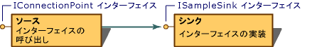
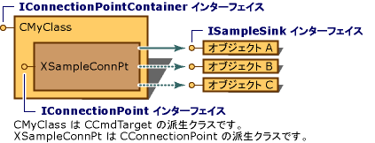

# コネクション ポイント
この記事は、接続ポイント (以前は OLE コネクション ポイントと呼ばれます) を実装する方法を説明します。 MFC クラスを使用して`CCmdTarget`と`CConnectionPoint`です。  
  
 以前は、コンポーネント オブジェクト モデル (COM) に一般的な機構が定義されている (**iunknown::queryinterface**) を実装して、インターフェイスで機能を公開するオブジェクトを許可します。 ただし、特定のインターフェイスを呼び出すには、機能を公開するオブジェクトを許可されている対応するメカニズムが定義されていません。 COM が着信ポインターをオブジェクトに定義された、(そのオブジェクトのインターフェイスへのポインター) が処理されましたが、発信インターフェイス (ポインターが他のオブジェクトのインターフェイスへのオブジェクトを保持) の明示的なモデルがありませんでした。 COM は、モデルの接続ポイントと呼ばれるこの機能をサポートするようになりました。  
  
 接続で 2 つの部分: ソースとのインターフェイスを実装するオブジェクトと呼ばれるインターフェイスを呼び出すオブジェクトが、シンクと呼ばれます。 接続ポイントは、ソースによって公開されるインターフェイスです。 接続ポイントを公開するでは、ソースは、シンク自体 (ソース) への接続を確立を許可します。 コネクション ポイント メカニズム (、 **IConnectionPoint**インターフェイス)、シンク インターフェイスへのポインターは、ソース オブジェクトに渡されます。 このポインターは、ソースとシンクの一連のメンバー関数へのアクセスを提供します。 たとえば、シンクによって実装されているイベントを発生させるには、ソースは、シンクの実装の適切なメソッドを呼び出すことができます。 次の図は、接続を示して上記で説明したポイントです。  
  
   
コネクション ポイントの実装  
  
 MFC 実装では、このモデル、[関数](../mfc/reference/cconnectionpoint-class.md)と[CCmdTarget](../mfc/reference/ccmdtarget-class.md)クラスです。 派生したクラス**関数**実装、 **IConnectionPoint**インターフェイス、他のオブジェクトへの接続ポイントを公開するために使用します。 派生したクラス`CCmdTarget`実装、 **IConnectionPointContainer**インターフェイスでは、すべてのオブジェクトの使用可能な接続ポイントを列挙または特定の接続ポイントを見つけることができます。  
  
 クラスで実装されたコネクション ポイントごとに、接続ポイントを実装する接続の部分を宣言する必要があります。 1 つまたは複数の接続ポイントを実装する場合は、クラス内で 1 つの接続のマップを宣言することも必要があります。 コネクション マップは、ActiveX コントロールでサポートされる接続ポイントのテーブルです。  
  
 次の例では、単純な接続のマップと 1 つの接続ポイントを示しています。 最初の例で、コネクション マップとポイントです。2 番目の例では、マップとポイントを実装します。 なお`CMyClass`する必要があります、 `CCmdTarget`-クラスを派生します。 最初の例では、コードを挿入、クラス宣言で下にある、**保護**セクション。  
  
 [!code-cpp[NVC_MFCConnectionPoints#1](../mfc/codesnippet/cpp/connection-points_1.h)]  
  
 `BEGIN_CONNECTION_PART`と**END_CONNECTION_PART**マクロ、埋め込みのクラスを宣言する`XSampleConnPt`(から派生した`CConnectionPoint`)、この特定の接続ポイントの実装です。 オーバーライドする場合は、`CConnectionPoint`メンバー関数は、独自のメンバー関数を追加または、これら 2 つのマクロの間、それらを宣言します。 たとえば、`CONNECTION_IID`マクロよりも優先、`CConnectionPoint::GetIID`メンバー関数はこれら 2 つのマクロの間に配置します。  
  
 2 番目の例では、コントロールの実装ファイル (.cpp ファイル) でコードが挿入されます。 このコードは、接続ポイントが含まれており、コネクション マップを実装する`SampleConnPt`:  
  
 [!code-cpp[NVC_MFCConnectionPoints#2](../mfc/codesnippet/cpp/connection-points_2.cpp)]  
  
 複数の接続ポイントをその他の挿入があるかどうかは`CONNECTION_PART`間でのマクロ、`BEGIN_CONNECTION_MAP`と`END_CONNECTION_MAP`マクロです。  
  
 最後に、呼び出しを追加して`EnableConnections`クラスのコンス トラクターでします。 例:  
  
 [!code-cpp[NVC_MFCConnectionPoints#3](../mfc/codesnippet/cpp/connection-points_3.cpp)]  
  
 このコードが挿入されると、 `CCmdTarget`-派生クラスの接続ポイントを公開する、 **ISampleSink**インターフェイスです。 次の図は、この例を示します。  
  
   
MFC で実装されたコネクション ポイント  
  
 接続ポイントが「マルチキャスト」をサポートする通常、-、同じインターフェイスに接続する複数のシンクにブロードキャストする機能。 次の例を示してマルチキャスト繰り返し処理で各シンク接続ポイントで使用する方法。  
  
 [!code-cpp[NVC_MFCConnectionPoints#4](../mfc/codesnippet/cpp/connection-points_4.cpp)]  
  
 この例では、接続の現在のセットを取得、`SampleConnPt`接続ポイントへの呼び出しが`CConnectionPoint::GetConnections`です。 接続と呼び出しを反復処理し、**繰り返し参照**すべての接続にアクティブにします。  
  
## 参照  
 [MFC COM](../mfc/mfc-com.md)

