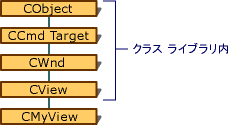

# メッセージ マップの派生
[!INCLUDE[vs2017banner](../assembler/inline/includes/vs2017banner.md)]

メッセージの処理中に、クラスの独自のメッセージ マップをチェックすると、メッセージ マップのストーリーの末尾ではありません。  クラス `CMyView` \(`CView`から派生される\) メッセージに一致するエントリがない場合はどうなりますか。  
  
 その `CView`の `CMyView`の基本クラス、順番に派生されます `CWnd`から注意してください。  したがって `CMyView`は  `CView`*で、*`CWnd`*です*。  これらの各クラスには、独自のメッセージ マップがあります。  図では、「階層」クラスの階層リレーションシップを示しますが、`CMyView` オブジェクトが 3 つすべてのクラスの特性を持つ単一オブジェクトであることに注意してください。  
  
   
階層  
  
 したがって、メッセージがクラスの `CMyView` のメッセージ マップに一致する場合、フレームワークは、直接の基本クラスのメッセージ マップを検索します。  メッセージ マップの開始時に `BEGIN_MESSAGE_MAP` マクロは引数として 2 個のクラス名を指定する:  
  
 [!CODE [NVC_MFCMessageHandling#2](../CodeSnippet/VS_Snippets_Cpp/NVC_MFCMessageHandling#2)]  
  
 最初の引数名メッセージ マップが属するクラス。  2 番目の引数は次の直接の基本クラス— `CView` を使用して、接続を—備えています。フレームワークがメッセージ マップを検索できます。  
  
 基本クラスで提供されるメッセージ ハンドラーでは、派生クラスでそれによって継承されます。  これはすべてのハンドラー メンバー関数は仮想関数にせずに正常な仮想メンバー関数とよく似ています。  
  
 ハンドラーが基本クラスのメッセージ マップにない場合は、メッセージの既定の処理が実行されます。  メッセージがコマンドの場合、フレームワークは次のコマンド ターゲットにルーティングします。  これは標準 Windows メッセージの場合、メッセージは適切な既定のウィンドウ プロシージャに渡されます。  
  
 一致するメッセージを簡単にするために、フレームワークは同じメッセージを再び表示する確率の最新の一致をキャッシュします。  次の 1 種類の結果は、フレームワークが処理されていないメッセージをより効率的に処理されます。  メッセージ マップでは、仮想関数を使用して、実装より効率的です。  
  
## 参照  
 [フレームワークのメッセージ マップ検索方法](../mfc/how-the-framework-searches-message-maps.md)