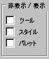

# ダイアログ バー
[!INCLUDE[vs2017banner](../assembler/inline/includes/vs2017banner.md)]

ダイアログ バーはツール バー、任意の種類のコントロールを含むことができる [コントロール バー](../Topic/Control%20Bars.md) の種類です。  、モードレス ダイアログ ボックスの特徴があるため、[CDialogBar](../mfc/reference/cdialogbar-class.md) オブジェクトは、より強力なツールが用意されています。  
  
 ツール バーと `CDialogBar` オブジェクト間に複数の重要な違いがあります。  `CDialogBar` オブジェクトは、Visual C\+\+ ダイアログ エディターで作成できる種類の Windows コントロールを含む、ダイアログ テンプレート リソースから作成されます。  ユーザーはコントロールからコントロールに記録できます。  と親のサイズを変更するとダイアログ バーを親フレーム ウィンドウの任意の部分を配置する場合は、そのまま維持に配置スタイルを指定できます。  次の図は、さまざまなコントロールのダイアログ バーが表示されます。  
  
   
ダイアログ バー  
  
 他の面では、`CDialogBar` オブジェクトと、モードレス ダイアログ ボックスを使用する方法です。  ダイアログ リソースをデザインおよび作成するには、ダイアログ エディターを使用します。  
  
 ダイアログ バーの美徳の 1 つが、ボタン以外のコントロールを含めることができます。  
  
 `CDialog`から独自のダイアログ クラスを派生する場合は、通常の間、通常、ダイアログ バーの独自のクラスを派生しません。  ダイアログ バーは、メイン ウィンドウの拡張機能であり、ダイアログ バー コントロール通知メッセージは、**BN\_CLICKED** または **EN\_CHANGE**など、ダイアログ バー、メイン ウィンドウの親に送信されます。  
  
## 参照  
 [ユーザー インターフェイス要素](../mfc/user-interface-elements-mfc.md)   
 [サンプル](../top/visual-cpp-samples.md)