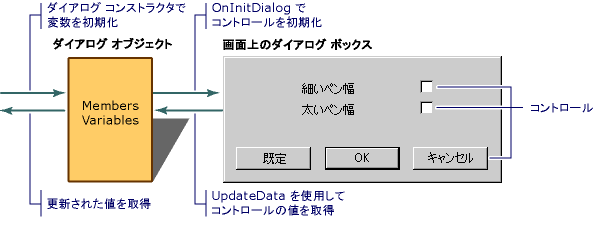

# ダイアログ データ エクスチェンジ
DDX 機構を使用する場合に設定した、ダイアログ ボックスの初期値オブジェクトのメンバー変数では、通常、`OnInitDialog`ハンドラーまたはダイアログ コンス トラクターです。 ダイアログ ボックスが表示される前に、フレームワークの DDX 機構によって転送メンバー変数の値 ダイアログ ボックスで、表示されるコントロールの直前にダイアログ ボックスが表示されたらへの応答`DoModal`または**作成**. 既定の実装`OnInitDialog`で`CDialog`呼び出し、`UpdateData`クラスのメンバー関数`CWnd` ダイアログ ボックスのコントロールを初期化します。  
  
 同じメカニズムに転送メンバー変数に値がコントロールから、ユーザーが [ok] ボタンをクリックしたときに (またはを呼び出すときに、 `UpdateData` 、引数を持つメンバー関数**TRUE**)。 ダイアログ データ検証メカニズムでは、検証規則を指定したデータ項目を検証します。  
  
 次の図は、ダイアログ データ エクス チェンジを示しています。  
  
   
ダイアログ データ エクスチェンジ  
  
 `UpdateData`指定したとおり、両方向で機能、 **BOOL**にパラメーターに渡されます。 Exchange を実行するために`UpdateData`設定、`CDataExchange`オブジェクトと呼び出しダイアログ クラスの上書きを`CDialog`の`DoDataExchange`メンバー関数。 `DoDataExchange`型の引数を受け取る`CDataExchange`です。 `CDataExchange`オブジェクトに渡される`UpdateData`exchange の方向としてこのような情報を定義する、交換のコンテキストを表します。  
  
 (または、コード ウィザード) をオーバーライドするとき`DoDataExchange`、データ メンバー (コントロール) ごとに 1 つの DDX 関数への呼び出しを指定します。 各 DDX 関数によって提供されるコンテキストに基づいて双方向のデータを交換する方法を知っている、`CDataExchange`に渡される引数、`DoDataExchange`によって`UpdateData`です。  
  
 MFC には、さまざまな種類の exchange の多くの DDX 関数が用意されています。 次の例は、`DoDataExchange`する 2 つの DDX で関数と 1 つの DDV 関数が呼び出されたオーバーライド。  
  
 [!code-cpp[NVC_MFCControlLadenDialog#49](../mfc/codesnippet/cpp/dialog-data-exchange_1.cpp)]  
  
 `DDX_`と`DDV_`行があるデータ マップします。 表示されるサンプル DDX ルーチンおよび DDV 関数は、チェック ボックス コントロールおよび、エディット ボックス コントロールでは、それぞれです。  
  
 ユーザーが、モーダル ダイアログ ボックスをキャンセルすると、`OnCancel`メンバー関数は、ダイアログ ボックスを終了し、`DoModal`値を返します**IDCANCEL**です。 その場合は、ダイアログ ボックスで、ダイアログ オブジェクト間で交換されるデータはありません。  
  
## 参照  
 [ダイアログ データ交換と検証](../mfc/dialog-data-exchange-and-validation.md)   
 [ダイアログ ボックスのライフ サイクル](../mfc/life-cycle-of-a-dialog-box.md)   
 [ダイアログ データ検証](../mfc/dialog-data-validation.md)

