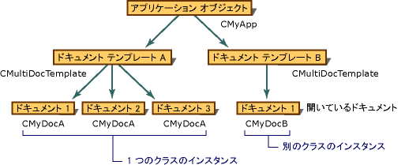

# ドキュメント テンプレートとドキュメント/ビューの作成手順
フレームワークを関連するビューとフレーム ウィンドウとドキュメントを作成する複雑なプロセスを管理するには、次の 2 つのドキュメント テンプレート クラスを使用して:[関数](../mfc/reference/csingledoctemplate-class.md)SDI アプリケーション用と[CMultiDocTemplate](../mfc/reference/cmultidoctemplate-class.md) MDI アプリケーション用。 A`CSingleDocTemplate`を作成し、同時に 1 つの型の 1 つのドキュメントを保存できます。 A`CMultiDocTemplate`は 1 つの型の多くの開いているドキュメントの一覧を保持します。  
  
 一部のアプリケーションでは、複数のドキュメント タイプをサポートします。 たとえば、アプリケーションでは、テキスト ドキュメントとグラフィックスのドキュメントをサポート可能性があります。 このようなアプリケーションは、[ファイル] メニューで、新しいコマンドを選択すると、ダイアログ ボックスを開くには使用可能な新しいドキュメント型一覧を示します。 サポートされているドキュメントの種類ごとに、アプリケーションは、個別のドキュメント テンプレート オブジェクトを使用します。 次の図は、次の 2 つのドキュメントの種類をサポートし、いくつかの開いているドキュメントを表示する MDI アプリケーションの構成を示しています。  
  
   
2 つのドキュメント タイプをサポートする MDI アプリケーション  
  
 ドキュメント テンプレートが作成され、アプリケーションのオブジェクトによって保持されます。 アプリケーションの中に実行される主なタスクのいずれかの`InitInstance`機能は、適切な種類の 1 つまたは複数のドキュメント テンプレートを作成します。 この機能については、「[ドキュメント テンプレートの作成](../mfc/document-template-creation.md)です。 Application オブジェクトは、テンプレートのリストにそれぞれのドキュメント テンプレートへのポインターを格納し、ドキュメント テンプレートを追加するためのインターフェイスを提供します。  
  
 2 つ以上のドキュメント型をサポートする必要がある場合への余分な呼び出しを追加する必要があります[AddDocTemplate](../mfc/reference/cwinapp-class.md#adddoctemplate)各ドキュメントの種類。  
  
 ドキュメント テンプレートのアプリケーションの一覧における位置に基づく各ドキュメント テンプレートのアイコンが登録されます。 ドキュメント テンプレートの順序はへの呼び出しに追加された順序によって決まります`AddDocTemplate`です。 MFC には、アプリケーションの最初のアイコン リソースは、アプリケーションのアイコン、[次へ] のアイコン リソースがあると最初のドキュメント アイコンが想定しています。  
  
 たとえば、ドキュメント テンプレートは、3 番目のアプリケーション用に 3 つです。 インデックス 3 のアプリケーションで、アイコン リソースがある場合は、ドキュメント テンプレートのアイコンが使用されます。 それ以外の場合は、インデックス 0 にあるアイコンは、既定値として使用します。  
  
## 参照  
 [MFC の一般的なトピック](../mfc/general-mfc-topics.md)   
 [ドキュメント テンプレートの作成](../mfc/document-template-creation.md)   
 [ドキュメント/ビューの作成](../mfc/document-view-creation.md)   
 [MFC オブジェクト間の関係](../mfc/relationships-among-mfc-objects.md)   
 [新しいドキュメント、ウィンドウ、ビューの作成](../mfc/creating-new-documents-windows-and-views.md)

