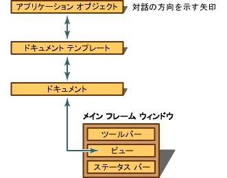

# ドキュメント、ビュー、フレームワーク
[!INCLUDE[vs2017banner](../assembler/inline/includes/vs2017banner.md)]

MFC フレームワークの中心にドキュメントやビューの概念です。  ドキュメントには、ユーザーが編集セッションでやり取りするデータ オブジェクトです。  これは **ファイル** メニューの `New` または **開く** コマンドで作成され、通常はファイルに保存されます。\(標準の MFC ドキュメント、**CDocument**クラスからの派生は、アクティブ ドキュメントと OLE 複合ドキュメントとは異なります。\) ビューは、ドキュメントと対話するウィンドウ オブジェクトです。  
  
 実行中のアプリケーションのキー オブジェクトは、次の操作:  
  
-   ドキュメント。  
  
     ドキュメント クラス \([CDocument](../Topic/CDocument%20Class.md)から派生\) は、アプリケーションのデータを指定します。  
  
     アプリケーションの OLE 機能が必要な場合は、必要な機能に、派生クラスの [COleDocument](../mfc/reference/coledocument-class.md) または 1 回からドキュメント クラス \(派生してください。  
  
-   ビュー。  
  
     ビュー クラス \([CView](../Topic/CView%20Class.md)から派生される\) がユーザーの「データ ウィンドウは」ユーザーがどのようにドキュメント内のデータを参照し、相互作用をビュー クラスのコントロール。  場合によっては、ドキュメントはデータの複数のビューを持つ必要があります。  
  
     スクロールする必要がある場合 [CScrollView](../mfc/reference/cscrollview-class.md)から派生してください。  ビューのダイアログ テンプレート リソースに配置されるユーザー インターフェイスがある場合は、[CFormView](../mfc/reference/cformview-class.md)から派生してください。  単純なテキスト データの場合、[CEditView](../Topic/CEditView%20Class.md)から使用または派生してください。  フォーム ベースのデータ アクセス アプリケーションでは、データ入力プログラムなど、[CRecordView](../mfc/reference/crecordview-class.md) から派生してください \(ODBC の場合\)。  も使用できます [CTreeView](../mfc/reference/ctreeview-class.md)クラス、[CListView](../mfc/reference/clistview-class.md)と [CRichEditView](../mfc/reference/cricheditview-class.md)です。  
  
-   フレーム ウィンドウ  
  
     ビューは表示されている「ドキュメント フレーム ウィンドウ」。SDI アプリケーションでは、ドキュメントのフレーム ウィンドウには、アプリケーションのメイン フレーム ウィンドウ「」です。  MDI アプリケーションでは、ドキュメント ウィンドウに、メイン フレーム ウィンドウ内に表示する子ウィンドウです。  派生のメイン フレーム ウィンドウ クラスには、ビューを含むフレーム ウィンドウのスタイルおよびそのほかの特性を指定します。  フレーム ウィンドウをカスタマイズする必要がある場合は、SDI アプリケーションのドキュメント フレーム ウィンドウをカスタマイズするために [CFrameWnd](../mfc/reference/cframewnd-class.md) から派生してください。  MDI アプリケーションのメイン フレーム ウィンドウをカスタマイズするために [CMDIFrameWnd](../mfc/reference/cmdiframewnd-class.md) から派生してください。  また、アプリケーションがサポートするたびに別の種類の MDI ドキュメント フレーム ウィンドウをカスタマイズするために [CMDIChildWnd](../mfc/reference/cmdichildwnd-class.md) からクラスを派生してください。  
  
-   ドキュメント テンプレートまたはテンプレート  
  
     ドキュメント テンプレートによってドキュメント、ビュー、およびフレーム ウィンドウの作成に編曲を調整します。  特定のドキュメントテンプレート クラス、[CDocTemplate](../mfc/reference/cdoctemplate-class.md)クラスからの派生は、1 種類のすべての開かれているドキュメントを作成および管理します。  サポートされるアプリケーションにドキュメント種類の複数のドキュメント テンプレートがあります。  クラス [CSingleDocTemplate](../mfc/reference/csingledoctemplate-class.md) を SDI アプリケーションで使用するか、MDI アプリケーションのクラス [CMultiDocTemplate](../mfc/reference/cmultidoctemplate-class.md) を使用します。  
  
-   アプリケーション オブジェクト  
  
     アプリケーション クラス \([CWinApp](../mfc/reference/cwinapp-class.md)から派生\) は、上記のすべてのオブジェクトを制御し、初期化およびクリーンアップなど、アプリケーションの動作を指定します。  アプリケーションの一つのアプリケーション オブジェクトは、ドキュメントの種類のドキュメント テンプレートをアプリケーションでサポート作成および管理されます。  
  
-   スレッド オブジェクト  
  
     アプリケーションを実行中のスレッドを作成した場合 \(たとえば、計算をバックグラウンドで実行する— [CWinThread](../mfc/reference/cwinthread-class.md)から派生されたクラスを使用します。  [CWinApp](../mfc/reference/cwinapp-class.md) 自体は `CWinThread` から派生され、アプリケーションの実行 \(またはメイン プロセス\) のプライマリ スレッドを表します。  、セカンダリ スレッドで MFC を使用できます。  
  
 実行中のアプリケーションでは、これらのオブジェクトは、コマンドによってユーザー アクション、境界、他のメッセージに協調的に応答します。  一つのアプリケーション オブジェクトは一つ以上のドキュメント テンプレートを管理します。  各ドキュメント テンプレートは、アプリケーションが SDI または MDI か\) 一つ以上のドキュメントを作成、管理する \(によって異なります。  ユーザーがフレーム ウィンドウ ビュー内に含まれるビューでドキュメントを処理します。  次の図は、SDI アプリケーションのオブジェクトの関係を示します。  
  
   
動作中の SDI アプリケーションのオブジェクト  
  
 詳細については、ここで他方がどのように連携して動作する方法、およびプログラミングで使用するフレームワーク ツール、MFC アプリケーション ウィザード、およびリソース エディターは、これらのオブジェクトを作成する方法について説明します。  ドキュメント、ビュー、およびフレーム ウィンドウは [ウィンドウ オブジェクト](../mfc/window-objects.md) と [ドキュメント\/ビュー アーキテクチャ](../Topic/Document-View%20Architecture.md)で詳しく説明します。  
  
## 参照  
 [クラスを使用した Windows アプリケーションの作成](../Topic/Using%20the%20Classes%20to%20Write%20Applications%20for%20Windows.md)