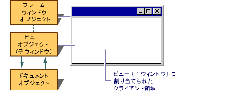

# フレーム ウィンドウ
[!INCLUDE[vs2017banner](../assembler/inline/includes/vs2017banner.md)]

Windows の下でアプリケーションが実行されるフレーム ウィンドウに表示されるドキュメント、ユーザーと対話している場合。  ドキュメント フレーム ウィンドウは、2 種類の主要コンポーネントがあります: フレームと構築コンテンツ。  ドキュメント フレーム ウィンドウは [シングル ドキュメント インターフェイス](../mfc/sdi-and-mdi.md) \(SDI\) のフレーム ウィンドウまたは [マルチ ドキュメント インターフェイス](../mfc/sdi-and-mdi.md) \(MDI\) の子ウィンドウのいずれかです。  Windows は、フレーム ウィンドウに対するユーザーの操作のほとんどを管理する: ウィンドウを、移動、サイズ変更、および最小化すると最大化を閉じます。  フレーム内のコンテンツを管理します。  
  
## フレーム ウィンドウとビュー  
 MFC フレームワークはビューの格納にフレーム ウィンドウを使用します。  2 のコンポーネントは、MFC の 2 種類のクラスによって—フレームと内容—表され、管理されます。  フレーム ウィンドウ クラスでフレームを管理し、ビュー クラスはコンテンツを管理します。  ビュー ウィンドウがフレーム ウィンドウの子です。  ドキュメントに描画し、他のユーザーとの対話はビューのクライアント領域フレーム ウィンドウのクライアント領域ではなくで発生します。  フレーム ウィンドウがビューの周囲に表示されるフレームを提供し、コントロール メニューなど、キャプション バーと標準のコントロール、ボタンでウィンドウのサイズを変更するためのウィンドウやコントロールを最小化、最大化するために実行されます。  「コンテンツ」は子ウィンドウ \(ビューによって完全にするウィンドウのクライアント領域から構成されます。  次の図は、フレーム ウィンドウとビューの関係を示します。  
  
   
フレーム ウィンドウとビュー  
  
## フレーム ウィンドウ、分割ウィンドウ  
 もう一つの一般的な配置は [分割ウィンドウ](../mfc/multiple-document-types-views-and-frame-windows.md)を使用して複数のビュー、通常は構築フレーム ウィンドウ用です。  分割ウィンドウで、フレーム ウィンドウのクライアント領域には、複数の子ウィンドウを持つビューのペインという分割ウィンドウ、占められます。  
  
### さらに詳しくは次のトピックをクリックしてください  
 **概要のフレーム ウィンドウに関するトピック**  
  
-   [ウィンドウ オブジェクト](../mfc/window-objects.md)  
  
-   [フレーム ウィンドウ クラス](../mfc/frame-window-classes.md)  
  
-   [アプリケーション ウィザードで作成されるフレーム ウィンドウ クラス](../mfc/frame-window-classes-created-by-the-application-wizard.md)  
  
-   [フレーム ウィンドウのスタイル](../Topic/Frame-Window%20Styles%20\(C++\).md)  
  
-   [どのフレーム ウィンドウです。](../mfc/what-frame-windows-do.md)  
  
 **フレーム ウィンドウのトピック**  
  
-   [フレーム ウィンドウを使用する](../Topic/Using%20Frame%20Windows.md)  
  
-   [ドキュメント フレーム ウィンドウの作成](../Topic/Creating%20Document%20Frame%20Windows.md)  
  
-   [破棄のフレーム ウィンドウ](../mfc/destroying-frame-windows.md)  
  
-   [MDI 子ウィンドウの管理](../mfc/managing-mdi-child-windows.md)  
  
-   複数のビューを含むフレーム ウィンドウの[現在のビューの管理](../mfc/managing-the-current-view.md)  
  
-   [管理メニュー、コントロール バーとアクセラレータ \(フレーム ウィンドウのスペースを共有するそのほかのオブジェクト\)](../mfc/managing-menus-control-bars-and-accelerators.md)  
  
 **特別なフレーム ウィンドウの機能のトピック**  
  
-   フレーム ウィンドウへのファイル エクスプローラーまたはファイル マネージャーから[ドラッグ アンド ドロップ ファイル](../Topic/Dragging%20and%20Dropping%20Files%20in%20a%20Frame%20Window.md)  
  
-   [ダイナミック データ エクスチェンジ \(DDE\) への応答](../mfc/responding-to-dynamic-data-exchange-dde.md)  
  
-   [Semimodal の状態: 状況依存の Windows ヘルプ \(他のウィンドウ操作を調整するに編曲\)](../mfc/orchestrating-other-window-actions.md)  
  
-   [Semimodal の状態: 印刷と印刷プレビュー \(他のウィンドウ操作を調整するに編曲\)](../mfc/orchestrating-other-window-actions.md)  
  
 **他の種類の Windows のトピック**  
  
-   [ビューを使用する](../mfc/using-views.md)  
  
-   [ダイアログ ボックス](../mfc/dialog-boxes.md)  
  
-   [コントロール](../mfc/controls-mfc.md)  
  
## 参照  
 [Windows](../mfc/windows.md)