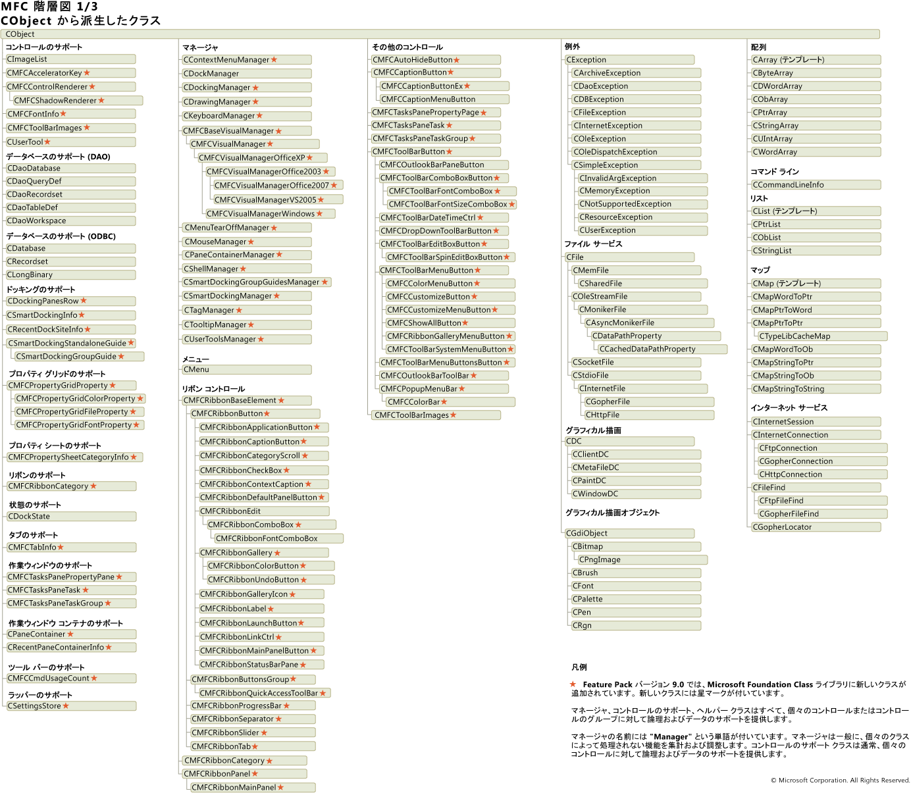
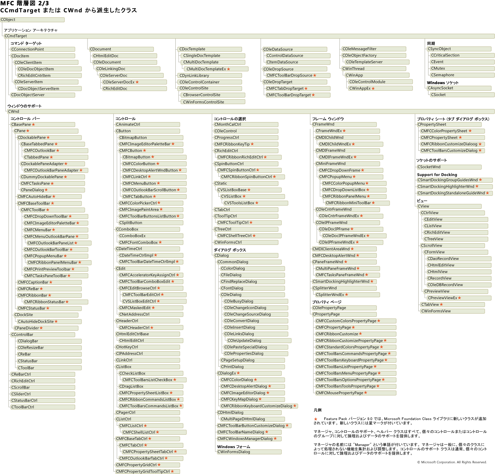

# 階層図
次の図は、`CObject` から派生した MFC クラスを表しています。  
  
   
  
 次の図は、`CWnd` および `CCmdTarget` から派生した MFC クラスを表しています。  
  
   
  
 次の図は、`CObject` から派生していない MFC クラスを表しています。  
  
   
  
 完全なグラフは、次の場所からダウンロードできます: [MFC 階層グラフ ダウンロード](https://aka.ms/hxgg8e)です。  
  
## 関連項目  
 [階層図カテゴリ](../mfc/hierarchy-chart-categories.md)   
 [クラスの概要](../mfc/class-library-overview.md)

