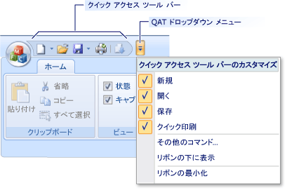

# 方法: クイック アクセス ツール バーをカスタマイズする
クイック アクセス ツールバー (QAT) は、アプリケーション ボタンの横にある、またはカテゴリ タブの下に表示されるコマンドのセットを含むカスタマイズ可能なツールバーです。 次の図は、一般的なクイック アクセス ツールバーを示しています。  
  
   
  
 クイック アクセス ツールバーをカスタマイズするで開く、**プロパティ**ウィンドウで、そのコマンドを変更し、リボン コントロールをプレビューします。  
  
### 開くには、[プロパティ] ウィンドウで、クイック アクセス ツールバー  
  
1.  Visual Studio での**ビュー**  メニューのをクリックして**リソース ビュー**です。  
  
2.  **リソース ビュー**、デザイン画面に表示するリボン リソースをダブルクリックします。  
  
3.  デザイン画面で、クイック アクセス ツールバーのメニューを右クリックし、をクリックして**プロパティ**です。  
  
## クイック アクセス ツールバーのプロパティ  
 次の表では、クイック アクセス ツールバーのプロパティを定義します。  
  
|プロパティ|定義|  
|--------------|----------------|  
|QAT Position|アプリケーションの起動時には、クイック アクセス ツールバーの位置を指定します。 位置には、いずれかを指定できる**上**または**下**リボン コントロール。|  
|QAT Items|クイック アクセス ツールバーで利用可能なコマンドを指定します。|  
  
#### 追加またはクイック アクセス ツールバーのコマンドを削除するには  
  
1.  **プロパティ**ウィンドウで、をクリックして**QAT Items**、省略記号ボタンをクリックして**([...])**.  
  
2.  **QAT Items エディター**ダイアログ ボックスで、使用、**追加**と**削除**クイック アクセス ツールバーのコマンドの一覧を変更するボタンです。  
  
3.  クイック アクセス ツールバーとメニューの クイック アクセス ツールバーの両方に表示するコマンドを実行する場合に、コマンドの横にあるボックスをオンにします。 メニューにのみ表示するコマンドを実行する場合、ボックスをオフにします。  
  
## リボンのプレビュー  
 クイック アクセス ツールバーのコマンドは、デザイン サーフェイスは表示されません。 表示するには、リボンのプレビューか、アプリケーションを実行する必要があります。  
  
#### リボン コントロールをプレビューするには  
  
-   **Ribbon エディター ツールバー**をクリックして**Ribbon のテスト**です。  
  
## 関連項目  
 [リボン デザイナー (MFC)](../mfc/ribbon-designer-mfc.md)

