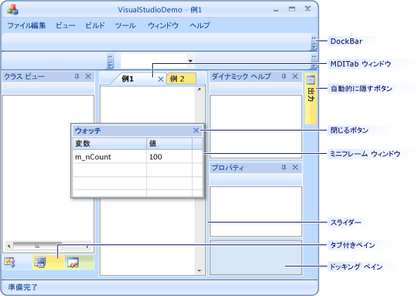

# インターフェイス要素
[!INCLUDE[vs2017banner](../assembler/inline/includes/vs2017banner.md)]

このドキュメントでは、[!INCLUDE[vs_orcas_long](../atl/reference/includes/vs_orcas_long_md.md)] SP1 で導入されたインターフェイス要素について説明します。また、旧バージョンのライブラリとの違いについても説明します。  
  
 次の図は、新しいインターフェイス要素を使用して構築されたアプリケーションを示しています。  
  
   
  
## ウィンドウのドッキング  
 ウィンドウのドッキング機能は、[!INCLUDE[vsprvs](../assembler/masm/includes/vsprvs_md.md)] のグラフィカル ユーザー インターフェイスが使用するドッキング機能に似ています。  
  
## コントロール バーからペインへの変更  
 現在、コントロール バーはペインと呼ばれ、[CBasePane クラス](../mfc/reference/cbasepane-class.md)から派生します。  以前のバージョンの MFC では、コントロール バーの基本クラスは `CControlBar` でした。  
  
 アプリケーションのメイン フレーム ウィンドウは、通常 [CFrameWndEx クラス](../mfc/reference/cframewndex-class.md)または [CMDIFrameWndEx クラス](../Topic/CMDIFrameWndEx%20Class.md)によって表されます。  メイン フレームは*ドッキング サイト*と呼ばれます。  ペインは、3 種類の親 \(ドッキング サイト、ドッキング バー、またはミニフレーム ウィンドウ\) のいずれかを持つことができます。  
  
 ペインには、サイズ変更できないペインとサイズ変更できるペインの 2 種類があります。  サイズ変更できるペイン \(ステータス バーやツール バーなど\) は、分割線またはスライダーを使ってサイズ変更できます。  サイズ変更可能なペインはコンテナーを形成できます \(分割線を使って、ペインを別のペインにドッキングできます\)。  ただし、サイズ変更可能ペインはドッキング バーにはアタッチ \(ドッキング\) できません。  
  
 アプリケーションでサイズ変更できないペインを使用する場合、[CPane クラス](../mfc/reference/cpane-class.md)から派生させます。アプリケーションでサイズ変更可能なペインを使用する場合、[CDockablePane クラス](../Topic/CDockablePane%20Class.md)から派生させます。  
  
## ドッキング サイト  
 ドッキング サイト \(またはメイン フレーム ウィンドウ\) は、アプリケーション内のすべてのペインとミニフレーム ウィンドウを所有します。  ドッキング サイトには [CDockingManager](../mfc/reference/cdockingmanager-class.md) メンバーが含まれます。  このメンバーは、ドッキング サイトに属するすべてのペインのリストを管理します。  このペイン リストの順序は、ドッキング サイトの外側に作成されたペインが最初になります。  フレームワークがドッキング サイトを再描画すると、このリスト上でループが行われ、ドッキング サイトの現在の外接する四角形を含むように各ペインのレイアウトが調整されます。  ドッキング レイアウトを調整する必要がある場合には `AdjustDockingLayout` または `RecalcLayout` を呼び出すことができます。フレームワークはこの呼び出しをドッキング マネージャーにリダイレクトします。  
  
## ドッキング バー  
 各メイン フレーム ウィンドウは、その境界に沿って*ドッキング バー*を配置できます。  ドッキング バーは、[CDockSite クラス](../mfc/reference/cdocksite-class.md)に所属するペインです。  ドッキング バーは、ツール バーなどの [CPane](../mfc/reference/cpane-class.md) から派生するオブジェクトを受け取ることができます。  メイン フレーム ウィンドウが初期化されるときにドッキング バーを作成するには、`EnableDocking` を呼び出します。  自動非表示バーを有効にするには、`EnableAutoHideBars` を呼び出します。  `EnableAutoHideBars` は [CAutoHideDockSite](../mfc/reference/cautohidedocksite-class.md) オブジェクトを作成し、各ドッキング バーの横に配置します。  
  
 各ドッキング バーはドッキング行に分かれています。  ドッキング行は [CDockingPanesRow クラス](../mfc/reference/cdockingpanesrow-class.md)によって表されます。  各ドッキング行には、ツール バーのリストが含まれます。  ユーザーがツール バーをドッキングしたり、同じドッキング バー内部で行から行へツール バーを移動した場合、フレームワークは新しい行を作成し、それに応じてドッキング バーのサイズを調整するか、既存の行上にツール バーを配置します。  
  
## ミニフレーム ウィンドウ  
 フローティング ペインはミニフレーム ウィンドウ内に置かれます。  ミニフレーム ウィンドウは、[CMDITabInfo クラス](../Topic/CMDITabInfo%20Class.md) \(1 つのペインのみ格納\) と [CMultiPaneFrameWnd クラス](../mfc/reference/cmultipaneframewnd-class.md) \(複数のペインを格納\) の 2 つのクラスによって表されます。  コードでペインをフローティングにするには、[CBasePane::FloatPane](../Topic/CBasePane::FloatPane.md) を呼び出します。  ペインがフローティング状態になった後、フレームワークは、自動的にミニフレーム ウィンドウを作成し、ミニフレーム ウィンドウはフローティング ペインの親になります。  フローティング ペインがドッキングすると、フレームワークはその親をリセットし、フローティング ペインはドッキング バー \(ツール バーの場合\) またはドッキング サイト \(サイズ変更可能ペインの場合\) になります。  
  
## ペイン区分線  
 ペイン区分線 \(スライダーまたは分割線\) は [CPaneDivider クラス](../mfc/reference/cpanedivider-class.md)によって表されます。  ユーザーがペインをドッキングすると、そのペインがドッキング サイトにドッキングされたか、別のペインにドッキングされたかには関係なく、フレームワークはペイン区分線を作成します。  ペインがドッキング サイトにドッキングされた場合のペイン区分線は、*既定のペイン区分線*と呼ばれます。  既定のペイン区分線は、ドッキング サイト内のすべてのドッキング ペインのレイアウトの基準となります。  ドッキング マネージャーは、既定のペイン区分線のリストとペイン リストを保持します。  ドッキング マネージャーは、すべてのドッキング ペインのレイアウトを管理します。  
  
## コンテナー  
 サイズ変更可能なペインはすべて、ドッキングされた場合、コンテナー内に格納されます。  コンテナーは [CPaneContainer クラス](../mfc/reference/cpanecontainer-class.md)によって表されます。  各コンテナーは、左のペイン、右のペイン、左のサブコンテナー、右のサブコンテナー、および左右を分ける分割線へのポインターを持ちます。ここで言う*左*と*右*は、物理的な右側、左側を表すのではなく、ツリー構造の分岐を指しています。このように、ペインと分割線のツリーを構築することにより、全体的にサイズ変更できる複雑なペインのレイアウトを構成することができます。  `CPaneContainer` クラスにはツリー コンテナーが含まれ、このツリーに存在するペインと分割線の 2 つのリストも保持されます。  ペイン コンテナー マネージャーは通常、既定のスライダーと、複数のペインを格納するミニフレーム ウィンドウ内に埋め込まれます。  
  
## 自動非表示のコントロール バー  
 既定では、`CDockablePane` は自動非表示機能をサポートします。  ユーザーが `CDockablePane` のキャプション上のピン ボタンをクリックすると、フレームワークはペインを自動非表示モードに切り替えます。  クリックを処理するのに、フレームワークは `CMFCAutoHideBar` オブジェクトと関連付ける [CMFCAutoHideBar クラス](../Topic/CMFCAutoHideBar%20Class.md)および [CMFCAutoHideButton クラス](../mfc/reference/cmfcautohidebutton-class.md)を作成します。  フレームワークは、新しい `CMFCAutoHideBar` を [CAutoHideDockSite](../mfc/reference/cautohidedocksite-class.md) 上に配置します。  また、フレームワークは、`CMFCAutoHideButton` をツール バーにアタッチします。  [CDockingManager クラス](../mfc/reference/cdockingmanager-class.md)は `CDockablePane` を管理します。  
  
## タブ付きコントロール バーと Outlook バー  
 [CMFCBaseTabCtrl クラス](../mfc/reference/cmfcbasetabctrl-class.md)は、切り離し可能なタブを持つタブ付きウィンドウの基本的な機能を実装します。  `CMFCBaseTabCtrl` オブジェクトを使用するには、アプリケーションで [CBaseTabbedPane クラス](../mfc/reference/cbasetabbedpane-class.md) を初期化します。  `CBaseTabbedPane` は、`CDockablePane` から派生し、`CMFCBaseTabCtrl` オブジェクトへのポインターを保持します。  `CBaseTabbedPane` により、タブ付きコントロール バーのドッキングとサイズ変更が可能になります。  タブ付きのドッキング コントロール バーを動的に作成するには、[CDockablePane::AttachToTabWnd](../Topic/CDockablePane::AttachToTabWnd.md) を使用します。  
  
 Outlook バー コントロールもタブ付きバーに基づきます。  [CMFCOutlookBar クラス](../mfc/reference/cmfcoutlookbar-class.md)は、`CBaseTabbedPane` から派生します。  Outlook バーを使用する方法の詳細については、[CMFCOutlookBar クラス](../mfc/reference/cmfcoutlookbar-class.md)を参照してください。  
  
## 参照  
 [概念](../mfc/mfc-concepts.md)