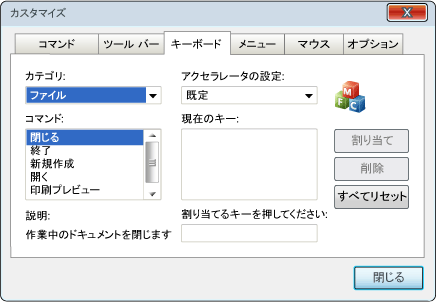
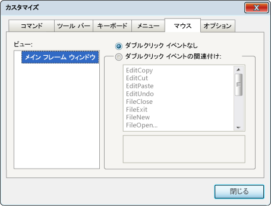

# キーボードとマウスのカスタマイズ
[!INCLUDE[vs2017banner](../assembler/inline/includes/vs2017banner.md)]

MFC は、アプリケーションのユーザーがキーボード入力とマウス入力を処理する方法をカスタマイズできるようにします。  ユーザーは、コマンドにショートカット キーを割り当てることで、キーボード入力をカスタマイズできます。  また、ユーザーは、アプリケーションの特定のウィンドウ内をダブルクリックしたときに実行されるコマンドを選択することで、マウス入力をカスタマイズできます。  このトピックでは、アプリケーションでの入力をカスタマイズする方法について説明します。  
  
 ユーザーは、**\[カスタマイズ\]** ダイアログ ボックスでマウスおよびキーボードのカスタム コントロールを変更できます。  ユーザーは、**\[表示\]** メニューの **\[カスタマイズ\]** をポイントし、**\[ツール バーとドッキング ウィンドウ\]** をクリックして、このダイアログ ボックスを表示します。  次に、このダイアログ ボックスで、**\[キーボード\]** タブまたは **\[マウス\]** タブをクリックします。  
  
## キーボードのカスタマイズ  
 次の図は、**\[カスタマイズ\]** ダイアログ ボックスの **\[キーボード\]** タブを示しています。  
  
   
キーボードのカスタマイズ タブ  
  
 ユーザーは、\[キーボード\] タブを使用して、1 つのコマンドに 1 つまたは複数のショートカット キーを割り当てます。  使用できるコマンドが、タブの左側に一覧表示されます。  ユーザーは、メニューから使用できるコマンドを選択できます。  ショートカット キーに関連付けることができるのはメニュー コマンドだけです。  新しいショートカット キーを入力すると、**\[割り当て\]** ボタンが有効になります。  ユーザーがこのボタンをクリックすると、アプリケーションは選択されたコマンドをそのショートカット キーに関連付けます。  
  
 現在割り当てられているすべてのショートカット キーが、右側の列のリスト ボックスに表示されます。  個々のショートカット キーを選択して削除したり、アプリケーションのすべての割り当てをリセットしたりすることもできます。  
  
 アプリケーションでこのカスタマイズをサポートするには、[CKeyboardManager](../mfc/reference/ckeyboardmanager-class.md) オブジェクトを作成する必要があります。  `CKeyboardManager` オブジェクトを作成するには、[CWinAppEx::InitKeyboardManager](../Topic/CWinAppEx::InitKeyboardManager.md) 関数を呼び出します。  このメソッドは、キーボード マネージャーを作成し、初期化します。  キーボード マネージャーを手動で作成する場合は、`CWinAppEx::InitKeyboardManager` を呼び出してキーボード マネージャーを初期化する必要があります。  
  
 ウィザードを使用してアプリケーションを作成する場合は、ウィザードによってキーボード マネージャーが初期化されます。  アプリケーションがキーボード マネージャーを初期化すると、フレームワークは **\[Keyboard\]** タブを **\[Customization\]** ダイアログ ボックスに追加します。  
  
## マウスのカスタマイズ  
 次の図は、**\[カスタマイズ\]** ダイアログ ボックスの **\[マウス\]** タブを示しています。  
  
   
マウスのカスタマイズ タブ  
  
 ユーザーは、このタブを使用して、マウスのダブルクリック アクションにメニュー コマンドを割り当てます。  ウィンドウの左側からビューを選択し、右側のコントロールを使用してコマンドをダブルクリック アクションに関連付けます。  ユーザーが **\[Close\]** をクリックすると、アプリケーションは、ユーザーがビューの任意の場所をダブルクリックするたびに、関連付けられたコマンドを実行します。  
  
 ウィザードを使用してアプリケーションを作成する場合、既定ではマウスのカスタマイズは有効になりません。  
  
#### マウスのカスタマイズを有効にするには  
  
1.  [CWinAppEx::InitMouseManager](../Topic/CWinAppEx::InitMouseManager.md) を呼び出して [CMouseManager](../mfc/reference/cmousemanager-class.md) オブジェクトを初期化します。  
  
2.  [CWinAppEx::GetMouseManager](../Topic/CWinAppEx::GetMouseManager.md) を使用して、マウス マネージャーへのポインターを取得します。  
  
3.  [CMouseManager::AddView](../Topic/CMouseManager::AddView.md) メソッドを使用してマウス マネージャーにビューを追加します。  この操作を、マウス マネージャーに追加するすべてのビューに対して行います。  
  
 アプリケーションがマウス マネージャーを初期化すると、フレームワークは **\[Mouse\]** タブを **\[Customize\]** ダイアログ ボックスに追加します。  ビューを追加しない場合は、タブにアクセスすると、ハンドルされない例外が発生します。  ビューの一覧を作成すると、ユーザーは **\[Mouse\]** タブを使用できるようになります。  
  
 新しいビューをマウス マネージャーに追加するときに、ビューに一意の ID を割り当てます。  ウィンドウのマウスのカスタマイズをサポートするには、`WM_LBUTTONDBLCLICK` メッセージを処理し、[CWinAppEx::OnViewDoubleClick](../Topic/CWinAppEx::OnViewDoubleClick.md) 関数を呼び出す必要があります。  この関数を呼び出すときに、パラメーターの 1 つとして、そのウィンドウの ID を指定します。  ID 番号および ID 番号に関連付けられたオブジェクトの管理は、プログラマが行います。  
  
## セキュリティに関する注意事項  
 「[ユーザー定義のツール](../Topic/User-defined%20Tools.md)」で説明されているように、ユーザーはユーザー定義のツール ID をダブルクリック イベントに関連付けることができます。  ユーザーがビューをダブルクリックすると、アプリケーションは関連付けられた ID に一致するユーザー ツールを探します。  一致するツールが見つかった場合、アプリケーションはそのツールを実行します。  一致するツールが見つからない場合は、WM\_COMMAND メッセージを ID と共にダブルクリックされたビューに送信します。  
  
 カスタマイズした設定はレジストリに格納されます。  攻撃者はレジストリを編集することで、有効なユーザー ツール ID を任意のコマンドに置き換えることができます。  ユーザーがビューをダブルクリックすると、ビューは攻撃者が仕掛けたコマンドを処理します。  これにより、予期しない動作や危険性のある動作が発生する可能性があります。  
  
 さらに、この種の攻撃は、ユーザー インターフェイスの保護をバイパスできます。  たとえば、アプリケーションで印刷機能が無効になっているとします。  つまり、アプリケーションのユーザー インターフェイスでは、**\[Print\]** のメニューとボタンが使用できません。  通常は、これでアプリケーションは印刷を実行できなくなります。  ただし、攻撃者がレジストリを編集した場合は、使用できないユーザー インターフェイス要素がバイパスされて、ユーザーはビューをダブルクリックすることで印刷コマンドを直接送信できます。  
  
 この種の攻撃を防ぐには、アプリケーションのコマンド ハンドラーに、実行前にコマンドが有効かどうかを検証するコードを追加します。  アプリケーションへのコマンド送信の防止をユーザー インターフェイスに依存しないでください。  
  
## 参照  
 [MFC のカスタマイズ](../mfc/customization-for-mfc.md)   
 [CKeyboardManager クラス](../mfc/reference/ckeyboardmanager-class.md)   
 [CMouseManager クラス](../mfc/reference/cmousemanager-class.md)   
 [カスタマイズによるセキュリティへの影響](../Topic/Security%20Implications%20of%20Customization.md)