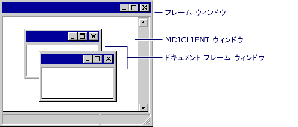

# MDI 子ウィンドウの管理
MDI メイン フレーム ウィンドウ (アプリケーションごとに 1 つ) と呼ばれる特殊な子ウィンドウが含まれて、 **MDICLIENT**ウィンドウです。 **MDICLIENT**ウィンドウがメイン フレーム ウィンドウのクライアント領域を管理し、それ自体の子ウィンドウを持つ: から派生して、ドキュメント ウィンドウ`CMDIChildWnd`します。 ドキュメント ウィンドウは、フレーム ウィンドウ自体 (MDI 子ウィンドウ) であるため、独自の子こともできます。 これらすべての場合は、親ウィンドウは、その子ウィンドウを管理し、いくつかのコマンドを転送します。  
  
 MDI フレーム ウィンドウでは、フレーム ウィンドウ、管理、 **MDICLIENT**ウィンドウ、コントロール バーと共に移動します。 **MDICLIENT**ウィンドウで、さらに、すべての MDI 子フレーム ウィンドウを管理します。 次の図は、MDI フレーム ウィンドウ、間の関係を示します、 **MDICLIENT**ウィンドウ、およびその子ドキュメント フレーム ウィンドウです。  
  
   
MDI フレーム ウィンドウと子ウィンドウ  
  
 1 つを使用する必要がある場合、MDI フレーム ウィンドウは、現在の MDI 子ウィンドウと共にでも動作します。 MDI フレーム ウィンドウは、自分で処理を試行する前に、MDI 子ウィンドウにコマンド メッセージを代行させます。  
  
## 詳しくは次のトピックをクリックしてください。  
  
-   [ドキュメント フレーム ウィンドウの作成](../mfc/creating-document-frame-windows.md)  
  
-   [フレーム ウィンドウ スタイル](../mfc/frame-window-styles-cpp.md)  
  
## 関連項目  
 [フレーム ウィンドウの使用](../mfc/using-frame-windows.md)

