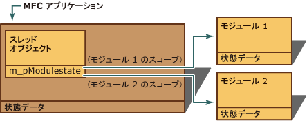

# MFC モジュールの状態データの管理
[!INCLUDE[vs2017banner](../assembler/inline/includes/vs2017banner.md)]

ここでは、実行すると実行のフロー \(コード パスは、アプリケーションから取得する\) モジュールに出入りしたとき、この状態をどのように更新されるまたは MFC モジュールの状態データについて説明します。  `AFX_MANAGE_STATE` と `METHOD_PROLOGUE` マクロのモジュール状態を切り替えると、説明します。  
  
> [!NOTE]
>  「module」という用語は、DLL \(または DLL の設定\)、ここに実行可能プログラムを、アプリケーションの残りの部分とは関係なく実行するのか、MFC DLL の共有コピーを使用します。  ActiveX コントロールは、モジュールの一般的な例です。  
  
 次の図に示すように、MFC にアプリケーションで使用されるモジュールごとに状態データがあります。  このデータの例は、アプリケーションの `CWinThread` の現在の `CWinApp` とオブジェクトに Windows のインスタンス ハンドル \(リソースを読み込むために使用される\)、ポインター、OLE モジュールの参照カウントをと MFC オブジェクトのウィンドウ オブジェクトのハンドルと対応するインスタンスとの関連付けを維持するさまざまなマップが含まれます。  ただし、アプリケーションに複数のモジュールを使用する場合は、各モジュールの状態データは、アプリケーションではありません。  ただし、各は MFC モジュールの状態データの専用コピーを持ちます。  
  
   
単一モジュール \(アプリケーション\) の状態データ  
  
 モジュールの状態データの構造は常に含まれ、この構造体へのポインターで使用できます。  実行のフローを次の図に示すように、特定のモジュールを入力すると、モジュールの状態は「現在」または「有効な」状態である必要があります。  したがって、各スレッド オブジェクトには、そのアプリケーションの有効な状態の構造体へのポインターがあります。  このポインターを常に更新しておくと、アプリケーションのグローバル状態を管理し、各モジュール状態の整合性を維持するために重要です。  グローバル状態の不適切な管理は予測不可能なアプリケーションの動作になります。  
  
   
複数モジュールの状態データ  
  
 つまり、各モジュールが正しくエントリ ポイントのモジュール状態の間のすべての切り替えを行います。  「エントリ ポイント」は実行のフローがモジュールのコードを入力できる場所です。  エントリ ポイントは次のとおりです。:  
  
-   [DLL のエクスポート関数](../mfc/exported-dll-function-entry-points.md)  
  
-   [COM インターフェイスのメンバー関数](../mfc/com-interface-entry-points.md)  
  
-   [ウィンドウ プロシージャ](../Topic/Window%20Procedure%20Entry%20Points.md)  
  
## 参照  
 [MFC の一般的なトピック](../mfc/general-mfc-topics.md)