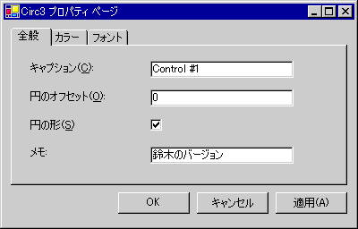

# MFC ActiveX コントロール : プロパティ ページ
プロパティ ページでは、ActiveX コントロールのユーザーを表示および ActiveX コントロールのプロパティを変更できるようにします。 これらのプロパティは、表示およびコントロールのプロパティを編集用にカスタマイズされた、グラフィカル インターフェイスを提供する 1 つまたは複数のプロパティ ページが含まれているコントロールのプロパティのダイアログ ボックスを呼び出すことによってアクセスします。  
  
 ActiveX コントロールのプロパティ ページは、2 つの方法で表示されます。  
  
-   ときに、コントロールのプロパティの動詞 (**OLEIVERB_PROPERTIES**) が呼び出されると、コントロールは、コントロールのプロパティ ページを含むモーダル プロパティ ダイアログ ボックスが表示されます。  
  
-   コンテナーは、選択したコントロールのプロパティ ページを表示する独自のモードレス ダイアログ ボックスを表示できます。  
  
 現在のプロパティ ページのプロパティ ページ、および一連のプロパティ ページ ダイアログを閉じるなど一般的なタスクを実行するボタンの間の切り替えのタブを表示するための領域で構成されます (次の図に示されている) のプロパティ ダイアログ ボックス、加えられた変更をキャンセルまたは ActiveX コントロールに変更をすぐに適用します。  
  
   
プロパティ ダイアログ ボックス  
  
 この記事では、ActiveX コントロールのプロパティ ページの使用に関連するトピックについて説明します。 次の設定があります。  
  
-   [ActiveX コントロールの既定のプロパティ ページを実装します。](#_core_implementing_the_default_property_page)  
  
-   [プロパティ ページにコントロールを追加します。](#_core_adding_controls_to_a_property_page)  
  
-   [DoDataExchange 関数をカスタマイズします。](#_core_customizing_the_dodataexchange_function)  
  
 ActiveX コントロールのプロパティ ページを使用する方法については、次の記事を参照してください。  
  
-   [MFC ActiveX コントロール: カスタム プロパティ ページの追加](../mfc/mfc-activex-controls-adding-another-custom-property-page.md)  
  
-   [MFC ActiveX コントロール: ストック プロパティ ページの使用](../mfc/mfc-activex-controls-using-stock-property-pages.md)  
  
 ActiveX コントロール以外の MFC アプリケーションでプロパティ シートの使用方法の詳細については、次を参照してください。[プロパティ シート](../mfc/property-sheets-mfc.md)です。  
  
##  既定のプロパティ ページを実装します。  
 コントロール プロジェクトの作成に ActiveX コントロール ウィザードを使用する場合 ActiveX コントロール ウィザードは、既定のプロパティ ページ クラスから派生したコントロール[COlePropertyPage クラス](../mfc/reference/colepropertypage-class.md)です。 最初に、このプロパティ ページが空白を任意のダイアログ ボックス コントロールまたはコントロールのセットを追加することができます。 ActiveX コントロール ウィザードが既定では、追加のプロパティ ページ クラスの 1 つのプロパティ ページ クラスを作成するため (からも派生`COlePropertyPage`) クラス ビューを使用して作成する必要があります。 この手順の詳細については、次を参照してください。 [MFC ActiveX コントロール: カスタム プロパティ ページの追加](../mfc/mfc-activex-controls-adding-another-custom-property-page.md)です。  
  
 プロパティの実装のページ (この場合、既定値) が 3 つの手順。  
  
#### プロパティ ページを実装するには  
  
1.  追加、 `COlePropertyPage`-コントロール プロジェクトにクラスを派生します。 (この場合は) と同様に ActiveX コントロール ウィザードを使用して、プロジェクトが作成されている場合、既定のプロパティ ページ クラスが既に存在します。  
  
2.  ダイアログ エディターを使用して、プロパティ ページのテンプレートにはコントロールを追加します。  
  
3.  カスタマイズ、`DoDataExchange`の関数、 `COlePropertyPage`-プロパティ ページのコントロールと ActiveX コントロールの間の値を交換するクラスを派生します。  
  
 たとえば目的で、次の手順は、単純なコントロール ("Sample"という名前) を使用します。 例では、ActiveX コントロール ウィザードを使用して作成したし、株式の Caption プロパティのみが含まれています。  
  
##  プロパティ ページにコントロールを追加します。  
  
#### プロパティ ページにコントロールを追加するには  
  
1.  コントロール プロジェクトを開き、リソース ビューを開きます。  
  
2.  ダブルクリックして、**ダイアログ**directory アイコン。  
  
3.  開く、 **IDD_PROPPAGE_SAMPLE**  ダイアログ ボックス。  
  
     ActiveX コントロール ウィザードは、プロジェクトの名前をダイアログ ID、ここでは、サンプルの末尾に追加します。  
  
4.  ドラッグし、選択したコントロールをツールボックスからダイアログ ボックスの領域にドロップします。  
  
5.  この例では、テキスト ラベル コントロール"キャプション:"、エディット ボックス コントロールは、**上述**識別子で十分です。  
  
6.  をクリックして**保存**ツールバーの変更を保存します。  
  
 ユーザー インターフェイスが変更されて、Caption プロパティの編集ボックスにリンクする必要があります。 これは、次のセクションを編集して、`CSamplePropPage::DoDataExchange`関数。  
  
##  DoDataExchange 関数をカスタマイズします。  
 プロパティ ページ[CWnd::DoDataExchange](../mfc/reference/cwnd-class.md#dodataexchange)関数では、コントロールのプロパティの実際の値にプロパティ ページの値をリンクすることができます。 リンクを確立するために、対応するコントロールのプロパティに適切なプロパティ ページのフィールドをマップする必要があります。  
  
 これらのマッピングは、プロパティ ページを使用して実装されます**ddp _**関数。 **Ddp _**関数の動作と同様に、 **ddx _**標準 MFC ダイアログ ボックスの 1 つの例外で使用する関数。 メンバー変数への参照だけでなく**ddp _**関数は、コントロールのプロパティの名前を受け取ります。 一般的なエントリを次に示します、`DoDataExchange`プロパティ ページの関数。  
  
 [!code-cpp[NVC_MFC_AxUI#31](../mfc/codesnippet/cpp/mfc-activex-controls-property-pages_1.cpp)]  
  
 この関数に関連付けますプロパティ ページの`m_caption`キャプション、メンバー変数を使用して、`DDP_TEXT`関数。  
  
 プロパティ ページのコントロールを挿入した後は、プロパティ ページ コントロール間のリンクを確立する必要があります。 `IDC_CAPTION`、を使用して実際のコントロールのプロパティ、キャプション、および、 **DDP_Text**上で説明したとおりに機能します。  
  
 [プロパティ ページ](../mfc/reference/property-pages-mfc.md)チェック ボックス、ラジオ ボタンなど、他の種類のダイアログ コントロールに使用できる、ボックスの一覧を表示します。 次の表は、プロパティ ページのセット全体を示します**ddp _**関数とその用途。  
  
### プロパティ ページ関数  
  
|関数名|この関数を使用してリンク|  
|-------------------|-------------------------------|  
|`DDP_CBIndex`|コントロール プロパティを持つコンボ ボックスで選択した文字列のインデックスです。|  
|`DDP_CBString`|コントロール プロパティを持つコンボ ボックスで選択されている文字列。 選択された文字列は、プロパティの値と同じ文字で始まることができますが、完全には一致しなくてもかまいません。|  
|`DDP_CBStringExact`|コントロール プロパティを持つコンボ ボックスで選択されている文字列。 選択した文字列とプロパティの文字列値が正確に一致する必要があります。|  
|`DDP_Check`|コントロール プロパティを持つチェック ボックスです。|  
|`DDP_LBIndex`|コントロールのプロパティにリスト ボックスで選択した文字列のインデックスです。|  
|`DDP_LBString`|コントロールのプロパティにリスト ボックスで選択されている文字列。 選択された文字列は、プロパティの値と同じ文字で始まることができますが、完全には一致しなくてもかまいません。|  
|`DDP_LBStringExact`|コントロールのプロパティにリスト ボックスで選択されている文字列。 選択した文字列とプロパティの文字列値が正確に一致する必要があります。|  
|`DDP_Radio`|コントロールのプロパティにラジオ ボタンです。|  
|**DDP_Text**|コントロールのプロパティにテキストです。|  
  
## 参照  
 [MFC ActiveX コントロール](../mfc/mfc-activex-controls.md)   
 [COlePropertyPage クラス](../mfc/reference/colepropertypage-class.md)
