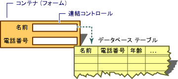

# MFC ActiveX コントロール : ActiveX コントロールにおけるデータ連結の使用
[!INCLUDE[vs2017banner](../assembler/inline/includes/vs2017banner.md)]

ActiveX コントロールのより強力な使用の 1 つがコントロールのプロパティがデータベースのフィールドにバインドするようにレンダリング データ バインディングです。  ユーザーがこのプロパティのバインド データを変更すると、コントロールはデータベースに通知、レコード フィールドが更新されるように必要があります。  データベースは、成功のコントロールまたは要求のエラーを通知します。  
  
 ここでは、タスクのコントロールの端について説明します。  データベースでデータ バインディングの対話を実装すると、コントロール コンテナーの役割です。  コンテナーのデータベースとの対話を管理方法です。ここでは詳しく説明しません。  どのように準備またはデータ バインディングのコントロールは、この記事の後半で説明します。  
  
   
データ バインド コントロールの概念図  
  
 `COleControl` クラスを実装するためのデータ バインディングに簡単なプロセスを、2 種類のメンバー関数を提供します。  最初の関数は、[BoundPropertyRequestEdit](../Topic/COleControl::BoundPropertyRequestEdit.md)が、プロパティ値を変更するアクセス許可を要求するために使用されます。  プロパティ値が正常に変更された後で[BoundPropertyChanged](../Topic/COleControl::BoundPropertyChanged.md)の 2 番目の関数が呼び出されます。  
  
 ここでは、次のトピックについて説明します。  
  
-   [バインドできるなストック プロパティの作成](#vchowcreatingbindablestockproperty)  
  
-   [バインドできるを作成して get および set メソッド](#vchowcreatingbindablegetsetmethod)  
  
##   バインドできるなストック プロパティの作成  
 [バインドできる get および set メソッド](#vchowcreatingbindablegetsetmethod)が目的の方がより高いがデータ バインドのストック プロパティを作成することもできます。  
  
> [!NOTE]
>  ストック プロパティに **バインド可能\(B\)** と **要求編集\(Q\)** 属性が与えられています。  
  
#### バインドできるなストック プロパティの追加ウィザードのプロパティを追加するには  
  
1.  [MFC ActiveX コントロール ウィザード](../mfc/reference/mfc-activex-control-wizard.md)を使用してプロジェクトを開始します。  
  
2.  コントロールのインターフェイス ノードを右クリックします。  
  
     これはショートカット メニューが開きます。  
  
3.  ショートカット メニューで、クリック **追加** は、**\[プロパティの追加\]** をクリックします。  
  
4.  **プロパティ 名前** のドロップダウン リストのエントリの 1 を選択します。  たとえば、**テキスト**を選択できます。  
  
     **テキスト** がストック プロパティであるため、**バインド可能\(B\)** と **要求編集\(Q\)** 属性が既にチェックされます。  
  
5.  **IDL 属性** タブで、次のチェック ボックスをオンにします: プロジェクトの .IDL プロパティ定義に属性を追加する **表示バインド\(P\)** と **既定のバインド\(E\)** はファイル。  これらの属性は、コントロールがユーザーに表示されるようにし、ストック プロパティに既定のバインド可能プロパティを表示します。  
  
 この時点で、コントロールはデータ ソースのデータを表示するユーザーは、更新データ フィールドにできません。  またコントロールでデータを更新できるように、次のように表示するに `OnOcmCommand` [OnOcmCommand](../mfc/mfc-activex-controls-subclassing-a-windows-control.md) 関数を変更する:  
  
 [!code-cpp[NVC_MFC_AxData#1](../mfc/codesnippet/CPP/mfc-activex-controls-using-data-binding-in-an-activex-control_1.cpp)]  
  
 これでコントロールを登録するプロジェクトをビルドできます。  ダイアログ ボックスにコントロールを挿入する場合、**データ フィールド** と **\[データ ソース\]** のプロパティを追加したり、コントロールに表示されるように、データ ソースおよびフィールドを選択できます。  
  
##   バインドできるを作成して get および set メソッド  
 データ バインドに加えて、[バインドできるなストック プロパティ](#vchowcreatingbindablestockproperty)を作成して取得すると、SET メソッド。  
  
> [!NOTE]
>  この手順では、Windows フォーム コントロールをサブクラス化する ActiveX コントロール プロジェクトがあるとします。  
  
#### バインドできるを追加するには追加のプロパティ ウィザードを使用して get および set メソッド  
  
1.  コントロールのプロジェクトを読み込んでください。  
  
2.  **コントロールの設定** ページで、コントロールがサブクラス化するためにウィンドウ クラスを選択します。  たとえば、エディット コントロールをサブクラス化したい場合があります。  
  
3.  コントロールのプロジェクトを読み込んでください。  
  
4.  コントロールのインターフェイス ノードを右クリックします。  
  
     これはショートカット メニューが開きます。  
  
5.  ショートカット メニューで、クリック **追加** は、**\[プロパティの追加\]** をクリックします。  
  
6.  **プロパティ名** ボックスのプロパティ名を入力します。  この例では、`MyProp` を使用します。  
  
7.  **プロパティの種類** のドロップダウン リスト ボックスからデータ型を選択します。  この例では、**short** を使用します。  
  
8.  **Implementation Type**の場合、クリック **Get\/Set メソッドの設定**。  
  
9. IDL 属性タブで、次のチェック ボックスをオンにします: **バインド可能\(B\)**、**要求編集\(Q\)**、プロジェクトの .IDL プロパティ定義に属性を追加する **表示バインド\(P\)**と **既定のバインド\(E\)** はファイル。  これらの属性は、コントロールがユーザーに表示されるようにし、ストック プロパティに既定のバインド可能プロパティを表示します。  
  
10. \[完了\] をクリックします。  
  
11. 次のコードを含むように `SetMyProp` 関数の本体を変更する:  
  
     [!code-cpp[NVC_MFC_AxData#2](../mfc/codesnippet/CPP/mfc-activex-controls-using-data-binding-in-an-activex-control_2.cpp)]  
  
12. `BoundPropertyChanged` と `BoundPropertyRequestEdit` 関数に渡されるパラメーターは .IDL ファイルのプロパティの ID \(\) 属性に渡されるパラメーターのプロパティの dispid です。  
  
13. [OnOcmCommand](../mfc/mfc-activex-controls-subclassing-a-windows-control.md) 関数を変更します。これは、次のコードが含まれています:  
  
     [!code-cpp[NVC_MFC_AxData#1](../mfc/codesnippet/CPP/mfc-activex-controls-using-data-binding-in-an-activex-control_1.cpp)]  
  
14. 次のコードを含むように `OnDraw` 関数を変更する:  
  
     [!code-cpp[NVC_MFC_AxData#3](../mfc/codesnippet/CPP/mfc-activex-controls-using-data-binding-in-an-activex-control_3.cpp)]  
  
15. ヘッダー ファイルのパブリック セクションにコントロール クラスのヘッダー ファイルは、メンバー変数の定義 \(\) コンストラクターを追加する:  
  
     [!code-cpp[NVC_MFC_AxData#4](../mfc/codesnippet/CPP/mfc-activex-controls-using-data-binding-in-an-activex-control_4.h)]  
  
16. 次の行に `DoPropExchange` の最後の行を機能させる:  
  
     [!code-cpp[NVC_MFC_AxData#5](../mfc/codesnippet/CPP/mfc-activex-controls-using-data-binding-in-an-activex-control_5.cpp)]  
  
17. 次のコードを含むように `OnResetState` 関数を変更する:  
  
     [!code-cpp[NVC_MFC_AxData#6](../mfc/codesnippet/CPP/mfc-activex-controls-using-data-binding-in-an-activex-control_6.cpp)]  
  
18. 次のコードを含むように `GetMyProp` 関数を変更する:  
  
     [!code-cpp[NVC_MFC_AxData#7](../mfc/codesnippet/CPP/mfc-activex-controls-using-data-binding-in-an-activex-control_7.cpp)]  
  
 これでコントロールを登録するプロジェクトをビルドできます。  ダイアログ ボックスにコントロールを挿入する場合、**データ フィールド** と **\[データ ソース\]** のプロパティを追加したり、コントロールに表示されるように、データ ソースおよびフィールドを選択できます。  
  
## 参照  
 [MFC ActiveX コントロール](../mfc/mfc-activex-controls.md)   
 [データ連結コントロール \(ADO および RDO\)](../Topic/Data-Bound%20Controls%20\(ADO%20and%20RDO\).md)