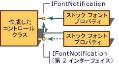

# MFC ActiveX コントロール : フォントの使用
[!INCLUDE[vs2017banner](../assembler/inline/includes/vs2017banner.md)]

ActiveX コントロールの表示がテキストを送信する場合は、コントロールのユーザーがフォントのプロパティを変更して、テキストの外観を変更できるようにすることができます。  フォント プロパティはフォント オブジェクトとして実装され、2 種類の 1 種類です: ストックまたはカスタム。  ストック フォント プロパティが、プロパティの追加ウィザードを使用して追加できる preimplemented フォント プロパティです。  カスタム フォントのプロパティは、preimplemented し、コントロールの開発者はプロパティの動作と使用方法を決定します。  
  
 ここでは、次のトピックについて説明します。  
  
-   [ストック フォント プロパティを使用します。](#_core_using_the_stock_font_property)  
  
-   [コントロールのカスタム プロパティを使用してフォントの](#_core_implementing_a_custom_font_property)  
  
##   ストック フォント プロパティを使用します。  
 ストック フォント プロパティは [COleControl](../mfc/reference/colecontrol-class.md)クラスによって preimplemented。  また、標準フォント プロパティ ページを使用すると、名前、サイズ、スタイルなどのフォント オブジェクトのさまざまな属性を、変更を許可します。  
  
 `COleControl`の [GetFont](../Topic/COleControl::GetFont.md)、[SetFont](../Topic/COleControl::SetFont.md)と [InternalGetFont](../Topic/COleControl::InternalGetFont.md) 関数でフォント オブジェクトにアクセスします。  コントロールのユーザーが `GetFont` と `SetFont` 関数によって他の取得と設定のプロパティと同様にフォント オブジェクトにアクセスします。  フォント オブジェクトへのアクセスがコントロール内の必要な場合は、`InternalGetFont` 関数を使用します。  
  
 [MFC ActiveX コントロール: プロパティ](../mfc/mfc-activex-controls-properties.md)"に説明されているように、ストック プロパティを追加するには [プロパティ 追加ウィザード](../ide/names-add-property-wizard.md)と簡単です。  フォント プロパティを選択し、プロパティの追加ウィザードはコントロールのディスパッチ マップに自動的にストック フォント エントリを挿入します。  
  
#### ストック フォント プロパティの追加ウィザードのプロパティを追加するには  
  
1.  コントロールのプロジェクトを読み込んでください。  
  
2.  クラス ビューで、コントロール ライブラリ ノードを展開します。  
  
3.  ショートカット メニューを表示するコントロール \(ライブラリ ノードの 2 番目のノード\) のインターフェイス ノードを右クリックします。  
  
4.  ショートカット メニューで、クリック **追加** は、**\[プロパティの追加\]** をクリックします。  
  
     これは、プロパティの追加ウィザードが表示されます。  
  
5.  **プロパティ名** ボックスで、**フォント**をクリックします。  
  
6.  \[完了\] をクリックします。  
  
 プロパティの追加ウィザードはコントロール クラスの実装ファイルにあるコントロールのディスパッチ マップに次の行を追加する:  
  
 [!code-cpp[NVC_MFC_AxFont#1](../mfc/codesnippet/CPP/mfc-activex-controls-using-fonts_1.cpp)]  
  
 また、プロパティの追加ウィザードはコントロール .IDL ファイルに次の行を追加する:  
  
 [!code-cpp[NVC_MFC_AxFont#2](../mfc/codesnippet/CPP/mfc-activex-controls-using-fonts_2.idl)]  
  
 ストック Caption プロパティには、ストック フォント プロパティ情報を使用して描画できるテキストのプロパティの例です。  コントロールにストック Caption プロパティを追加すると、ストック フォント プロパティに使用するような手順を使用します。  
  
#### ストック Caption プロパティの追加ウィザードのプロパティを追加するには  
  
1.  コントロールのプロジェクトを読み込んでください。  
  
2.  クラス ビューで、コントロール ライブラリ ノードを展開します。  
  
3.  ショートカット メニューを表示するコントロール \(ライブラリ ノードの 2 番目のノード\) のインターフェイス ノードを右クリックします。  
  
4.  ショートカット メニューで、クリック **追加** は、**\[プロパティの追加\]** をクリックします。  
  
     これは、プロパティの追加ウィザードが表示されます。  
  
5.  **プロパティ名** ボックスで、**キャプション**をクリックします。  
  
6.  \[完了\] をクリックします。  
  
 プロパティの追加ウィザードはコントロール クラスの実装ファイルにあるコントロールのディスパッチ マップに次の行を追加する:  
  
 [!code-cpp[NVC_MFC_AxFont#3](../mfc/codesnippet/CPP/mfc-activex-controls-using-fonts_3.cpp)]  
  
##   OnDraw 関数の変更  
 `OnDraw` の既定の実装では、コントロールに表示されるすべてのテキストに Windows システム フォントを使用します。  これはデバイス コンテキストにフォント オブジェクトを選択して `OnDraw` コードを変更する必要があります。  これを行うには、[COleControl::SelectStockFont](../Topic/COleControl::SelectStockFont.md) を呼び出し、次の例に示すように、コントロールのデバイス コンテキストを渡します。:  
  
 [!code-cpp[NVC_MFC_AxFont#4](../mfc/codesnippet/CPP/mfc-activex-controls-using-fonts_4.cpp)]  
  
 フォント オブジェクトを使用するに `OnDraw` 関数が変更された後にコントロール内のテキストは、コントロールのストックのフォント プロパティの特性が表示されます。  
  
##   コントロールのカスタム プロパティを使用してフォントの  
 ストック フォント プロパティに加えて、ActiveX コントロールはカスタム フォントのプロパティを持つことができます。  カスタム フォントのプロパティを追加するには、次のようにする必要があります:  
  
-   カスタム フォントのプロパティを実装するには、プロパティの追加ウィザードを使用します。  
  
-   [フォントの通知の処理](#_core_processing_font_notifications)。  
  
-   [新しいフォントの通知インターフェイスの実装](#_core_implementing_a_new_font_notification_interface)。  
  
###   カスタム フォントのプロパティの実装  
 カスタム フォントのプロパティを実装するには、プロパティを追加し、コードに対して変更を行うには、プロパティの追加ウィザードを使用します。  次のセクションでは、サンプル コントロールに `HeadingFont` にカスタム プロパティを追加する方法について説明します。  
  
##### カスタム フォントのプロパティをプロパティの追加ウィザードを追加するには  
  
1.  コントロールのプロジェクトを読み込んでください。  
  
2.  クラス ビューで、コントロール ライブラリ ノードを展開します。  
  
3.  ショートカット メニューを表示するコントロール \(ライブラリ ノードの 2 番目のノード\) のインターフェイス ノードを右クリックします。  
  
4.  ショートカット メニューで、クリック **追加** は、**\[プロパティの追加\]** をクリックします。  
  
     これは、プロパティの追加ウィザードが表示されます。  
  
5.  **プロパティ名** ボックスで、プロパティの名前を入力します。  この例では、**HeadingFont**を使用します。  
  
6.  **Implementation Type**の場合、クリック **Get\/Set メソッドの設定**。  
  
7.  **プロパティの種類** ボックスで、プロパティの型に **IDispatch\*** を選択します。  
  
8.  \[完了\] をクリックします。  
  
 プロパティの追加ウィザードが `CSampleCtrl` クラスと SAMPLE.IDL ファイルに `HeadingFont` にカスタム プロパティを追加するコードを作成します。  `HeadingFont` が Get\/Set プロパティ型であるため、プロパティの追加ウィザードが `DISP_PROPERTY_EX_ID`[DISP\_PROPERTY\_EX](../Topic/DISP_PROPERTY_EX.md) マクロ エントリを含むように `CSampleCtrl` クラスのディスパッチ マップを変更する:  
  
 [!code-cpp[NVC_MFC_AxFont#5](../mfc/codesnippet/CPP/mfc-activex-controls-using-fonts_5.cpp)]  
  
 `DISP_PROPERTY_EX` マクロは `CSampleCtrl` の対応するクラスと `HeadingFont` プロパティ名を取得します `GetHeadingFont` set メソッド、および `SetHeadingFont`関連付けます。  プロパティ値の種類も指定されます; この場合、**VT\_FONT**。  
  
 プロパティの追加ウィザードによって、コントロールのヘッダー ファイルの宣言を追加します。`GetHeadingFont` と `SetHeadingFont` の H\) はしたり、コントロールの実装ファイル \(.cpp\) 関数テンプレートを追加する:  
  
 [!code-cpp[NVC_MFC_AxFont#6](../mfc/codesnippet/CPP/mfc-activex-controls-using-fonts_6.cpp)]  
  
 最後に、プロパティの追加ウィザードが `HeadingFont` のプロパティのエントリを追加して、コントロール .IDL ファイルを変更する:  
  
 [!code-cpp[NVC_MFC_AxFont#7](../mfc/codesnippet/CPP/mfc-activex-controls-using-fonts_7.idl)]  
  
### 制御コードの変更  
 コントロールに `HeadingFont` のプロパティを追加したので、新しいプロパティをサポートするコントロールのヘッダー ファイルと実装ファイルへの変更を行う必要があります。  
  
 コントロールのヘッダー ファイル \(。H\) は、プロテクト メンバー変数の次の宣言を追加する:  
  
 [!code-cpp[NVC_MFC_AxFont#8](../mfc/codesnippet/CPP/mfc-activex-controls-using-fonts_8.h)]  
  
 コントロールの実装ファイル \(.cpp\) で、次の手順を実行します。:  
  
-   コントロールのコンストラクターの `m_fontHeading` を初期化してください。  
  
     [!code-cpp[NVC_MFC_AxFont#9](../mfc/codesnippet/CPP/mfc-activex-controls-using-fonts_9.cpp)]  
  
-   フォントの静的な **FONTDESC** を含む構造体の既定のプロパティを宣言します。  
  
     [!code-cpp[NVC_MFC_AxFont#10](../mfc/codesnippet/CPP/mfc-activex-controls-using-fonts_10.cpp)]  
  
-   コントロールの `DoPropExchange` のメンバー関数では、`PX_Font` 関数の呼び出しを追加します。  これは、カスタム フォントのプロパティに初期化、永続性を提供します。  
  
     [!code-cpp[NVC_MFC_AxFont#11](../mfc/codesnippet/CPP/mfc-activex-controls-using-fonts_11.cpp)]  
  
-   コントロールの `GetHeadingFont` メンバー関数を実装する終了します。  
  
     [!code-cpp[NVC_MFC_AxFont#12](../mfc/codesnippet/CPP/mfc-activex-controls-using-fonts_12.cpp)]  
  
-   コントロールの `SetHeadingFont` メンバー関数を実装する終了します。  
  
     [!code-cpp[NVC_MFC_AxFont#13](../mfc/codesnippet/CPP/mfc-activex-controls-using-fonts_13.cpp)]  
  
-   変数を選択したフォントを保持するために定義されたときにコントロールの `OnDraw` メンバー関数を変更します。  
  
     [!code-cpp[NVC_MFC_AxFont#14](../mfc/codesnippet/CPP/mfc-activex-controls-using-fonts_14.cpp)]  
  
-   次の行を追加して、デバイス コンテキストにカスタム フォントを選択するためのコントロールの `OnDraw` メンバー関数を変更して、フォントを使用する必要がある場所で。  
  
     [!code-cpp[NVC_MFC_AxFont#15](../mfc/codesnippet/CPP/mfc-activex-controls-using-fonts_15.cpp)]  
  
-   次の行を追加して、デバイス コンテキストに戻す前のフォントを選択するためのコントロールの `OnDraw` メンバー関数を変更して、フォントを使用した後。  
  
     [!code-cpp[NVC_MFC_AxFont#16](../mfc/codesnippet/CPP/mfc-activex-controls-using-fonts_16.cpp)]  
  
 カスタム フォントのプロパティが実装された後、標準フォント プロパティ ページが実装されるようにコントロールの現在のフォントを変更するには、コントロールのユーザーを許可します。  標準フォント プロパティ ページの ID プロパティ ページを追加するには、`BEGIN_PROPPAGEIDS` マクロの後に次の行を挿入する:  
  
 [!code-cpp[NVC_MFC_AxFont#17](../mfc/codesnippet/CPP/mfc-activex-controls-using-fonts_17.cpp)]  
  
 または 1 ずつ `BEGIN_PROPPAGEIDS` マクロのパラメーター数をインクリメントしなければなりません。  次の行ではこれを説明する:  
  
 [!code-cpp[NVC_MFC_AxFont#18](../mfc/codesnippet/CPP/mfc-activex-controls-using-fonts_18.cpp)]  
  
 これらの変更が行われた後で、追加機能を取り込んだプロジェクト全体を再ビルドします。  
  
###   フォントの通知の処理  
 ほとんどの場合、フォント オブジェクトの特性がいつ変更したかを確認するコントロールが。  各フォント オブジェクトは **IFontNotification** インターフェイスのメンバー関数を呼び出して、変更されたときに通知を提供できますが、`COleControl`で実装されています。  
  
 コントロールがストック フォント プロパティを使用すると、通知は `COleControl`の `OnFontChanged` のメンバー関数によって処理されます。  カスタム フォントのプロパティを追加すると、それらを同じ実装を使用できます。  前述の例では、これは**m\_xFontNotification** を渡すことによって &**m\_fontHeading** のメンバー変数を初期化するときに実行されます。  
  
   
複数のフォント オブジェクト インターフェイスの実装  
  
 フォント、両方のオブジェクトが同じ **IFontNotification**の実装を使用している、上の図の純色。  これには、フォントが変更した区別する場合、問題が発生する可能性があります。  
  
 コントロールのフォント オブジェクトの通知を区別する 1 番目の方法は、コントロールの各フォント オブジェクトの **IFontNotification** インターフェイスの別の実装を作成します。  この方法は、最近変更されたフォントを使用し、文字列は、文字列が更新によって描画コードを最適化するようにします。  以下のセクションでは、2 番目のフォント プロパティに別の通知インターフェイスを実装するために必要な手順について説明します。  2 番目のフォント プロパティは、前のセクションで追加した `HeadingFont` のプロパティと見なされます。  
  
###   新しいフォントの通知インターフェイスの実装  
 複数のフォントの通知を区別するために、新しい通知インターフェイスは、コントロールで使用される各フォントで実装されなければなりません。  以下のセクションでは、コントロールのヘッダー ファイルと実装ファイルを変更して、新しいフォントの通知インターフェイスを実装する方法について説明します。  
  
### ヘッダー ファイルへの追加  
 コントロールのヘッダー ファイル \(。H\) はクラス宣言に、次の行を追加する:  
  
 [!code-cpp[NVC_MFC_AxFont#19](../mfc/codesnippet/CPP/mfc-activex-controls-using-fonts_19.h)]  
  
 これは `HeadingFontNotify`という `IPropertyNotifySink` インターフェイスの実装を作成します。  この新しいインターフェイスが `OnChanged`というメソッドが含まれています。  
  
### 実装ファイルへの追加  
 ヘッダーのフォントを初期化するコードでは、コントロールのコンストラクター\)、`&m_xHeadingFontNotify`に `&m_xFontNotification` を変更します。  次のコードを追加する:  
  
 [!code-cpp[NVC_MFC_AxFont#20](../mfc/codesnippet/CPP/mfc-activex-controls-using-fonts_20.cpp)]  
  
 `IPropertyNotifySink` インターフェイスの `AddRef` と `Release` のメソッドは ActiveX コントロール オブジェクトの参照カウントを追跡します。  コントロールがインターフェイス ポインターへのアクセスを取得すると、コントロールが参照カウントをインクリメントするに `AddRef` を呼び出します。  コントロールは、ポインターが完了したら、グローバル メモリのブロックを解除するに **GlobalFree** が呼び出される可能性があります。`Release`を、ほとんど同じ方法で呼び出します。  このインターフェイスの参照カウントがゼロになると、インターフェイスの実装を解放できます。  この例では、特定のオブジェクトの `IPropertyNotifySink` インターフェイスへの `QueryInterface` 関数の戻り値はポインター。  この関数は、ActiveX コントロールを任意のインターフェイスをサポートしているかを判断するためにオブジェクトを呼び出すことができます。  
  
 プロジェクトに変更が加えられると、プロジェクトを再度ビルドし、インターフェイスをテストするには、テスト コンテナーを使用します。  テスト コンテナーへのアクセス方法については、「[テスト コンテナーでのプロパティとイベントのテスト](../mfc/testing-properties-and-events-with-test-container.md)」を参照してください。  
  
## 参照  
 [MFC ActiveX コントロール](../mfc/mfc-activex-controls.md)   
 [MFC ActiveX コントロール : ActiveX コントロールにおけるピクチャの使用](../mfc/mfc-activex-controls-using-pictures-in-an-activex-control.md)   
 [MFC ActiveX コントロール : ストック プロパティ ページの使用](../mfc/mfc-activex-controls-using-stock-property-pages.md)