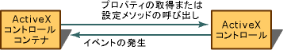
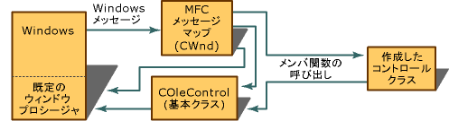

# MFC ActiveX コントロール
ActiveX コントロールは、コンポーネント オブジェクト モデル (COM: Component Object Model) に基づく再利用可能なソフトウェア コンポーネントです。多岐にわたる OLE の機能をサポートしており、さまざまなソフトウェアの要件に合わせてカスタマイズできます。 ActiveX コントロールは、通常の ActiveX コントロール コンテナー内と、インターネット上の WWW (World Wide Web) ページの両方で使用できるように設計されています。 MFC では、ここでは、またはに記載されているのいずれかの ActiveX コントロールを作成できる、[アクティブ テンプレート ライブラリ (ATL)](../atl/active-template-library-atl-concepts.md)です。  
  
 ActiveX コントロールは、独自のウィンドウに自らを描画し、(マウス クリックなどの) イベントに応答し、オートメーション オブジェクトに含まれているのと同様のプロパティおよびメソッドを含むインターフェイスを通じて管理することができます。  
  
 これらのコントロールは、データベース アクセス、データの監視、またはグラフの作成など、多くの用途で開発できます。 移植性以外にも、既存の OLE コンテナーとの互換性、OLE コンテナーのメニューと自らのメニューの統合など、以前の ActiveX コントロールでは使用できなかった機能が、現在の ActiveX コントロールではサポートされています。 また、ActiveX コントロールはオートメーションを完全にサポートしており、その結果、コントロールは読み取り/書き込みのプロパティや一連のメソッドを公開し、コントロール ユーザーがそれらを呼び出すことができます。  
  
 ウィンドウなしの ActiveX コントロールや、アクティブになったときのみウィンドウを作成する ActiveX コントロールを作成することもできます。 ウィンドウなしのコントロールを使用すると、アプリケーションの表示が高速化され、透明なコントロールや長方形以外のコントロールを作り出すこともできます。 また、ActiveX コントロールのプロパティを非同期で読み込むこともできます。  
  
 ActiveX コントロールは、インプロセス サーバー (通常は小さなオブジェクト) として実装され、任意の OLE コンテナー内で使用することができます。 ActiveX コントロールに対応するように設計された OLE コンテナー内で ActiveX コントロールを使用する場合のみ、ActiveX コントロールのすべての機能を利用できることに注意してください。 参照してください[ActiveX コントロールの他のアプリケーション](../mfc/containers-for-activex-controls.md)ActiveX コントロールをサポートするコンテナーの一覧についてはします。 これ以後はこのコンテナーの種類を "コントロール コンテナー" と呼びますが、これらのコンテナーはコントロールのプロパティとメソッドを使用して ActiveX コントロールを操作し、イベントの形式で ActiveX コントロールからの通知を受け取ることができます。 次の図に、この双方向のやり取りを示します。  
  
   
ActiveX コントロール コンテナーとウィンドウを持つ ActiveX コントロールとの対話  
  
 ActiveX コントロールの最適化に関する最新情報については、次を参照してください。 [MFC ActiveX コントロール: 最適化](../mfc/mfc-activex-controls-optimization.md)です。  
  
 MFC ActiveX コントロールを作成するを参照してください。 [ActiveX コントロール プロジェクトを作成する](../mfc/reference/mfc-activex-control-wizard.md)です。  
  
 詳細については次を参照してください:  
  
-   [ActiveX コントロール コンテナー](../mfc/activex-control-containers.md)  
  
-   [アクティブ ドキュメント](../mfc/active-documents.md)  
  
-   [ActiveX コントロールをについてください。](http://msdn.microsoft.com/library/windows/desktop/ms693753)  
  
-   [インターネットで使用する既存の ActiveX コントロールのアップグレード](../mfc/upgrading-an-existing-activex-control.md)  
  
##  ActiveX コントロールの基本コンポーネント  
 ActiveX コントロールは複数のプログラム要素を使用して、コントロール コンテナーやユーザーとの双方向のやり取りを効率的に実行します。 これらは、クラス[COleControl](../mfc/reference/colecontrol-class.md)一連のイベントを発生させる関数、および 1 つのディスパッチ マップです。  
  
 独自に開発するすべての ActiveX コントロール オブジェクトは、MFC 基底クラス `COleControl` から強力な機能セットを継承します。 これらの機能には、埋め込み先でのアクティブ化機能と、オートメーション ロジックが含まれています。 `COleControl` はコントロール オブジェクトに対して、MFC ウィンドウ オブジェクトと同じ機能、およびイベント発生機能を提供できます。 `COleControl`提供[ウィンドウなしのコントロール](../mfc/providing-windowless-activation.md)ウィンドウのヘルプ機能の一部をコンテナーに依存するは、(マウスのキャプチャ、キーボード フォーカス、スクロール)、ですが、はるかに高速の表示を提供します。  
  
 コントロール クラスは `COleControl` から派生するため、特定の条件が満たされている場合は、コントロール コンテナーに対して、イベントとも呼ばれるメッセージを送信、つまり "発生させる" 機能を継承します。 これらのイベントは、コントロール内で重要な動作が発生したときにそのことをコントロール コンテナーに通知するために使用されます。 イベントにパラメーターをアタッチして、イベントに関する追加情報をコントロール コンテナーに送信することもできます。 ActiveX コントロールのイベントに関する詳細については、記事を参照してください。 [MFC ActiveX コントロール: イベント](../mfc/mfc-activex-controls-events.md)です。  
  
 最後の要素はコントロール ユーザーに対して一連の関数 (メソッド) と属性 (プロパティ) を公開するために使用されるディスパッチ マップです。 プロパティを使用すると、コントロール コンテナーまたはコントロール ユーザーがさまざまな方法でコントロールを操作できます。 ユーザーはコントロールの外観の変更、コントロールの特定の値の変更、コントロールが維持する特定のデータへのアクセスなど、コントロールに対する要求を実行することもできます。 このインターフェイスはコントロールの開発者によって決定されますを使用して定義**クラス ビュー**です。 ActiveX コントロールのメソッドとプロパティの詳細については、記事を参照してください。 [MFC ActiveX コントロール: メソッド](../mfc/mfc-activex-controls-methods.md)と[プロパティ](../mfc/mfc-activex-controls-properties.md)です。  
  
##  Windows のコントロールおよび ActiveX コントロール コンテナー間の相互作用  
 コントロール コンテナー内でコントロールを使用すると、コントロールは 2 つのメカニズムを使用して通信を行います。つまり、プロパティとメソッドを公開し、イベントを発生させます。 次の図に、これら 2 つのメカニズムを実装する方法を示します。  
  
   
ActiveX コントロール コンテナーと ActiveX コントロールとの通信  
  
 前の図では、コントロールが他の OLE インターフェイスを (オートメーションとイベント以外の方法で) 処理する方法も示します。  
  
 コントロールとコンテナーとのすべての通信は、`COleControl` によって実行されます。 コンテナーの要求の一部を処理するために**COleControl**メンバー コントロール クラスに実装されている関数を呼び出します。 すべてのメソッドと一部のプロパティは、この方法で処理されます。 開発するコントロールが属するクラスは、`COleControl` のメンバー関数を呼び出して、コンテナーとの通信を開始することもできます。 イベントは次の方法で発生します。  
  
##  ActiveX コントロールのアクティブおよび非アクティブの状態  
 各コントロールには、アクティブおよび非アクティブという 2 つの基本的な状態があります。 従来、これらの状態は、コントロールがウィンドウを持つかどうかという形で判別されていました。 アクティブなコントロールはウィンドウを持ち、非アクティブなコントロールはウィンドウを持たないという分類でした。 ウィンドウなしのアクティブ状態が導入された結果、この区別はもう普遍的ではありませんが、今でも多くのコントロールに適用されます。  
  
 ときに、[ウィンドウなしのコントロール](../mfc/providing-windowless-activation.md)がアクティブになる、マウスのキャプチャ、キーボード フォーカス、スクロール、およびコンテナーから他のウィンドウ サービスを呼び出します。 こともできます[アクティブでないコントロールにマウスの反応を提供](../mfc/providing-mouse-interaction-while-inactive.md)、コントロールを作成および[ウィンドウを作成するためにアクティブ化されるまで待機](../mfc/turning-off-the-activate-when-visible-option.md)です。  
  
 ウィンドウを持つコントロールがアクティブになると、コントロール コンテナー、ユーザー、および Windows との双方向のやり取りができます。 下の図では、ActiveX コントロール、コントロール コンテナー、およびオペレーティング システムの間の通信パスを示します。  
  
   
ウィンドウを持つ ActiveX コントロールがアクティブになったときの Windows メッセージの処理  
  
##  シリアル化  
 永続化とも呼ばれるデータのシリアル化機能により、コントロールは自らのプロパティの値を永続ストレージに書き込むことができます。 その後、ストレージからオブジェクトの状態を読み取ることで、コントロールを再作成できます。  
  
 コントロールは、ストレージ メディアにアクセスする役割を果たさないことに注意してください。 代わりに、適切なときに使用できるように、コントロール コンテナーがストレージ メディアをコントロールに提供する役割を果たします。 シリアル化の詳細については、記事を参照してください。 [MFC ActiveX コントロール: シリアル化する](../mfc/mfc-activex-controls-serializing.md)です。 シリアル化を最適化する方法の詳細については、次を参照してください。[を最適化する永続化と初期化](../mfc/optimizing-persistence-and-initialization.md)、ActiveX コントロール: 最適化します。  
  
##  ActiveX コントロール クラスとツールのインストール  
 Visual C++ をインストールするときに、セットアップで ActiveX コントロールを選択した (既定で選択されます) 場合は、MFC ActiveX コントロール クラス、およびリテール バージョンとデバッグ バージョンの ActiveX コントロール ランタイム DLL が自動的にインストールされます。  
  
 既定では、ActiveX コントロール クラスとツールが \Program Files\Microsoft Visual Studio .NET の下に次のサブディレクトリにインストールされます。  
  
-   **\Common7\Tools**  
  
     テスト コンテナー ファイル (TstCon32.exe、およびそのヘルプ ファイル) を格納します。  
  
-   **\Vc7\atlmfc\include**  
  
     MFC を使用して ActiveX コントロールを開発するために必要なインクルード ファイルを格納します。  
  
-   **\Vc7\atlmfc\src\mfc**  
  
     MFC 内の特定の ActiveX コントロール クラスに対応するソース コードを格納します。  
  
-   **\Vc7\atlmfc\lib**  
  
     MFC を使用して ActiveX コントロールを開発するために必要なライブラリを格納します。  
  
 また、MFC ActiveX コントロール用のサンプルもあります。 これらのサンプルの詳細については、次を参照してください[コントロールのサンプル: MFC-Based ActiveX コントロール。](../visual-cpp-samples.md)  
  
## 参照  
 [ユーザー インターフェイス要素](../mfc/user-interface-elements-mfc.md)
