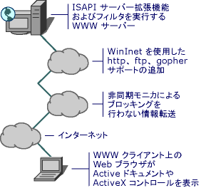

# MFC インターネット プログラミングの基礎
[!INCLUDE[vs2017banner](../assembler/inline/includes/vs2017banner.md)]

Microsoft では、クライアント アプリケーションとサーバー アプリケーションのプログラミング用に多数の API を用意しています。  技術、ブラウザー機能、およびセキュリティ オプションの発展に伴って、今後も新しい種類のアプリケーションが登場することは確実です。  ブラウザーは、WWW \(World Wide Web\) へのアクセスの提供、HTML ページの表示などの動作をクライアント コンピューター上で行います。HTML ページは、テキスト、グラフィックス、ActiveX コントロール、および ActiveX ドキュメントを含みます。  サーバーは、FTP、HTTP、Gopher の各サービスを提供し、CGI を使用してサーバー拡張アプリケーションを実行します。  独自のアプリケーションを作成して、インターネットから情報を取得したり、逆にインターネットにデータを提供することもできます。  
  
   
  
 MFC には、インターネットのプログラミングで使用できるクラスが用意されています。  ActiveX コントロールおよび ActiveX ドキュメントは、[COleControl](../mfc/reference/colecontrol-class.md)、[CDocObjectServer](../mfc/reference/cdocobjectserver-class.md)、および関連する MFC クラスで作成できます。  FTP、HTTP、Gopher などのインターネット プロトコルを使用してファイルおよび情報を取得するには、[CInternetSession](../Topic/CInternetSession%20Class.md)、[CFtpConnection](../mfc/reference/cftpconnection-class.md)、[CAsyncMonikerFile](../mfc/reference/casyncmonikerfile-class.md) などの MFC クラスを使用できます。  
  
## このセクションの内容  
  
-   [インターネット関連の MFC クラス](../mfc/internet-related-mfc-classes.md)  
  
-   [項目別のインターネット情報](../Topic/Internet%20Information%20by%20Topic.md)  
  
-   [操作別のインターネット情報](../mfc/internet-information-by-task.md)  
  
-   [インターネット上の Active テクノロジ](../mfc/active-technology-on-the-internet.md)  
  
-   [WinInet の基礎](../mfc/wininet-basics.md)  
  
-   [HTML の基礎](../mfc/html-basics.md)  
  
-   [HTTP の基礎](../mfc/http-basics.md)  
  
## 関連項目  
  
-   [インターネット上の ActiveX コントロール](../mfc/activex-controls-on-the-internet.md)  
  
-   [インターネット上の Active ドキュメント](../Topic/Active%20Documents%20on%20the%20Internet.md)  
  
-   [インターネット上の非同期モニカー](../mfc/asynchronous-monikers-on-the-internet.md)  
  
-   [Win32 インターネット拡張機能 \(WinInet\)](../mfc/win32-internet-extensions-wininet.md)  
  
-   [MFC インターネット プログラミングの作業](../mfc/mfc-internet-programming-tasks.md)  
  
-   [アプリケーションのデザイン上の検討事項](../mfc/application-design-choices.md)  
  
-   [MFC アプリケーションの作成](../mfc/writing-mfc-applications.md)  
  
-   [インターネット アプリケーションのテスト](../mfc/testing-internet-applications.md)  
  
-   [インターネットのセキュリティ](../Topic/Internet%20Security%20\(C++\).md)  
  
-   [DHTML コントロールに対する ATL のサポート](../atl/atl-support-for-dhtml-controls.md)  
  
##   Web サイト情報  
 Microsoft Internet テクノロジに関する追加情報については、"を [Microsoft Developer Network \(MSDN\)](http://go.microsoft.com/fwlink/?LinkID=56322) 参照してください。\(リンクは、予告なしに変更される場合があります\)。  
  
 この開発者向け Web サイトは、Microsoft の開発ツールおよび技術の使い方と、最近開催されたコンファレンスや今後予定されているコンファレンスに関する最新情報を提供しています。  このページから、.NET や XML Developer Centers を含む多数の関連する開発者サイトにジャンプできます。  また、ベータ版の SDK とサンプル プログラムをダウンロードすることもできます。  
  
 HTML [W3C \(W3C\)](http://go.microsoft.com/fwlink/?LinkID=37125)、HTTP、CGI などの WWW テクノロジの発行を指定します。  
  
##   インターネットに関する追加情報  
 [!INCLUDE[winSDK](../atl/includes/winsdk_md.md)] の OLE の項目には、OLE のプログラミングに関する追加情報があります。  ここでは、MFC クラスを使わずに Win32 WinInet 関数を直接使用する方法が詳しく解説されています。  また、インターネット技術に関する概要も含まれています。  
  
## 参照  
 [MFC Internet Programming \(NIB\)](http://msdn.microsoft.com/ja-jp/0f7a1f3a-385b-4d56-a55b-0d766840c58a)