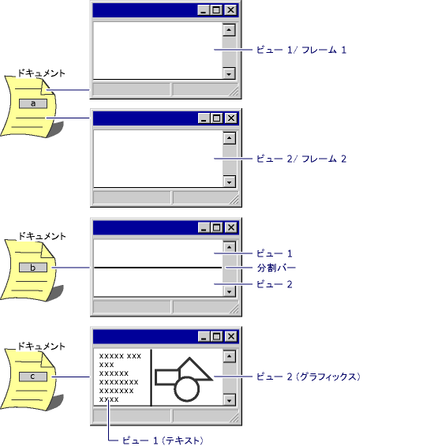

# 複数のドキュメント タイプ、ビュー、フレーム ウィンドウ
[!INCLUDE[vs2017banner](../assembler/inline/includes/vs2017banner.md)]

ドキュメント、そのビュー、およびそのフレーム ウィンドウの間の標準的な関係については、「[ドキュメントおよびビューの作成](../mfc/document-view-creation.md)」を参照してください。 アプリケーションの多くが、ドキュメントごとに 1 つのビューと 1 つのフレーム ウィンドウを備えた、1 つのドキュメント タイプをサポートしますが \(1 つのドキュメント タイプのドキュメントを複数開くことはできます\)、 アプリケーションによっては、こうした 1 つ以上の既定値の変更が必要になる場合があります。  
  
## さらに詳しくは次のトピックをクリックしてください  
  
-   [複数のドキュメント タイプ](#_core_multiple_document_types)  
  
-   [複数のビュー](#_core_multiple_views)  
  
-   [複数のフレーム ウィンドウ](#_core_multiple_frame_windows)  
  
-   [分割ウィンドウ](#_core_splitter_windows)  
  
##   複数のドキュメント タイプ  
 MFC のアプリケーション ウィザードで作成されるドキュメント クラスは 1 つですが、 場合によっては、複数のドキュメント タイプのサポートが必要になることがあります。 たとえば、アプリケーションでワークシート ドキュメントとグラフ ドキュメントが必要になる可能性があります。 各ドキュメント タイプは、独自のドキュメント クラスと、おそらくは独自のビュー クラスで表されます。 ユーザーが \[ファイル\] メニューの \[新規作成\] を選択すると、サポートされているドキュメント タイプの一覧がダイアログ ボックスに表示されます。 その後、ユーザーが選択したタイプのドキュメントが作成されます。 ドキュメント タイプはそれぞれ、自身のドキュメント テンプレート オブジェクトで管理されます。  
  
 追加のドキュメント クラスの作成については、「[クラスの追加](../Topic/Adding%20a%20Class%20\(Visual%20C++\).md)」を参照してください。[CDocument](../Topic/CDocument%20Class.md) を派生元のクラス タイプとして選択し、必要なドキュメント情報を指定します。 次に、新しいクラスのデータを実装します。  
  
 追加したドキュメント クラスをフレームワークに認識させるには、アプリケーション クラスでオーバーライドした [InitInstance](../Topic/CWinApp::InitInstance.md) に、[AddDocTemplate](../Topic/CWinApp::AddDocTemplate.md) への呼び出しをもう 1 つ追加します。 詳細については、[ドキュメント テンプレート](../mfc/document-templates-and-the-document-view-creation-process.md)に関するページを参照してください。  
  
##   複数のビュー  
 多くのドキュメントに必要なビューは 1 つだけですが、1 つのドキュメントに対して複数のビューをサポートすることもできます。 複数のビューを実装できるように、ドキュメント オブジェクトにはそのビューのリストが保持されます。また、ビューを追加および削除するためのメンバー関数のほか、ドキュメントのデータが変更されたときに複数のビューが認識できるようにするための [UpdateAllViews](../Topic/CDocument::UpdateAllViews.md) メンバー関数も用意されています。  
  
 MFC は、1 つのドキュメントに対して複数のビューを必要とする 3 つの一般的なユーザー インターフェイスをサポートしています。 その 3 つのモデルを次に示します。  
  
-   同じクラスの複数のビュー オブジェクトが、それぞれ個別の MDI ドキュメント フレーム ウィンドウに表示されるモデル。  
  
     ドキュメントでは 2 番目のフレーム ウィンドウの作成をサポートできます。 ユーザーが \[新規ウィンドウ\] を選択すると、2 番目のフレーム ウィンドウが開き、同じドキュメントのビューが表示されます。この 2 つのフレームを使うと、同じドキュメントの異なる部分を同時に表示できます。 フレームワークは、ドキュメントにアタッチされている最初のフレーム ウィンドウとビューを複製することで、MDI アプリケーションの \[ウィンドウ\] メニューにある \[新規ウィンドウ\] をサポートします。  
  
-   同じクラスの複数のビュー オブジェクトが、同じドキュメント フレーム ウィンドウに表示されるモデル。  
  
     分割ウィンドウは 1 つのドキュメント ウィンドウのビュー空間を分割して、そのドキュメントの個別のビューを複数作成します。 フレームワークによって、同じビュー クラスから複数のビュー オブジェクトが作成されます。 詳細については、「[分割ウィンドウ](#_core_splitter_windows)」を参照してください。  
  
-   異なるクラスの複数のビュー オブジェクトが、1 つのフレーム ウィンドウに表示されるモデル。  
  
     このモデルでは、分割ウィンドウのバリエーションである、複数のビューが 1 つのフレーム ウィンドウを共有します。 このビューはさまざまなクラスから構築され、それぞれのビューで、同じドキュメントを異なる方法を使って表示できます。 たとえば、あるビューでは通常モードでワード プロセッサの文書が表示され、別のビューではその文書がアウトライン モードで表示されます。 分割コントロールを使用すると、ユーザーはビューの相対的なサイズを調整できます。  
  
 次の図は、a、b、c の 3 つに分けて、前述の 3 つのユーザー インターフェイス モデルを順に示しています。  
  
   
マルチ ビューによるユーザー インターフェイス  
  
 「[分割ウィンドウ](#_core_splitter_windows)」で説明されているように、フレームワークでは、\[新規ウィンドウ\] コマンドの実装と [CSplitterWnd](../mfc/reference/csplitterwnd-class.md) クラスの提供により、これらのモデルを用意します。 その他のモデルを実装するには、これを開始点として使用できます。 ビュー、フレーム ウィンドウ、分割ウィンドウのさまざまな構成を示すサンプル プログラムについては、「[MFC サンプル](../top/visual-cpp-samples.md)」を参照してください。  
  
 `UpdateAllViews` の詳細については、*MFC リファレンス*の [CView](../Topic/CView%20Class.md) に関するトピックと、[SCRIBBLE サンプル](../top/visual-cpp-samples.md)を参照してください。  
  
##   複数のフレーム ウィンドウ  
 MDI アプリケーション用の \[ウィンドウ\] メニューの \[新規ウィンドウ\] を使うと、同じのドキュメントに 2 番目のフレーム ウィンドウを作成できます。 詳細については、「[マルチ ビューによるユーザー インターフェイス](#_core_multiple.2d.view_user_interfaces)」の図の最初のモデルを参照してください。  
  
##   分割ウィンドウ  
 分割ウィンドウでは、ウィンドウを 2 つ以上のスクロール可能なペインに分割できます。 ウィンドウ フレームのスクロール バーの横にある分割コントロール \("分割ボックス"\) を使用すると、ペインの相対的なサイズを調整できます。 各ペインは、同じドキュメントのビューです。 "動的な" 分割ウィンドウでは、「[マルチ ビューによるユーザー インターフェイス](#_core_multiple.2d.view_user_interfaces)」の図の b 部分のように、どのビューも同じクラスに属します。 "静的な" 分割ウィンドウでは、各ビューのクラスが異なっていてもかまいません。 どちらの分割ウィンドウも、[CSplitterWnd](../mfc/reference/csplitterwnd-class.md) クラスでサポートされています。  
  
 動的な分割ウィンドウは、同じクラスの複数のビューで構成され、ウィンドウを複数のペインに分割できるため、各ペインをスクロールすることで、同じドキュメントの別の部分を表示できます。 また、ウィンドウの分割を解除して、追加したビューを削除することもできます。[SCRIBBLE サンプル](../top/visual-cpp-samples.md)で追加した分割ウィンドウは 1 つの例です。 このトピックでは、動的分割ウィンドウを作成する方法について説明しています。 動的分割ウィンドウについては、「[マルチ ビューによるユーザー インターフェイス](#_core_multiple.2d.view_user_interfaces)」の図の b 部分を参照してください。  
  
 異なるクラスのビューを含む静的分割ウィンドウを作成するには、まず、ウィンドウを目的別のペインに分割します。 たとえば、Visual C\+\+ ビットマップ エディターでは、イメージ ウィンドウに 2 つのペインが横に並んで表示されます。 左ペインには、等倍のビットマップ イメージが表示されます。 右ペインには、同じビットマップの拡大イメージまたは縮小イメージが表示されます。 各ペインは "分割バー" で分けられており、このバーをドラッグすることで、ペインの相対的サイズを変更できます。 静的分割ウィンドウについては、「[マルチ ビューによるユーザー インターフェイス](#_core_multiple.2d.view_user_interfaces)」の図の c 部分を参照してください。  
  
 詳細については、*MFC リファレンス*の [CSplitterWnd](../mfc/reference/csplitterwnd-class.md) に関するトピックと、[MFC サンプル](../top/visual-cpp-samples.md)を参照してください。  
  
## 参照  
 [ドキュメント\/ビュー アーキテクチャ](../Topic/Document-View%20Architecture.md)