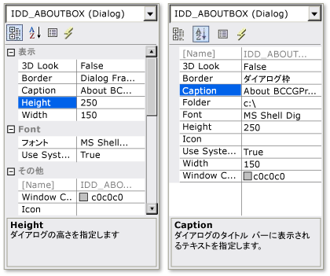

# <a name="cmfcpropertygridctrl-class"></a>CMFCPropertyGridCtrl クラス
[!INCLUDE[cpp_fp_under_construction](../../mfc/reference/includes/cpp_fp_under_construction_md.md)]  
  
 プロパティをアルファベット順または階層順に表示できる、編集可能なプロパティ グリッド コントロールをサポートします。  
  
## <a name="syntax"></a>構文  
  
```  
class CMFCPropertyGridCtrl : public CWnd  
```  
  
## <a name="members"></a>メンバー  
  
### <a name="public-constructors"></a>パブリック コンストラクター  
  
|名前|説明|  
|----------|-----------------|  
|[CMFCPropertyGridCtrl::CMFCPropertyGridCtrl](#cmfcpropertygridctrl)|`CMFCPropertyGridCtrl` オブジェクトを構築します。|  
|`CMFCPropertyGridCtrl::~CMFCPropertyGridCtrl`|デストラクターです。|  
  
### <a name="public-methods"></a>パブリック メソッド  
  
|名前|説明|  
|----------|-----------------|  
|`CMFCPropertyGridCtrl::accHitTest`|画面上の指定された位置にある子要素または子オブジェクトを取得するために、フレームワークによって呼び出されます。 (上書き[CWnd::accHitTest](../../mfc/reference/cwnd-class.md#acchittest))。|  
|`CMFCPropertyGridCtrl::accLocation`|指定されたオブジェクトの現在の画面位置を取得するために、フレームワークによって呼び出されます。 (上書き[CWnd::accLocation](../../mfc/reference/cwnd-class.md#acclocation))。|  
|[CMFCPropertyGridCtrl::accSelect](#accselect)|選択を変更するため、または指定されたオブジェクトのキーボード フォーカスを移動するために、フレームワークによって呼び出されます。 (上書き[CWnd::accSelect](../../mfc/reference/cwnd-class.md#accselect))。|  
|[CMFCPropertyGridCtrl::AddProperty](#addproperty)|プロパティ グリッド コントロールに新しいプロパティを追加します。|  
|[CMFCPropertyGridCtrl::AlwaysShowUserToolTip](#alwaysshowusertooltip)||  
|[CMFCPropertyGridCtrl::CloseColorPopup](#closecolorpopup)|色の選択 ダイアログ ボックスを閉じます。|  
|[CMFCPropertyGridCtrl::Create](#create)|プロパティ グリッド コントロールを作成し、プロパティ グリッド コントロール オブジェクトにアタッチします。|  
|[CMFCPropertyGridCtrl::DeleteProperty](#deleteproperty)|プロパティ グリッド コントロールから、指定したプロパティを削除します。|  
|[CMFCPropertyGridCtrl::DrawControlBarColors](#drawcontrolbarcolors)||  
|[CMFCPropertyGridCtrl::EnableDescriptionArea](#enabledescriptionarea)|有効またはプロパティの一覧の下に表示される説明領域を無効にします。|  
|[CMFCPropertyGridCtrl::EnableHeaderCtrl](#enableheaderctrl)|有効またはプロパティ グリッド コントロールの上部にあるヘッダー コントロールを無効にします。|  
|[CMFCPropertyGridCtrl::EnsureVisible](#ensurevisible)|プロパティ グリッド コントロールをスクロールし、指定したプロパティが表示されるまでは、プロパティ項目を展開します。|  
|[CMFCPropertyGridCtrl::ExpandAll](#expandall)|展開またはプロパティ グリッド コントロールのすべてのノードを折りたたみます。|  
|[CMFCPropertyGridCtrl::FindItemByData](#finditembydata)|ユーザー定義に関連付けられているプロパティを取得`DWORD`値。|  
|`CMFCPropertyGridCtrl::get_accChild`|指定された子の `IDispatch` インターフェイスのアドレスを取得するために、フレームワークによって呼び出されます。 (上書き[CWnd::get_accChild](../../mfc/reference/cwnd-class.md#get_accchild))。|  
|[CMFCPropertyGridCtrl::get_accChildCount](#get_accchildcount)|このオブジェクトに属する子の数を取得するために、フレームワークによって呼び出されます。 (上書き[CWnd::get_accChildCount](../../mfc/reference/cwnd-class.md#get_accchildcount))。|  
|`CMFCPropertyGridCtrl::get_accDefaultAction`|オブジェクトの既定のアクションを記述する文字列を取得するために、フレームワークによって呼び出されます。 (上書き[CWnd::get_accDefaultAction](../../mfc/reference/cwnd-class.md#get_accdefaultaction))。|  
|`CMFCPropertyGridCtrl::get_accDescription`|指定されたオブジェクトの外観を記述する文字列を取得するために、フレームワークによって呼び出されます。 (上書き[CWnd::get_accDescription](../../mfc/reference/cwnd-class.md#get_accdescription))。|  
|[CMFCPropertyGridCtrl::get_accFocus](#get_accfocus)|キーボード フォーカスを保持するオブジェクトを取得するために、フレームワークによって呼び出されます。 (上書き[CWnd::get_accFocus](../../mfc/reference/cwnd-class.md#get_accfocus))。|  
|[CMFCPropertyGridCtrl::get_accHelp](#get_acchelp)|オブジェクトのために、フレームワークによって呼び出される`Help`プロパティの文字列です。 (上書き[CWnd::get_accHelp](../../mfc/reference/cwnd-class.md#get_acchelp))。|  
|[CMFCPropertyGridCtrl::get_accHelpTopic](#get_acchelptopic)|完全なパスを取得するためにフレームワークによって呼び出される、`WinHelp`指定したオブジェクトとそのファイル内の該当するトピックの識別子に関連付けられているファイル。 (上書き[CWnd::get_accHelpTopic](../../mfc/reference/cwnd-class.md#get_acchelptopic))。|  
|[CMFCPropertyGridCtrl::get_accKeyboardShortcut](#get_acckeyboardshortcut)|指定されたオブジェクトのショートカット キーまたはアクセス キーを取得するために、フレームワークによって呼び出されます。 (上書き[CWnd::get_accKeyboardShortcut](../../mfc/reference/cwnd-class.md#get_acckeyboardshortcut))。|  
|`CMFCPropertyGridCtrl::get_accName`|指定されたオブジェクトの名前を取得するために、フレームワークによって呼び出されます。 (上書き[CWnd::get_accName](../../mfc/reference/cwnd-class.md#get_accname))。|  
|`CMFCPropertyGridCtrl::get_accRole`|指定されたオブジェクトの役割を記述する情報を取得するために、フレームワークによって呼び出されます。 (上書き[CWnd::get_accRole](../../mfc/reference/cwnd-class.md#get_accrole))。|  
|[CMFCPropertyGridCtrl::get_accSelection](#get_accselection)|このオブジェクトの選択されている子を取得するために、フレームワークによって呼び出されます。 (上書き[CWnd::get_accSelection](../../mfc/reference/cwnd-class.md#get_accselection))。|  
|`CMFCPropertyGridCtrl::get_accState`|指定されたオブジェクトの現在の状態を取得するために、フレームワークによって呼び出されます。 (上書き[CWnd::get_accState](../../mfc/reference/cwnd-class.md#get_accstate))。|  
|`CMFCPropertyGridCtrl::get_accValue`|指定されたオブジェクトの値を取得するために、フレームワークによって呼び出されます。 (上書き[CWnd::get_accValue](../../mfc/reference/cwnd-class.md#get_accvalue))。|  
|[CMFCPropertyGridCtrl::GetBkColor](#getbkcolor)|現在のプロパティ グリッド コントロールの背景色を取得します。|  
|[CMFCPropertyGridCtrl::GetBoldFont](#getboldfont)|現在のプロパティ グリッド内のテキストの太字のスタイルを制御する Windows のフォントを取得します。|  
|[CMFCPropertyGridCtrl::GetCurSel](#getcursel)|現在選択されているプロパティを取得します。|  
|[CMFCPropertyGridCtrl::GetCustomColors](#getcustomcolors)|プロパティ グリッド コントロール要素に対して現在定義されているカスタムの色を取得します。|  
|[CMFCPropertyGridCtrl::GetDescriptionHeight](#getdescriptionheight)|プロパティ グリッド コントロールの下部にある説明領域の高さを取得します。|  
|[CMFCPropertyGridCtrl::GetDescriptionRows](#getdescriptionrows)|現在のプロパティ グリッド コントロールの説明領域の行の数を取得します。|  
|[CMFCPropertyGridCtrl::GetHeaderCtrl](#getheaderctrl)|内部取得[CMFCHeaderCtrl](../../mfc/reference/cmfcheaderctrl-class.md)フレームワークを使用して、現在のプロパティ グリッド コントロールを表示するオブジェクトします。|  
|[CMFCPropertyGridCtrl::GetHeaderHeight](#getheaderheight)|プロパティ グリッド コントロールのヘッダーの高さを取得します。|  
|[CMFCPropertyGridCtrl::GetLeftColumnWidth](#getleftcolumnwidth)|各プロパティの名前を含む現在プロパティ グリッド コントロールの左の列の幅を取得します。|  
|[CMFCPropertyGridCtrl::GetListRect](#getlistrect)|プロパティ グリッド コントロールの外接する四角形を取得します。|  
|[CMFCPropertyGridCtrl::GetProperty](#getproperty)|プロパティ グリッド コントロール項目の指定したインデックスに対応するプロパティ オブジェクトへのポインターを取得します。|  
|[CMFCPropertyGridCtrl::GetPropertyColumnWidth](#getpropertycolumnwidth)|プロパティ値を含む列の現在の幅を取得します。|  
|[CMFCPropertyGridCtrl::GetPropertyCount](#getpropertycount)|プロパティ グリッド コントロールのプロパティの数を取得します。|  
|[CMFCPropertyGridCtrl::GetRowHeight](#getrowheight)|プロパティ グリッド コントロールの行の高さを取得します。|  
|[CMFCPropertyGridCtrl::GetScrollBarCtrl](#getscrollbarctrl)|プロパティ グリッド コントロールのスクロール バー コントロールへのポインターを取得します。 (上書き[CWnd::GetScrollBarCtrl](../../mfc/reference/cwnd-class.md#getscrollbarctrl))。|  
|[CMFCPropertyGridCtrl::GetTextColor](#gettextcolor)|現在のプロパティ グリッド コントロールのプロパティ項目のテキストの色を取得します。|  
|`CMFCPropertyGridCtrl::GetThisClass`|ポインターを取得するために、フレームワークで使用される、 [CRuntimeClass](../../mfc/reference/cruntimeclass-structure.md)このクラス型に関連付けられているオブジェクト。|  
|[CMFCPropertyGridCtrl::HitTest](#hittest)|指定した点が、項目の場合は、プロパティ グリッド コントロールの項目に対応するプロパティ オブジェクトへのポインターを取得します。 このメソッドは、ポイントを含むプロパティ グリッド コントロールの領域も示されます。|  
|[CMFCPropertyGridCtrl::InitHeader](#initheader)|内部初期化[CMFCHeaderCtrl](../../mfc/reference/cmfcheaderctrl-class.md)フレームワークを使用して、現在のプロパティ グリッド コントロールを表示するオブジェクトします。|  
|[CMFCPropertyGridCtrl::IsAlphabeticMode](#isalphabeticmode)|プロパティ グリッド コントロールがアルファベット モードかどうかを示します。|  
|[CMFCPropertyGridCtrl::IsAlwaysShowUserToolTip](#isalwaysshowusertooltip)||  
|[CMFCPropertyGridCtrl::IsDescriptionArea](#isdescriptionarea)|プロパティ グリッド コントロールの説明領域を表示するかどうかを示します。|  
|[CMFCPropertyGridCtrl::IsGroupNameFullWidth](#isgroupnamefullwidth)|各プロパティ グループの名前が現在のプロパティ グリッド コントロールの幅にまたがって表示するかどうかを示します。|  
|[CMFCPropertyGridCtrl::IsHeaderCtrl](#isheaderctrl)|ヘッダー コントロールを表示するかどうかを示します。|  
|[CMFCPropertyGridCtrl::IsMarkModifiedProperties](#ismarkmodifiedproperties)|プロパティ グリッド コントロールが変更されたプロパティを表示する方法を示します。|  
|[CMFCPropertyGridCtrl::IsShowDragContext](#isshowdragcontext)|フレームワークでは、ユーザーの列のサイズを変更するときに、現在のプロパティ グリッド コントロールの名前と値の列が再描画するかどうかを示します。|  
|[CMFCPropertyGridCtrl::IsVSDotNetLook](#isvsdotnetlook)|プロパティ グリッド コントロールの外観が VS .NET で使用されているスタイルかどうかを示します。|  
|[CMFCPropertyGridCtrl::MarkModifiedProperties](#markmodifiedproperties)|変更されたプロパティを表示する方法を指定します。|  
|`CMFCPropertyGridCtrl::PreTranslateMessage`|クラスで使用される[CWinApp](../../mfc/reference/cwinapp-class.md)にディスパッチされる前に、ウィンドウ メッセージを変換する、 [TranslateMessage](http://msdn.microsoft.com/library/windows/desktop/ms644955)と[DispatchMessage](http://msdn.microsoft.com/library/windows/desktop/ms644934) Windows 関数です。 (上書き[CWnd::PreTranslateMessage](../../mfc/reference/cwnd-class.md#pretranslatemessage))。|  
|[CMFCPropertyGridCtrl::RemoveAll](#removeall)|プロパティ グリッド コントロールからすべてのプロパティ オブジェクトを削除します。|  
|[CMFCPropertyGridCtrl::ResetOriginalValues](#resetoriginalvalues)|すべてのプロパティの元の値を復元します。|  
|[CMFCPropertyGridCtrl::SetAlphabeticMode](#setalphabeticmode)|設定またはアルファベット モードをリセットします。|  
|[CMFCPropertyGridCtrl::SetBoolLabels](#setboollabels)|ブール値のラベルのテキストを指定します。|  
|[CMFCPropertyGridCtrl::SetCurSel](#setcursel)|プロパティ グリッド コントロールのプロパティを選択します。|  
|[CMFCPropertyGridCtrl::SetCustomColors](#setcustomcolors)|さまざまなプロパティ グリッド コントロールの要素に対して独自の色を指定します。|  
|[CMFCPropertyGridCtrl::SetDescriptionRows](#setdescriptionrows)|現在のプロパティ グリッド コントロールの [説明] セクションに表示する行の数を指定します。|  
|[CMFCPropertyGridCtrl::SetGroupNameFullWidth](#setgroupnamefullwidth)|現在のプロパティ グリッド コントロールのプロパティのグループのカテゴリ名の幅全体を表示するかどうかを指定します。|  
|[CMFCPropertyGridCtrl::SetListDelimiter](#setlistdelimiter)|プロパティ値一覧の区切り記号として使用される文字を定義します。|  
|[CMFCPropertyGridCtrl::SetShowDragContext](#setshowdragcontext)|フレームワークでは、ユーザーの列のサイズを変更するときに、現在のプロパティ グリッド コントロールの名前と値の列が再描画するかどうかを指定します。|  
|[CMFCPropertyGridCtrl::SetVSDotNetLook](#setvsdotnetlook)|VS .NET で使用されているスタイルには、プロパティ グリッド コントロールの外観を設定します。|  
|[CMFCPropertyGridCtrl::UpdateColor](#updatecolor)|現在選択されている色のプロパティの色の値を設定します。|  
  
### <a name="protected-methods"></a>プロテクト メソッド  
  
|名前|説明|  
|----------|-----------------|  
|[CMFCPropertyGridCtrl::AdjustLayout](#adjustlayout)|プロパティ グリッド コントロールとそのプロパティを再描画します。|  
|[CMFCPropertyGridCtrl::CompareProps](#compareprops)|並べ替えのプロパティにプロパティ グリッド コントロールによって呼び出されます。|  
|[CMFCPropertyGridCtrl::EditItem](#edititem)|ユーザーが、プロパティの変更を開始すると、フレームワークによって呼び出されます。|  
|[CMFCPropertyGridCtrl::EndEditItem](#endedititem)|プロパティを変更するユーザーが停止したときに、フレームワークによって呼び出されます。|  
|[CMFCPropertyGridCtrl::Init](#init)|プロパティ グリッド コントロールを初期化するためにフレームワークによって呼び出されます。|  
|[CMFCPropertyGridCtrl::OnChangeSelection](#onchangeselection)|現在の選択項目が変更されたときに、フレームワークによって呼び出されます。|  
|[CMFCPropertyGridCtrl::OnClickButton](#onclickbutton)|プロパティ ボタンがクリックされたときに、フレームワークによって呼び出されます。|  
|[CMFCPropertyGridCtrl::OnDrawBorder](#ondrawborder)|プロパティ グリッド コントロールの周囲に罫線を引くために、フレームワークによって呼び出されます。|  
|[CMFCPropertyGridCtrl::OnDrawDescription](#ondrawdescription)|説明の領域を描画し、説明テキストを表示するためにフレームワークによって呼び出されます。|  
|[CMFCPropertyGridCtrl::OnDrawList](#ondrawlist)|プロパティ グリッド コントロールのプロパティの一覧を表示するためにフレームワークによって呼び出されます。|  
|[CMFCPropertyGridCtrl::OnDrawProperty](#ondrawproperty)|プロパティを表示するためにフレームワークによって呼び出されます。|  
|[CMFCPropertyGridCtrl::OnPropertyChanged](#onpropertychanged)|プロパティの値が変更されたときに、フレームワークによって呼び出されます。|  
|[CMFCPropertyGridCtrl::OnSelectCombo](#onselectcombo)|コンボ ボックス コントロールを含むプロパティが選択されているときに、フレームワークによって呼び出されます。|  
|[CMFCPropertyGridCtrl::ValidateItemData](#validateitemdata)|プロパティのデータを検証するために、フレームワークによって呼び出されます。|  
  
## <a name="remarks"></a>コメント  
 `CMFCPropertyGridCtrl`クラスから派生した編集可能なプロパティを含むプロパティ グリッド コントロールの表示、 [CMFCPropertyGridProperty](../../mfc/reference/cmfcpropertygridproperty-class.md)クラスです。 各プロパティは、型を表すことができ、サブ項目を含めることができます。 プロパティ グリッド コントロールには、選択したプロパティの説明を表示できる下部にあるサイズ変更可能な領域がサポートしています。  
  
 プロパティ グリッド コントロールを使用するのには、構築、`CMFCPropertyGridCtrl`オブジェクトを呼び出して、 [CMFCPropertyGridCtrl::Create](#create)メソッドです。 使用して、 [CMFCPropertyGridCtrl::AddProperty](#addproperty)プロパティを一覧に追加するメソッドです。  
  
## <a name="selection-properties"></a>選択プロパティ  
 プロパティ項目は、値を表すのではなく、ユーザーが色、ファイル、またはフォントを選択できるダイアログ ボックスを開始できます。  
  
 次の表に、4 つの選択範囲のプロパティの型を示します。  
  
|クラス|説明|  
|-----------|-----------------|  
|[CMFCPropertyGridProperty クラス](../../mfc/reference/cmfcpropertygridproperty-class.md)|文字列、ブール値、日付の値を指定するために使用する汎用プロパティです。|  
|[CMFCPropertyGridColorProperty クラス](../../mfc/reference/cmfcpropertygridcolorproperty-class.md)|色の値の選択に使用するプロパティです。|  
|[CMFCPropertyGridFileProperty クラス](../../mfc/reference/cmfcpropertygridfileproperty-class.md)|ファイルを選択するために使用するプロパティです。|  
|[CMFCPropertyGridFontProperty クラス](../../mfc/reference/cmfcpropertygridfontproperty-class.md)|フォントを選択するために使用するプロパティです。|  
  
## <a name="illustrations"></a>図  
 次の図は、2 つの方法でプロパティを表示するプロパティ グリッド コントロールを表します。 最初の図は階層的にプロパティを表示し、もう&1; つがアルファベット順にプロパティを表示します。  
  
   
  
## <a name="example"></a>例  
 次の例では、多様なメソッドを使用して、プロパティ グリッド コントロール オブジェクトを構成する方法、`CMFCPropertyGridCtrl`クラスです。 この例では、ヘッダー コントロールを有効にする、説明領域を有効にし、プロパティ グリッド コントロールの外観を設定する方法を示します。 また、それによって、コントロールの並べ替えコントロールのアルファベット モードにはプロパティ名が含まれているすべてのプロパティを設定する方法と、プロパティ グリッド コントロールのさまざまな要素は、カスタム カラーを設定する方法についても示します。 この例は、[新しいコントロールのサンプル](../../visual-cpp-samples.md)します。  
  
 [!code-cpp[NVC_MFC_NewControls&#14;](../../mfc/reference/codesnippet/cpp/cmfcpropertygridctrl-class_1.h)]  
[!code-cpp[NVC_MFC_NewControls&#16;](../../mfc/reference/codesnippet/cpp/cmfcpropertygridctrl-class_2.cpp)]  
[!code-cpp[NVC_MFC_NewControls&#20;](../../mfc/reference/codesnippet/cpp/cmfcpropertygridctrl-class_3.cpp)]  
[!code-cpp[NVC_MFC_NewControls #&21;](../../mfc/reference/codesnippet/cpp/cmfcpropertygridctrl-class_4.cpp)]  
[!code-cpp[NVC_MFC_NewControls #&24;](../../mfc/reference/codesnippet/cpp/cmfcpropertygridctrl-class_5.cpp)]  
  
## <a name="inheritance-hierarchy"></a>継承階層  
 [CObject](../../mfc/reference/cobject-class.md)  
  
 [CCmdTarget](../../mfc/reference/ccmdtarget-class.md)  
  
 [CWnd](../../mfc/reference/cwnd-class.md)  
  
 [CMFCPropertyGridCtrl](../../mfc/reference/cmfcpropertygridctrl-class.md)  
  
## <a name="requirements"></a>要件  
 **ヘッダー:** afxpropertygridctrl.h  
  
##  <a name="a-nameaccselecta--cmfcpropertygridctrlaccselect"></a><a name="accselect"></a>CMFCPropertyGridCtrl::accSelect  
 [!INCLUDE[cpp_fp_under_construction](../../mfc/reference/includes/cpp_fp_under_construction_md.md)]  
  
```  
virtual HRESULT accSelect(
    long flagsSelect,  
    VARIANT varChild);
```  
  
### <a name="parameters"></a>パラメーター  
 [入力] `flagsSelect`  
 [入力] `varChild`  
  
### <a name="return-value"></a>戻り値  
  
### <a name="remarks"></a>コメント  
  
##  <a name="a-nameaddpropertya--cmfcpropertygridctrladdproperty"></a><a name="addproperty"></a>CMFCPropertyGridCtrl::AddProperty  
 プロパティ グリッド コントロールに新しいプロパティを追加します。  
  
```  
int AddProperty(
    CMFCPropertyGridProperty* pProp,  
    BOOL bRedraw=TRUE,  
    BOOL bAdjustLayout=TRUE);
```  
  
### <a name="parameters"></a>パラメーター  
 [入力] `pProp`  
 プロパティへのポインター。  
  
 [入力] `bRedraw`  
 `TRUE`プロパティをすぐに再描画するにはそれ以外の場合、`FALSE`です。 既定値は `TRUE` です。  
  
 [入力] `bAdjustLayout`  
 `TRUE`テキストと、プロパティの値を描画し、プロパティを描画する方法を再計算するには`FALSE`既存の計算を使用して、プロパティを描画します。 既定値は `TRUE` です。  
  
### <a name="return-value"></a>戻り値  
 このメソッドが成功すると、ここで、プロパティを追加します。 プロパティ グリッド コントロールの位置の&0; から始まるインデックスそれ以外の場合、-1 を返します。  
  
### <a name="remarks"></a>コメント  
 このメソッドは、プロパティ グリッド コントロールのプロパティの一覧の末尾に指定されたプロパティへのポインターを追加します。 プロパティを破棄したり、グリッド コントロールが破棄される前にスコープ外に出るようにしないでください。 プロパティ グリッド コントロールで完了したときに呼び出す[CMFCPropertyGridCtrl::RemoveAll](#removeall)を追加したすべてのプロパティを削除します。 AddProperty メソッドは、指定したプロパティは、リストに既に追加されている場合に失敗します。  
  
##  <a name="a-nameadjustlayouta--cmfcpropertygridctrladjustlayout"></a><a name="adjustlayout"></a>CMFCPropertyGridCtrl::AdjustLayout  
 プロパティ グリッド コントロールとそのプロパティを再描画します。  
  
```  
virtual void AdjustLayout();
```  
  
### <a name="remarks"></a>コメント  
 このメソッドは、全体のプロパティ グリッド コントロール、イメージ、フォント、およびコントロールなどのプロパティを描画する方法を再計算します。  
  
##  <a name="a-namealwaysshowusertooltipa--cmfcpropertygridctrlalwaysshowusertooltip"></a><a name="alwaysshowusertooltip"></a>CMFCPropertyGridCtrl::AlwaysShowUserToolTip  
 [!INCLUDE[cpp_fp_under_construction](../../mfc/reference/includes/cpp_fp_under_construction_md.md)]  
  
```  
void AlwaysShowUserToolTip(BOOL bShow = TRUE);
```  
  
### <a name="parameters"></a>パラメーター  
 [入力] `bShow`  
  
### <a name="remarks"></a>コメント  
  
##  <a name="a-nameclosecolorpopupa--cmfcpropertygridctrlclosecolorpopup"></a><a name="closecolorpopup"></a>CMFCPropertyGridCtrl::CloseColorPopup  
 色の選択 ダイアログ ボックスを閉じます。  
  
```  
virtual void CloseColorPopup();
```  
  
### <a name="remarks"></a>コメント  
 色の選択 ダイアログ ボックスの詳細については、次を参照してください。 [CMFCPropertyGridColorProperty クラス](../../mfc/reference/cmfcpropertygridcolorproperty-class.md)します。  
  
##  <a name="a-namecmfcpropertygridctrla--cmfcpropertygridctrlcmfcpropertygridctrl"></a><a name="cmfcpropertygridctrl"></a>CMFCPropertyGridCtrl::CMFCPropertyGridCtrl  
 `CMFCPropertyGridCtrl` オブジェクトを構築します。  
  
```  
CMFCPropertyGridCtrl();
```  
  
### <a name="return-value"></a>戻り値  
  
### <a name="remarks"></a>コメント  
  
##  <a name="a-namecomparepropsa--cmfcpropertygridctrlcompareprops"></a><a name="compareprops"></a>CMFCPropertyGridCtrl::CompareProps  
 並べ替えのプロパティにプロパティ グリッド コントロールによって呼び出されます。  
  
```  
virtual int CompareProps(
    const CMFCPropertyGridProperty* pProp1,  
    const CMFCPropertyGridProperty* pProp2) const;  
```  
  
### <a name="parameters"></a>パラメーター  
 `pProp1`  
 プロパティへのポインター。  
  
 `pProp2`  
 プロパティへのポインター。  
  
### <a name="return-value"></a>戻り値  
  
|戻り値|説明|  
|------------------|-----------------|  
|< 0|名前、`pProp1`パラメーターが名より小さい、`pProp2`パラメーター。|  
|0|名前、`pProp1`パラメーターがの名前に等しい、`pProp2`パラメーター。|  
|> 0|名前、`pProp1`の名前は、`pProp2`パラメーター。|  
  
### <a name="remarks"></a>コメント  
 既定では、このメソッドを使用して、 [CString::Compare](../../atl-mfc-shared/reference/cstringt-class.md#compare)を比較するメソッド、`CMFCPropertyGridProperty::m_strName`指定したパラメーターのメンバーです。  
  
##  <a name="a-namecreatea--cmfcpropertygridctrlcreate"></a><a name="create"></a>CMFCPropertyGridCtrl::Create  
 プロパティ グリッド コントロールを作成し、プロパティ グリッド コントロール オブジェクトにアタッチします。  
  
```  
virtual BOOL Create(
    DWORD dwStyle,  
    const RECT& rect,  
    CWnd* pParentWnd,  
    UINT nID);
```  
  
### <a name="parameters"></a>パラメーター  
 [入力] `dwStyle`  
 ビットごとの組み合わせ (OR)[ウィンドウ スタイル](../../mfc/reference/window-styles.md)します。  
  
 [入力] `rect`  
 クライアントで、サイズと、ウィンドウの位置を示す外接する四角形の座標を`pParentWnd`します。  
  
 [入力] `pParentWnd`  
 親ウィンドウへのポインター。 `NULL` にすることはできません。  
  
 [入力] `nID`  
 子ウィンドウの ID です。  
  
### <a name="return-value"></a>戻り値  
 `TRUE`ウィンドウを正常に作成した場合それ以外の場合、`FALSE`です。  
  
### <a name="remarks"></a>コメント  
 プロパティ グリッド コントロールの最初の呼び出しを作成する[CMFCPropertyGridCtrl::CMFCPropertyGridCtrl](#cmfcpropertygridctrl)プロパティ グリッド オブジェクトを構築します。 まず`CMFCPropertyGridCtrl::Create`します。  
  
### <a name="example"></a>例  
 次の例では、使用して、`Create`メソッド`CMFCPropertyGridCtrl`クラスです。 この例は、[新しいコントロールのサンプル](../../visual-cpp-samples.md)します。  
  
 [!code-cpp[NVC_MFC_NewControls&#15;](../../mfc/reference/codesnippet/cpp/cmfcpropertygridctrl-class_6.cpp)]  
  
##  <a name="a-namedeletepropertya--cmfcpropertygridctrldeleteproperty"></a><a name="deleteproperty"></a>CMFCPropertyGridCtrl::DeleteProperty  
 プロパティ グリッド コントロールから、指定したプロパティを削除します。  
  
```  
BOOL DeleteProperty(
    CMFCPropertyGridProperty*& pProp,  
    BOOL bRedraw=TRUE,  
    BOOL bAdjustLayout=TRUE);
```  
  
### <a name="parameters"></a>パラメーター  
 [入力] `pProp`  
 プロパティへのポインター。  
  
 [入力] `bRedraw`  
 `TRUE`プロパティ グリッド コントロールを再描画するにはそれ以外の場合、`FALSE`です。 既定値は `TRUE` です。  
  
 [入力] `bAdjustLayout`  
 `TRUE`プロパティのグリッド コントロールのすべてのテキスト、イメージ、および項目を描画し、コントロールを描画する方法を再計算するにはそれ以外の場合、`FALSE`です。 既定値は `TRUE` です。  
  
### <a name="return-value"></a>戻り値  
 `TRUE`このメソッドが成功した場合それ以外の場合、`FALSE`です。  
  
### <a name="remarks"></a>コメント  
 このメソッドを使用して、プロパティ グリッド コントロールからプロパティ、およびすべてのサブ項目を削除します。  
  
##  <a name="a-namedrawcontrolbarcolorsa--cmfcpropertygridctrldrawcontrolbarcolors"></a><a name="drawcontrolbarcolors"></a>CMFCPropertyGridCtrl::DrawControlBarColors  
 [!INCLUDE[cpp_fp_under_construction](../../mfc/reference/includes/cpp_fp_under_construction_md.md)]  
  
```  
BOOL DrawControlBarColors() const;  
```  
  
### <a name="return-value"></a>戻り値  
  
### <a name="remarks"></a>コメント  
  
##  <a name="a-nameedititema--cmfcpropertygridctrledititem"></a><a name="edititem"></a>CMFCPropertyGridCtrl::EditItem  
 ユーザーが、プロパティの変更を開始すると、フレームワークによって呼び出されます。  
  
```  
virtual BOOL EditItem(
    CMFCPropertyGridProperty* pProp,  
    LPPOINT lptClick=NULL);
```  
  
### <a name="parameters"></a>パラメーター  
 [入力] `pProp`  
 プロパティへのポインター。  
  
 [入力] `lptClick`  
 編集操作を開始するユーザーがクリックしたプロパティのグリッド コントロール上のポイント。 ポイントは、コントロールのクライアント座標でです。 既定値は `NULL` です。  
  
### <a name="return-value"></a>戻り値  
 `TRUE`メソッドが成功した場合それ以外の場合、`FALSE`です。  
  
### <a name="remarks"></a>コメント  
  
##  <a name="a-nameenabledescriptionareaa--cmfcpropertygridctrlenabledescriptionarea"></a><a name="enabledescriptionarea"></a>CMFCPropertyGridCtrl::EnableDescriptionArea  
 有効またはプロパティ グリッド コントロールのプロパティの一覧の下に表示される説明領域を無効にします。  
  
```  
void EnableDescriptionArea(BOOL bEnable=TRUE);
```  
  
### <a name="parameters"></a>パラメーター  
 [入力] `bEnable`  
 `TRUE`説明の領域を有効にするには`FALSE`説明領域を無効にします。 既定値は `TRUE` です。  
  
### <a name="remarks"></a>コメント  
 プロパティ グリッド コントロールの下部にある説明領域が表示されます。 既定では、説明領域は、無効になり、非表示です。  
  
##  <a name="a-nameenableheaderctrla--cmfcpropertygridctrlenableheaderctrl"></a><a name="enableheaderctrl"></a>CMFCPropertyGridCtrl::EnableHeaderCtrl  
 有効またはプロパティ グリッド コントロールの上部にあるヘッダー コントロールを無効にします。  
  
```  
void EnableHeaderCtrl(
    BOOL bEnable=TRUE,  
    LPCTSTR lpszLeftColumn=_T("Property"),  
    LPCTSTR lpszRightColumn=_T("Value"));
```  
  
### <a name="parameters"></a>パラメーター  
 [入力] `bEnable`  
 `TRUE`ヘッダー コントロールを有効にするには`FALSE`ヘッダー制御を無効にします。 既定値は `TRUE` です。  
  
 [入力] `lpszLeftColumn`  
 ヘッダー コントロールの左の列のタイトルです。 既定値は**プロパティ**します。  
  
 [入力] `lpszRightColumn`  
 ヘッダー コントロールの右側の列のタイトルです。 既定値は**値**です。  
  
##  <a name="a-nameendedititema--cmfcpropertygridctrlendedititem"></a><a name="endedititem"></a>CMFCPropertyGridCtrl::EndEditItem  
 プロパティを変更するユーザーが終了したときに、フレームワークによって呼び出されます。  
  
```  
virtual BOOL EndEditItem(BOOL bUpdateData=TRUE);
```  
  
### <a name="parameters"></a>パラメーター  
 [入力] `bUpdateData`  
 `TRUE`編集操作が完了したときに、変更されたプロパティのデータを検証する必要あることを指定するにはそれ以外の場合、`FALSE`です。 既定値は `TRUE` です。  
  
### <a name="return-value"></a>戻り値  
 `TRUE`編集操作が正常に終了した場合`FALSE`変更されたプロパティのデータが有効でない場合、または編集操作を続行する必要があります。  
  
### <a name="remarks"></a>コメント  
  
##  <a name="a-nameensurevisiblea--cmfcpropertygridctrlensurevisible"></a><a name="ensurevisible"></a>CMFCPropertyGridCtrl::EnsureVisible  
 プロパティ グリッド コントロールをスクロールし、指定したプロパティが表示されるまでは、プロパティ項目を展開します。  
  
```  
void EnsureVisible(
    CMFCPropertyGridProperty* pProp,  
    BOOL bExpandParents=FALSE);
```  
  
### <a name="parameters"></a>パラメーター  
 [入力] `pProp`  
 プロパティへのポインター。  
  
 [入力] `bExpandParents`  
 `TRUE`指定したプロパティを表示します。 する親項目を展開するにはそれ以外の場合、`FALSE`です。 既定値は、`FALSE` です。  
  
### <a name="remarks"></a>コメント  
  
##  <a name="a-nameexpandalla--cmfcpropertygridctrlexpandall"></a><a name="expandall"></a>CMFCPropertyGridCtrl::ExpandAll  
 展開またはプロパティ グリッド コントロールのすべてのノードを折りたたみます。  
  
```  
void ExpandAll(BOOL bExpand=TRUE);
```  
  
### <a name="parameters"></a>パラメーター  
 [入力] `bExpand`  
 `TRUE`すべてのノードを展開するには`FALSE`すべてのノードを折りたたみます。 既定値は `TRUE` です。  
  
### <a name="remarks"></a>コメント  
  
##  <a name="a-namefinditembydataa--cmfcpropertygridctrlfinditembydata"></a><a name="finditembydata"></a>CMFCPropertyGridCtrl::FindItemByData  
 ユーザー定義に関連付けられているプロパティを取得`DWORD`値。  
  
```  
CMFCPropertyGridProperty* FindItemByData(
    DWORD_PTR dwData,  
    BOOL bSearchSubItems=TRUE) const;  
```  
  
### <a name="parameters"></a>パラメーター  
 [入力] `dwData`  
 `DWORD` 値。  
  
 [入力] `bSearchSubItems`  
 `TRUE`プロパティのサブ項目を検索するにはそれ以外の場合、`FALSE`です。 既定値は `TRUE` です。  
  
### <a name="return-value"></a>戻り値  
 このメソッドが成功した場合は、関連するプロパティ オブジェクトへのポインターそれ以外の場合、`NULL`です。  
  
### <a name="remarks"></a>コメント  
 使用して、 [CMFCPropertyGridCtrl::CMFCPropertyGridCtrl](#cmfcpropertygridctrl)コンス トラクターまたは[CMFCPropertyGridProperty::SetData](../../mfc/reference/cmfcpropertygridproperty-class.md#setdata)メソッドに関連付けるには、`DWORD`プロパティを使用します。  
  
##  <a name="a-namegetaccchildcounta--cmfcpropertygridctrlgetaccchildcount"></a><a name="get_accchildcount"></a>CMFCPropertyGridCtrl::get_accChildCount  
 [!INCLUDE[cpp_fp_under_construction](../../mfc/reference/includes/cpp_fp_under_construction_md.md)]  
  
```  
virtual HRESULT get_accChildCount(long* pcountChildren);
```  
  
### <a name="parameters"></a>パラメーター  
 [入力] `pcountChildren`  
  
### <a name="return-value"></a>戻り値  
  
### <a name="remarks"></a>コメント  
  
##  <a name="a-namegetaccfocusa--cmfcpropertygridctrlgetaccfocus"></a><a name="get_accfocus"></a>CMFCPropertyGridCtrl::get_accFocus  
 [!INCLUDE[cpp_fp_under_construction](../../mfc/reference/includes/cpp_fp_under_construction_md.md)]  
  
```  
virtual HRESULT get_accFocus(VARIANT* pvarChild);
```  
  
### <a name="parameters"></a>パラメーター  
 [入力] `pvarChild`  
  
### <a name="return-value"></a>戻り値  
  
### <a name="remarks"></a>コメント  
  
##  <a name="a-namegetacchelpa--cmfcpropertygridctrlgetacchelp"></a><a name="get_acchelp"></a>CMFCPropertyGridCtrl::get_accHelp  
 [!INCLUDE[cpp_fp_under_construction](../../mfc/reference/includes/cpp_fp_under_construction_md.md)]  
  
```  
virtual HRESULT get_accHelp(
    VARIANT varChild,  
    BSTR* pszHelp);
```  
  
### <a name="parameters"></a>パラメーター  
 [入力] `varChild`  
 [入力] `pszHelp`  
  
### <a name="return-value"></a>戻り値  
  
### <a name="remarks"></a>コメント  
  
##  <a name="a-namegetacchelptopica--cmfcpropertygridctrlgetacchelptopic"></a><a name="get_acchelptopic"></a>CMFCPropertyGridCtrl::get_accHelpTopic  
 [!INCLUDE[cpp_fp_under_construction](../../mfc/reference/includes/cpp_fp_under_construction_md.md)]  
  
```  
virtual HRESULT get_accHelpTopic(
    BSTR* pszHelpFile,  
    VARIANT varChild,  
    long* pidTopic);
```  
  
### <a name="parameters"></a>パラメーター  
 [入力] `pszHelpFile`  
 [入力] `varChild`  
 [入力] `pidTopic`  
  
### <a name="return-value"></a>戻り値  
  
### <a name="remarks"></a>コメント  
  
##  <a name="a-namegetacckeyboardshortcuta--cmfcpropertygridctrlgetacckeyboardshortcut"></a><a name="get_acckeyboardshortcut"></a>CMFCPropertyGridCtrl::get_accKeyboardShortcut  
 [!INCLUDE[cpp_fp_under_construction](../../mfc/reference/includes/cpp_fp_under_construction_md.md)]  
  
```  
virtual HRESULT get_accKeyboardShortcut(
    VARIANT varChild,  
    BSTR* pszKeyboardShortcut);
```  
  
### <a name="parameters"></a>パラメーター  
 [入力] `varChild`  
 [入力] `pszKeyboardShortcut`  
  
### <a name="return-value"></a>戻り値  
  
### <a name="remarks"></a>コメント  
  
##  <a name="a-namegetaccselectiona--cmfcpropertygridctrlgetaccselection"></a><a name="get_accselection"></a>CMFCPropertyGridCtrl::get_accSelection  
 [!INCLUDE[cpp_fp_under_construction](../../mfc/reference/includes/cpp_fp_under_construction_md.md)]  
  
```  
virtual HRESULT get_accSelection(VARIANT* pvarChildren);
```  
  
### <a name="parameters"></a>パラメーター  
 [入力] `pvarChildren`  
  
### <a name="return-value"></a>戻り値  
  
### <a name="remarks"></a>コメント  
  
##  <a name="a-namegetbkcolora--cmfcpropertygridctrlgetbkcolor"></a><a name="getbkcolor"></a>CMFCPropertyGridCtrl::GetBkColor  
 現在のプロパティ グリッド コントロールの背景色を取得します。  
  
```  
COLORREF GetBkColor() const;  
```  
  
### <a name="return-value"></a>戻り値  
 RGB 色の値。  
  
### <a name="remarks"></a>コメント  
 このメソッドは、現在のプロパティ グリッド コントロールの背景を描画するために、フレームワークを使用する色を取得します。 [CMFCPropertyGridCtrl::GetTextColor](#gettextcolor)メソッドは、前景色を取得します。  
  
##  <a name="a-namegetboldfonta--cmfcpropertygridctrlgetboldfont"></a><a name="getboldfont"></a>CMFCPropertyGridCtrl::GetBoldFont  
 太字のスタイルでは、現在のプロパティ グリッド コントロールでテキストの描画に使用されている Windows フォントを取得します。  
  
```  
CFont& GetBoldFont();
```  
  
### <a name="return-value"></a>戻り値  
 参照、 [CFont](../../mfc/reference/cfont-class.md)太字のフォントの特性を記述するオブジェクト。  
  
##  <a name="a-namegetcursela--cmfcpropertygridctrlgetcursel"></a><a name="getcursel"></a>CMFCPropertyGridCtrl::GetCurSel  
 現在選択されているプロパティを取得します。  
  
```  
CMFCPropertyGridProperty* GetCurSel() const;  
```  
  
### <a name="return-value"></a>戻り値  
 プロパティ グリッド コントロールで選択した項目に対応するプロパティ オブジェクトへのポインター。  
  
### <a name="remarks"></a>コメント  
  
##  <a name="a-namegetcustomcolorsa--cmfcpropertygridctrlgetcustomcolors"></a><a name="getcustomcolors"></a>CMFCPropertyGridCtrl::GetCustomColors  
 プロパティ グリッド コントロール要素に対して現在定義されているカスタムの色を取得します。  
  
```  
void GetCustomColors(
    COLORREF& clrBackground,  
    COLORREF& clrText,  
    COLORREF& clrGroupBackground,  
    COLORREF& clrGroupText,  
    COLORREF& clrDescriptionBackground,  
    COLORREF& clrDescriptionText,  
    COLORREF& clrLine);
```  
  
### <a name="parameters"></a>パラメーター  
 [出力] `clrBackground`  
 プロパティの値の背景色。  
  
 [出力] `clrText`  
 プロパティの名前とプロパティ値のテキストの色です。  
  
 [出力] `clrGroupBackground`  
 プロパティ グループの背景色。  
  
 [出力] `clrGroupText`  
 プロパティ グループ内のテキストの色。  
  
 [出力] `clrDescriptionBackground`  
 説明領域の背景色。  
  
 [出力] `clrDescriptionText`  
 説明領域内のテキストの色。  
  
 [出力] `clrLine`  
 プロパティの間に描画される線の色です。  
  
### <a name="remarks"></a>コメント  
 使用して、 [CMFCPropertyGridCtrl::SetCustomColors](#setcustomcolors)カスタム カラーを設定します。  
  
##  <a name="a-namegetdescriptionheighta--cmfcpropertygridctrlgetdescriptionheight"></a><a name="getdescriptionheight"></a>CMFCPropertyGridCtrl::GetDescriptionHeight  
 これは、プロパティ グリッド コントロールの下部にある説明領域の高さを取得します。  
  
```  
int GetDescriptionHeight() const;  
```  
  
### <a name="return-value"></a>戻り値  
 ピクセル単位での説明領域の高さ。  
  
### <a name="remarks"></a>コメント  
 説明領域の高さが自動的に計算し、プロパティ グリッド コントロールの高さが 1/4 に設定します。  
  
 使用して、 [CMFCPropertyGridCtrl::EnableDescriptionArea](#enabledescriptionarea)メソッドまたは説明領域を非表示にします。 使用して、 [CMFCPropertyGridCtrl::IsDescriptionArea](#isdescriptionarea)説明領域を表示または非表示かどうかを決定する方法です。  
  
##  <a name="a-namegetdescriptionrowsa--cmfcpropertygridctrlgetdescriptionrows"></a><a name="getdescriptionrows"></a>CMFCPropertyGridCtrl::GetDescriptionRows  
 現在のプロパティ グリッド コントロールの説明領域の行の数を取得します。  
  
```  
int GetDescriptionRows() const;  
```  
  
### <a name="return-value"></a>戻り値  
 現在のプロパティ グリッド コントロールの説明領域の行の数。  
  
### <a name="remarks"></a>コメント  
 [CMFCPropertyGridCtrl::CMFCPropertyGridCtrl](#cmfcpropertygridctrl)コンス トラクターは、3 つの行を説明領域を初期化します。  
  
##  <a name="a-namegetheaderctrla--cmfcpropertygridctrlgetheaderctrl"></a><a name="getheaderctrl"></a>CMFCPropertyGridCtrl::GetHeaderCtrl  
 内部取得[CMFCHeaderCtrl](../../mfc/reference/cmfcheaderctrl-class.md)フレームワークを使用して、現在のプロパティ グリッド コントロールを表示するオブジェクトします。  
  
```  
virtual CMFCHeaderCtrl& GetHeaderCtrl();
```  
  
### <a name="return-value"></a>戻り値  
 `CMFCHeaderCtrl` オブジェクトへの参照。  
  
##  <a name="a-namegetheaderheighta--cmfcpropertygridctrlgetheaderheight"></a><a name="getheaderheight"></a>CMFCPropertyGridCtrl::GetHeaderHeight  
 プロパティ グリッド コントロールのヘッダーの高さを取得します。  
  
```  
int GetHeaderHeight() const;  
```  
  
### <a name="return-value"></a>戻り値  
 ピクセル単位で、ヘッダーの高さ。  
  
### <a name="remarks"></a>コメント  
  
##  <a name="a-namegetleftcolumnwidtha--cmfcpropertygridctrlgetleftcolumnwidth"></a><a name="getleftcolumnwidth"></a>CMFCPropertyGridCtrl::GetLeftColumnWidth  
 各プロパティの名前を含む現在プロパティ グリッド コントロールの左の列の幅を取得します。  
  
```  
int GetLeftColumnWidth() const;  
```  
  
### <a name="return-value"></a>戻り値  
 [名前] 列の幅。  
  
### <a name="remarks"></a>コメント  
 プロパティ グリッド コントロールの右側の列には、各プロパティの値が含まれています。  
  
##  <a name="a-namegetlistrecta--cmfcpropertygridctrlgetlistrect"></a><a name="getlistrect"></a>CMFCPropertyGridCtrl::GetListRect  
 プロパティ グリッド コントロールの外接する四角形を取得します。  
  
```  
CRect GetListRect() const;  
```  
  
### <a name="return-value"></a>戻り値  
 プロパティ グリッド コントロールの外接する四角形。 この四角形は、説明領域とヘッダーには含まれません。  
  
### <a name="remarks"></a>コメント  
  
##  <a name="a-namegetpropertya--cmfcpropertygridctrlgetproperty"></a><a name="getproperty"></a>CMFCPropertyGridCtrl::GetProperty  
 プロパティ グリッド コントロール内の項目の指定したインデックスに対応するプロパティ オブジェクトへのポインターを取得します。  
  
```  
CMFCPropertyGridProperty* GetProperty(int nIndex) const;  
```  
  
### <a name="parameters"></a>パラメーター  
 [入力] `nIndex`  
 プロパティ グリッド コントロール項目の&0; から始まるインデックス。  
  
 このメソッドはアサート場合、`nIndex`パラメーターは、0 より大きいか以下のプロパティの数に相当します。  
  
### <a name="return-value"></a>戻り値  
 このメソッドが成功した場合は、指定したインデックスに対応するプロパティ オブジェクトへのポインターそれ以外の場合、`NULL`です。  
  
### <a name="remarks"></a>コメント  
  
##  <a name="a-namegetpropertycolumnwidtha--cmfcpropertygridctrlgetpropertycolumnwidth"></a><a name="getpropertycolumnwidth"></a>CMFCPropertyGridCtrl::GetPropertyColumnWidth  
 プロパティ値を含む列の現在の幅を取得します。  
  
```  
int GetPropertyColumnWidth() const;  
```  
  
### <a name="return-value"></a>戻り値  
 プロパティ値を含む列の現在の幅。  
  
### <a name="remarks"></a>コメント  
 プロパティ グリッド コントロールの右側の列には、プロパティの値が含まれています。 顧客は、プロパティ グリッド コントロールの分割ボックスを使用して、[値] 列の幅を変更します。  
  
##  <a name="a-namegetpropertycounta--cmfcpropertygridctrlgetpropertycount"></a><a name="getpropertycount"></a>CMFCPropertyGridCtrl::GetPropertyCount  
 プロパティ グリッド コントロールのプロパティの数を取得します。  
  
```  
int GetPropertyCount() const;  
```  
  
### <a name="return-value"></a>戻り値  
 プロパティの数。  
  
### <a name="remarks"></a>コメント  
  
##  <a name="a-namegetrowheighta--cmfcpropertygridctrlgetrowheight"></a><a name="getrowheight"></a>CMFCPropertyGridCtrl::GetRowHeight  
 プロパティ グリッド コントロールの行の高さを取得します。  
  
```  
int GetRowHeight() const;  
```  
  
### <a name="return-value"></a>戻り値  
 行の高さ。  
  
### <a name="remarks"></a>コメント  
 行の高さは、現在のフォントの高さと 4 ピクセルです。  
  
##  <a name="a-namegetscrollbarctrla--cmfcpropertygridctrlgetscrollbarctrl"></a><a name="getscrollbarctrl"></a>CMFCPropertyGridCtrl::GetScrollBarCtrl  
 プロパティ グリッド コントロールのスクロール バー コントロールへのポインターを取得します。  
  
```  
virtual CScrollBar* GetScrollBarCtrl(int nBar) const;  
```  
  
### <a name="parameters"></a>パラメーター  
 [入力] `nBar`  
 あるスクロール バーの方向`SB_VERT`します。  
  
### <a name="return-value"></a>戻り値  
 スクロール バーのオブジェクトへのポインターまたは`NULL`スクロール バーがないか、スクロール バーの方向は`SB_HORZ`です。  
  
### <a name="remarks"></a>コメント  
 垂直スクロール バー コントロールに直接アクセスするために、このメソッドを使用します。  
  
##  <a name="a-namegettextcolora--cmfcpropertygridctrlgettextcolor"></a><a name="gettextcolor"></a>CMFCPropertyGridCtrl::GetTextColor  
 現在のプロパティ グリッド コントロールのプロパティ項目のテキストの描画に使用される色を取得します。  
  
```  
COLORREF GetTextColor() const;  
```  
  
### <a name="return-value"></a>戻り値  
 RGB 色の値。  
  
### <a name="remarks"></a>コメント  
 このメソッドは、フレームワークが現在のプロパティ グリッド コントロールの前景の描画に使用する色を取得します。 [CMFCPropertyGridCtrl::GetBkColor](#getbkcolor)メソッドは、背景色を取得します。  
  
##  <a name="a-namehittesta--cmfcpropertygridctrlhittest"></a><a name="hittest"></a>CMFCPropertyGridCtrl::HitTest  
 指定した点が、項目の場合は、プロパティ グリッド コントロールの項目に対応するプロパティ オブジェクトへのポインターを取得します。 このメソッドは、ポイントを含むプロパティ グリッド コントロールの領域も示されます。  
  
```  
CMFCPropertyGridProperty* HitTest(
    CPoint pt,  
    CMFCPropertyGridProperty::ClickArea* pnArea=NULL,  
    BOOL bPropsOnly=FALSE) const;  
```  
  
### <a name="parameters"></a>パラメーター  
 [入力] `pt`  
 クライアント座標にポイントします。  
  
 [入力、出力] `pnArea`  
 ポインター、`ClickArea`変数です。 このメソッドが返す場合、変数、*プロパティ領域*指定したポイントを含みます。 プロパティ領域の詳細については、「解説」を参照してください。  
  
 [入力] `bPropsOnly`  
 `TRUE`プロパティ領域のみをテストするには`FALSE`をテストする、*説明領域*プロパティ領域に、指定した点がない場合。 既定値は `FALSE` です。 詳細について説明領域は、「解説」を参照してください。  
  
### <a name="return-value"></a>戻り値  
 場合、`bPropsOnly`パラメーターは`TRUE`プロパティ領域に指定されたポイントが、戻り値は、対応するプロパティ オブジェクトへのポインター。 さらに、`pnArea`パラメーターが指定したポイントを格納している特定の領域に設定します。 それ以外の場合、戻り値は`NULL`と`pnArea`パラメーターは変更されません。  
  
 場合、`bPropsOnly`パラメーターは`FALSE`、戻り値は常に`NULL`します。 ただし、指定した点が説明領域の場合、`pnArea`にパラメーターが設定されている`CMFCPropertyGridProperty::ClickDescription`します。  
  
### <a name="remarks"></a>コメント  
 用語*プロパティ領域*は値で、名前のいずれかを参照またはプロパティ グリッド コントロール項目のボックスの領域を展開します。 *説明領域*プロパティ グリッド コントロールの下部にあるゾーンです。 プロパティ グリッド コントロール項目をクリックすると、説明領域には、対応するプロパティの説明が表示されます。  
  
 このメソッドの設定、変数の値、`pnArea`パラメーターをポイントします。 次の表は、使用される値と対応する領域を示します。  
  
|値|領域|  
|-----------|----------|  
|`ClickArea::ClickExpandBox`|プロパティは、ボックス コントロールを展開します。|  
|`ClickArea::ClickName`|プロパティ名。|  
|`ClickArea::ClickValue`|プロパティ値。|  
|`CMFCPropertyGridProperty::ClickDescription`|プロパティ グリッド コントロールの説明領域です。|  
  
##  <a name="a-nameinita--cmfcpropertygridctrlinit"></a><a name="init"></a>CMFCPropertyGridCtrl::Init  
 プロパティ グリッド コントロールを初期化するためにフレームワークによって呼び出されます。  
  
```  
virtual void Init();
```  
  
### <a name="remarks"></a>コメント  
  
##  <a name="a-nameinitheadera--cmfcpropertygridctrlinitheader"></a><a name="initheader"></a>CMFCPropertyGridCtrl::InitHeader  
 内部初期化[CMFCHeaderCtrl](../../mfc/reference/cmfcheaderctrl-class.md)フレームワークを使用して、現在のプロパティ グリッド コントロールを表示するオブジェクトします。  
  
```  
virtual void InitHeader();
```  
  
##  <a name="a-nameisalphabeticmodea--cmfcpropertygridctrlisalphabeticmode"></a><a name="isalphabeticmode"></a>CMFCPropertyGridCtrl::IsAlphabeticMode  
 プロパティ グリッド コントロールがアルファベット モードかどうかを示します。  
  
```  
BOOL IsAlphabeticMode() const;  
```  
  
### <a name="return-value"></a>戻り値  
 `TRUE`プロパティ グリッド コントロールがアルファベット モードである場合それ以外の場合`FALSE`します。  
  
### <a name="remarks"></a>コメント  
 プロパティ グリッド コントロールは、アルファベット モードが、すべてのプロパティは名前のアルファベット順に並べ替えています。 それ以外の場合、プロパティは親ノードの下にグループ化されます。  
  
 使用して、 [CMFCPropertyGridCtrl::SetAlphabeticMode](#setalphabeticmode)メソッドを有効にするか、アルファベット モードを無効にします。  
  
##  <a name="a-nameisalwaysshowusertooltipa--cmfcpropertygridctrlisalwaysshowusertooltip"></a><a name="isalwaysshowusertooltip"></a>CMFCPropertyGridCtrl::IsAlwaysShowUserToolTip  
 [!INCLUDE[cpp_fp_under_construction](../../mfc/reference/includes/cpp_fp_under_construction_md.md)]  
  
```  
BOOL IsAlwaysShowUserToolTip() const;  
```  
  
### <a name="return-value"></a>戻り値  
  
### <a name="remarks"></a>コメント  
  
##  <a name="a-nameisdescriptionareaa--cmfcpropertygridctrlisdescriptionarea"></a><a name="isdescriptionarea"></a>CMFCPropertyGridCtrl::IsDescriptionArea  
 プロパティ グリッド コントロールの説明領域を表示するかどうかを示します。  
  
```  
BOOL IsDescriptionArea() const;  
```  
  
### <a name="return-value"></a>戻り値  
 `TRUE`説明の領域を表示する場合それ以外の場合、`FALSE`です。  
  
### <a name="remarks"></a>コメント  
 使用して、 [CMFCPropertyGridCtrl::EnableDescriptionArea](#enabledescriptionarea)メソッドの説明領域を表示または非表示にします。  
  
##  <a name="a-nameisgroupnamefullwidtha--cmfcpropertygridctrlisgroupnamefullwidth"></a><a name="isgroupnamefullwidth"></a>CMFCPropertyGridCtrl::IsGroupNameFullWidth  
 各プロパティ グループの名前が現在のプロパティ グリッド コントロールの幅にまたがって表示するかどうかを示します。  
  
```  
BOOL IsGroupNameFullWidth() const;  
```  
  
### <a name="return-value"></a>戻り値  
 `TRUE`グループ名が、プロパティ グリッド コントロールの幅にまたがって表示されている場合`FALSE`コントロールの右側 (値) の列でグループの名前が切り詰められている場合。  
  
### <a name="remarks"></a>コメント  
 A*グループ*プロパティ グリッド コントロールに関連するプロパティのコレクションです。 コントロールが階層的に表示されている場合、*グループ名*グループ上の行にカテゴリのタイトルとして表示されます。  
  
##  <a name="a-nameisheaderctrla--cmfcpropertygridctrlisheaderctrl"></a><a name="isheaderctrl"></a>CMFCPropertyGridCtrl::IsHeaderCtrl  
 ヘッダー コントロールを表示するかどうかを示します。  
  
```  
BOOL IsHeaderCtrl() const;  
```  
  
### <a name="return-value"></a>戻り値  
 `TRUE`ヘッダー コントロールを表示する場合それ以外の場合`FALSE`します。  
  
### <a name="remarks"></a>コメント  
 使用して、 [CMFCPropertyGridCtrl::EnableHeaderCtrl](#enableheaderctrl)メソッド ヘッダー コントロールを表示または非表示にします。  
  
##  <a name="a-nameismarkmodifiedpropertiesa--cmfcpropertygridctrlismarkmodifiedproperties"></a><a name="ismarkmodifiedproperties"></a>CMFCPropertyGridCtrl::IsMarkModifiedProperties  
 プロパティ グリッド コントロールが変更されたプロパティを表示する方法を示します。  
  
```  
BOOL IsMarkModifiedProperties() const;  
```  
  
### <a name="return-value"></a>戻り値  
 `TRUE`太字のスタイルを使用して表示する場合は、プロパティを変更します。`FALSE`標準スタイルを使用して表示する場合は、プロパティを変更します。  
  
### <a name="remarks"></a>コメント  
  
##  <a name="a-nameisshowdragcontexta--cmfcpropertygridctrlisshowdragcontext"></a><a name="isshowdragcontext"></a>CMFCPropertyGridCtrl::IsShowDragContext  
 フレームワークでは、ユーザーの列のサイズを変更するときに、現在のプロパティ グリッド コントロールの名前と値の列が再描画するかどうかを示します。  
  
```  
BOOL IsShowDragContext() const;  
```  
  
### <a name="return-value"></a>戻り値  
 `TRUE`サイズ変更操作中に、フレームワーク、名前と値の列が再描画する場合`FALSE`場合は、フレームワークは、ドラッグ操作が完了した後に列を再描画します。  
  
### <a name="remarks"></a>コメント  
 ユーザーは、列間にある分割バーをドラッグして、プロパティ グリッド コントロールの名前と値の列のサイズを変更できます。 ドラッグ コンテキストが表示されたら、ユーザーは、分割バーをドラッグしている間に、名前と値の列がサイズ変更されます。 それ以外の場合、分割バーが移動しますが、列はドラッグ操作が完了するまで再描画されません。  
  
##  <a name="a-nameisvsdotnetlooka--cmfcpropertygridctrlisvsdotnetlook"></a><a name="isvsdotnetlook"></a>CMFCPropertyGridCtrl::IsVSDotNetLook  
 プロパティ グリッド コントロールの外観が Visual Studio .NET のスタイルであるかどうかを示します。  
  
```  
BOOL IsVSDotNetLook() const;  
```  
  
### <a name="return-value"></a>戻り値  
 `TRUE`プロパティ グリッド コントロールが Visual Studio .NET; のスタイルの場合それ以外の場合、`FALSE`です。  
  
### <a name="remarks"></a>コメント  
 使用して、 [CMFCPropertyGridCtrl::SetVSDotNetLook](#setvsdotnetlook)プロパティ グリッド コントロールを Visual Studio .NET のスタイルに設定します。  
  
##  <a name="a-namemarkmodifiedpropertiesa--cmfcpropertygridctrlmarkmodifiedproperties"></a><a name="markmodifiedproperties"></a>CMFCPropertyGridCtrl::MarkModifiedProperties  
 変更されたプロパティを表示する方法を指定します。  
  
```  
void MarkModifiedProperties(
    BOOL bMark=TRUE,  
    BOOL bRedraw=TRUE);
```  
  
### <a name="parameters"></a>パラメーター  
 [入力] `bMark`  
 `TRUE`表示するには、太字のスタイルのプロパティを変更しました。`FALSE`標準スタイルで変更されたプロパティを表示します。 既定値は `TRUE` です。  
  
 [入力] `bRedraw`  
 `TRUE`プロパティ グリッド コントロールをすぐに再描画するにはそれ以外の場合、`FALSE`です。 既定値は `TRUE` です。  
  
### <a name="remarks"></a>コメント  
  
##  <a name="a-nameonchangeselectiona--cmfcpropertygridctrlonchangeselection"></a><a name="onchangeselection"></a>CMFCPropertyGridCtrl::OnChangeSelection  
 現在の選択項目が変更されたときに、フレームワークによって呼び出されます。  
  
```  
virtual void OnChangeSelection(
    CMFCPropertyGridProperty* pNewSel,   
    CMFCPropertyGridProperty* pOldSel);
```  
  
### <a name="parameters"></a>パラメーター  
  
|パラメーター|説明|  
|---------------|-----------------|  
|[入力] `pNewSel`|新しく選択されたプロパティへのポインター。|  
|[入力] `pOldSel`|以前に選択したプロパティへのポインター。|  
  
### <a name="remarks"></a>コメント  
 このメソッドの既定の実装では、何も行いません。  
  
##  <a name="a-nameonclickbuttona--cmfcpropertygridctrlonclickbutton"></a><a name="onclickbutton"></a>CMFCPropertyGridCtrl::OnClickButton  
 プロパティ ボタンがクリックされたときに、フレームワークによって呼び出されます。  
  
```  
virtual void OnClickButton(CPoint point);
```  
  
### <a name="parameters"></a>パラメーター  
 [入力] `point`  
 クライアント座標にポイントします。  
  
### <a name="remarks"></a>コメント  
 既定では、このメソッドは、現在のプロパティ値を更新します。  
  
##  <a name="a-nameondrawbordera--cmfcpropertygridctrlondrawborder"></a><a name="ondrawborder"></a>CMFCPropertyGridCtrl::OnDrawBorder  
 プロパティ グリッド コントロールの周囲に罫線を引くために、フレームワークによって呼び出されます。  
  
```  
virtual void OnDrawBorder(CDC* pDC);
```  
  
### <a name="parameters"></a>パラメーター  
 [入力] `pDC`  
 デバイス コンテキストへのポインター。  
  
### <a name="remarks"></a>コメント  
  
##  <a name="a-nameondrawdescriptiona--cmfcpropertygridctrlondrawdescription"></a><a name="ondrawdescription"></a>CMFCPropertyGridCtrl::OnDrawDescription  
 説明の領域を描画し、説明テキストを表示するためにフレームワークによって呼び出されます。  
  
```  
virtual void OnDrawDescription(
    CDC* pDC,  
    CRect rect);
```  
  
### <a name="parameters"></a>パラメーター  
 [入力] `pDC`  
 デバイス コンテキストへのポインター。  
  
 [入力] `rect`  
 説明領域を描画する場所を指定する四角形。  
  
### <a name="remarks"></a>コメント  
 使用して、 [CMFCPropertyGridCtrl::EnableDescriptionArea](#enabledescriptionarea)説明領域を表示するメソッドです。  
  
##  <a name="a-nameondrawlista--cmfcpropertygridctrlondrawlist"></a><a name="ondrawlist"></a>CMFCPropertyGridCtrl::OnDrawList  
 プロパティ グリッド コントロールのプロパティの一覧を表示するためにフレームワークによって呼び出されます。  
  
```  
virtual void OnDrawList(CDC* pDC);
```  
  
### <a name="parameters"></a>パラメーター  
 [入力] `pDC`  
 デバイス コンテキストへのポインター。  
  
### <a name="remarks"></a>コメント  
  
##  <a name="a-nameondrawpropertya--cmfcpropertygridctrlondrawproperty"></a><a name="ondrawproperty"></a>CMFCPropertyGridCtrl::OnDrawProperty  
 プロパティを表示するためにフレームワークによって呼び出されます。  
  
```  
virtual int OnDrawProperty(
    CDC* pDC,  
    CMFCPropertyGridProperty* pProp) const;  
```  
  
### <a name="parameters"></a>パラメーター  
 [入力] `pDC`  
 デバイス コンテキストへのポインター。  
  
 [入力] `pProp`  
 プロパティのオブジェクトへのポインター。  
  
### <a name="return-value"></a>戻り値  
 `TRUE`このメソッドが成功した場合それ以外の場合、`FALSE`です。  
  
### <a name="remarks"></a>コメント  
  
##  <a name="a-nameonpropertychangeda--cmfcpropertygridctrlonpropertychanged"></a><a name="onpropertychanged"></a>CMFCPropertyGridCtrl::OnPropertyChanged  
 プロパティの値が変更されたときに、フレームワークによって呼び出されます。  
  
```  
virtual void OnPropertyChanged(CMFCPropertyGridProperty* pProp) const;  
```  
  
### <a name="parameters"></a>パラメーター  
 [入力] `pProp`  
 値が変更されたプロパティのオブジェクトへのポインター。  
  
### <a name="remarks"></a>コメント  
 既定では、このメソッドは送信、 [AFX_WM_PROPERTY_CHANGED](../../mfc/reference/afx-messages.md)メッセージ プロパティのグリッド コントロールの所有者にします。  
  
##  <a name="a-nameonselectcomboa--cmfcpropertygridctrlonselectcombo"></a><a name="onselectcombo"></a>CMFCPropertyGridCtrl::OnSelectCombo  
 コンボ ボックス コントロールを含むプロパティが選択されているときに、フレームワークによって呼び出されます。  
  
```  
void OnSelectCombo();
```  
  
### <a name="remarks"></a>コメント  
  
##  <a name="a-nameremovealla--cmfcpropertygridctrlremoveall"></a><a name="removeall"></a>CMFCPropertyGridCtrl::RemoveAll  
 プロパティ グリッド コントロールからすべてのプロパティ オブジェクトを削除します。  
  
```  
void RemoveAll();
```  
  
### <a name="remarks"></a>コメント  
  
##  <a name="a-nameresetoriginalvaluesa--cmfcpropertygridctrlresetoriginalvalues"></a><a name="resetoriginalvalues"></a>CMFCPropertyGridCtrl::ResetOriginalValues  
 すべてのプロパティの元の値を復元します。  
  
```  
void ResetOriginalValues(BOOL bRedraw=TRUE);
```  
  
### <a name="parameters"></a>パラメーター  
 [入力] `bRedraw`  
 `TRUE`は、プロパティ リストを再描画するにはそれ以外の場合、`FALSE`です。 既定値は `TRUE` です。  
  
### <a name="remarks"></a>コメント  
  
##  <a name="a-namesetalphabeticmodea--cmfcpropertygridctrlsetalphabeticmode"></a><a name="setalphabeticmode"></a>CMFCPropertyGridCtrl::SetAlphabeticMode  
 設定またはアルファベット モードをリセットします。  
  
```  
void SetAlphabeticMode(BOOL bSet=TRUE);
```  
  
### <a name="parameters"></a>パラメーター  
 [入力] `bSet`  
 `TRUE`アルファベット モードを設定するには`FALSE`アルファベット モードをリセットします。 既定値は `TRUE` です。  
  
### <a name="remarks"></a>コメント  
 プロパティ グリッド コントロールは、アルファベット モードでは、コントロールは、プロパティ名が含まれているすべてのプロパティを並べ替えます。  
  
##  <a name="a-namesetboollabelsa--cmfcpropertygridctrlsetboollabels"></a><a name="setboollabels"></a>CMFCPropertyGridCtrl::SetBoolLabels  
 ブール値のラベルのテキストを指定します。  
  
```  
void SetBoolLabels(
    LPCTSTR lpszTrue,  
    LPCTSTR lpszFalse);
```  
  
### <a name="parameters"></a>パラメーター  
 [入力] `lpszTrue`  
 True のブール値を表示するテキスト文字列。  
  
 [入力] `lpszFalse`  
 False のブール値を表示するテキスト文字列。  
  
### <a name="remarks"></a>コメント  
  
##  <a name="a-namesetcursela--cmfcpropertygridctrlsetcursel"></a><a name="setcursel"></a>CMFCPropertyGridCtrl::SetCurSel  
 プロパティ グリッド コントロールのプロパティを選択します。  
  
```  
void SetCurSel(
    CMFCPropertyGridProperty* pProp,  
    BOOL bRedraw=TRUE);
```  
  
### <a name="parameters"></a>パラメーター  
 [入力] `pProp`  
 プロパティのオブジェクトへのポインター。  
  
 [入力] `bRedraw`  
 `TRUE`プロパティ グリッド コントロールをすぐに再描画するにはそれ以外の場合、`FALSE`です。 既定値は `TRUE` です。  
  
### <a name="remarks"></a>コメント  
 このメソッドを使用して、プロパティ グリッド コントロールの現在のアイテムの選択を解除し、指定したプロパティに対応する項目を選択します。  
  
##  <a name="a-namesetcustomcolorsa--cmfcpropertygridctrlsetcustomcolors"></a><a name="setcustomcolors"></a>CMFCPropertyGridCtrl::SetCustomColors  
 プロパティ グリッド コントロールのさまざまな要素は、カスタム カラーを指定します。  
  
```  
void SetCustomColors(
    COLORREF clrBackground,  
    COLORREF clrText,  
    COLORREF clrGroupBackground,  
    COLORREF clrGroupText,  
    COLORREF clrDescriptionBackground,  
    COLORREF clrDescriptionText,  
    COLORREF clrLine);
```  
  
### <a name="parameters"></a>パラメーター  
 [入力] `clrBackground`  
 プロパティの値の背景色。  
  
 [入力] `clrText`  
 プロパティの名前とプロパティ値のテキストの色です。  
  
 [入力] `clrGroupBackground`  
 プロパティ グループの背景色。  
  
 [入力] `clrGroupText`  
 プロパティ グループの新しいテキストの色。  
  
 [入力] `clrDescriptionBackground`  
 説明領域の背景色。  
  
 [入力] `clrDescriptionText`  
 説明領域内のテキストの色。  
  
 [入力] `clrLine`  
 プロパティの間に描画される線の色です。  
  
### <a name="remarks"></a>コメント  
 任意のパラメーターを指定、`((COLORREF)-1)`カラー プロパティのグリッド コントロールの要素の既定の色を使用する値。  
  
 特定のプロパティの外観をカスタマイズするには、派生クラスを[CMFCPropertyGridProperty](../../mfc/reference/cmfcpropertygridproperty-class.md)クラスをその後、オーバーライド、 [CMFCPropertyGridProperty::OnDrawName](../../mfc/reference/cmfcpropertygridproperty-class.md#ondrawname)、 [CMFCPropertyGridProperty::OnDrawValue](../../mfc/reference/cmfcpropertygridproperty-class.md#ondrawvalue)、 [CMFCPropertyGridProperty::OnDrawExpandBox](../../mfc/reference/cmfcpropertygridproperty-class.md#ondrawexpandbox)、および[CMFCPropertyGridProperty::OnDrawButton](../../mfc/reference/cmfcpropertygridproperty-class.md#ondrawbutton)メソッドです。  
  
##  <a name="a-namesetdescriptionrowsa--cmfcpropertygridctrlsetdescriptionrows"></a><a name="setdescriptionrows"></a>CMFCPropertyGridCtrl::SetDescriptionRows  
 現在のプロパティ グリッド コントロールの [説明] セクションに表示する行の数を指定します。  
  
```  
void SetDescriptionRows(int nDescRows);
```  
  
### <a name="parameters"></a>パラメーター  
 [入力] `nDescRows`  
 プロパティの説明に表示する行の数。  
  
##  <a name="a-namesetgroupnamefullwidtha--cmfcpropertygridctrlsetgroupnamefullwidth"></a><a name="setgroupnamefullwidth"></a>CMFCPropertyGridCtrl::SetGroupNameFullWidth  
 現在のプロパティ グリッド コントロールのプロパティのグループのカテゴリ名の幅全体を表示するかどうかを指定します。  
  
```  
void SetGroupNameFullWidth(
    BOOL bGroupNameFullWidth = TRUE,  
    BOOL bRedraw = TRUE);
```  
  
### <a name="parameters"></a>パラメーター  
 [入力] `bGroupNameFullWidth`  
 `TRUE`プロパティ名 列の幅に関係なく、カテゴリ名の完全な幅を表示します。 `FALSE`プロパティ名 列の幅にカテゴリ名の幅を制限します。 既定値は `TRUE` です。  
  
 [入力] `bRedraw`  
 `TRUE`プロパティ グリッド コントロールを直ちに更新するには`FALSE`コントロールを更新して、次の再描画イベント時に発生します。 既定値は `TRUE` です。  
  
### <a name="remarks"></a>コメント  
 プロパティ グリッド コントロールは、サイズ変更可能な*プロパティ名*列と*プロパティ値*列です。 [名前] 列の末尾は、[値] 列の開始もです。 列のサイズを変更するには、列の間の境界線をドラッグします。  
  
 条件*グループ名*と*カテゴリ名*このメソッドで同じ意味で使用されます。 カテゴリ名は、関連するプロパティと値のセットの見出し行に表示されます。 このメソッドは、プロパティ名 列の幅もカテゴリ名の表示の幅を指定するかどうかを指定します。  
  
##  <a name="a-namesetlistdelimitera--cmfcpropertygridctrlsetlistdelimiter"></a><a name="setlistdelimiter"></a>CMFCPropertyGridCtrl::SetListDelimiter  
 プロパティ値一覧の区切り記号として使用される文字を定義します。  
  
```  
void SetListDelimiter(TCHAR c);
```  
  
### <a name="parameters"></a>パラメーター  
 [入力] `c`  
 区切り記号として使用される文字。  
  
### <a name="remarks"></a>コメント  
 このメソッドを使用して、使用されているプロパティ値の一覧の区切り文字を定義、 [CMFCPropertyGridProperty::CMFCPropertyGridProperty](../../mfc/reference/cmfcpropertygridproperty-class.md#cmfcpropertygridproperty)コンス トラクターです。 そのコンス トラクターで、設定、`bIsValueList`パラメーターを`TRUE`します。  
  
 既定では、 [CMFCPropertyGridCtrl::CMFCPropertyGridCtrl](#cmfcpropertygridctrl)コンス トラクターは、コンマを区切り文字を設定 (',')。  
  
##  <a name="a-namesetshowdragcontexta--cmfcpropertygridctrlsetshowdragcontext"></a><a name="setshowdragcontext"></a>CMFCPropertyGridCtrl::SetShowDragContext  
 フレームワークでは、ユーザーの列のサイズを変更するときに、現在のプロパティ グリッド コントロールの名前と値の列が再描画するかどうかを指定します。  
  
```  
void SetShowDragContext(BOOL bShowDragContext = TRUE);
```  
  
### <a name="parameters"></a>パラメーター  
 [入力] `bShowDragContext`  
 `TRUE`サイズ変更操作中に名前と値の列を再描画するには`FALSE`ドラッグ操作が完了した後、列が再描画します。 既定値は `TRUE` です。  
  
### <a name="remarks"></a>コメント  
 ユーザーは、列間にある分割バーをドラッグして、プロパティ グリッド コントロールの名前と値の列のサイズを変更できます。 ドラッグ コンテキストが表示されたら、ユーザーは、分割バーをドラッグしている間に、名前と値の列がサイズ変更されます。 それ以外の場合、分割バーが移動しますが、列はドラッグ操作が完了するまで再描画されません。  
  
##  <a name="a-namesetvsdotnetlooka--cmfcpropertygridctrlsetvsdotnetlook"></a><a name="setvsdotnetlook"></a>CMFCPropertyGridCtrl::SetVSDotNetLook  
 Visual Studio .NET で使用されているスタイルには、プロパティ グリッド コントロールの外観を設定します。  
  
```  
void SetVSDotNetLook(BOOL bSet=TRUE);
```  
  
### <a name="parameters"></a>パラメーター  
 [入力] `bSet`  
 `TRUE`プロパティ グリッド コントロールを Visual Studio .NET で使用されているスタイルに設定するにはそれ以外の場合、`FALSE`です。 既定値は `TRUE` です。  
  
### <a name="remarks"></a>コメント  
  
##  <a name="a-nameupdatecolora--cmfcpropertygridctrlupdatecolor"></a><a name="updatecolor"></a>CMFCPropertyGridCtrl::UpdateColor  
 現在選択されている色のプロパティの色の値を設定します。  
  
```  
virtual void UpdateColor(COLORREF color);
```  
  
### <a name="parameters"></a>パラメーター  
 [入力] `color`  
 RGB 色の値。  
  
### <a name="remarks"></a>コメント  
 このメソッドは、プロパティ グリッド コントロールの現在選択されているプロパティは、カラー プロパティではない場合、デバッグ モードでアサートします。  
  
##  <a name="a-namevalidateitemdataa--cmfcpropertygridctrlvalidateitemdata"></a><a name="validateitemdata"></a>CMFCPropertyGridCtrl::ValidateItemData  
 プロパティのデータを検証するために、フレームワークによって呼び出されます。  
  
```  
virtual BOOL ValidateItemData(CMFCPropertyGridProperty* pProp);
```  
  
### <a name="parameters"></a>パラメーター  
  
|パラメーター|説明|  
|---------------|-----------------|  
|[入力] `pProp`|プロパティへのポインター。 このパラメーターは使用されません。|  
  
### <a name="return-value"></a>戻り値  
 常に `TRUE`。  
  
### <a name="remarks"></a>コメント  
 [CMFCPropertyGridCtrl::EndEditItem](#endedititem)メソッドは、データを検証するには、このメソッドを呼び出します。 既定では、このメソッドを使用できませんが、`pProp`パラメーターと戻り値は常に`TRUE`します。  
  
 このメソッドをオーバーライドする場合は、返す`TRUE`指定したプロパティのデータが有効な場合です。 それ以外の場合、返す`FALSE`、その場合、フレームワークがプロパティを更新しません。  
  
## <a name="see-also"></a>関連項目  
 [階層図](../../mfc/hierarchy-chart.md)   
 [クラス](../../mfc/reference/mfc-classes.md)

