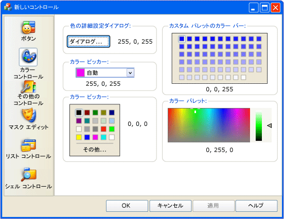
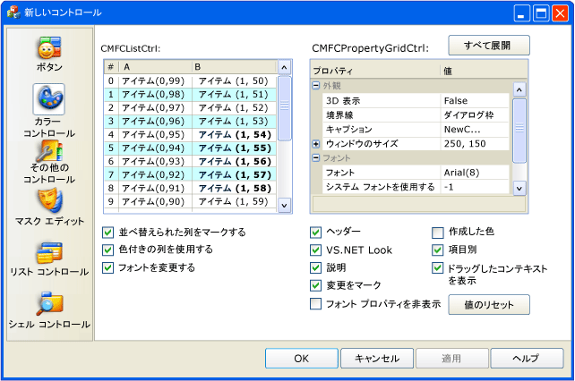

# <a name="cmfcpropertysheet-class"></a>CMFCPropertySheet クラス
`CMFCPropertySheet` クラスは、各プロパティ ページがページ タブ、ツール バー ボタン、ツリー コントロールのノード、またはリスト項目で示されるプロパティ シートをサポートします。  
  
## <a name="syntax"></a>構文  
  
```  
class CMFCPropertySheet : public CPropertySheet  
```  
  
## <a name="members"></a>メンバー  
  
### <a name="public-constructors"></a>パブリック コンストラクター  
  
|名前|説明|  
|----------|-----------------|  
|[CMFCPropertySheet::CMFCPropertySheet](#cmfcpropertysheet)|`CMFCPropertySheet` オブジェクトを構築します。|  
|`CMFCPropertySheet::~CMFCPropertySheet`|デストラクターです。|  
  
### <a name="public-methods"></a>パブリック メソッド  
  
|名前|説明|  
|----------|-----------------|  
|[:Addpage](#addpage)|プロパティ シートにページを追加します。|  
|[CMFCPropertySheet::AddPageToTree](#addpagetotree)|ツリー コントロールに新しいプロパティ ページを追加します。|  
|[CMFCPropertySheet::AddTreeCategory](#addtreecategory)|ツリー コントロールに新しいノードを追加します。|  
|[CMFCPropertySheet::EnablePageHeader](#enablepageheader)|カスタム ヘッダーを描画する領域を各ページの上部に確保します。|  
|[CMFCPropertySheet::GetHeaderHeight](#getheaderheight)|現在のヘッダーの高さを取得します。|  
|[CMFCPropertySheet::GetLook](#getlook)|現在のプロパティ シートの外観を指定する列挙値を取得します。|  
|[CMFCPropertySheet::GetNavBarWidth](#getnavbarwidth)|ナビゲーション バーの幅をピクセル単位で取得します。|  
|[CMFCPropertySheet::GetTab](#gettab)|現在のプロパティ シート コントロールをサポートする内部タブ コントロール オブジェクトを取得します。|  
|`CMFCPropertySheet::GetThisClass`|ポインターを取得するために、フレームワークで使用される、 [CRuntimeClass](../../mfc/reference/cruntimeclass-structure.md)このクラス型に関連付けられているオブジェクト。|  
|[CMFCPropertySheet::InitNavigationControl](#initnavigationcontrol)|現在のプロパティ シート コントロールの外観を初期化します。|  
|[CMFCPropertySheet::OnActivatePage](#onactivatepage)|プロパティ ページが有効になったときにフレームワークによって呼び出されます。|  
|[CMFCPropertySheet::OnDrawPageHeader](#ondrawpageheader)|カスタム プロパティ ページのヘッダーを描画するためにフレームワークによって呼び出されます。|  
|`CMFCPropertySheet::OnInitDialog`|処理、 [WM_INITDIALOG](http://msdn.microsoft.com/library/windows/desktop/ms645428)メッセージ。 (上書き[cpropertysheet::oninitdialog](../../mfc/reference/cpropertysheet-class.md#oninitdialog))。|  
|[CMFCPropertySheet::OnRemoveTreePage](#onremovetreepage)|ツリー コントロールからプロパティ ページを削除するためにフレームワークによって呼び出されます。|  
|`CMFCPropertySheet::PreTranslateMessage`|ディスパッチされる前に、ウィンドウ メッセージを変換、 [TranslateMessage](http://msdn.microsoft.com/library/windows/desktop/ms644955)と[DispatchMessage](http://msdn.microsoft.com/library/windows/desktop/ms644934) Windows 関数。 (`CPropertySheet::PreTranslateMessage` をオーバーライドします)。|  
|[CMFCPropertySheet::RemoveCategory](#removecategory)|ツリー コントロールからノードを削除します。|  
|[CMFCPropertySheet::RemovePage](#removepage)|プロパティ シートからプロパティ ページを削除します。|  
|[CMFCPropertySheet::SetIconsList](#seticonslist)|Outlook ウィンドウのナビゲーション コントロールで使用されるイメージの一覧を指定します。|  
|[:Setlook](#setlook)|プロパティ シートの外観を指定します。|  
  
## <a name="remarks"></a>コメント  
 `CMFCPropertySheet` クラスは、プロパティ シート (タブ ダイアログ ボックスとも呼ばれます) を表します。 `CMFCPropertySheet` クラスは、さまざまな方法でプロパティ ページを表示できます。  
  
 アプリケーションで `CMFCPropertySheet` クラスを使用するには、次の手順を実行します。  
  
1.  `CMFCPropertySheet` クラスから派生クラスを作成し、名前 (CMyPropertySheet など) を付けます。  
  
2.  構築、 [CMFCPropertyPage](../../mfc/reference/cmfcpropertypage-class.md)の各プロパティ ページのオブジェクト。  
  
3.  呼び出す、 [:setlook](#setlook) CMyPropertySheet コンス トラクターのメソッドです。 このメソッドのパラメーターで、プロパティ ページの表示方法として、プロパティ シートの上部または左側のタブ、Microsoft OneNote プロパティ シート スタイルのタブ、Microsoft Outlook ツール バー コントロールのボタン、ツリー コントロールのノード、プロパティ シートの左側の項目リストのいずれかを指定します。  
  
4.  Microsoft Outlook ツール バーのスタイルのプロパティ シートを作成する場合、 [CMFCPropertySheet::SetIconsList](#seticonslist)プロパティ ページ、イメージ リストを関連付けるメソッド。  
  
5.  呼び出す、 [:addpage](#addpage)各プロパティ ページのメソッドです。  
  
6.  `CMFCPropertySheet` コントロールを作成し、その `DoModal` メソッドを呼び出します。  
  
## <a name="illustrations"></a>図  
 次の図は、埋め込みの Microsoft Outlook ツール バー スタイルのプロパティ シートを示しています。 プロパティ シートの左側に Outlook ツール バーが表示されます。  
  
   
  
 次の図を含むプロパティ シートを示しています、 [CMFCPropertyGridCtrl クラス](../../mfc/reference/cmfcpropertygridctrl-class.md)オブジェクト。 このオブジェクトは、標準のコモン コントロール スタイルのプロパティ シートです。  
  
   
  
 次の図は、ツリー コントロール スタイルのプロパティ シートを示しています。  
  
   
  
## <a name="inheritance-hierarchy"></a>継承階層  
 [CObject](../../mfc/reference/cobject-class.md)  
  
 [CCmdTarget](../../mfc/reference/ccmdtarget-class.md)  
  
 [CWnd](../../mfc/reference/cwnd-class.md)  
  
 [CPropertySheet](../../mfc/reference/cpropertysheet-class.md)  
  
 [CMFCPropertySheet](../../mfc/reference/cmfcpropertysheet-class.md)  
  
## <a name="requirements"></a>要件  
 **ヘッダー:** afxpropertysheet.h  
  
##  <a name="addpage"></a>:Addpage  
 プロパティ シートにページを追加します。  
  
```  
void AddPage(CPropertyPage* pPage);
```  
  
### <a name="parameters"></a>パラメーター  
 [入力] `pPage`  
 Page オブジェクトへのポインター。 このパラメーターを指定できません`NULL`です。  
  
### <a name="remarks"></a>コメント  
 このメソッドは、プロパティ シートの一番右のタブとして指定したプロパティ ページを追加します。 そのため、このメソッドを使用して、左から右へ順番でページを追加します。  
  
 プロパティ シートは、Microsoft Outlook のスタイルでは、フレームワークは、プロパティ シートの左側にあるナビゲーション ボタンの一覧を表示します。 このメソッドは、プロパティ ページを追加後の一覧に対応するボタンを追加します。 プロパティ ページを表示するには、その対応するボタンをクリックします。 プロパティ シートのスタイルの詳細については、次を参照してください。 [:setlook](#setlook)です。  
  
##  <a name="addpagetotree"></a>CMFCPropertySheet::AddPageToTree  
 ツリー コントロールに新しいプロパティ ページを追加します。  
  
```  
void AddPageToTree(
    CMFCPropertySheetCategoryInfo* pCategory,  
    CMFCPropertyPage* pPage,  
    int nIconNum=-1,  
    int nSelIconNum=-1);
```  
  
### <a name="parameters"></a>パラメーター  
 [入力] `pCategory`  
 親ツリー ノードへのポインターまたは`NULL`に指定したページを最上位のノードに関連付けます。 呼び出す、 [CMFCPropertySheet::AddTreeCategory](#addtreecategory)このポインターを取得します。  
  
 [入力] `pPage`  
 プロパティ ページのオブジェクトへのポインター。  
  
 [入力] `nIconNum`  
 アイコン、またはアイコンを使用しない場合は-1 の 0 から始まるインデックス。 ページが選択されていないときに、ツリー コントロールのプロパティ ページの横にアイコンが表示されます。 既定値は -1 です。  
  
 [入力] `nSelIconNum`  
 アイコン、またはアイコンを使用しない場合は-1 の 0 から始まるインデックス。 ページを選択すると、ツリー コントロールのプロパティ ページの横にアイコンが表示されます。 既定値は -1 です。  
  
### <a name="remarks"></a>コメント  
 このメソッドは、ツリー コントロールのリーフとしてプロパティ ページを追加します。 プロパティ ページを追加するには、作成、`CMFCPropertySheet`オブジェクトを呼び出し、 [:setlook](#setlook)メソッドを`look`パラメーターに設定`CMFCPropertySheet::PropSheetLook_Tree`、し、このメソッドを使用して、プロパティ ページを追加します。  
  
##  <a name="addtreecategory"></a>CMFCPropertySheet::AddTreeCategory  
 ツリー コントロールに新しいノードを追加します。  
  
```  
CMFCPropertySheetCategoryInfo* AddTreeCategory(
    LPCTSTR lpszLabel,  
    int nIconNum=-1,  
    int nSelectedIconNum=-1,  
    const CMFCPropertySheetCategoryInfo* pParentCategory=NULL);
```  
  
### <a name="parameters"></a>パラメーター  
 [入力] `lpszLabel`  
 ノードの名前。  
  
 [入力] `nIconNum`  
 アイコン、またはアイコンを使用しない場合は-1 の 0 から始まるインデックス。 ページが選択されていないときに、ツリー コントロールのプロパティ ページの横にアイコンが表示されます。 既定値は -1 です。  
  
 [入力] `nSelectedIconNum`  
 アイコン、またはアイコンを使用しない場合は-1 の 0 から始まるインデックス。 ページを選択すると、ツリー コントロールのプロパティ ページの横にアイコンが表示されます。 既定値は -1 です。  
  
 [入力] `pParentCategory`  
 親ツリー ノードへのポインターまたは`NULL`に指定したページを最上位のノードに関連付けます。 このパラメーターを設定、 [CMFCPropertySheet::AddTreeCategory](#addtreecategory)メソッドです。  
  
### <a name="return-value"></a>戻り値  
 ツリー コントロールで新しいノードへのポインター。  
  
### <a name="remarks"></a>コメント  
 ツリー コントロールにカテゴリとも呼ばれる、新しいノードを追加するのにには、このメソッドを使用します。 ノードを追加するには、作成、`CMFCPropertySheet`オブジェクトを呼び出す、 [:setlook](#setlook)メソッドを`look`パラメーターに設定`CMFCPropertySheet::PropSheetLook_Tree`、し、このメソッドを使用して、ノードを追加します。  
  
 後続の呼び出しでこのメソッドの戻り値を使用して[CMFCPropertySheet::AddPageToTree](#addpagetotree)と[CMFCPropertySheet::AddTreeCategory](#addtreecategory)です。  
  
##  <a name="cmfcpropertysheet"></a>CMFCPropertySheet::CMFCPropertySheet  
 `CMFCPropertySheet` オブジェクトを構築します。  
  
```  
CMFCPropertySheet(
    UINT nIDCaption,  
    CWnd* pParentWnd=NULL,  
    UINT iSelectPage=0);

CMFCPropertySheet(
    LPCTSTR pszCaption,  
    CWnd* pParentWnd=NULL,  
    UINT iSelectPage=0);
```  
  
### <a name="parameters"></a>パラメーター  
 [入力] `pszCaption`  
 プロパティ シートのキャプションを表す文字列。 ことはできません`NULL`です。  
  
 [入力] `nIDCaption`  
 プロパティ シートのキャプションを含むリソース ID です。  
  
 [入力] `pParentWnd`  
 プロパティ シートの親ウィンドウへのポインターまたは`NULL`親ウィンドウが、アプリケーションのメイン ウィンドウの場合。 既定値は `NULL` です。  
  
 [入力] `iSelectPage`  
 最上位のプロパティ ページの 0 から始まるインデックス。 既定値は 0 です。  
  
### <a name="remarks"></a>コメント  
 詳細については、パラメーターを参照してください、[呼び出します](../../mfc/reference/cpropertysheet-class.md#cpropertysheet)コンス トラクターです。  
  
##  <a name="enablepageheader"></a>CMFCPropertySheet::EnablePageHeader  
 カスタム ヘッダーを描画する領域を各ページの上部に確保します。  
  
```  
void EnablePageHeader(int nHeaderHeight);
```  
  
### <a name="parameters"></a>パラメーター  
 [入力] `nHeaderHeight`  
 ピクセル単位で、ヘッダーの高さ。  
  
### <a name="remarks"></a>コメント  
 値を使用する、`nHeaderHeight`カスタム ヘッダーを描画するパラメーターを上書きする、 [CMFCPropertySheet::OnDrawPageHeader](#ondrawpageheader)メソッドです。  
  
##  <a name="getheaderheight"></a>CMFCPropertySheet::GetHeaderHeight  
 現在のヘッダーの高さを取得します。  
  
```  
int GetHeaderHeight() const;  
```  
  
### <a name="return-value"></a>戻り値  
 ピクセル単位で、ヘッダーの高さ。  
  
### <a name="remarks"></a>コメント  
 呼び出す、 [CMFCPropertySheet::EnablePageHeader](#enablepageheader)メソッドのこのメソッドを呼び出す前にします。  
  
##  <a name="getlook"></a>CMFCPropertySheet::GetLook  
 現在のプロパティ シートの外観を指定する列挙値を取得します。  
  
```  
PropSheetLook GetLook() const;  
```  
  
### <a name="return-value"></a>戻り値  
 プロパティ シートの外観を指定する列挙値の 1 つ。 使用可能な値の一覧は、「解説」の列挙表を参照して[:setlook](#setlook)です。  
  
##  <a name="getnavbarwidth"></a>CMFCPropertySheet::GetNavBarWidth  
 ナビゲーション バーの幅を取得します。  
  
```  
int GetNavBarWidth() const;  
```  
  
### <a name="return-value"></a>戻り値  
 軸スクロール バーの幅 (ピクセル単位)。  
  
##  <a name="gettab"></a>CMFCPropertySheet::GetTab  
 現在のプロパティ シート コントロールをサポートする内部タブ コントロール オブジェクトを取得します。  
  
```  
CMFCTabCtrl& GetTab() const;  
```  
  
### <a name="return-value"></a>戻り値  
 内部タブ コントロール オブジェクト。  
  
### <a name="remarks"></a>コメント  
 ナビゲーション ボタン、または一連のタブ付きページのリスト、ツリー コントロールなどのさまざまなスタイルで表示されるように、プロパティ シートを設定できます。  
  
 このメソッドを呼び出す前に呼び出し、 [:setlook](#setlook)プロパティ シート コントロールの外観を設定します。 まず、 [CMFCPropertySheet::InitNavigationControl](#initnavigationcontrol)内部タブ コントロール オブジェクトを初期化します。 タブ コントロール オブジェクトを取得し、そのオブジェクトを使用して、プロパティ シートで、タブを使用するには、このメソッドを使用します。  
  
 このメソッドは、Microsoft OneNote スタイルで表示されるプロパティ シート コントロールが設定されていない場合、デバッグ モードでアサートします。  
  
##  <a name="initnavigationcontrol"></a>CMFCPropertySheet::InitNavigationControl  
 現在のプロパティ シート コントロールの外観を初期化します。  
  
```  
virtual CWnd* InitNavigationControl();
```  
  
### <a name="return-value"></a>戻り値  
 プロパティ シート コントロールのウィンドウへのポインター。  
  
### <a name="remarks"></a>コメント  
 プロパティ シート コントロールは、一連のタブ付きページ、ツリー コントロール、またはナビゲーション ボタンの一覧など、いくつかの異なる形式で表示できます。 使用して、 [:setlook](#setlook)プロパティ シート コントロールの外観を指定します。  
  
##  <a name="onactivatepage"></a>CMFCPropertySheet::OnActivatePage  
 プロパティ ページが有効になったときにフレームワークによって呼び出されます。  
  
```  
virtual void OnActivatePage(CPropertyPage* pPage);
```  
  
### <a name="parameters"></a>パラメーター  
 [入力] `pPage`  
 有効なプロパティ ページを表すプロパティ ページ オブジェクトへのポインター。  
  
### <a name="remarks"></a>コメント  
 既定では、このメソッドは、有効なプロパティ ページをスクロールして表示を確認します。 現在のプロパティ シート スタイルの Microsoft Outlook のウィンドウが含まれている場合、このメソッドは、チェックされた状態に、対応する Outlook ボタンを設定します。  
  
##  <a name="ondrawpageheader"></a>CMFCPropertySheet::OnDrawPageHeader  
 カスタム プロパティ ページのヘッダーを描画するためにフレームワークによって呼び出されます。  
  
```  
virtual void OnDrawPageHeader(
    CDC* pDC,  
    int nPage,  
    CRect rectHeader);
```  
  
### <a name="parameters"></a>パラメーター  
 [入力] `pDC`  
 デバイス コンテキストへのポインター。  
  
 [入力] `nPage`  
 0 から始まるプロパティのページ番号です。  
  
 [入力] `rectHeader`  
 ヘッダーを描画する場所を指定する外接する四角形。  
  
### <a name="remarks"></a>コメント  
 既定では、このメソッドは何も行いません。 このメソッドをオーバーライドする場合、 [CMFCPropertySheet::EnablePageHeader](#enablepageheader)フレームワークがこのメソッドを呼び出す前にします。  
  
##  <a name="onremovetreepage"></a>CMFCPropertySheet::OnRemoveTreePage  
 ツリー コントロールからプロパティ ページを削除するためにフレームワークによって呼び出されます。  
  
```  
virtual BOOL OnRemoveTreePage(CPropertyPage* pPage);
```  
  
### <a name="parameters"></a>パラメーター  
 [入力] `pPage`  
 削除するプロパティ ページを表すプロパティ ページ オブジェクトへのポインター。  
  
### <a name="return-value"></a>戻り値  
 `TRUE`このメソッドが成功した場合それ以外の場合、`FALSE`です。  
  
##  <a name="removecategory"></a>CMFCPropertySheet::RemoveCategory  
 ツリー コントロールからノードを削除します。  
  
```  
void RemoveCategory(CMFCPropertySheetCategoryInfo* pCategory);
```  
  
### <a name="parameters"></a>パラメーター  
 [入力] `pCategory`  
 削除するカテゴリ (ノード) へのポインター。  
  
### <a name="remarks"></a>コメント  
 またと呼ばれるをカテゴリでは、ツリー コントロールからノードを削除するのにには、このメソッドを使用します。 使用して、 [CMFCPropertySheet::AddTreeCategory](#addtreecategory)ツリー コントロール ノードを追加するメソッド。  
  
##  <a name="removepage"></a>CMFCPropertySheet::RemovePage  
 プロパティ シートからプロパティ ページを削除します。  
  
```  
void RemovePage(CPropertyPage* pPage);
void RemovePage(int nPage);
```  
  
### <a name="parameters"></a>パラメーター  
 [入力] `pPage`  
 削除するプロパティ ページを表すプロパティ ページのオブジェクトへのポインター。 ことはできません`NULL`です。  
  
 [入力] `nPage`  
 削除するページの 0 から始まるインデックス。  
  
### <a name="remarks"></a>コメント  
 このメソッドは、指定したプロパティ ページを削除し、その関連付けられたウィンドウを破棄します。 オブジェクトのプロパティ ページ、`pPage`パラメーターを指定するまで破棄されませんが、 [CMFCPropertySheet](../../mfc/reference/cmfcpropertysheet-class.md)ウィンドウが閉じられます。  
  
##  <a name="seticonslist"></a>CMFCPropertySheet::SetIconsList  
 Outlook ウィンドウのナビゲーション コントロールで使用されるイメージの一覧を指定します。  
  
```  
BOOL SetIconsList(
    UINT uiImageListResID,  
    int cx,  
    COLORREF clrTransparent=RGB(255, 0, 255));
void SetIconsList(HIMAGELIST hIcons);
```  
  
### <a name="parameters"></a>パラメーター  
 [入力] `uiImageListResID`  
 イメージ リストのリソース ID です。  
  
 [入力] `cx`  
 イメージ リストのアイコンのピクセル単位の幅。  
  
 [入力] `clrTransparent`  
 透明な画像の色。 この色であるイメージの部分は透過的になります。 既定値は、マゼンタ、RGB(255,0,255) です。  
  
 [入力] `hIcons`  
 既存のイメージ リストへのハンドル。  
  
### <a name="return-value"></a>戻り値  
 最初のメソッド オーバー ロード構文、`TRUE`このメソッドが成功した、それ以外の場合`FALSE`です。  
  
### <a name="remarks"></a>コメント  
 プロパティ シートは、Microsoft Outlook のスタイルでは、フレームワークは、プロパティ シートの左側にある、Outlook のウィンドウ コントロールと呼ばれるナビゲーション ボタンの一覧を表示します。 このメソッドを使用すると、Outlook のウィンドウ コントロールで使用するのにイメージ リストを設定できます。  
  
 このメソッドをサポートする方法の詳細については、次を参照してください。 [CImageList::Create](../../mfc/reference/cimagelist-class.md#create)と[CImageList::Add](../../mfc/reference/cimagelist-class.md#add)です。 プロパティ シートのスタイルを設定する方法の詳細については、次を参照してください。 [:setlook](#setlook)です。  
  
##  <a name="setlook"></a>:Setlook  
 プロパティ シートの外観を指定します。  
  
```  
void SetLook(
    PropSheetLook look,  
    int nNavControlWidth=100);
```  
  
### <a name="parameters"></a>パラメーター  
 [入力] `look`  
 プロパティ シートの外観を指定する列挙値の 1 つ。 プロパティ シートの既定のスタイルは`CMFCPropertySheet::PropSheetLook_Tabs`します。 詳細については、このトピックの「解説」セクションの表を参照してください。  
  
 [入力] `nNavControlWidth`  
 ピクセル単位でのナビゲーション コントロールの幅。 既定値は 100 です。  
  
### <a name="remarks"></a>コメント  
 既定とは異なるスタイルでは、プロパティ シートを表示するには、プロパティ シート ウィンドウを作成する前にこのメソッドを呼び出します。  
  
 次の表に、列挙値で指定できる、`look`パラメーター。  
  
|値|説明|  
|-----------|-----------------|  
|`CMFCPropertySheet::PropSheetLook_Tabs`|(既定値)各プロパティ ページのタブが表示されます。 タブは、プロパティ シートの上部に表示されるられ、1 つの行に収まらない他のタブがある場合に積み重ねられます。|  
|`CMFCPropertySheet::PropSheetLook_OutlookBar`|プロパティ シートの左側にある、Microsoft Outlook バーのスタイルのナビゲーション ボタンの一覧を表示します。 リスト内の各ボタンは、プロパティ ページに対応します。 フレームワークでは、一覧の表示領域内に収まるより多くのボタンがある場合、スクロール バーの矢印が表示されます。|  
|`CMFCPropertySheet::PropSheetLook_Tree`|プロパティ シートの左側にあるツリー コントロールを表示します。 各ツリーのコントロールのノードの親または子ノードは、プロパティ ページに対応します。 フレームワークでは、ツリー コントロールの表示領域内に収まる複数のノードがある場合、スクロール バーの矢印が表示されます。|  
|`CMFCPropertySheet::PropSheetLook_OneNoteTabs`|各プロパティ ページの Microsoft OneNote スタイルでタブを表示します。 フレームワークは、プロパティ シートの上部にあるタブを表示し、スクロール矢印よりも多くのタブがある場合に収まる 1 つの行。|  
|`CMFCPropertySheet::PropSheetLook_List`|プロパティ シートの左側にある一覧を表示します。 各リスト項目は、プロパティ ページに対応します。 フレームワークでは、一覧の表示領域内に収まるリスト項目がある場合、スクロール バーの矢印が表示されます。|  
  
## <a name="see-also"></a>関連項目  
 [階層図](../../mfc/hierarchy-chart.md)   
 [クラス](../../mfc/reference/mfc-classes.md)   
 [CMFCPropertyPage クラス](../../mfc/reference/cmfcpropertypage-class.md)   
 [CMFCOutlookBar クラス](../../mfc/reference/cmfcoutlookbar-class.md)
