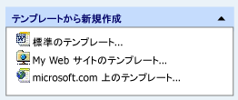

# <a name="cmfctaskspanetask-class"></a>CMFCTasksPaneTask クラス
`CMFCTasksPaneTask`クラスは、作業ウィンドウ コントロールのタスクを表すヘルパー クラス ( [CMFCTasksPane](../../mfc/reference/cmfctaskspane-class.md))。 タスク オブジェクトは、タスク グループ内の項目を表します ( [CMFCTasksPaneTaskGroup](../../mfc/reference/cmfctaskspanetaskgroup-class.md))。 各タスクには、ユーザーがタスク名の左側に表示されるタスクやアイコンをクリックしたときにフレームワークが実行するコマンドを設定できます。  
  
## <a name="syntax"></a>構文  
  
```  
class CMFCTasksPaneTask : public CObject  
```  
  
## <a name="members"></a>メンバー  
  
### <a name="public-constructors"></a>パブリック コンストラクター  
  
|名前|説明|  
|----------|-----------------|  
|[CMFCTasksPaneTask::CMFCTasksPaneTask](#cmfctaskspanetask)|作成して初期化、`CMFCTasksPaneTask`オブジェクト。|  
|`CMFCTasksPaneTask::~CMFCTasksPaneTask`|デストラクターです。|  
  
### <a name="public-methods"></a>パブリック メソッド  
  
|名前|説明|  
|----------|-----------------|  
|[CMFCTasksPaneTask::SetACCData](#setaccdata)|現在のタスクのユーザー補助データを決定します。|  
  
### <a name="data-members"></a>データ メンバー  
  
|name|説明|  
|----------|-----------------|  
|[CMFCTasksPaneTask::m_bAutoDestroyWindow](#m_bautodestroywindow)|タスク一覧 ウィンドウが自動的に破棄されるかどうかを判断します。|  
|[CMFCTasksPaneTask::m_bIsBold](#m_bisbold)|フレームワークは太字でタスクのラベルを描画するかどうかを判断します。|  
|[CMFCTasksPaneTask::m_dwUserData](#m_dwuserdata)|フレームワークとを関連付けるタスク、ユーザー定義のデータが含まれています。 タスクに関連付けられているデータがあるない場合は、0 に設定します。|  
|[CMFCTasksPaneTask::m_hwndTask](#m_hwndtask)|タスク一覧 ウィンドウへのハンドル。|  
|[CMFCTasksPaneTask::m_nIcon](#m_nicon)|フレームワークは、タスクの横に表示されるイメージのイメージ リスト内のインデックス。|  
|[CMFCTasksPaneTask::m_nWindowHeight](#m_nwindowheight)|タスク一覧 ウィンドウの高さ。 タスク一覧 ウィンドウのタスクがない場合は、この値は 0 です。|  
|[CMFCTasksPaneTask::m_pGroup](#m_pgroup)|ポインター、`CMFCTasksPaneTaskGroup`にこのタスクが属しています。|  
|[CMFCTasksPaneTask::m_rect](#m_rect)|タスクの外接する四角形を指定します。|  
|[CMFCTasksPaneTask::m_strName](#m_strname)|タスクの名前。|  
|[CMFCTasksPaneTask::m_uiCommandID](#m_uicommandid)|ユーザーがタスクをクリックしたときに、フレームワークが実行されるコマンドのコマンド ID を指定します。 この値は有効なコマンド ID ではない場合は、タスクが単純なラベルとして扱われます。|  
  
## <a name="remarks"></a>コメント  
 次の図は、3 つのタスクを含むタスク グループを示しています。  
  
   
  
> [!NOTE]
>  タスクが有効なコマンド ID を持たない場合は、単純なラベルとして扱われます。  
  
## <a name="inheritance-hierarchy"></a>継承階層  
 [CObject](../../mfc/reference/cobject-class.md)  
  
 [CMFCTasksPaneTask](../../mfc/reference/cmfctaskspanetask-class.md)  
  
## <a name="requirements"></a>必要条件  
 **ヘッダー:** afxTasksPane.h  
  
##  <a name="cmfctaskspanetask"></a>CMFCTasksPaneTask::CMFCTasksPaneTask  
 作成して初期化、`CMFCTasksPaneTask`オブジェクト。  
  
```  
CMFCTasksPaneTask(
    CMFCTasksPaneTaskGroup* pGroup,  
    LPCTSTR lpszName,  
    int nIcon,  
    UINT uiCommandID,  
    DWORD dwUserData = 0,  
    HWND hwndTask = NULL,  
    BOOL bAutoDestroyWindow = FALSE,  
    int nWindowHeight = 0);
```  
  
### <a name="parameters"></a>パラメーター  
 `pGroup`  
 指定します、 [CMFCTasksPaneTaskGroup](../../mfc/reference/cmfctaskspanetaskgroup-class.md)タスクが属しています。  
  
 `lpszName`  
 タスクの名前を指定します。  
  
 `nIcon`  
 イメージ リストには、タスクのイメージのインデックスを指定します。  
  
 `uiCommandID`  
 タスクがクリックされたときに実行されるコマンドのコマンド ID を指定します。  
  
 `dwUserData`  
 ユーザー定義データ。  
  
 `hwndTask`  
 タスク一覧 ウィンドウへのハンドルを指定します。  
  
 `bAutoDestroyWindow`  
 場合`TRUE`、作業ウィンドウは自動的に破棄されます。  
  
 `nWindowHeight`  
 タスク一覧 ウィンドウの高さを指定します。  
  
### <a name="remarks"></a>コメント  
  
##  <a name="m_bautodestroywindow"></a>CMFCTasksPaneTask::m_bAutoDestroyWindow  
 タスク一覧 ウィンドウが自動的に破棄されるかどうかを判断します。  
  
```  
BOOL m_bAutoDestroyWindow;  
```  
  
### <a name="remarks"></a>コメント  
 設定`TRUE`ことを指定する、タスク ウィンドウ ( [CMFCTasksPaneTask::m_hwndTask](#m_hwndtask)) 以外の場合は、自動的に破棄する必要があります`FALSE`です。  
  
##  <a name="m_bisbold"></a>CMFCTasksPaneTask::m_bIsBold  
 タスクのラベルが太字のテキストで描画されるかどうかを判断します。  
  
```  
BOOL m_bIsBold;  
```  
  
### <a name="remarks"></a>コメント  
 このメンバーを設定`TRUE`太字テキスト タスク ラベルを表示します。  
  
##  <a name="m_dwuserdata"></a>CMFCTasksPaneTask::m_dwUserData  
 タスクに関連付けられているユーザー定義のデータが含まれています。 タスクに関連付けデータがない場合は、0 に設定します。  
  
```  
DWORD m_dwUserData;  
```  
  
### <a name="remarks"></a>コメント  
  
##  <a name="m_hwndtask"></a>CMFCTasksPaneTask::m_hwndTask  
 タスク一覧 ウィンドウへのハンドル。  
  
```  
HWND m_hwndTask;  
```  
  
### <a name="remarks"></a>コメント  
 作業ウィンドウを追加するには、呼び出す[CMFCTasksPane::AddWindow](../../mfc/reference/cmfctaskspane-class.md#addwindow)です。  
  
##  <a name="m_nicon"></a>CMFCTasksPaneTask::m_nIcon  
 指定したタスクの横に表示されるイメージを識別するイメージ リスト内のインデックス位置。  
  
```  
int m_nIcon;  
```  
  
### <a name="remarks"></a>コメント  
 イメージ リストはによって設定[CMFCTasksPane::SetIconsList](../../mfc/reference/cmfctaskspane-class.md#seticonslist)です。  
  
 設定`m_nIcon`に画像がない場合、タスクを表示する場合は-1。  
  
##  <a name="m_nwindowheight"></a>CMFCTasksPaneTask::m_nWindowHeight  
 タスク一覧 ウィンドウの高さ。 タスク一覧 ウィンドウのタスクがない場合は、この値は 0 です。  
  
```  
int m_nWindowHeight;  
```  
  
### <a name="remarks"></a>コメント  
  
##  <a name="m_pgroup"></a>CMFCTasksPaneTask::m_pGroup  
 ポインター、 [CMFCTasksPaneTaskGroup](../../mfc/reference/cmfctaskspanetaskgroup-class.md)このタスクが属しています。  
  
```  
CMFCTasksPaneTaskGroup* m_pGroup;  
```  
  
### <a name="remarks"></a>コメント  
 すべてのタスクは、親グループをいる必要があります。 呼び出して、作業ウィンドウにグループを追加する[cmfctaskspane::addgroup](../../mfc/reference/cmfctaskspane-class.md#addgroup)です。  
  
##  <a name="m_rect"></a>CMFCTasksPaneTask::m_rect  
 タスクの外接する四角形を指定します。  
  
```  
CRect m_rect;  
```  
  
### <a name="remarks"></a>コメント  
 この値は、タスクが描画されるときにフレームワークによって計算されます。  
  
##  <a name="m_strname"></a>CMFCTasksPaneTask::m_strName  
 タスクの名前。  
  
```  
CString m_strName;  
```  
  
### <a name="remarks"></a>コメント  
  
##  <a name="m_uicommandid"></a>CMFCTasksPaneTask::m_uiCommandID  
 ユーザーがタスクをクリックしたときに実行されるコマンドのコマンド ID を指定します。 この値は有効なコマンド ID ではない場合は、タスクが単純なラベルとして扱われます。  
  
```  
UINT m_uiCommandID;  
```  
  
### <a name="remarks"></a>コメント  
  
##  <a name="setaccdata"></a>CMFCTasksPaneTask::SetACCData  
 現在のタスクのユーザー補助データを決定します。  
  
```  
virtual BOOL SetACCData(
    CWnd* pParent,  
    CAccessibilityData& data);
```  
  
### <a name="parameters"></a>パラメーター  
 [入力] `pParent`  
 現在のタスクの親ウィンドウを表します。  
  
 [出力] `data`  
 型のオブジェクト`CAccessibilityData`を現在のタスクのユーザー補助データが格納されます。  
  
### <a name="return-value"></a>戻り値  
 `TRUE`場合、`data`パラメーターが正常に設定された状態で、現在のタスクのユーザー補助データです。 それ以外の場合、`FALSE`です。  
  
## <a name="see-also"></a>参照  
 [階層図](../../mfc/hierarchy-chart.md)   
 [クラス](../../mfc/reference/mfc-classes.md)   
 [CObject クラス](../../mfc/reference/cobject-class.md)
