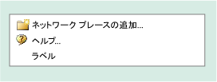
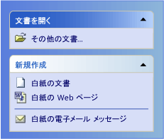

# CMFCTasksPaneTaskGroup クラス
[!INCLUDE[vs2017banner](../../assembler/inline/includes/vs2017banner.md)]

`CMFCTasksPaneTaskGroup` クラスは、[CMFCTasksPane](../Topic/CMFCTasksPane%20Class.md) コントロールが使用するヘルパー クラスです。  `CMFCTasksPaneTaskGroup` 型のオブジェクトは*タスク グループ*を表します。  タスク グループは、閉じるボタンがある独立したボックスにフレームワークによって表示される項目の一覧です。  このボックスには、オプションのキャプション \(グループ名\) があります。  グループが閉じると、タスクの一覧は表示されません。  
  
## 構文  
  
```  
class CMFCTasksPaneTaskGroup : public CObject  
```  
  
## メンバー  
  
### パブリック コンストラクター  
  
|名前|説明|  
|--------|--------|  
|[CMFCTasksPaneTaskGroup::CMFCTasksPaneTaskGroup](../Topic/CMFCTasksPaneTaskGroup::CMFCTasksPaneTaskGroup.md)|`CMFCTasksPaneTaskGroup` オブジェクトを構築します。|  
|`CMFCTasksPaneTaskGroup::~CMFCTasksPaneTaskGroup`|デストラクターです。|  
  
### パブリック メソッド  
  
|名前|説明|  
|--------|--------|  
|[CMFCTasksPaneTaskGroup::SetACCData](../Topic/CMFCTasksPaneTaskGroup::SetACCData.md)|現在のタスク グループのアクセシビリティ データを設定します。|  
  
### データ メンバー  
  
|名前|説明|  
|--------|--------|  
|[CMFCTasksPaneTaskGroup::m\_bIsBottom](../Topic/CMFCTasksPaneTaskGroup::m_bIsBottom.md)|タスク グループがタスク ペイン コントロールの下部に配置されているかどうかを判断します。|  
|[CMFCTasksPaneTaskGroup::m\_bIsCollapsed](../Topic/CMFCTasksPaneTaskGroup::m_bIsCollapsed.md)|タスク グループを折りたたむかどうかを指定します。|  
|[CMFCTasksPaneTaskGroup::m\_bIsSpecial](../Topic/CMFCTasksPaneTaskGroup::m_bIsSpecial.md)|タスク グループが*特別*かどうかを判断します。フレームワークは特別なキャプションを別の色で表示します。|  
|[CMFCTasksPaneTaskGroup::m\_lstTasks](../Topic/CMFCTasksPaneTaskGroup::m_lstTasks.md)|タスクの内部リストが含まれています。|  
|[CMFCTasksPaneTaskGroup::m\_rect](../Topic/CMFCTasksPaneTaskGroup::m_rect.md)|グループのキャプションの外接する四角形を指定します。|  
|[CMFCTasksPaneTaskGroup::m\_rectGroup](../Topic/CMFCTasksPaneTaskGroup::m_rectGroup.md)|グループの外接する四角形を指定します。|  
|[CMFCTasksPaneTaskGroup::m\_strName](../Topic/CMFCTasksPaneTaskGroup::m_strName.md)|グループの名前を指定します。|  
  
## 解説  
 次の図は、展開されたタスク グループを示しています。  
  
   
  
 次の図は、折りたたまれたタスク グループを示しています。  
  
   
  
 次の図は、キャプションのないタスク グループを示しています。  
  
   
  
 次の図は、2 つのタスク グループを示しています。  最初のタスク グループは、`m_bIsSpecial` フラグを `TRUE` に設定することにより、特別なグループとしてマークされています。2 つ目のタスク グループは特別ではありません。  最初のタスク グループのキャプションが 2 つ目のタスク グループより濃い色で表示されている点に注意してください。  
  
   
  
## 継承階層  
 [CObject](../Topic/CObject%20Class.md)  
  
 [CMFCTasksPaneTaskGroup](../../mfc/reference/cmfctaskspanetaskgroup-class.md)  
  
## 必要条件  
 **ヘッダー :** afxTasksPane.h  
  
## 参照  
 [階層図](../../mfc/hierarchy-chart.md)   
 [クラス](../Topic/MFC%20Classes.md)   
 [CMFCTasksPane クラス](../Topic/CMFCTasksPane%20Class.md)   
 [CMFCTasksPaneTask クラス](../../mfc/reference/cmfctaskspanetask-class.md)   
 [CMFCOutlookBar クラス](../../mfc/reference/cmfcoutlookbar-class.md)   
 [CObject クラス](../Topic/CObject%20Class.md)