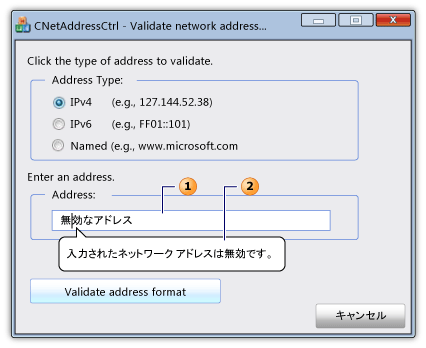

# CNetAddressCtrl クラス
[!INCLUDE[vs2017banner](../../assembler/inline/includes/vs2017banner.md)]

`CNetAddressCtrl` クラスは、ネットワーク アドレス コントロールを表します。このコントロールを使用すると、IPv4 アドレス、IPv6 アドレス、および名前付き DNS アドレスの形式を入力して検証できます。  
  
## 構文  
  
```  
class CNetAddressCtrl : public CEdit  
```  
  
## メンバー  
  
### パブリック コンストラクター  
  
|名前|説明|  
|--------|--------|  
|[CNetAddressCtrl::CNetAddressCtrl](../Topic/CNetAddressCtrl::CNetAddressCtrl.md)|`CNetAddressCtrl` オブジェクトを構築します。|  
  
### パブリック メソッド  
  
|名前|説明|  
|--------|--------|  
|[CNetAddressCtrl::Create](../Topic/CNetAddressCtrl::Create.md)|指定されたスタイルのネットワーク アドレス コントロールを作成し、`CNetAddressCtrl` の現在のオブジェクトにアタッチします。|  
|[CNetAddressCtrl::CreateEx](../Topic/CNetAddressCtrl::CreateEx.md)|指定された拡張スタイルのネットワーク アドレス コントロールを作成し、`CNetAddressCtrl` の現在のオブジェクトにアタッチします。|  
|[CNetAddressCtrl::DisplayErrorTip](../Topic/CNetAddressCtrl::DisplayErrorTip.md)|ユーザーが現在のネットワーク アドレス コントロールでサポートされていないネットワーク アドレスを入力するとエラーにバルーン ヒントを表示します。|  
|[CNetAddressCtrl::GetAddress](../Topic/CNetAddressCtrl::GetAddress.md)|現在のネットワーク アドレス コントロールに関連付けられているネットワーク アドレスの検証され、解析された表現を取得します。|  
|[CNetAddressCtrl::GetAllowType](../Topic/CNetAddressCtrl::GetAllowType.md)|サポートする現在のネットワーク アドレス コントロールができるネットワーク アドレスの種類を取得します。|  
|[CNetAddressCtrl::SetAllowType](../Topic/CNetAddressCtrl::SetAllowType.md)|サポートする現在のネットワーク アドレス コントロールができるネットワーク アドレスの種類を設定します。|  
  
## 解説  
 ネットワーク アドレス コントロールは、ユーザーが入力したアドレスの形式が正しいことを確認します。  コントロールは、ネットワーク アドレスに実際に接続しません。  [CNetAddressCtrl::SetAllowType](../Topic/CNetAddressCtrl::SetAllowType.md) のメソッドは [CNetAddressCtrl::GetAddress](../Topic/CNetAddressCtrl::GetAddress.md) の検証メソッドが解析してアドレスの一つ以上の型を指定します。  アドレスは、ネットワーク サーバー、ホスト、またはブロードキャスト メッセージの出力先の IPv4、IPv6、または名前付きのアドレスの形式になります。  アドレスの形式が正しくない場合、ネットワーク アドレス コントロールのテキスト ボックスをグラフィカルにポイントして、定義済みのエラー メッセージを表示するヒントのメッセージ ボックスを表示するに [CNetAddressCtrl::DisplayErrorTip](../Topic/CNetAddressCtrl::DisplayErrorTip.md) のメソッドを使用できます。  
  
 `CNetAddressCtrl` のクラスは [CEdit](../Topic/CEdit%20Class.md) のクラスから派生します。  その結果、ネットワーク アドレス コントロールは、すべての Windows のエディット コントロールのメッセージへのアクセスを提供します。  
  
 次の図は、ネットワーク アドレス コントロールをダイアログを示しています。  ネットワーク アドレス コントロールのテキスト ボックス \(1\) が無効なネットワーク アドレスを格納します。  ネットワーク アドレスが有効でない場合は \(2\) ヒント メッセージが表示されます。  
  
   
  
## 使用例  
 次のコード例は、ネットワーク アドレスを検証するダイアログの一部です。  3 個のラジオ ボタンのイベント ハンドラーは、ネットワーク アドレスが 3 台のアドレスの 1 種類の一つであることを指定します。  ユーザーは、ネットワーク アドレス コントロールのテキスト ボックスには、されたアドレスを検証するためにボタンを押します。  アドレスが有効な場合、成功メッセージが表示されます。; は、定義済みのツールヒントのエラー メッセージが表示されます。  
  
 [!code-cpp[NVC_MFC_CNetAddressCtrl_s1#1](../../mfc/reference/codesnippet/CPP/cnetaddressctrl-class_1.cpp)]  
  
## 使用例  
 ダイアログのヘッダー ファイルの次のコード例は [CNetAddressCtrl::GetAddress](../Topic/CNetAddressCtrl::GetAddress.md) のメソッドに必要な [NC\_ADDRESS](http://msdn.microsoft.com/library/windows/desktop/bb773345) と [NET\_ADDRESS\_INFO](http://msdn.microsoft.com/library/windows/desktop/bb773346) の変数を定義します。  
  
 [!code-cpp[NVC_MFC_CNetAddressCtrl_s1#2](../../mfc/reference/codesnippet/CPP/cnetaddressctrl-class_2.h)]  
  
## 継承階層  
 [CObject](../Topic/CObject%20Class.md)  
  
 [CCmdTarget](../Topic/CCmdTarget%20Class.md)  
  
 [CWnd](../Topic/CWnd%20Class.md)  
  
 [CEdit](../Topic/CEdit%20Class.md)  
  
 `CNetAddressCtrl`  
  
## 必要条件  
 **ヘッダー:** afxcmn.h  
  
 このクラスは [!INCLUDE[windowsver](../Token/windowsver_md.md)] 以降でサポートされます。  
  
 このクラスの追加要件は [Windows Vista コモン コントロールの作成要件](../../mfc/build-requirements-for-windows-vista-common-controls.md)で説明します。  
  
## 参照  
 [CNetAddressCtrl Class](../../mfc/reference/cnetaddressctrl-class.md)   
 [階層図](../../mfc/hierarchy-chart.md)   
 [CEdit クラス](../Topic/CEdit%20Class.md)