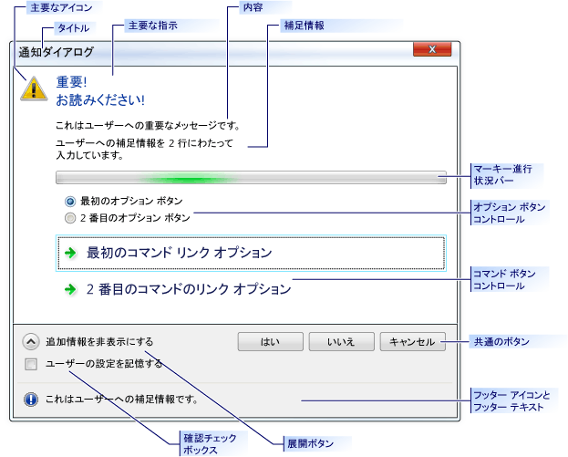

# <a name="ctaskdialog-class"></a>CTaskDialog Class
メッセージ ボックスのような機能を持つだけでなく、ユーザーに対する追加情報も表示できる、ポップアップ ダイアログ ボックスです。 `CTaskDialog` には、ユーザーから情報を収集するための機能も用意されています。  
  
## <a name="syntax"></a>構文  
  
```  
class CTaskDialog : public CObject  
```  
  
## <a name="members"></a>メンバー  
  
### <a name="constructors"></a>コンストラクター  
  
|||  
|-|-|  
|[CTaskDialog::CTaskDialog](#ctaskdialog)|`CTaskDialog` オブジェクトを構築します。|  
  
### <a name="methods"></a>メソッド  
  
|||  
|-|-|  
|[CTaskDialog::AddCommandControl](#addcommandcontrol)|コマンド ボタン コントロールを追加、`CTaskDialog`です。|  
|[CTaskDialog::AddRadioButton](#addradiobutton)|ラジオ ボタンを追加、`CTaskDialog`です。|  
|[CTaskDialog::ClickCommandControl](#clickcommandcontrol)|プログラムを使用して、コマンド ボタン コントロールや一般的なボタンをクリックします。|  
|[CTaskDialog::ClickRadioButton](#clickradiobutton)|プログラムを使用して、オプション ボタンをクリックします。|  
|[CTaskDialog::DoModal](#domodal)|「`CTaskDialog`」を表示します。|  
|[CTaskDialog::GetCommonButtonCount](#getcommonbuttoncount)|利用可能な一般的なボタンの数を取得します。|  
|[CTaskDialog::GetCommonButtonFlag](#getcommonbuttonflag)|一般的なボタンの種類に Windows の button コントロールに関連付けられている標準の変換、`CTaskDialog`クラスです。|  
|[CTaskDialog::GetCommonButtonId](#getcommonbuttonid)|関連付けられている一般的なボタンの種類のいずれかに変換、`CTaskDialog`を標準の Windows ボタン クラスです。|  
|[CTaskDialog::GetOptions](#getoptions)|このオプションのフラグを返す`CTaskDialog`します。|  
|[CTaskDialog::GetSelectedCommandControlID](#getselectedcommandcontrolid)|選択したコマンドのボタン コントロールを返します。|  
|[CTaskDialog::GetSelectedRadioButtonID](#getselectedradiobuttonid)|選択したオプション ボタンを返します。|  
|[CTaskDialog::GetVerificationCheckboxState](#getverificationcheckboxstate)|確認のチェック ボックスの状態を取得します。|  
|[CTaskDialog::IsCommandControlEnabled](#iscommandcontrolenabled)|コマンド ボタン コントロールまたは一般的なボタンが有効かどうかを決定します。|  
|[CTaskDialog::IsRadioButtonEnabled](#isradiobuttonenabled)|オプション ボタンが有効になっているかどうかを決定します。|  
|[CTaskDialog::IsSupported](#issupported)|アプリケーションを実行しているコンピューターをサポートするかどうかを決定、`CTaskDialog`です。|  
|[CTaskDialog::LoadCommandControls](#loadcommandcontrols)|ストリング テーブルからデータを使用して、コマンド ボタン コントロールを追加します。|  
|[CTaskDialog::LoadRadioButtons](#loadradiobuttons)|ストリング テーブルからデータを使用して、オプション ボタンを追加します。|  
|[CTaskDialog::NavigateTo](#navigateto)|別にフォーカスが移動`CTaskDialog`します。|  
|[CTaskDialog::OnCommandControlClick](#oncommandcontrolclick)|フレームワークは、ユーザーがコマンド ボタン コントロールをクリックすると、このメソッドを呼び出します。|  
|[CTaskDialog::OnCreate](#oncreate)|フレームワークが作成された後、このメソッドを呼び出して、`CTaskDialog`です。|  
|[CTaskDialog::OnDestroy](#ondestroy)|破棄前にすぐに、フレームワークはこのメソッドを呼び出して、`CTaskDialog`です。|  
|[CTaskDialog::OnExpandButtonClick](#onexpandbuttonclick)|フレームワークは、ユーザーが展開ボタンをクリックすると、このメソッドを呼び出します。|  
|[CTaskDialog::OnHelp](#onhelp)|フレームワークは、ユーザーはヘルプを要求すると、このメソッドを呼び出します。|  
|[CTaskDialog::OnHyperlinkClick](#onhyperlinkclick)|フレームワークは、ユーザーがハイパーリンクをクリックしたときに、このメソッドを呼び出します。|  
|[CTaskDialog::OnInit](#oninit)|フレームワークがこのメソッドを呼び出すときに、`CTaskDialog`が初期化されます。|  
|[CTaskDialog::OnNavigatePage](#onnavigatepage)|フレームワークは、ユーザーは、上のコントロールに関連のフォーカスを移動するときにこのメソッドを呼び出して、`CTaskDialog`です。|  
|[CTaskDialog::OnRadioButtonClick](#onradiobuttonclick)|フレームワークは、オプション ボタン コントロールを選択すると、このメソッドを呼び出します。|  
|[CTaskDialog::OnTimer](#ontimer)|フレームワークは、タイマーが切れたときに、このメソッドを呼び出します。|  
|[CTaskDialog::OnVerificationCheckboxClick](#onverificationcheckboxclick)|フレームワークは、ユーザーが確認のチェック ボックスをクリックすると、このメソッドを呼び出します。|  
|[CTaskDialog::RemoveAllCommandControls](#removeallcommandcontrols)|すべてのコマンド コントロールからの削除、`CTaskDialog`です。|  
|[CTaskDialog::RemoveAllRadioButtons](#removeallradiobuttons)|すべてのオプション ボタンの削除、`CTaskDialog`です。|  
|[CTaskDialog::SetCommandControlOptions](#setcommandcontroloptions)|更新プログラムをコマンド ボタン コントロール、`CTaskDialog`です。|  
|[CTaskDialog::SetCommonButtonOptions](#setcommonbuttonoptions)|有効にして、UAC の昇格を必要とする一般的なボタンのサブセットを更新します。|  
|[CTaskDialog::SetCommonButtons](#setcommonbuttons)|一般的なボタンを追加、`CTaskDialog`です。|  
|[CTaskDialog::SetContent](#setcontent)|内容を更新、`CTaskDialog`です。|  
|[CTaskDialog::SetDefaultCommandControl](#setdefaultcommandcontrol)|既定のコマンド ボタン コントロールを指定します。|  
|[CTaskDialog::SetDefaultRadioButton](#setdefaultradiobutton)|既定のオプション ボタンを指定します。|  
|[CTaskDialog::SetDialogWidth](#setdialogwidth)|幅を調整、`CTaskDialog`です。|  
|[CTaskDialog::SetExpansionArea](#setexpansionarea)|更新の展開領域、`CTaskDialog`です。|  
|[CTaskDialog::SetFooterIcon](#setfootericon)|フッター アイコンを更新、`CTaskDialog`です。|  
|[CTaskDialog::SetFooterText](#setfootertext)|フッターにテキストを更新する、`CTaskDialog`です。|  
|[CTaskDialog::SetMainIcon](#setmainicon)|メインのアイコンを更新、`CTaskDialog`です。|  
|[CTaskDialog::SetMainInstruction](#setmaininstruction)|更新のメイン インストラクション、`CTaskDialog`です。|  
|[CTaskDialog::SetOptions](#setoptions)|オプションを設定、`CTaskDialog`です。|  
|[CTaskDialog::SetProgressBarMarquee](#setprogressbarmarquee)|構成の選択バー、`CTaskDialog`し、ダイアログ ボックスに追加します。|  
|[CTaskDialog::SetProgressBarPosition](#setprogressbarposition)|進行状況バーの位置を調整します。|  
|[CTaskDialog::SetProgressBarRange](#setprogressbarrange)|進行状況バーの範囲を調整します。|  
|[CTaskDialog::SetProgressBarState](#setprogressbarstate)|進行状況バーの状態に設定し、それを表示、`CTaskDialog`です。|  
|[CTaskDialog::SetRadioButtonOptions](#setradiobuttonoptions)|有効またはオプション ボタンを無効にします。|  
|[CTaskDialog::SetVerificationCheckbox](#setverificationcheckbox)|確認のチェック ボックスのチェック状態を設定します。|  
|[CTaskDialog::SetVerificationCheckboxText](#setverificationcheckboxtext)|確認のチェック ボックスの右側にあるテキストを設定します。|  
|[CTaskDialog::SetWindowTitle](#setwindowtitle)|タイトルを設定、`CTaskDialog`です。|  
|[CTaskDialog::ShowDialog](#showdialog)|作成し、表示、`CTaskDialog`です。|  
|[CTaskDialog::TaskDialogCallback](#taskdialogcallback)|フレームワークでは、さまざまな Windows メッセージへの応答で、これを呼び出します。|  
  
### <a name="data-members"></a>データ メンバー  
  
|||  
|-|-|  
|`m_aButtons`|コマンド ボタン コントロールの配列、`CTaskDialog`です。|  
|`m_aRadioButtons`|オプション ボタン コントロールの配列、`CTaskDialog`です。|  
|`m_bVerified`|`TRUE`かどうか確認のチェック ボックスをチェックします。`FALSE`なっていないことを示します。|  
|`m_footerIcon`|フッターに、アイコン、`CTaskDialog`です。|  
|`m_hWnd`|ウィンドウのハンドル、`CTaskDialog`です。|  
|`m_mainIcon`|メインのアイコン、`CTaskDialog`です。|  
|`m_nButtonDisabled`|指定する一般的なボタンのマスクが無効になります。|  
|`m_nButtonElevation`|指定する一般的なボタンのマスクでは、UAC の昇格が必要です。|  
|`m_nButtonId`|選択したコマンドのボタン コントロールの ID です。|  
|`m_nCommonButton`|表示される一般的なボタンを示すマスク、`CTaskDialog`です。|  
|`m_nDefaultCommandControl`|コマンド ボタンの ID を制御する場合に選択されている、`CTaskDialog`が表示されます。|  
|`m_nDefaultRadioButton`|オプション ボタンの ID を制御する場合に選択されている、`CTaskDialog`が表示されます。|  
|`m_nFlags`|マスクをするためのオプションを示す、`CTaskDialog`です。|  
|`m_nProgressPos`|進行状況バーの現在の位置。  この値の有効値の範囲は `m_nProgressRangeMin` ～ `m_nProgressRangeMax` です。|  
|`m_nProgressRangeMax`|進行状況バーの最大値。|  
|`m_nProgressRangeMin`|進行状況バーの最小値。|  
|`m_nProgressState`|進行状況バーの状態。 詳細については、次を参照してください。 [CTaskDialog::SetProgressBarState](#setprogressbarstate)します。|  
|`m_nRadioId`|選択したオプション ボタン コントロールの ID です。|  
|`m_nWidth`|幅、 `CTaskDialog` (ピクセル単位)。|  
|`m_strCollapse`|文字列、`CTaskDialog`展開された情報が表示されていない場合は、展開 ボックスの右側に表示されます。|  
|`m_strContent`|コンテンツの文字列、`CTaskDialog`です。|  
|`m_strExpand`|文字列、`CTaskDialog`展開された情報が表示されるときに展開 ボックスの右側に表示されます。|  
|`m_strFooter`|フッター、`CTaskDialog`です。|  
|`m_strInformation`|展開された情報、`CTaskDialog`です。|  
|`m_strMainInstruction`|メイン インストラクション、`CTaskDialog`です。|  
|`m_strTitle`|タイトル、`CTaskDialog`です。|  
|`m_strVerification`|文字列を`CTaskDialog`確認のチェック ボックスの右側に表示されます。|  
  
## <a name="remarks"></a>コメント  
 `CTaskDialog`クラスは、標準の Windows メッセージ ボックスに置き換えられますあり、ユーザーから情報を収集する新しいコントロールなどの追加機能。 このクラスは、MFC ライブラリに[!INCLUDE[vs_dev10_long](../../build/includes/vs_dev10_long_md.md)]します。 `CTaskDialog`以降で利用できるは[!INCLUDE[wiprlhext](../../c-runtime-library/reference/includes/wiprlhext_md.md)]です。 Windows の以前のバージョンを表示できません、`CTaskDialog`オブジェクトです。 使用`CTaskDialog::IsSupported`を実行時に、現在のユーザーがタスク ダイアログ ボックスを表示できるかどうかを判断します。 標準の Windows メッセージ ボックスでもサポート[!INCLUDE[vs_dev10_long](../../build/includes/vs_dev10_long_md.md)]します。  
  
 `CTaskDialog`は Unicode ライブラリを使用して、アプリケーションをビルドするときにのみ使用します。  
  
 `CTaskDialog`が&2; つの異なるコンス トラクターです。 1 つのコンス トラクターでは、2 つのコマンド ボタンと&6; つの標準ボタン コントロールの最大数を指定することができます。 さらにコマンド ボタンを追加するには、作成した後、`CTaskDialog`です。 2 番目のコンス トラクターは、コマンド ボタンをサポートしていませんが、無制限の数の標準ボタン コントロールを追加することができます。 コンス トラクターの詳細については、次を参照してください。 [CTaskDialog::CTaskDialog](#ctaskdialog)します。  
  
 次の図は、サンプル`CTaskDialog`を一部のコントロールの場所を示します。  
  
   
CTaskDialog のサンプル  
  
## <a name="requirements"></a>要件  
 **必要なオペレーティング システムの最小値:**[!INCLUDE[wiprlhext](../../c-runtime-library/reference/includes/wiprlhext_md.md)]  
  
 **ヘッダー:** afxtaskdialog.h  
  
##  <a name="addcommandcontrol"></a>CTaskDialog::AddCommandControl  
 新しいコマンド ボタン コントロールを追加、`CTaskDialog`です。  
  
```  
void AddCommandControl(
    int nCommandControlID,  
    const CString& strCaption,  
    BOOL bEnabled = TRUE,  
    BOOL bRequiresElevation = FALSE);
```  
  
### <a name="parameters"></a>パラメーター  
 [入力] `nCommandControlID`  
 コマンド コントロールの識別番号。  
  
 [入力] `strCaption`  
 文字列を`CTaskDialog`をユーザーに表示します。 この文字列を使用して、コマンドの目的について説明します。  
  
 [入力] `bEnabled`  
 新規作成 ボタンを有効または無効になっているかどうかを示すブール値パラメーター。  
  
 [入力] `bRequiresElevation`  
 コマンドが昇格を必要とするかどうかを示すブール値パラメーターです。  
  
### <a name="remarks"></a>コメント  
 `CTaskDialog Class`コマンド ボタン コントロールの無制限の数を表示できます。 ただし場合、`CTaskDialog`表示任意のコマンド ボタン コントロールで、最大&6; つのボタンを表示できます。 場合、`CTaskDialog`コマンド ボタン コントロールを持たない、ボタンの無制限の数を表示できます。  
  
 コマンド ボタン コントロールを選択すると、`CTaskDialog`を閉じます。 アプリケーションを使用して、ダイアログ ボックスが表示される場合[CTaskDialog::DoModal](#domodal)、`DoModal`返します、`nCommandControlID`選択コマンドのボタン コントロールのです。  
  
### <a name="example"></a>例  
 [!code-cpp[NVC_MFC_CTaskDialog&#2;](../../mfc/reference/codesnippet/cpp/ctaskdialog-class_1.cpp)]  
  
##  <a name="addradiobutton"></a>CTaskDialog::AddRadioButton  
 ラジオ ボタンを追加、`CTaskDialog`です。  
  
```  
void CTaskDialog::AddRadioButton(
    int nRadioButtonID,  
    const CString& strCaption,  
    BOOL bEnabled = TRUE);
```  
  
### <a name="parameters"></a>パラメーター  
 [入力] `nRadioButtonID`  
 オプション ボタンの id 番号。  
  
 [入力] `strCaption`  
 文字列を`CTaskDialog`ラジオ ボタンの横に表示されます。  
  
 [入力] `bEnabled`  
 オプション ボタンが有効になっているかどうかを示すブール値パラメーター。  
  
### <a name="remarks"></a>コメント  
 ラジオ ボタンを[CTaskDialog Class](../../mfc/reference/ctaskdialog-class.md)を使用すると、ユーザーから情報を収集します。 関数を使用して[CTaskDialog::GetSelectedRadioButtonID](#getselectedradiobuttonid)ラジオ ボタンが選択を決定します。  
  
 `CTaskDialog`いる必要はありません、`nRadioButtonID`パラメーターは、各オプション ボタンに対して一意です。 ただし、オプション ボタンごとに一意の識別子を使用しない場合に、予期しない動作が発生する可能性があります。  
  
### <a name="example"></a>例  
 [!code-cpp[NVC_MFC_CTaskDialog&#3;](../../mfc/reference/codesnippet/cpp/ctaskdialog-class_2.cpp)]  
  
##  <a name="clickcommandcontrol"></a>CTaskDialog::ClickCommandControl  
 プログラムを使用して、コマンド ボタン コントロールや一般的なボタンをクリックします。  
  
```  
protected:  
void ClickCommandControl(int nCommandControlID) const;  
```  
  
### <a name="parameters"></a>パラメーター  
 [入力] `nCommandControlID`  
 クリックして、コントロールのコマンド ID。  
  
### <a name="remarks"></a>コメント  
 このメソッドは、windows メッセージを生成`TDM_CLICK_BUTTON`します。  
  
##  <a name="clickradiobutton"></a>CTaskDialog::ClickRadioButton  
 プログラムを使用して、オプション ボタンをクリックします。  
  
```  
protected:  
void ClickRadioButton(int nRadioButtonID) const;  
```  
  
### <a name="parameters"></a>パラメーター  
 [入力] `nRadioButtonID`  
 クリックしてオプション ボタンの ID です。  
  
### <a name="remarks"></a>コメント  
 このメソッドは、windows メッセージを生成`TDM_CLICK_RADIO_BUTTON`します。  
  
##  <a name="ctaskdialog"></a>CTaskDialog::CTaskDialog  
 インスタンスを作成、 [CTaskDialog Class](../../mfc/reference/ctaskdialog-class.md)します。  
  
```  
CTaskDialog(
    const CString& strContent,  
    const CString& strMainInstruction,  
    const CString& strTitle,  
    int nCommonButtons = TDCBF_OK_BUTTON | TDCBF_CANCEL_BUTTON,  
    int nTaskDialogOptions = TDF_ENABLE_HYPERLINKS | TDF_USE_COMMAND_LINKS,  
    const CString& strFooter = _T(""));

 
CTaskDialog(
    const CString& strContent,  
    const CString& strMainInstruction,  
    const CString& strTitle,  
    int nIDCommandControlsFirst,  
    int nIDCommandControlsLast,  
    int nCommonButtons,  
    int nTaskDialogOptions = TDF_ENABLE_HYPERLINKS | TDF_USE_COMMAND_LINKS,  
    const CString& strFooter = _T(""));
```  
  
### <a name="parameters"></a>パラメーター  
 [入力] `strContent`  
 コンテンツを使用する文字列、`CTaskDialog`です。  
  
 [入力] `strMainInstruction`  
 メイン インストラクション、`CTaskDialog`です。  
  
 [入力] `strTitle`  
 タイトル、`CTaskDialog`です。  
  
 [入力] `nCommonButtons`  
 追加する一般的なボタンのマスク、`CTaskDialog`です。  
  
 [入力] `nTaskDialogOptions`  
 使用するオプションのセット、`CTaskDialog`です。  
  
 [入力] `strFooter`  
 フッターとして使用する文字列。  
  
 [入力] `nIDCommandControlsFirst`  
 最初のコマンドの文字列 ID です。  
  
 [入力] `nIDCommandControlsLast`  
 最後のコマンドの文字列 ID です。  
  
### <a name="remarks"></a>コメント  
 追加できる&2; つの方法があります、`CTaskDialog`をアプリケーションにします。 最初の方法が、コンス トラクターのいずれかを使用して作成するには、`CTaskDialog`し、それを使用して表示[CTaskDialog::DoModal](#domodal)します。 2 つ目の方法は、静的関数を使用する[CTaskDialog::ShowDialog](#showdialog)を使用すると、表示、`CTaskDialog`明示的に作成しなくても、`CTaskDialog`オブジェクトです。  
  
 2 番目のコンス トラクターは、アプリケーションのリソース ファイルからデータを使用して、コマンド ボタン コントロールを作成します。 リソース ファイル内の文字列テーブルには、関連付けられた文字列 Id のいくつかの文字列があります。 このメソッドは、文字列テーブルの間で有効な各エントリに対して、コマンド ボタン コントロールを追加`nIDCommandControlsFirst`と`nCommandControlsLast`、包括的です。 これらのコマンド ボタン コントロールの文字列テーブル内の文字列がコントロールのキャプションで、文字列 ID がコントロールの id。  
  
 参照してください[CTaskDialog::SetOptions](#setoptions)の有効なオプションの一覧です。  
  
### <a name="example"></a>例  
 [!code-cpp[NVC_MFC_CTaskDialog&#7;](../../mfc/reference/codesnippet/cpp/ctaskdialog-class_3.cpp)]  
  
##  <a name="domodal"></a>CTaskDialog::DoModal  
 表示、`CTaskDialog`されモーダルになります。  
  
```  
INT_PTR DoModal (HWND hParent = ::GetActiveWindow());
```  
  
### <a name="parameters"></a>パラメーター  
 [入力] `hParent`  
 親ウィンドウ、`CTaskDialog`です。  
  
### <a name="return-value"></a>戻り値  
 ユーザーによる選択に対応する整数。  
  
### <a name="remarks"></a>コメント  
 このインスタンスが表示される、 [CTaskDialog](../../mfc/reference/ctaskdialog-class.md)します。 次に、アプリケーションでは、ユーザーがダイアログ ボックスを閉じますが待機します。  
  
 `CTaskDialog` 、ユーザーがコマンド リンク コントロールの一般的なボタンを選択または終了すると閉じます、`CTaskDialog`です。 戻り値は、ユーザーがダイアログ ボックスを閉じた方法を示す識別子です。  
  
### <a name="example"></a>例  
 [!code-cpp[NVC_MFC_CTaskDialog&#7;](../../mfc/reference/codesnippet/cpp/ctaskdialog-class_3.cpp)]  
  
##  <a name="getcommonbuttoncount"></a>CTaskDialog::GetCommonButtonCount  
 一般的なボタンの数を取得します。  
  
```  
int GetCommonButtonCount() const;  
```  
  
### <a name="return-value"></a>戻り値  
 利用可能な一般的なボタンの数。  
  
### <a name="remarks"></a>コメント  
 一般的なボタンは既定のボタンに提供する[CTaskDialog::CTaskDialog](#ctaskdialog)します。 [CTaskDialog Class](../../mfc/reference/ctaskdialog-class.md)  ダイアログ ボックスの下部にあるボタンが表示されます。  
  
 ボタンの一覧については、CommCtrl.h で提供されます。  
  
##  <a name="getcommonbuttonflag"></a>CTaskDialog::GetCommonButtonFlag  
 一般的なボタンの種類に Windows の button コントロールに関連付けられている標準の変換、 [CTaskDialog Class](../../mfc/reference/ctaskdialog-class.md)します。  
  
```  
int GetCommonButtonFlag(int nButtonId) const;  
```  
  
### <a name="parameters"></a>パラメーター  
 [入力] `nButtonId`  
 標準の Windows ボタンの値。  
  
### <a name="return-value"></a>戻り値  
 対応する値`CTaskDialog`一般的なボタンをクリックします。 対応する一般的なボタンがない場合、このメソッドは、0 を返します。  
  
##  <a name="getcommonbuttonid"></a>CTaskDialog::GetCommonButtonId  
 関連付けられている一般的なボタンの種類のいずれかに変換、 [CTaskDialog Class](../../mfc/reference/ctaskdialog-class.md)標準の Windows ボタンをします。  
  
```  
int GetCommonButtonId(int nFlag);
```  
  
### <a name="parameters"></a>パラメーター  
 [入力] `nFlag`  
 一般的なボタンの種類に関連付けられている、`CTaskDialog`クラスです。  
  
### <a name="return-value"></a>戻り値  
 対応する標準の Windows ボタンの値です。 対応する Windows のボタンがない場合は、0 を返します。  
  
##  <a name="getoptions"></a>CTaskDialog::GetOptions  
 このオプションのフラグを返す`CTaskDialog`します。  
  
```  
int GetOptions() const;  
```  
  
### <a name="return-value"></a>戻り値  
 使用されるフラグ、`CTaskDialog`です。  
  
### <a name="remarks"></a>コメント  
 使用できるオプションの詳細については、 [CTaskDialog Class](../../mfc/reference/ctaskdialog-class.md)を参照してください[CTaskDialog::SetOptions](#setoptions)します。  
  
### <a name="example"></a>例  
 [!code-cpp[NVC_MFC_CTaskDialog&#7;](../../mfc/reference/codesnippet/cpp/ctaskdialog-class_3.cpp)]  
  
##  <a name="getselectedcommandcontrolid"></a>CTaskDialog::GetSelectedCommandControlID  
 選択したコマンドのボタン コントロールを返します。  
  
```  
int GetSelectedCommandControlID() const;  
```  
  
### <a name="return-value"></a>戻り値  
 現在選択されているコマンドのボタン コントロールの ID です。  
  
### <a name="remarks"></a>コメント  
 このメソッドを使用して、ユーザーが選択したコマンド ボタンの ID を取得する必要はありません。 いずれかでその ID が返される[CTaskDialog::DoModal](#domodal)または[CTaskDialog::ShowDialog](#showdialog)します。  
  
### <a name="example"></a>例  
 [!code-cpp[NVC_MFC_CTaskDialog&#2;](../../mfc/reference/codesnippet/cpp/ctaskdialog-class_1.cpp)]  
  
##  <a name="getselectedradiobuttonid"></a>CTaskDialog::GetSelectedRadioButtonID  
 選択したオプション ボタンを返します。  
  
```  
int GetSelectedRadioButtonID() const;  
```  
  
### <a name="return-value"></a>戻り値  
 選択したオプション ボタンの ID です。  
  
### <a name="remarks"></a>コメント  
 選択したオプション ボタンを取得するダイアログ ボックスを閉じた後は、このメソッドを使用できます。  
  
### <a name="example"></a>例  
 [!code-cpp[NVC_MFC_CTaskDialog&#3;](../../mfc/reference/codesnippet/cpp/ctaskdialog-class_2.cpp)]  
  
##  <a name="getverificationcheckboxstate"></a>CTaskDialog::GetVerificationCheckboxState  
 確認のチェック ボックスの状態を取得します。  
  
```  
BOOL GetVerificationCheckboxState() const;  
```  
  
### <a name="return-value"></a>戻り値  
 `TRUE`チェック ボックスをオンにした場合`FALSE`がない場合。  
  
### <a name="example"></a>例  
 [!code-cpp[NVC_MFC_CTaskDialog&#5;](../../mfc/reference/codesnippet/cpp/ctaskdialog-class_4.cpp)]  
  
##  <a name="iscommandcontrolenabled"></a>CTaskDialog::IsCommandControlEnabled  
 コマンド ボタン コントロールまたはボタンが有効かどうかを決定します。  
  
```  
BOOL IsCommandControlEnabled(int nCommandControlID) const;  
```  
  
### <a name="parameters"></a>パラメーター  
 [入力] `nCommandControlID`  
 テスト コマンド ボタン コントロールまたはボタンの ID。  
  
### <a name="return-value"></a>戻り値  
 `TRUE`コントロールが有効になっている場合は、`FALSE`がない場合。  
  
### <a name="remarks"></a>コメント  
 このメソッドを使用するを両方のコマンド ボタン コントロールの可用性、およびの一般的なボタンを判断、`CTaskDialog Class`です。  
  
 場合`nCommandControlID`のいずれかとして最も一般的なに有効な識別子ではありませんが、`CTaskDialog`ボタンまたはコマンド ボタン コントロールの場合は、このメソッドは例外をスローします。  
  
### <a name="example"></a>例  
 [!code-cpp[NVC_MFC_CTaskDialog&#2;](../../mfc/reference/codesnippet/cpp/ctaskdialog-class_1.cpp)]  
  
##  <a name="isradiobuttonenabled"></a>CTaskDialog::IsRadioButtonEnabled  
 オプション ボタンが有効になっているかどうかを決定します。  
  
```  
BOOL IsRadioButtonEnabled(int nRadioButtonID) const;  
```  
  
### <a name="parameters"></a>パラメーター  
 [入力] `nRadioButtonID`  
 テストするラジオ ボタンの ID。  
  
### <a name="return-value"></a>戻り値  
 `TRUE`オプション ボタンが有効になっている場合は、`FALSE`がない場合。  
  
### <a name="remarks"></a>コメント  
 場合`nRadioButtonID`有効な識別子ではないラジオ ボタンは、このメソッドは例外をスローします。  
  
### <a name="example"></a>例  
 [!code-cpp[NVC_MFC_CTaskDialog&#3;](../../mfc/reference/codesnippet/cpp/ctaskdialog-class_2.cpp)]  
  
##  <a name="issupported"></a>CTaskDialog::IsSupported  
 アプリケーションを実行しているコンピューターをサポートするかどうかを決定、`CTaskDialog`です。  
  
```  
static BOOL IsSupported();
```  
  
### <a name="return-value"></a>戻り値  
 `TRUE`コンピューターがサポートされている場合、`CTaskDialog`です。`FALSE`それ以外の場合。  
  
### <a name="remarks"></a>コメント  
 アプリケーションを実行しているコンピューターがサポートされている場合は、実行時に決定をこの関数を使用して、`CTaskDialog Class`です。 コンピューターがサポートされていない場合、 `CTaskDialog`、別のユーザーに情報を通信する方法を提供する必要があります。 使用しようとすると、アプリケーションがクラッシュ、`CTaskDialog`をサポートしないコンピューターで、`CTaskDialog`クラスです。  
  
### <a name="example"></a>例  
 [!code-cpp[NVC_MFC_CTaskDialog&#1;](../../mfc/reference/codesnippet/cpp/ctaskdialog-class_5.cpp)]  
  
##  <a name="loadcommandcontrols"></a>CTaskDialog::LoadCommandControls  
 ストリング テーブルからデータを使用して、コマンド ボタン コントロールを追加します。  
  
```  
void LoadCommandControls(
    int nIDCommandControlsFirst,  
    int nIDCommandControlsLast);
```  
  
### <a name="parameters"></a>パラメーター  
 [入力] `nIDCommandControlsFirst`  
 最初のコマンドの文字列 ID です。  
  
 [入力] `nIDCommandControlsLast`  
 最後のコマンドの文字列 ID です。  
  
### <a name="remarks"></a>コメント  
 このメソッドは、アプリケーションのリソース ファイルからデータを使用して、コマンド ボタン コントロールを作成します。 リソース ファイル内の文字列テーブルには、関連付けられた文字列 Id のいくつかの文字列があります。 このメソッドを使用して追加されたコマンド ボタン コントロールが新しいコントロールのキャプションと文字列 ID のコントロールの ID に文字列を使用します。 選択されている文字列の範囲がによって提供される`nIDCommandControlsFirst`と`nCommandControlsLast`、包括的です。 範囲の空のエントリがある場合、このメソッドはそのエントリのコマンド ボタン コントロールを追加できません。  
  
 既定では、新しいコマンド ボタン コントロールを有効にし、昇格を必要としません。  
  
### <a name="example"></a>例  
 [!code-cpp[NVC_MFC_CTaskDialog&#2;](../../mfc/reference/codesnippet/cpp/ctaskdialog-class_1.cpp)]  
  
##  <a name="loadradiobuttons"></a>CTaskDialog::LoadRadioButtons  
 ストリング テーブルからデータを使用して、オプション ボタン コントロールを追加します。  
  
```  
void LoadRadioButtons(
    int nIDRadioButtonsFirst,  
    int nIDRadioButtonsLast);
```  
  
### <a name="parameters"></a>パラメーター  
 [入力] `nIDRadioButtonsFirst`  
 最初のオプション ボタンの文字列 ID です。  
  
 [入力] `nIDRadioButtonsLast`  
 最後のオプション ボタンの文字列 ID です。  
  
### <a name="remarks"></a>コメント  
 このメソッドは、アプリケーションのリソース ファイルからデータを使用して、オプション ボタンを作成します。 リソース ファイル内の文字列テーブルには、関連付けられた文字列 Id のいくつかの文字列があります。 このメソッドを使用して追加された新しいラジオ ボタン オプション ボタンのキャプションと文字列 ID のオプション ボタンの ID の文字列を使用します。 選択されている文字列の範囲がによって提供される`nIDRadioButtonsFirst`と`nRadioButtonsLast`、包括的です。 範囲の空のエントリがある場合、このメソッドはそのエントリのラジオ ボタンを追加できません。  
  
 既定では、新しいオプション ボタンが有効にします。  
  
### <a name="example"></a>例  
 [!code-cpp[NVC_MFC_CTaskDialog&#3;](../../mfc/reference/codesnippet/cpp/ctaskdialog-class_2.cpp)]  
  
##  <a name="navigateto"></a>CTaskDialog::NavigateTo  
 別にフォーカスが移動`CTaskDialog`します。  
  
```  
protected:  
void NavigateTo(CTaskDialog& oTaskDialog) const;  
```  
  
### <a name="parameters"></a>パラメーター  
 [入力] `oTaskDialog`  
 `CTaskDialog`フォーカスを受け取る。  
  
### <a name="remarks"></a>コメント  
 このメソッドは現在、隠ぺい`CTaskDialog`表示される、`oTaskDialog`です。 `oTaskDialog`現在と同じ場所に表示される`CTaskDialog`します。  
  
##  <a name="oncommandcontrolclick"></a>CTaskDialog::OnCommandControlClick  
 フレームワークは、ユーザーがコマンド ボタン コントロールをクリックすると、このメソッドを呼び出します。  
  
```  
virtual HRESULT OnCommandControlClick(int nCommandControlID);
```  
  
### <a name="parameters"></a>パラメーター  
 [入力] `nCommandControlID`  
 ユーザーが選択したコマンド ボタン コントロールの ID です。  
  
### <a name="return-value"></a>戻り値  
 既定の実装では、`S_OK` が返されます。  
  
### <a name="remarks"></a>コメント  
 カスタム動作を実装する派生クラスでは、このメソッドをオーバーライドします。  
  
##  <a name="oncreate"></a>CTaskDialog::OnCreate  
 フレームワークが作成された後、このメソッドを呼び出して、`CTaskDialog`です。  
  
```  
virtual HRESULT OnCreate();
```  
  
### <a name="return-value"></a>戻り値  
 既定の実装では、`S_OK` が返されます。  
  
### <a name="remarks"></a>コメント  
 カスタム動作を実装する派生クラスでは、このメソッドをオーバーライドします。  
  
##  <a name="ondestroy"></a>CTaskDialog::OnDestroy  
 破棄前にすぐに、フレームワークはこのメソッドを呼び出して、`CTaskDialog`です。  
  
```  
virtual HRESULT OnDestroy();
```  
  
### <a name="return-value"></a>戻り値  
 既定の実装では、`S_OK` が返されます。  
  
### <a name="remarks"></a>コメント  
 カスタム動作を実装する派生クラスでは、このメソッドをオーバーライドします。  
  
##  <a name="onexpandbuttonclick"></a>CTaskDialog::OnExpandButtonClick  
 フレームワークは、ユーザーが展開ボタンをクリックすると、このメソッドを呼び出します。  
  
```  
virtual HRESULT OnExpandButtonClicked(BOOL bExpanded);
```  
  
### <a name="parameters"></a>パラメーター  
 [入力] `bExpanded`  
 追加の情報が表示されます。 0 以外の値を示します0 では、追加の情報が非表示を示します。  
  
### <a name="return-value"></a>戻り値  
 既定の実装では、`S_OK` が返されます。  
  
### <a name="remarks"></a>コメント  
 カスタム動作を実装する派生クラスでは、このメソッドをオーバーライドします。  
  
##  <a name="onhelp"></a>CTaskDialog::OnHelp  
 フレームワークは、ユーザーはヘルプを要求すると、このメソッドを呼び出します。  
  
```  
virtual HRESULT OnHelp();
```  
  
### <a name="return-value"></a>戻り値  
 既定の実装では、`S_OK` が返されます。  
  
### <a name="remarks"></a>コメント  
 カスタム動作を実装する派生クラスでは、このメソッドをオーバーライドします。  
  
##  <a name="onhyperlinkclick"></a>CTaskDialog::OnHyperlinkClick  
 フレームワークは、ユーザーがハイパーリンクをクリックしたときに、このメソッドを呼び出します。  
  
```  
virtual HRESULT OnHyperlinkClick(const CString& strHref);
```  
  
### <a name="parameters"></a>パラメーター  
 [入力] `strHref`  
 ハイパーリンクを表す文字列です。  
  
### <a name="return-value"></a>戻り値  
 既定の実装では、`S_OK` が返されます。  
  
### <a name="remarks"></a>コメント  
 このメソッドを呼び出す[ShellExecute](http://msdn.microsoft.com/library/windows/desktop/bb762153)を返す前に`S_OK`します。  
  
 カスタム動作を実装する派生クラスでは、このメソッドをオーバーライドします。  
  
##  <a name="oninit"></a>CTaskDialog::OnInit  
 フレームワークがこのメソッドを呼び出すときに、`CTaskDialog`が初期化されます。  
  
```  
virtual HRESULT OnInit();
```  
  
### <a name="return-value"></a>戻り値  
 既定の実装では、`S_OK` が返されます。  
  
### <a name="remarks"></a>コメント  
 カスタム動作を実装する派生クラスでは、このメソッドをオーバーライドします。  
  
##  <a name="onnavigatepage"></a>CTaskDialog::OnNavigatePage  
 フレームワークでは、このメソッドを呼び出してに応えて、 [CTaskDialog::NavigateTo](#navigateto)メソッドです。  
  
```  
virtual HRESULT OnNavigatePage();
```  
  
### <a name="return-value"></a>戻り値  
 既定の実装では、`S_OK` が返されます。  
  
### <a name="remarks"></a>コメント  
 カスタム動作を実装する派生クラスでは、このメソッドをオーバーライドします。  
  
##  <a name="onradiobuttonclick"></a>CTaskDialog::OnRadioButtonClick  
 フレームワークは、オプション ボタン コントロールを選択すると、このメソッドを呼び出します。  
  
```  
virtual HRESULT OnRadioButtonClick(int nRadioButtonID);
```  
  
### <a name="parameters"></a>パラメーター  
 [入力] `nRadioButtonID`  
 ユーザーがクリックしたオプション ボタン コントロールの ID です。  
  
### <a name="return-value"></a>戻り値  
 既定の実装では、`S_OK` が返されます。  
  
### <a name="remarks"></a>コメント  
 カスタム動作を実装する派生クラスでは、このメソッドをオーバーライドします。  
  
##  <a name="ontimer"></a>CTaskDialog::OnTimer  
 フレームワークは、タイマーが切れたときに、このメソッドを呼び出します。  
  
```  
virtual HRESULT OnTimer(long lTime);
```  
  
### <a name="parameters"></a>パラメーター  
 [入力] `lTime`  
 以降のミリ秒単位の時間、`CTaskDialog`が作成されたか、タイマーをリセットします。  
  
### <a name="return-value"></a>戻り値  
 既定の実装では、`S_OK` が返されます。  
  
### <a name="remarks"></a>コメント  
 カスタム動作を実装する派生クラスでは、このメソッドをオーバーライドします。  
  
##  <a name="onverificationcheckboxclick"></a>CTaskDialog::OnVerificationCheckboxClick  
 フレームワークは、ユーザーが確認のチェック ボックスをクリックすると、このメソッドを呼び出します。  
  
```  
virtual HRESULT OnVerificationCheckboxClick(BOOL bChecked);
```  
  
### <a name="parameters"></a>パラメーター  
 [入力] `bChecked`  
 `TRUE`確認のチェック ボックスが選択されていることを示します。`FALSE`なっていないことを示します。  
  
### <a name="return-value"></a>戻り値  
 既定の実装では、`S_OK` が返されます。  
  
### <a name="remarks"></a>コメント  
 カスタム動作を実装する派生クラスでは、このメソッドをオーバーライドします。  
  
##  <a name="removeallcommandcontrols"></a>CTaskDialog::RemoveAllCommandControls  
 すべてのコマンド ボタン コントロールを削除、`CTaskDialog`です。  
  
```  
void RemoveAllCommandControls();
```  
  
### <a name="example"></a>例  
 [!code-cpp[NVC_MFC_CTaskDialog&#2;](../../mfc/reference/codesnippet/cpp/ctaskdialog-class_1.cpp)]  
  
##  <a name="removeallradiobuttons"></a>CTaskDialog::RemoveAllRadioButtons  
 すべてのオプション ボタンの削除、`CTaskDialog`です。  
  
```  
void RemoveAllRadioButtons();
```  
  
### <a name="example"></a>例  
 [!code-cpp[NVC_MFC_CTaskDialog&#3;](../../mfc/reference/codesnippet/cpp/ctaskdialog-class_2.cpp)]  
  
##  <a name="setcommandcontroloptions"></a>CTaskDialog::SetCommandControlOptions  
 更新プログラムをコマンド ボタン コントロール、`CTaskDialog`です。  
  
```  
void SetCommandControlOptions(
    int nCommandControlID,  
    BOOL bEnabled,  
    BOOL bRequiresElevation = FALSE);
```  
  
### <a name="parameters"></a>パラメーター  
 [入力] `nCommandControlID`  
 更新するコマンド コントロールの ID。  
  
 [入力] `bEnabled`  
 ブール値パラメーターには、指定されたコマンド ボタン コントロールが有効か無効になっているかどうかを示します。  
  
 [入力] `bRequiresElevation`  
 指定されたコマンド ボタン コントロールに昇格が必要なかどうかを示すブール値パラメーターです。  
  
### <a name="remarks"></a>コメント  
 コマンド ボタン コントロールが有効かを追加した後は、昇格を必要とするかどうかを変更するには、このメソッドを使用して、`CTaskDialog Class`です。  
  
### <a name="example"></a>例  
 [!code-cpp[NVC_MFC_CTaskDialog&#2;](../../mfc/reference/codesnippet/cpp/ctaskdialog-class_1.cpp)]  
  
##  <a name="setcommonbuttonoptions"></a>CTaskDialog::SetCommonButtonOptions  
 一般的なボタンを有効にして、UAC の昇格時の要求のサブセットを更新します。  
  
```  
void SetCommonButtonOptions(
    int nDisabledButtonMask,  
    int nElevationButtonMask = 0);
```  
  
### <a name="parameters"></a>パラメーター  
 [入力] `nDisabledButtonMask`  
 無効にする一般的なボタン用のマスク。  
  
 [入力] `nElevationButtonMask`  
 昇格を必要とする一般的なボタン用のマスク。  
  
### <a name="remarks"></a>コメント  
 インスタンスに利用可能な一般的なボタンを設定することができます、 [CTaskDialog Class](../../mfc/reference/ctaskdialog-class.md)コンス トラクターを使用して、 [CTaskDialog::CTaskDialog](#ctaskdialog)とメソッドの[CTaskDialog::SetCommonButtons](#setcommonbuttons)します。 `CTaskDialog::SetCommonButtonOptions`新しい一般的なボタンの追加はできません。  
  
 このメソッドを使用して無効にするか、またはこの記載されていない一般的なボタンを昇格する場合`CTaskDialog`、このメソッドを使用して例外をスローする、[ことを確認して](http://msdn.microsoft.com/library/738c4ccf-c29c-4c04-8d6c-f126bedf6e91)マクロです。  
  
 このメソッドにより、使用可能な任意のボタン、`CTaskDialog`に含まれていないが、`nDisabledButtonMask`無効であった場合でも、します。 このメソッドは、同様の方法で昇格をどのように処理: が記録されます。 一般的なボタンが使用できるに含まれていない場合は、昇格が必要としない同様`nElevationButtonMask`します。  
  
### <a name="example"></a>例  
 [!code-cpp[NVC_MFC_CTaskDialog&6;](../../mfc/reference/codesnippet/cpp/ctaskdialog-class_6.cpp)]  
  
##  <a name="setcommonbuttons"></a>CTaskDialog::SetCommonButtons  
 一般的なボタンを追加、`CTaskDialog`です。  
  
```  
void SetCommonButtons(
    int nButtonMask,  
    int nDisabledButtonMask = 0,  
    int nElevationButtonMask = 0);
```  
  
### <a name="parameters"></a>パラメーター  
 [入力] `nButtonMask`  
 追加するボタンのマスク、`CTaskDialog`です。  
  
 [入力] `nDisabledButtonMask`  
 無効にするボタンのマスク。  
  
 [入力] `nElevationButtonMask`  
 昇格を必要とするボタンのマスク。  
  
### <a name="remarks"></a>コメント  
 このインスタンスのウィンドウの表示後にこのメソッドを呼び出すことができない、`CTaskDialog Class`が作成されます。 この場合、このメソッドは例外をスローします。  
  
 によって示されるボタン`nButtonMask`オーバーライドに追加したすべての一般的なボタン、`CTaskDialog`です。 ボタンだけが示されている`nButtonMask`を利用します。  
  
 いずれか`nDisabledButtonMask`または`nElevationButtonMask`に含まれていないボタンが表示`nButtonMask`、このメソッドを使用して例外をスローする、[ことを確認して](http://msdn.microsoft.com/library/738c4ccf-c29c-4c04-8d6c-f126bedf6e91)マクロです。  
  
 既定では、すべての一般的なボタンが有効になり、昇格を必要としません。  
  
### <a name="example"></a>例  
 [!code-cpp[NVC_MFC_CTaskDialog&6;](../../mfc/reference/codesnippet/cpp/ctaskdialog-class_6.cpp)]  
  
##  <a name="setcontent"></a>CTaskDialog::SetContent  
 内容を更新、`CTaskDialog`です。  
  
```  
void SetContent(const CString& strContent);
```  
  
### <a name="parameters"></a>パラメーター  
 [入力] `strContent`  
 ユーザーに表示する文字列。  
  
### <a name="remarks"></a>コメント  
 内容、 `CTaskDialog Class`  ダイアログ ボックスの主要なセクション内のユーザーに表示されるテキストです。  
  
### <a name="example"></a>例  
 [!code-cpp[NVC_MFC_CTaskDialog&#7;](../../mfc/reference/codesnippet/cpp/ctaskdialog-class_3.cpp)]  
  
##  <a name="setdefaultcommandcontrol"></a>CTaskDialog::SetDefaultCommandControl  
 既定のコマンド ボタン コントロールを指定します。  
  
```  
void SetDefaultCommandControl(int nCommandControlID);
```  
  
### <a name="parameters"></a>パラメーター  
 [入力] `nCommandControlID`  
 既定値であるコマンド ボタン コントロールの ID。  
  
### <a name="remarks"></a>コメント  
 既定のコマンド ボタン コントロールがコントロールであるとき、`CTaskDialog`をユーザーに最初に表示されます。  
  
 指定されたコマンド ボタン コントロールを見つけられない場合、このメソッドが例外をスロー`nCommandControlID`します。  
  
### <a name="example"></a>例  
 [!code-cpp[NVC_MFC_CTaskDialog&#2;](../../mfc/reference/codesnippet/cpp/ctaskdialog-class_1.cpp)]  
  
##  <a name="setdefaultradiobutton"></a>CTaskDialog::SetDefaultRadioButton  
 既定のオプション ボタンを指定します。  
  
```  
void SetDefaultRadioButton(int nRadioButtonID);
```  
  
### <a name="parameters"></a>パラメーター  
 [入力] `nRadioButtonID`  
 既定値にするオプション ボタンの ID。  
  
### <a name="remarks"></a>コメント  
 既定のオプション ボタンは、ボタンが選択されている場合に、`CTaskDialog`をユーザーに最初に表示されます。  
  
 指定したオプション ボタンを見つけられない場合、このメソッドが例外をスロー`nRadioButtonID`します。  
  
### <a name="example"></a>例  
 [!code-cpp[NVC_MFC_CTaskDialog&#3;](../../mfc/reference/codesnippet/cpp/ctaskdialog-class_2.cpp)]  
  
##  <a name="setdialogwidth"></a>CTaskDialog::SetDialogWidth  
 幅を調整、`CTaskDialog`です。  
  
```  
void SetDialogWidth(int nWidth = 0);
```  
  
### <a name="parameters"></a>パラメーター  
 [入力] `nWidth`  
 ピクセル単位で、ダイアログ ボックスの幅。  
  
### <a name="remarks"></a>コメント  
 パラメーター `nWidth` 0 以上にする必要があります。 それ以外の場合、このメソッドは、例外をスローします。  
  
 場合`nWidth`は 0、このメソッドを設定します ダイアログ ボックスの既定のサイズに設定します。  
  
### <a name="example"></a>例  
 [!code-cpp[NVC_MFC_CTaskDialog&#7;](../../mfc/reference/codesnippet/cpp/ctaskdialog-class_3.cpp)]  
  
##  <a name="setexpansionarea"></a>CTaskDialog::SetExpansionArea  
 更新の展開領域、`CTaskDialog`です。  
  
```  
void SetExpansionArea(
    const CString& strExpandedInformation,  
    const CString& strCollapsedLabel = _T(""),  
    const CString& strExpandedLabel = _T(""));
```  
  
### <a name="parameters"></a>パラメーター  
 [入力] `strExpandedInformation`  
 文字列を`CTaskDialog`拡張ボタンをクリックすると、ダイアログ ボックスの本文に表示します。  
  
 [入力] `strCollapsedLabel`  
 文字列を`CTaskDialog`拡張領域が折りたたまれているときに、拡張ボタンの横に表示します。  
  
 [入力] `strExpandedLabel`  
 文字列を`CTaskDialog`展開された領域が表示されるときに、拡張ボタンの横に表示されます。  
  
### <a name="remarks"></a>コメント  
 拡張領域、`CTaskDialog Class`追加情報をユーザーに提供することができます。 展開領域は、の主要部分で、`CTaskDialog`タイトルとコンテンツの文字列のすぐ下にある。  
  
 ときに、`CTaskDialog`を最初に展開された情報を表示しないと表示は、`strCollapsedLabel`拡張ボタンの横にします。 ユーザーが展開ボタンをクリックすると、`CTaskDialog`が表示されます`strExpandedInformation`にラベルを変更および`strExpandedLabel`です。  
  
### <a name="example"></a>例  
 [!code-cpp[NVC_MFC_CTaskDialog&#7;](../../mfc/reference/codesnippet/cpp/ctaskdialog-class_3.cpp)]  
  
##  <a name="setfootericon"></a>CTaskDialog::SetFooterIcon  
 [フッター] アイコンを更新、`CTaskDialog`です。  
  
```  
void SetFooterIcon(HICON hFooterIcon);  
void SetFooterIcon(LPCWSTR lpszFooterIcon);
```  
  
### <a name="parameters"></a>パラメーター  
 [入力] `hFooterIcon`  
 用の新しいアイコン、`CTaskDialog`です。  
  
 [入力] `lpszFooterIcon`  
 用の新しいアイコン、`CTaskDialog`です。  
  
### <a name="remarks"></a>コメント  
 下部にある [フッター] アイコンが表示される、 [CTaskDialog Class](../../mfc/reference/ctaskdialog-class.md)します。 フッターのテキストを関連付ける、ことができます。 フッター テキストを変更する[CTaskDialog::SetFooterText](#setfootertext)します。  
  
 このメソッドで例外をスローする、[ことを確認して](http://msdn.microsoft.com/library/738c4ccf-c29c-4c04-8d6c-f126bedf6e91)マクロ場合、`CTaskDialog`が表示されますか、入力パラメーターが`NULL`です。  
  
 A`CTaskDialog`のみを受け入れることができます、`HICON`または`LPCWSTR`フッター アイコンとして。 これが、オプションを設定して構成されている`TDF_USE_HICON_FOOTER`コンス トラクターでまたは[CTaskDialog::SetOptions](#setoptions)します。 既定では、`CTaskDialog`を使用するように構成`LPCWSTR`フッター アイコンの入力の型として。 このメソッドは、不適切な型を使用して、アイコンを設定しようとする場合に例外を生成します。  
  
### <a name="example"></a>例  
 [!code-cpp[NVC_MFC_CTaskDialog&#7;](../../mfc/reference/codesnippet/cpp/ctaskdialog-class_3.cpp)]  
  
##  <a name="setfootertext"></a>CTaskDialog::SetFooterText  
 フッターにテキストを更新する、`CTaskDialog`です。  
  
```  
void SetFooterText(const CString& strFooterText);
```  
  
### <a name="parameters"></a>パラメーター  
 [入力] `strFooterText`  
 フッターの新しいテキスト。  
  
### <a name="remarks"></a>コメント  
 下部でフッター テキストの横にあるフッター アイコンが表示されます、`CTaskDialog`です。 フッターのアイコンを変更する[CTaskDialog::SetFooterIcon](#setfootericon)します。  
  
### <a name="example"></a>例  
 [!code-cpp[NVC_MFC_CTaskDialog&#7;](../../mfc/reference/codesnippet/cpp/ctaskdialog-class_3.cpp)]  
  
##  <a name="setmainicon"></a>CTaskDialog::SetMainIcon  
 メインのアイコンを更新、`CTaskDialog`です。  
  
```  
void SetMainIcon(HICON hMainIcon);  
void SetMainIcon(LPCWSTR lpszMainIcon);
```  
  
### <a name="parameters"></a>パラメーター  
 [入力] `hMainIcon`  
 新しいアイコン。  
  
 [入力] `lpszMainIcon`  
 新しいアイコン。  
  
### <a name="remarks"></a>コメント  
 このメソッドで例外をスローする、[ことを確認して](http://msdn.microsoft.com/library/738c4ccf-c29c-4c04-8d6c-f126bedf6e91)マクロ場合、`CTaskDialog`が表示されますか、入力パラメーターが`NULL`です。  
  
 A`CTaskDialog`のみを受け入れることができます、`HICON`または`LPCWSTR`メイン アイコンとして。 これを構成するにを設定、`TDF_USE_HICON_MAIN`オプションか、コンス トラクターで、 [CTaskDialog::SetOptions](#setoptions)メソッドです。 既定では、`CTaskDialog`を使用するように構成`LPCWSTR`メイン アイコンの入力の型として。 このメソッドは、不適切な型を使用して、アイコンを設定しようとする場合に例外を生成します。  
  
### <a name="example"></a>例  
 [!code-cpp[NVC_MFC_CTaskDialog&#7;](../../mfc/reference/codesnippet/cpp/ctaskdialog-class_3.cpp)]  
  
##  <a name="setmaininstruction"></a>CTaskDialog::SetMainInstruction  
 更新のメイン インストラクション、`CTaskDialog`です。  
  
```  
void SetMainInstruction(const CString& strInstructions);
```  
  
### <a name="parameters"></a>パラメーター  
 [入力] `strInstructions`  
 新しいメイン インストラクションします。  
  
### <a name="remarks"></a>コメント  
 メイン インストラクション、`CTaskDialog Class`大きい太字フォントでユーザーに表示されるテキストします。 これについては、ダイアログ ボックスのタイトル バーの下にあります。  
  
### <a name="example"></a>例  
 [!code-cpp[NVC_MFC_CTaskDialog&#7;](../../mfc/reference/codesnippet/cpp/ctaskdialog-class_3.cpp)]  
  
##  <a name="setoptions"></a>CTaskDialog::SetOptions  
 オプションを設定、`CTaskDialog`です。  
  
```  
void SetOptions(int nOptionFlag);
```  
  
### <a name="parameters"></a>パラメーター  
 [入力] `nOptionFlag`  
 使用するフラグのセット、`CTaskDialog`です。  
  
### <a name="remarks"></a>コメント  
 このメソッドは、すべて現在のオプションをクリア、`CTaskDialog`です。 現在のオプションを保持するために取得する必要に最初に[CTaskDialog::GetOptions](#getoptions)し、それらを設定するオプションを使用して結合します。  
  
 次の表では、有効なオプションをすべて一覧表示します。  
  
 `TDF_ENABLE_HYPERLINKS`  
 内のハイパーリンクをにより、`CTaskDialog`です。  
  
 `TDF_USE_HICON_MAIN`  
 構成、`CTaskDialog`を使用する、`HICON`メインのアイコン。 使用する方法、`LPCWSTR`です。  
  
 `TDF_USE_HICON_FOOTER`  
 構成、`CTaskDialog`を使用する、`HICON`フッター アイコンに対応します。 使用する方法、`LPCWSTR`です。  
  
 `TDF_ALLOW_DIALOG_CANCELLATION`  
 閉じることができます、`CTaskDialog`またはダイアログ ボックスの右上隅のアイコンを使用して、キーボードを使用して場合でも、**キャンセル**ボタンは使用できません。 このフラグが設定されていない場合、**キャンセル**ボタンが有効でない、ユーザーは、alt キーを押しながら f4 キー、Esc キーを使用して、ダイアログ ボックスを閉じることはできません、またはタイトル バーの [閉じる] ボタン。  
  
 `TDF_USE_COMMAND_LINKS`  
 構成、`CTaskDialog`コマンド ボタン コントロールを使用します。  
  
 `TDF_USE_COMMAND_LINKS_NO_ICON`  
 構成、`CTaskDialog`コントロールの横にアイコンを表示することがなくコマンド ボタン コントロールを使用します。 `TDF_USE_COMMAND_LINKS` は `TDF_USE_COMMAND_LINKS_NO_ICON` をオーバーライドします。  
  
 `TDF_EXPAND_FOOTER_AREA`  
 拡張領域が現在展開されていることを示します。  
  
 `TDF_EXPANDED_BY_DEFAULT`  
 既定で展開領域が展開されているかどうかを決定します。  
  
 `TDF_VERIFICATION_FLAG_CHECKED`  
 確認のチェック ボックスが現在選択されていることを示します。  
  
 `TDF_SHOW_PROGRESS_BAR`  
 構成、`CTaskDialog`進行状況バーを表示します。  
  
 `TDF_SHOW_MARQUEE_PROGRESS_BAR`  
 マーキーの進行状況バーに進行状況バーを構成します。 このオプションを有効にしたときに設定`TDF_SHOW_PROGRESS_BAR`に想定される動作です。  
  
 `TDF_CALLBACK_TIMER`  
 示して、`CTaskDialog`コールバック間隔は約 200 ミリ秒に設定します。  
  
 `TDF_POSITION_RELATIVE_TO_WINDOW`  
 構成、`CTaskDialog`親ウィンドウの相対中央揃えにします。 このフラグが有効でない場合、`CTaskDialog`モニターに対して中央に配置します。  
  
 `TDF_RTL_LAYOUT`  
 構成、`CTaskDialog`レイアウトの右から左への読み取り。  
  
 `TDF_NO_DEFAULT_RADIO_BUTTON`  
 オプション ボタンが選択されていないことを示すときに、`CTaskDialog`が表示されます。  
  
 `TDF_CAN_BE_MINIMIZED`  
 ユーザーが最小化できるように、`CTaskDialog`です。 このオプションをサポートするために、`CTaskDialog`モーダルにすることはできません。 MFC がこのオプションをサポートしていない MFC は、モードレスをサポートしていないため`CTaskDialog`です。  
  
### <a name="example"></a>例  
 [!code-cpp[NVC_MFC_CTaskDialog&#7;](../../mfc/reference/codesnippet/cpp/ctaskdialog-class_3.cpp)]  
  
##  <a name="setprogressbarmarquee"></a>CTaskDialog::SetProgressBarMarquee  
 構成の選択バー、`CTaskDialog`し、ダイアログ ボックスに追加します。  
  
```  
void SetProgressBarMarquee(
    BOOL bEnabled = TRUE,  
    int nMarqueeSpeed = 0);
```  
  
### <a name="parameters"></a>パラメーター  
 [入力] `bEnabled`  
 `TRUE`マーキー バーを有効にするには`FALSE`マーキー バーを無効にしてから、削除、`CTaskDialog`です。  
  
 [入力] `nMarqueeSpeed`  
 マーキー バーの速度を示す整数。  
  
### <a name="remarks"></a>コメント  
 メイン テキストの下に、マーキー バーが表示されます、`CTaskDialog Class`です。  
  
 使用`nMarqueeSpeed`マーキー バー; の速度を設定する大きな値は、速度の低下を示します。 値 0 を`nMarqueeSpeed`の既定の速度で移動マーキー バー[!INCLUDE[wiprlhext](../../c-runtime-library/reference/includes/wiprlhext_md.md)]します。  
  
 このメソッドで例外をスローする、[ことを確認して](http://msdn.microsoft.com/library/738c4ccf-c29c-4c04-8d6c-f126bedf6e91)マクロ場合`nMarqueeSpeed`が 0 未満です。  
  
### <a name="example"></a>例  
 [!code-cpp[NVC_MFC_CTaskDialog&4;](../../mfc/reference/codesnippet/cpp/ctaskdialog-class_7.cpp)]  
  
##  <a name="setprogressbarposition"></a>CTaskDialog::SetProgressBarPosition  
 進行状況バーの位置を調整します。  
  
```  
void SetProgressBarPosition(int nProgressPos);
```  
  
### <a name="parameters"></a>パラメーター  
 [入力] `nProgressPos`  
 進行状況バーの位置。  
  
### <a name="remarks"></a>コメント  
 このメソッドで例外をスローする、[ことを確認して](http://msdn.microsoft.com/library/738c4ccf-c29c-4c04-8d6c-f126bedf6e91)マクロ場合`nProgressPos`進行状況バーの範囲ではありません。 進行状況バーの範囲を変更する[CTaskDialog::SetProgressBarRange](#setprogressbarrange)します。  
  
### <a name="example"></a>例  
 [!code-cpp[NVC_MFC_CTaskDialog&4;](../../mfc/reference/codesnippet/cpp/ctaskdialog-class_7.cpp)]  
  
##  <a name="setprogressbarrange"></a>CTaskDialog::SetProgressBarRange  
 進行状況バーの範囲を調整します。  
  
```  
void SetProgressBarRange(
    int nRangeMin,  
    int nRangeMax);
```  
  
### <a name="parameters"></a>パラメーター  
 [入力] `nRangeMin`  
 進行状況バーの下限値です。  
  
 [入力] `nRangeMax`  
 進行状況バーの上限です。  
  
### <a name="remarks"></a>コメント  
 進行状況バーの位置に関連する`nRangeMin`と`nRangeMax`です。 たとえば場合、 `nRangeMin` 50 と`nRangeMax`100 は、進行状況バーと交差 75 の位置が中間に位置します。 使用[CTaskDialog::SetProgressBarPosition](#setprogressbarposition)進行状況バーの位置を設定します。  
  
 進行状況バーは、オプションを表示する`TDF_SHOW_PROGRESS_BAR`有効にする必要があり、`TDF_SHOW_MARQUEE_PROGRESS_BAR`しない有効にする必要があります。 このメソッドが自動的に設定`TDF_SHOW_PROGRESS_BAR`およびクリア`TDF_SHOW_MARQUEE_PROGRESS_BAR`します。 使用[CTaskDialog::SetOptions](#setoptions)を手動でのこのインスタンスのオプションを変更する、 [CTaskDialog Class](../../mfc/reference/ctaskdialog-class.md)します。  
  
 このメソッドで例外をスローする、[ことを確認して](http://msdn.microsoft.com/library/738c4ccf-c29c-4c04-8d6c-f126bedf6e91)マクロ場合`nRangeMin`はより小さくない`nRangeMax`します。 このメソッドは、場合も、例外をスロー、`CTaskDialog`既に表示されており、マーキー進行状況バー。  
  
### <a name="example"></a>例  
 [!code-cpp[NVC_MFC_CTaskDialog&4;](../../mfc/reference/codesnippet/cpp/ctaskdialog-class_7.cpp)]  
  
##  <a name="setprogressbarstate"></a>CTaskDialog::SetProgressBarState  
 進行状況バーの状態に設定し、それを表示、`CTaskDialog`です。  
  
```  
void SetProgressBarState(int nState = PBST_NORMAL);
```  
  
### <a name="parameters"></a>パラメーター  
 [入力] `nState`  
 進行状況バーの状態。 指定できる値については、「解説」を参照してください。  
  
### <a name="remarks"></a>コメント  
 このメソッドで例外をスローする、[ことを確認して](http://msdn.microsoft.com/library/738c4ccf-c29c-4c04-8d6c-f126bedf6e91)マクロ場合、`CTaskDialog`既に表示されており、マーキー進行状況バー。  
  
 次の表に、可能な値`nState`です。 この場合は、進行状況バーが入力されます標準の色に指定された位置に達するまで。 その時点の状態に基づく色が変更されます。  
  
 PBST_NORMAL  
 バーが塗りつぶさ進行状況の後、`CTaskDialog`バーの色を変更することはできません。 既定では、通常の色は緑色です。  
  
 PBST_ERROR  
 バーが塗りつぶさ進行状況の後、`CTaskDialog`バーの色をエラー色に変更します。 既定では、これは赤です。  
  
 PBST_PAUSED  
 バーが塗りつぶさ進行状況の後、`CTaskDialog`バーの色を一時停止中の色に変更します。 既定では、これは、黄色です。  
  
 進行状況バーが停止しを設定する[CTaskDialog::SetProgressBarPosition](#setprogressbarposition)します。  
  
### <a name="example"></a>例  
 [!code-cpp[NVC_MFC_CTaskDialog&4;](../../mfc/reference/codesnippet/cpp/ctaskdialog-class_7.cpp)]  
  
##  <a name="setradiobuttonoptions"></a>CTaskDialog::SetRadioButtonOptions  
 有効またはオプション ボタンを無効にします。  
  
```  
void SetRadioButtonOptions(
    int nRadioButtonID,  
    BOOL bEnabled);
```  
  
### <a name="parameters"></a>パラメーター  
 [入力] `nRadioButtonID`  
 オプション ボタン コントロールの ID です。  
  
 [入力] `bEnabled`  
 `TRUE`オプション ボタンを有効にするには`FALSE`ラジオ ボタンを無効にします。  
  
### <a name="remarks"></a>コメント  
 このメソッドで例外をスローする、[ことを確認して](http://msdn.microsoft.com/library/738c4ccf-c29c-4c04-8d6c-f126bedf6e91)マクロ場合`nRadioButtonID`ラジオ ボタンの有効な ID ではありません。  
  
### <a name="example"></a>例  
 [!code-cpp[NVC_MFC_CTaskDialog&#3;](../../mfc/reference/codesnippet/cpp/ctaskdialog-class_2.cpp)]  
  
##  <a name="setverificationcheckbox"></a>CTaskDialog::SetVerificationCheckbox  
 確認のチェック ボックスのチェック状態を設定します。  
  
```  
void SetVerificationCheckbox(BOOL bChecked);
```  
  
### <a name="parameters"></a>パラメーター  
 [入力] `bChecked`  
 `TRUE`検証しておく チェック ボックスはオンときに、`CTaskDialog`が表示されます。`FALSE`検証しておく チェック ボックスを選択されていない場合に、`CTaskDialog`が表示されます。  
  
### <a name="example"></a>例  
 [!code-cpp[NVC_MFC_CTaskDialog&#5;](../../mfc/reference/codesnippet/cpp/ctaskdialog-class_4.cpp)]  
  
##  <a name="setverificationcheckboxtext"></a>CTaskDialog::SetVerificationCheckboxText  
 確認のチェック ボックスの右側に表示されるテキストを設定します。  
  
```  
void SetVerificationCheckboxText(CString& strVerificationText);
```  
  
### <a name="parameters"></a>パラメーター  
 [入力] `strVerificationText`  
 このメソッドは、確認のチェック ボックスの横に表示されるテキスト。  
  
### <a name="remarks"></a>コメント  
 このメソッドで例外をスローする、[を確認してください](http://msdn.microsoft.com/library/738c4ccf-c29c-4c04-8d6c-f126bedf6e91)場合は、このマクロのインスタンス、`CTaskDialog Class`まだ表示されています。  
  
### <a name="example"></a>例  
 [!code-cpp[NVC_MFC_CTaskDialog&#5;](../../mfc/reference/codesnippet/cpp/ctaskdialog-class_4.cpp)]  
  
##  <a name="setwindowtitle"></a>CTaskDialog::SetWindowTitle  
 タイトルを設定、`CTaskDialog`です。  
  
```  
void SetWindowTitle(CString& strWindowTitle);
```  
  
### <a name="parameters"></a>パラメーター  
 [入力] `strWindowTitle`  
 新しいタイトル、`CTaskDialog`です。  
  
### <a name="remarks"></a>コメント  
  
### <a name="example"></a>例  
 [!code-cpp[NVC_MFC_CTaskDialog&#7;](../../mfc/reference/codesnippet/cpp/ctaskdialog-class_3.cpp)]  
  
##  <a name="showdialog"></a>CTaskDialog::ShowDialog  
 作成し、表示、`CTaskDialog`です。  
  
```  
static INT_PTR ShowDialog(
    const CString& strContent,  
    const CString& strMainInstruction,  
    const CString& strTitle,  
    int nIDCommandControlsFirst,  
    int nIDCommandControlsLast,  
    int nCommonButtons = TDCBF_YES_BUTTON | TDCBF_NO_BUTTON,  
    int nTaskDialogOptions = TDF_ENABLE_HYPERLINKS | TDF_USE_COMMAND_LINKS,  
    const CString& strFooter = _T(""));
```  
  
### <a name="parameters"></a>パラメーター  
 [入力] `strContent`  
 コンテンツを使用する文字列、`CTaskDialog`です。  
  
 [入力] `strMainInstruction`  
 メイン インストラクション、`CTaskDialog`です。  
  
 [入力] `strTitle`  
 タイトル、`CTaskDialog`です。  
  
 [入力] `nIDCommandControlsFirst`  
 最初のコマンドの文字列 ID です。  
  
 [入力] `nIDCommandControlsLast`  
 最後のコマンドの文字列 ID です。  
  
 [入力] `nCommonButtons`  
 追加するボタンのマスク、`CTaskDialog`です。  
  
 [入力] `nTaskDialogOptions`  
 使用するオプションのセット、`CTaskDialog`です。  
  
 [入力] `strFooter`  
 フッターとして使用する文字列。  
  
### <a name="return-value"></a>戻り値  
 ユーザーによる選択に対応する整数。  
  
### <a name="remarks"></a>コメント  
 この静的メソッドでは、インスタンスを作成することができます、`CTaskDialog Class`明示的に作成しなくても、`CTaskDialog`コード内のオブジェクト。 存在しない`CTaskDialog`オブジェクトの他のメソッドを呼び出すことはできません、`CTaskDialog`を表示するこのメソッドを使用する場合、`CTaskDialog`をユーザーにします。  
  
 このメソッドは、アプリケーションのリソース ファイルからデータを使用して、コマンド ボタン コントロールを作成します。 リソース ファイル内の文字列テーブルには、関連付けられた文字列 Id のいくつかの文字列があります。 このメソッドは、文字列テーブルの間で有効な各エントリに対して、コマンド ボタン コントロールを追加`nIDCommandControlsFirst`と`nCommandControlsLast`、包括的です。 これらのコマンド ボタン コントロールの文字列テーブル内の文字列がコントロールのキャプションで、文字列 ID がコントロールの id。  
  
 参照してください[CTaskDialog::SetOptions](#setoptions)の有効なオプションの一覧です。  
  
 `CTaskDialog` 、ユーザーがコマンド リンク コントロールの一般的なボタンを選択または終了すると閉じます、`CTaskDialog`です。 戻り値は、ユーザーがダイアログ ボックスを閉じた方法を示す識別子です。  
  
### <a name="example"></a>例  
 [!code-cpp[NVC_MFC_CTaskDialog&#1;](../../mfc/reference/codesnippet/cpp/ctaskdialog-class_5.cpp)]  
  
##  <a name="taskdialogcallback"></a>CTaskDialog::TaskDialogCallback  
 フレームワークは、さまざまな Windows メッセージへの応答でこのメソッドを呼び出します。  
  
```  
friend:  
HRESULT TaskDialogCallback(
    HWND hWnd,  
    UINT uNotification,  
    WPARAM wParam,  
    LPARAM lParam,  
    LONG_PTR dwRefData);
```  
  
### <a name="parameters"></a>パラメーター  
 [入力] `hwnd`  
 ハンドル、`m_hWnd`の構造体、`CTaskDialog`です。  
  
 [入力] `uNotification`  
 生成されたメッセージを示す通知コード。  
  
 [入力] `wParam`  
 詳細については、メッセージ。  
  
 [入力] `lParam`  
 詳細については、メッセージ。  
  
 [入力] `dwRefData`  
 ポインター、`CTaskDialog`コールバック メッセージを適用するオブジェクト。  
  
### <a name="return-value"></a>戻り値  
 特定の通知コードに依存します。 詳細については、「解説」を参照してください。  
  
### <a name="remarks"></a>コメント  
 既定の実装`TaskDialogCallback`特定のメッセージを処理し、呼び出し、適切な方法で、 [CTaskDialog Class](../../mfc/reference/ctaskdialog-class.md)します。 応答などで、`TDN_BUTTON_CLICKED`メッセージ、`TaskDialogCallback`呼び出し[CTaskDialog::OnCommandControlClick](#oncommandcontrolclick)します。  
  
 値は、`wParam`と`lParam`生成された特定のメッセージに依存します。 どちらか一方または両方の値を空にすることができます。 次の表は、サポートされている既定の通知と値の`wParam`と`lParam`を表します。 派生クラスでは、このメソッドをオーバーライドする場合は、次の表に各メッセージのコールバック コードを実装する必要があります。  
  
|通知メッセージ|`wParam` 値|`lParam` 値|  
|--------------------------|--------------------|--------------------|  
|`TDN_CREATED`|使用しません。|使用しません。|  
|`TDN_NAVIGATED`|使用しません。|使用しません。|  
|`TDN_BUTTON_CLICKED`|コマンド ボタン コントロールの id。|使用しません。|  
|`TDN_HYPERLINK_CLICKED`|使用しません。|A [LPCWSTR](http://msdn.microsoft.com/library/windows/desktop/aa383751)のリンクを含む構造体。|  
|`TDN_TIMER`|以降のミリ秒単位の時間、`CTaskDialog`が作成されたか、タイマーをリセットします。|使用しません。|  
|`TDN_DESTROYED`|使用しません。|使用しません。|  
|`TDN_RADIO_BUTTON_CLICKED`|オプション ボタンの id。|使用しません。|  
|`TDN_DIALOG_CONSTRUCTED`|使用しません。|使用しません。|  
|`TDN_VERIFICATION_CLICKED`|チェック ボックスがオンの場合は 1、0 がない場合。|使用しません。|  
|`TDN_HELP`|使用しません。|使用しません。|  
|`TDN_EXPANDO_BUTTON_CLICKED`|拡張領域が折りたたまれている場合は&0;以外の場合は、拡張テキストが表示されます。|使用しません。|  
  
## <a name="see-also"></a>関連項目  
 [クラス](../../mfc/reference/mfc-classes.md)   
 [CObject クラス](../../mfc/reference/cobject-class.md)   
 [階層図](../../mfc/hierarchy-chart.md)   
 [チュートリアル: アプリケーションへの CTaskDialog の追加](../../mfc/walkthrough-adding-a-ctaskdialog-to-an-application.md)


