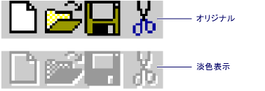
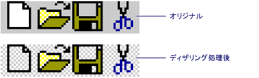

# <a name="gray-and-dithered-bitmap-functions"></a>淡色表示 (灰色) ビットマップ関数とディザリングされたビットマップ関数
**淡色表示 (灰色) ビットマップ関数**  
  
 MFC には、ビットマップのコントロールが無効になっていることを示すための 2 つの関数が用意されています。  
  
   
  
|||  
|-|-|  
|[AfxDrawGrayBitmap](#afxdrawgraybitmap)|灰色のバージョンのビットマップを描画します。|  
|[AfxGetGrayBitmap](#afxgetgraybitmap)|灰色のバージョンのビットマップをコピーします。|  
  
 **淡色表示 (灰色) ビットマップ関数**  
  
 MFC には、ビットマップの背景をディザリングされたパターンに置き換える 2 つの関数も用意されています。  
  
   
  
|||  
|-|-|  
|[AfxDrawDitheredBitmap](#afxdrawditheredbitmap)|背景がディザリングされたビットマップを描画します。|  
|[AfxGetDitheredBitmap](#afxgetditheredbitmap)|背景がディザリングされたビットマップをコピーします。|  
  
##  <a name="afxdrawgraybitmap"></a>  AfxDrawGrayBitmap  
 灰色のバージョンのビットマップを描画します。  
  
```   
void AFXAPI AfxDrawGrayBitmap(
    CDC* pDC,  
    int x,  
    int y,  
    const CBitmap& rSrc,  
    COLORREF crBackground); 
```  
  
### <a name="parameters"></a>パラメーター  
 `pDC`  
 宛先 DC を示します。  
  
 *x*  
 宛先の x 座標。  
  
 *y*  
 宛先の y 座標。  
  
 `rSrc`  
 元のビットマップ。  
  
 `crBackground`  
 新しい背景色 (通常は COLOR_MENU などの灰色)。  
  
### <a name="remarks"></a>コメント  
 `AfxDrawGrayBitmap` で描画されるビットマップの外観は、無効なコントロールになります。  
  
   
  
### <a name="example"></a>例  
 [!code-cpp[NVC_MFCDocView#191](../../mfc/codesnippet/cpp/gray-and-dithered-bitmap-functions_1.cpp)]  

### <a name="requirements"></a>必要条件  
 **ヘッダー:** afxwin.h  

##  <a name="afxgetgraybitmap"></a>  AfxGetGrayBitmap  
 灰色のバージョンのビットマップをコピーします。  
  
```   
void AFXAPI AfxGetGrayBitmap(
    const CBitmap& rSrc,  
    CBitmap* pDest,  
    COLORREF crBackground); 
```  
  
### <a name="parameters"></a>パラメーター  
 `rSrc`  
 元のビットマップ。  
  
 `pDest`  
 コピー先のビットマップ。  
  
 `crBackground`  
 新しい背景色 (通常は COLOR_MENU などの灰色)。  
  
### <a name="remarks"></a>コメント  
 `AfxGetGrayBitmap` でコピーされるビットマップの外観は、無効なコントロールのようになります。  
  
   
  
### <a name="example"></a>例  
 [!code-cpp[NVC_MFCDocView#193](../../mfc/codesnippet/cpp/gray-and-dithered-bitmap-functions_2.cpp)]  

### <a name="requirements"></a>必要条件  
 **ヘッダー:** afxwin.h  
  
##  <a name="afxdrawditheredbitmap"></a>  AfxDrawDitheredBitmap  
 その背景 (チェック) をディザリングされたパターンを置き換える、ビットマップを描画します。  
  
```   
void AFXAPI AfxDrawDitheredBitmap(
    CDC* pDC,  
    int x,  
    int y,  
    const CBitmap& rSrc,  
    COLORREF cr1  ,  
    COLORREF cr2); 
```  
  
### <a name="parameters"></a>パラメーター  
 `pDC`  
 宛先 DC を示します。  
  
 *x*  
 宛先の x 座標。  
  
 *y*  
 宛先の y 座標。  
  
 `rSrc`  
 元のビットマップ。  
  
 `cr1`  
 2 つのディザー カラーのいずれかの通常白色です。  
  
 `cr2`  
 その他のディザー色、通常の明るい灰色で示さ (COLOR_MENU)。  
  
### <a name="remarks"></a>コメント  
 2 色で宛先 DC 上に元のビットマップを描画 (`cr1`と`cr2`) チェッカー パターン ビットマップの背景。 元のビットマップの背景は、その白いピクセルとビットマップの左上隅にあるピクセルの色と一致するすべてのピクセルとして定義されます。  
  
   
  
### <a name="example"></a>例  
 [!code-cpp[NVC_MFCDocView#190](../../mfc/codesnippet/cpp/gray-and-dithered-bitmap-functions_3.cpp)]  

### <a name="requirements"></a>必要条件  
 **ヘッダー:** afxwin.h  


##  <a name="afxgetditheredbitmap"></a>  AfxGetDitheredBitmap  
 その背景 (チェック) をディザリングされたパターンを置き換える、ビットマップをコピーします。  
  
```   
void AFXAPI AfxGetDitheredBitmap(
    const CBitmap& rSrc,  
    CBitmap* pDest,  
    COLORREF cr1  ,  
    COLORREF cr2); 
```  
  
### <a name="parameters"></a>パラメーター  
 `rSrc`  
 元のビットマップ。  
  
 `pDest`  
 コピー先のビットマップ。  
  
 `cr1`  
 2 つのディザー カラーのいずれかの通常白色です。  
  
 `cr2`  
 その他のディザー色、通常の明るい灰色で示さ (COLOR_MENU)。  
  
### <a name="remarks"></a>コメント  
 元のビットマップを 2 色でコピー先ビットマップにコピー (`cr1`と`cr2`) 元のビットマップの背景に置き換えるチェッカーのパターン。 元のビットマップの背景は、その白いピクセルとビットマップの左上隅にあるピクセルの色と一致するすべてのピクセルとして定義されます。  
  
   
  
### <a name="example"></a>例  
 [!code-cpp[NVC_MFCDocView#192](../../mfc/codesnippet/cpp/gray-and-dithered-bitmap-functions_4.cpp)]  

### <a name="requirements"></a>必要条件  
 **ヘッダー:** afxwin.h  
  
## <a name="see-also"></a>参照  
 [マクロとグローバル](../../mfc/reference/mfc-macros-and-globals.md)
