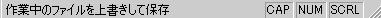

# MFC でのステータス バーの実装
[!INCLUDE[vs2017banner](../assembler/inline/includes/vs2017banner.md)]

[CStatusBar](../mfc/reference/cstatusbar-class.md) オブジェクトは、テキスト出力ペインの行を持つコントロール バーです。  出力ウィンドウには、メッセージ行とステータス インジケーターとしてよく使用されます。  例を示し、NumLock キー、ScrollLock キーなどのキーの状態を示すインジケーターと指定されたメニュー コマンドについて説明するヘルプ メニュー メッセージの行が含まれます。  
  
 MFC 4.0 以降では、ステータス バー コモン コントロールをカプセル化するクラス [CStatusBarCtrl](../mfc/reference/cstatusbarctrl-class.md)を使用して実装されます。  下位互換性に対して、クラス **COldStatusBar**で古いステータス バーの実装を保持します。  以前のバージョンの MFC のドキュメントは `CStatusBar`で **COldStatusBar** について説明します。  
  
 [CStatusBar::GetStatusBarCtrl](../Topic/CStatusBar::GetStatusBarCtrl.md)の MFC 4.0、割り当てに新しいメンバー関数ステータス バーのカスタマイズと追加機能の Windows コモン コントロールのサポートを利用できます。  `CStatusBar` の メンバー関数は、Windows コモン コントロールの機能の最もします; ただし、`GetStatusBarCtrl`を呼び出すと、ステータス バーにステータス バーの特性をさらに指定できます。  `GetStatusBarCtrl`を呼び出すと、`CStatusBarCtrl` オブジェクトへの参照を返します。  ステータス バー コントロールを操作するには、その参照を使用できます。  
  
 次の図は、複数のインジケーターを表示するステータス バーを示します。  
  
   
ステータス バー  
  
 ツール バーのように、ステータス バー オブジェクトが親フレーム ウィンドウにフレーム ウィンドウを作成するときに埋め込まれ、自動的に生成されます。  ステータス バーは、すべてのコントロール バーなど、親フレームが破棄されると同様に自動的に破棄されます。  
  
## さらに詳しくは次のトピックをクリックしてください  
  
-   [ステータス バーのペインのテキストの更新](../mfc/updating-the-text-of-a-status-bar-pane.md)  
  
-   MFC は [CStatusBar](../mfc/reference/cstatusbar-class.md) と [CStatusBarCtrl](../mfc/reference/cstatusbarctrl-class.md)を設定します。  
  
-   [コントロール バー](../Topic/Control%20Bars.md)  
  
-   [ダイアログ バー](../mfc/dialog-bars.md)  
  
-   [ツール バー \(MFC ツール バーの実装\)](../mfc/mfc-toolbar-implementation.md)  
  
## 参照  
 [ステータス バー](../mfc/status-bars.md)