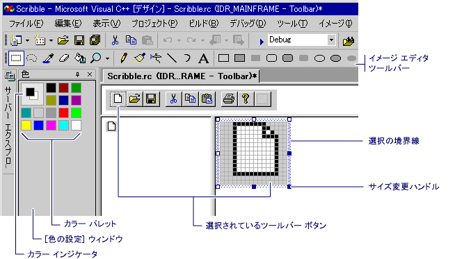

# Toolbar Editor
[!INCLUDE[vs2017banner](../assembler/inline/includes/vs2017banner.md)]

ツール バー エディターを使用すると、ツール バー リソースを作成し、ビットマップをツール バー リソースに変換できます。 ツールバー エディターはグラフィカルな表示を使用して、完成したアプリケーションの外観と非常によく似たツールバーとボタンを示します。  
  
 ツールバー エディターで、次の作業ができます。  
  
-   [新しいツールバーとボタンを作成する](../mfc/creating-new-toolbars.md)  
  
-   [ビットマップからツールバーのリソースに変換する](../mfc/converting-bitmaps-to-toolbars.md)  
  
-   [ツールバー ボタンを作成、移動、編集する](../mfc/creating-moving-and-editing-toolbar-buttons.md)  
  
-   [ツール ヒントを作成する](../mfc/creating-a-tool-tip-for-a-toolbar-button.md)  
  
 イメージ エディター ウィンドウと同じように、ツールバー エディター ウィンドウには、ボタン イメージの 2 つのビューが表示されます。 分割バーは、2 つのペインを分割します。 分割バーを左右にドラッグすると、ペインの相対サイズを変更できます。 アクティブなペインには、選択境界線が表示されます。 イメージの 2 つのビューの上にはサブジェクト ツールバーがあります。  
  
   
ツール バー エディター  
  
 ツールバー エディターは、イメージ エディターの機能に似ています。 メニュー項目、グラフィック ツール、ビットマップのグリッドは、イメージ エディター内のものと同じです。 イメージ メニューには、ツールバー エディターとイメージ エディターを切り替えるためのメニュー コマンドがあります。 グラフィック ツールバー、カラー パレット、またはイメージ メニューの使用の詳細については、「[イメージ エディター](../mfc/image-editor-for-icons.md)」を参照してください。  
  
 マネージ プロジェクトにリソースを追加する方法については、『*.NET Framework 開発者ガイド*』の「[アプリケーションのリソース](../Topic/Resources%20in%20Desktop%20Apps.md)」を参照してください。マネージ プロジェクトにリソース ファイルを手動で追加する方法、リソースへのアクセス方法、静的なリソースの表示方法、リソース文字列をプロパティに割り当てる方法については、「[チュートリアル : Windows フォームのローカリゼーション](http://msdn.microsoft.com/ja-jp/9a96220d-a19b-4de0-9f48-01e5d82679e5)」および「[Walkthrough: Using Resources for Localization with ASP.NET](../Topic/Walkthrough:%20Using%20Resources%20for%20Localization%20with%20ASP.NET.md)」をご覧ください。  
  
## 必要条件  
 MFC または ATL  
  
## 参照  
 [Resource Editors](../mfc/resource-editors.md)   
 [メニューとその他のリソース](http://msdn.microsoft.com/library/windows/desktop/ms632583.aspx)