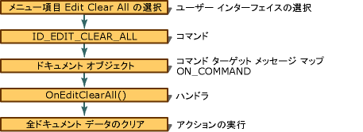

# ユーザー インターフェイス オブジェクトとコマンド ID
[!INCLUDE[vs2017banner](../assembler/inline/includes/vs2017banner.md)]

メニュー項目やツール バー ボタンとアクセラレータ キーはコマンドを生成できる「ユーザー インターフェイス オブジェクト」です。  そのような各ユーザー インターフェイス オブジェクトには id を指定します。  コマンドとオブジェクトとコマンドに同じ ID を割り当てることにより、ユーザー インターフェイス オブジェクトを関連付けます。  [メッセージ](../mfc/messages.md)"で説明しているように、特別なメッセージとして実装されます。  図では、「表示でフレームワークでフレームワークがコマンドの管理方法」を参照してください。  ユーザー インターフェイス オブジェクトを作成すると、そのコマンドは、`ID_EDIT_CLEAR_ALL`など、アプリケーション オブジェクトの 1 つがコマンドを処理します、ドキュメント オブジェクトの `OnEditClearAll` 関数はドキュメントのメッセージ マップによって—下の図に…呼び出されます。  
  
   
フレームワーク内のコマンド  
  
 MFC は、メニュー項目とツール バー ボタンなどのユーザー インターフェイス オブジェクトをどのように更新するか図「表示でフレームワークの」更新するコマンド。  中のドロップダウン メニューの前、またはツール バー ボタンの場合はアイドル ループ、MFC は更新コマンドをルーティングします。  次の図は、ドキュメント オブジェクトは、ユーザー インターフェイス オブジェクトを有効または無効にするように更新コマンド ハンドラー、`OnUpdateEditClearAll`、照会します。  
  
   
フレームワーク内のコマンド更新  
  
## 参照  
 [フレームワークのメッセージとコマンド](../mfc/messages-and-commands-in-the-framework.md)