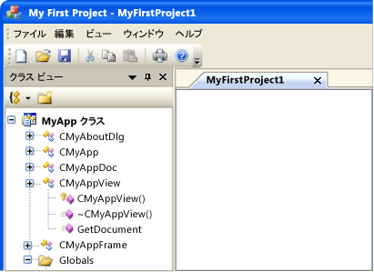
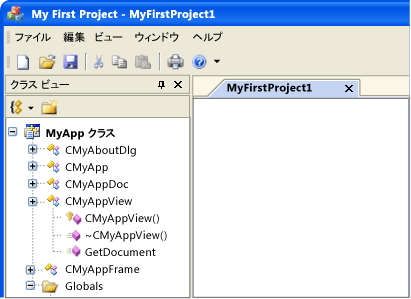
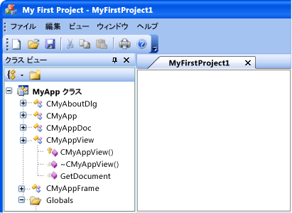
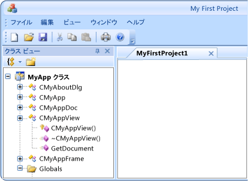

# ビジュアル マネージャー
[!INCLUDE[vs2017banner](../assembler/inline/includes/vs2017banner.md)]

ビジュアル マネージャーは、アプリケーション全体の外観を制御するオブジェクトです。  単一のクラスとして動作し、これにアプリケーションの描画コードをすべて配置できます。  MFC ライブラリには、複数のビジュアル マネージャーがあります。  アプリケーションのカスタム ビューを作成する場合、独自のビジュアル マネージャーも作成できます。  異なるビジュアル マネージャーが有効になっている同じアプリケーションを次の図に示します。  
  
   
CMFCVisualManagerWindows ビジュアル マネージャーを使用する MyApp  
  
   
CMFCVisualManagerVS2005 ビジュアル マネージャーを使用する MyApp  
  
   
CMFCVisualManagerOfficeXP ビジュアル マネージャーを使用する MyApp  
  
   
CMFCVisualManagerOffice2003 ビジュアル マネージャーを使用する MyApp  
  
   
CMFCVisualManagerOffice2007 ビジュアル マネージャーを使用する MyApp  
  
 既定では、ビジュアル マネージャーは複数の GUI 要素の描画コードを保持します。  カスタム UI 要素を用意するには、ビジュアル マネージャーの関連する描画メソッドをオーバーライドする必要があります。  これらのメソッドの一覧については、「[CMFCVisualManager クラス](../mfc/reference/cmfcvisualmanager-class.md)」を参照してください。  独自の外観を用意するためにオーバーライドできるメソッドはすべて `OnDraw` で始まるメソッドです。  
  
 アプリケーションが保持できる `CMFCVisualManager` オブジェクトは 1 つだけです。  アプリケーションのビジュアル マネージャーへのポインターを取得するには、静的関数である [CMFCVisualManager::GetInstance](../Topic/CMFCVisualManager::GetInstance.md) を呼び出します。  すべてのビジュアル マネージャーは `CMFCVisualManager` を継承するので、カスタム ビジュアル マネージャーを作成した場合でも、`CMFCVisualManager::GetInstance` メソッドで該当するビジュアル マネージャーへのポインターを取得できます。  
  
 カスタム ビジュアル マネージャーを作成する場合、既に存在するビジュアル マネージャーから派生させる必要があります。  派生元の既定のクラスは `CMFCVisualManager` です。  ただし、別のビジュアル マネージャーがアプリケーションと類似している場合、そのビジュアル マネージャーを派生元として使用できます。  たとえば、`CMFCVisualManagerOffice2007` ビジュアル マネージャーを使用する場合で、区分線の外観のみを変更する場合は、`CMFCVisualManagerOffice2007` からカスタム クラスを派生させることができます。  このシナリオでは、区分線を描画するメソッドのみオーバーライドする必要があります。  
  
 アプリケーションで特定のビジュアル マネージャーを使用する方法は 2 つあります。  1 つは、[CMFCVisualManager::SetDefaultManager](../Topic/CMFCVisualManager::SetDefaultManager.md) メソッドを呼び出し、該当するビジュアル マネージャーをパラメーターとして渡す方法です。  このメソッドにより `CMFCVisualManagerVS2005` ビジュアル マネージャーを使用する方法を次のコード例に示します。  
  
```  
CMFCVisualManager::SetDefaultManager (RUNTIME_CLASS (CMFCVisualManagerVS2005));  
```  
  
 アプリケーションでビジュアル マネージャーを使用するもう 1 つの方法は、ビジュアル マネージャーを手動で作成する方法です。  アプリケーションはこの新しいビジュアル マネージャーを使用してすべての描画処理を実行します。  ただし、使用できる `CMFCVisualManager` オブジェクトはアプリケーションにつき 1 つのみであるため、新しいビジュアル マネージャーを作成する前に、現在のビジュアル マネージャーを削除する必要があります。  次の例の `CMyVisualManager` は、`CMFCVisualManager` から派生させたカスタム ビジュアル マネージャーです。  以下のメソッドは、インデックスに基づいて、アプリケーションを表示するのに使用するビジュアル マネージャーを変更します。  
  
```  
void CMyApp::SetSkin (int index)  
{  
   if (CMFCVisualManager::GetInstance() != NULL)  
   {  
      delete CMFCVisualManager::GetInstance();  
   }  
  
   switch (index)  
   {  
   case DEFAULT_STYLE:  
      // The following statement creates a new CMFCVisualManager  
      CMFCVisualManager::GetInstance();  
      break;  
  
   case CUSTOM_STYLE:  
      new CMyVisualManager;  
      break;  
  
   default:  
      CMFCVisualManager::GetInstance();  
      break;  
   }  
  
   CMFCVisualManager::GetInstance()->RedrawAll();  
}  
```  
  
## 参照  
 [ユーザー インターフェイス要素](../mfc/user-interface-elements-mfc.md)   
 [CMFCVisualManager クラス](../mfc/reference/cmfcvisualmanager-class.md)