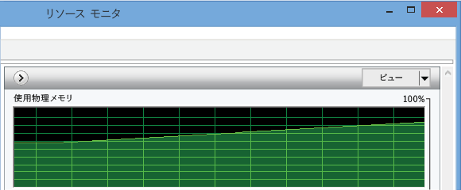
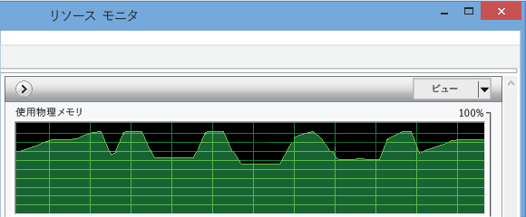
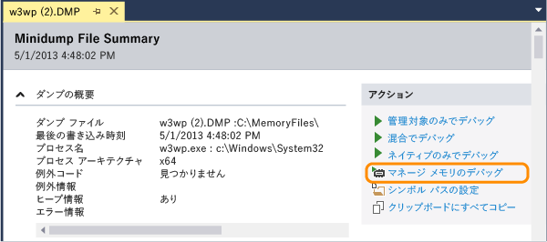
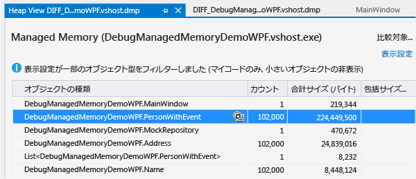
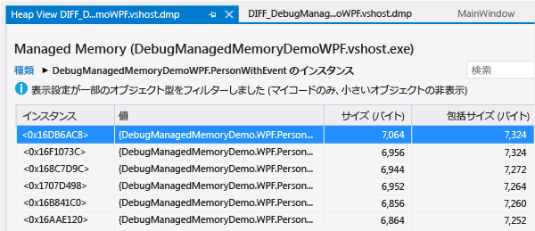
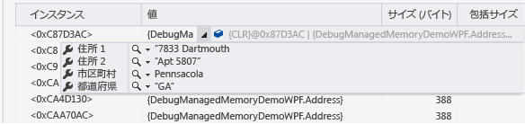
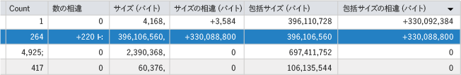

# .Net Framework のメモリ分析の問題
Visual Studio マネージ メモリ アナライザーを使用して、.NET Framework コードでのメモリ リークおよび非効率的なメモリの使用を検出します。  対象コードの最低限の .NET Framework バージョンは .NET Framework 4.5 です。  
  
 このメモリ分析ツールでは、アプリのメモリ内にあるオブジェクトのコピーである*ヒープ データ付きダンプ ファイル*の情報が分析されます。  ダンプ \(.dmp\) ファイルは、Visual Studio IDE から収集することも、その他のシステム ツールを使用して収集することもできます。  
  
-   単一のスナップショットを分析することにより、オブジェクト型のメモリ使用に対する相対的な影響を理解し、アプリ内でメモリが効率的に使用されていないコードを検出することができます。  
  
-   アプリの 2 つのスナップショットを比較 \(*diff*\) することにより、コード内で時間の経過に伴ってメモリ使用量が増加している箇所を検出することもできます。  
  
 マネージ メモリ アナライザーのチュートリアルについては、Visual Studio ALM \+ Team Foundation Server ブログの「[Using Visual Studio 2013 to Diagnose .NET Memory Issues in Production \(Visual Studio 2013 を使用した、実稼働での .NET メモリ問題の診断\)](http://blogs.msdn.com/b/visualstudioalm/archive/2013/06/20/using-visual-studio-2013-to-diagnose-net-memory-issues-in-production.aspx)」を参照してください。  
  
##   内容  
 [.NET Framework アプリでのメモリ使用](#BKMK_Memory_use_in__NET_Framework_apps)  
  
 [アプリ内でのメモリに関する問題の特定](#BKMK_Identify_a_memory_issue_in_an_app)  
  
 [メモリのスナップショットの収集](#BKMK_Collect_memory_snapshots)  
  
 [メモリ使用量の分析](#BKMK_Analyze_memory_use)  
  
##   .NET Framework アプリでのメモリ使用  
 .NET Framework はガベージ コレクションが実行されるランタイムであるため、ほとんどのアプリでメモリの使用が問題になりません。  ただし、Web サービスや Web アプリケーションなどの長時間実行されるアプリケーションおよびメモリ量に制限があるデバイスでは、メモリ内にオブジェクトが蓄積されると、アプリのパフォーマンスや、そのアプリを実行するデバイスのパフォーマンスに影響することがあります。  メモリが過剰に使用されると、ガベージ コレクターの実行頻度が高すぎる場合や、オペレーティング システムが RAM とディスクとの間でメモリを移動せざるを得ない場合、アプリケーションやコンピューターのリソースが不足する可能性があります。  最悪の場合、"メモリ不足" 例外によってアプリがクラッシュすることもあります。  
  
 .NET の*マネージ ヒープ*は、アプリによって作成された参照オブジェクトが格納される仮想メモリの領域です。  オブジェクトの有効期間はガベージ コレクター \(GC\) によって管理されます。  ガベージ コレクターは参照を使用して、メモリ ブロックを占有するオブジェクトを追跡します。  参照は、オブジェクトが作成され変数に割り当てられると、作成されます。  単一のオブジェクトに対して、複数の参照を作成することもできます。  たとえば、クラス、コレクション、またはその他のデータ構造にオブジェクトを追加するか、2 つ目の変数にオブジェクトを割り当てると、オブジェクトへの追加の参照が作成されます。  明示的な方法ではありませんが、あるオブジェクトでイベント ハンドラーを別のオブジェクトのイベントに追加した場合も、参照が作成されます。  この場合、ハンドラーが明示的に削除されるか 2 つ目のオブジェクトが破棄されるまで、最初のオブジェクトへの参照が 2 つ目のオブジェクトに保持されます。  
  
 各アプリケーションについて、GC では、アプリケーションから参照されるオブジェクトを追跡する参照ツリーが管理されます。  *参照ツリー*には、ルートのセットがあります。これにはグローバル オブジェクトおよび静的オブジェクト、関連付けられたスレッドのスタック、動的にインスタンス化されたオブジェクトが含まれます。  オブジェクトへの参照を持つ 1 つ以上の親オブジェクトがある場合、そのオブジェクトではルートが作成されます。  GC は、アプリケーション内の他のオブジェクトまたは変数から参照されていない場合にのみ、そのオブジェクトのメモリを再利用できます。  
  
  [内容](#BKMK_Contents)  
  
##   アプリ内でのメモリに関する問題の特定  
 メモリに関する問題の最も可視的な兆候は、アプリのパフォーマンスです \(特に、時間の経過に伴ってパフォーマンスが低下する場合\)。  特定のアプリの実行中に他のアプリのパフォーマンスが低下した場合も、メモリの問題を示している可能性があります。  メモリの問題が疑われる場合は、タスク マネージャーや [Windows パフォーマンス モニター](http://technet.microsoft.com/library/cc749249.aspx)などのツールを使用して、調査を進めます。  たとえば、考えられるメモリ リークの原因として、説明が付かないような合計メモリ サイズの増加がないか確認します。  
  
   
  
 また、コードについて認識しているより明らかに大きいメモリ スパイクに気付くことがあります。このような場合は、プロシージャ内での非効率的なメモリの使用を示している可能性があります。  
  
   
  
##   メモリのスナップショットの収集  
 メモリ分析ツールでは、ヒープ情報が含まれた*ダンプ ファイル*の情報を分析します。  Visual Studio でダンプ ファイルを作成することも、[Windows Sysinternals](http://technet.microsoft.com/sysinternals) の [ProcDump](http://technet.microsoft.com/sysinternals/dd996900.aspx) などのツールを使用することもできます。  Visual Studio デバッガー チーム ブログの「[What is a dump, and how do I create one? \(ダンプの概要と作成方法\)](http://blogs.msdn.com/b/debugger/archive/2009/12/30/what-is-a-dump-and-how-do-i-create-one.aspx)」を参照してください。  
  
> [!NOTE]
>  ほとんどのツールでは、完全なヒープ メモリ データの有無に関係なくダンプ情報を収集できます。  Visual Studio メモリ アナライザーでは、完全なヒープ情報が求められます。  
  
 **Visual Studio からダンプを収集するには**  
  
1.  Visual Studio プロジェクトから開始されたプロセスのダンプ ファイルを作成することも、実行中のプロセスにデバッガーをアタッチすることもできます。  「[実行中のプロセスへのアタッチ](../Topic/Attach%20to%20Running%20Processes%20with%20the%20Visual%20Studio%20Debugger.md)」を参照してください。  
  
2.  実行を停止します。  デバッガーは、**\[デバッグ\]** メニューの **\[すべて中断\]** が選択された場合や、例外の発生時またはブレークポイントで停止します。  
  
3.  **\[デバッグ\]** メニューの **\[名前を付けてダンプを保存\]** をクリックします。  **\[名前を付けてダンプを保存\]** ダイアログ ボックスで場所を指定し、**\[ファイルの種類\]** ボックスの一覧で **\[ヒープ付きミニダンプ\]** \(既定\) が選択されていることを確認します。  
  
 **2 つのメモリ スナップショットを比較するには**  
  
 アプリでのメモリ使用量の増加を分析するには、アプリの単一インスタンスから 2 つのダンプ ファイルを収集します。  
  
  [内容](#BKMK_Contents)  
  
##   メモリ使用量の分析  
 [オブジェクト一覧のフィルター処理](#BKMK_Filter_the_list_of_objects) **&#124;** [単一スナップショットからのメモリ データの分析](#BKMK_Analyze_memory_data_in_from_a_single_snapshot) **&#124;** [2 つのメモリ スナップショットの比較](#BKMK_Compare_two_memory_snapshots)  
  
 ダンプ ファイルでメモリ使用に関する問題を分析するには:  
  
1.  Visual Studio で、**\[ファイル\]**、**\[開く\]** の順にクリックし、ダンプ ファイルを指定します。  
  
2.  **\[ミニダンプ ファイルの概要\]** ページで、**\[マネージ メモリのデバッグ\]** をクリックします。  
  
       
  
 メモリ アナライザーによるデバッグ セッションが開始し、ファイルの分析が行われ、\[ヒープの表示\] ページに結果が表示されます。  
  
  [内容](#BKMK_Contents)  
  
###   オブジェクト一覧のフィルター処理  
 メモリ アナライザーの既定では、メモリ スナップショット内のオブジェクト一覧がフィルター処理されます。これにより、ユーザー コードの型とインスタンスのみを対象とし、合計ヒープ サイズのパーセンテージで表したしきい値を超える合計包括サイズの型のみが表示されます。  **\[表示設定\]** の一覧で、これらのオプションを変更することもできます。  
  
|||  
|-|-|  
|**マイ コードのみを有効にする**|\[マイ コードのみ\] では、独自に作成した型のみを一覧に表示するために、ほとんどの一般的なシステム オブジェクトが非表示になります。   \[マイ コードのみ\] オプションは、Visual Studio の **\[オプション\]** ダイアログ ボックスで設定することもできます。  **\[デバッグ\]** メニューの **\[オプションと設定\]** をクリックします。  **\[デバッグ\]**\/**\[全般\]** タブで、**\[マイ コードのみ\]** チェック ボックスをオンまたはオフにします。|  
|**小さいオブジェクトの非表示**|**\[小さいオブジェクトの非表示\]** では、合計包括サイズが合計ヒープ サイズの 0.5% 未満であるすべての型が非表示になります。|  
  
 また **\[検索\]** ボックスに文字列を入力することによって、型の一覧をフィルター処理することもできます。  一覧には、この文字列が名前に含まれる型のみが表示されます。  
  
  [内容](#BKMK_Contents)  
  
###   単一スナップショットからのメモリ データの分析  
 Visual Studio による新しいデバッグ セッションが開始し、ファイルの分析が行われ、\[ヒープの表示\] ページにメモリ データが表示されます。  
  
   
  
  [内容](#BKMK_Contents)  
  
#### オブジェクトの型テーブル  
 最上部のテーブルには、メモリ内に保持されているオブジェクトの型が一覧表示されます。  
  
-   **\[データの個数\]** には、スナップショット内の型のインスタンス数が示されます。  
  
-   **\[サイズ \(バイト\)\]** は、参照先オブジェクトのサイズを除く、型の全インスタンスのサイズです。  
  
-   **\[包括サイズ \(バイト\)\]** には、参照先オブジェクトのサイズも含まれます。  
  
 **\[オブジェクトの型\]** 列のインスタンス アイコン \(\) を選択すると、その型のインスタンスのリストを表示できます。  
  
#### インスタンス テーブル  
   
  
-   **\[インスタンス\]** は、オブジェクトのオブジェクト ID として機能する、オブジェクトのメモリ位置です。  
  
-   **\[値\]** は、値型の実際の値を示します。  参照される型の名前の上にポインターを合わせると、データヒントでそのデータ値を確認できます。  
  
       
  
-   **\[サイズ \(バイト\)\]** は、参照先オブジェクトのサイズを除く、オブジェクトのサイズです。  
  
-   **\[包括サイズ \(バイト\)\]** には、参照先オブジェクトのサイズも含まれます。  
  
 既定では、型とインスタンスは **\[包括サイズ \(バイト\)\]** 順に並べ替えられます。  並べ替え順序を変更するには、一覧の列ヘッダーを選択します。  
  
#### ルートのパス  
  
-   **\[オブジェクトの型\]** テーブルから型を選択した場合、**\[ルートのパス\]** テーブルには、固有の型階層が示されます。この階層では、型のすべてのオブジェクトからルート オブジェクトまでが示され、階層内で上位にある型への参照数も示されます。  
  
-   型のインスタンスからオブジェクトを選択した場合、**\[ルートのパス\]** には、そのインスタンスへの参照を保持する実際のオブジェクトのグラフが示されます。  オブジェクトの名前の上にポインターを合わせると、データヒントでそのデータ値を確認できます。  
  
#### 参照される型\/参照されるオブジェクト  
  
-   **\[オブジェクトの型\]** テーブルから型を選択した場合、**\[参照される型\]** タブには、選択された型のすべてのオブジェクトに保持されている参照される型のサイズと数が示されます。  
  
-   型のインスタンスを選択した場合、**\[参照される型\]** には、選択されたインスタンスに保持されているオブジェクトが示されます。  名前の上にポインターを合わせると、データヒントでそのデータ値を確認できます。  
  
 **循環参照**  
  
 オブジェクトでは、直接的または間接的に 1 つ目のオブジェクトへの参照を保持する 2 つ目のオブジェクトを参照している可能性があります。  メモリ アナライザーは、このような状況を検出すると、参照パスの展開を中止し、1 つ目のオブジェクトの表示に **"循環が検出されました"** という注釈を追加して、停止します。  
  
 **ルート型**  
  
 メモリ アナライザーでは、保持されている参照の種類を示す注釈がルート オブジェクトに追加されます。  
  
|注釈|説明|  
|--------|--------|  
|**静的変数** `VariableName`|静的変数。  `VariableName` は変数の名前です。|  
|**終了処理ハンドル**|ファイナライザー キューからの参照。|  
|**ローカル変数**|ローカル変数。|  
|**強力なハンドル**|オブジェクト ハンドル テーブルからの強い参照へのハンドル。|  
|**非同期   固定ハンドル**|オブジェクト ハンドル テーブルからの非同期固定オブジェクト。|  
|**依存ハンドル**|オブジェクト ハンドル テーブルからの依存オブジェクト。|  
|**固定ハンドル**|オブジェクト ハンドル テーブルからの固定された強い参照。|  
|**RefCount ハンドル**|オブジェクト ハンドル テーブルからの参照カウントされたオブジェクト。|  
|**SizedRef ハンドル**|ガベージ コレクション時に、すべてのオブジェクトおよびオブジェクト ルートの集合的なクロージャの概算サイズを保持する強力なハンドル。|  
|**ピンされたローカル変数**|ピンされたローカル変数。|  
  
###   2 つのメモリ スナップショットの比較  
 メモリ リークの原因である可能性のあるオブジェクトを見つけるために、プロセスに関する 2 つのダンプ ファイルを比較できます。  リークしているオブジェクトの数の増加をわかりやすくするために、1 つ目 \(1 回目\) と 2 つ目 \(2 回目\) のファイルを収集する時間間隔は十分長くする必要があります。  2 つのファイルを比較するには:  
  
1.  2 つ目のダンプ ファイルを開き、**\[ミニダンプ ファイルの概要\]** ページの **\[マネージ メモリのデバッグ\]** を選択します。  
  
2.  メモリ分析レポート ページで、**\[ベースラインの選択\]** の一覧を開き、**\[参照\]** をクリックして、1 つ目のダンプ ファイルを指定します。  
  
 アナライザーは、レポート上部のペインに列を追加します。これらの列には、型の **\[データの個数\]**、**\[サイズ\]**、および **\[包括サイズ \(バイト\)\]** と、1 回目のスナップショットの対応する値との差異が表示されます。  
  
   
  
 **\[ルートのパス\]** テーブルにも **\[参照数の相違\]** 列が追加されます。  
  
  [内容](#BKMK_Contents)  
  
## 参照  
 [VS ALM TFS Blog: Using Visual Studio 2013 to Diagnose .NET Memory Issues in Production \(VS ALM TFS ブログ: Visual Studio 2013 を使用した、実稼働での .NET メモリ問題の診断\)](http://blogs.msdn.com/b/visualstudioalm/archive/2013/06/20/using-visual-studio-2013-to-diagnose-net-memory-issues-in-production.aspx)   
 [Channel 9 &#124; Visual Studio TV &#124; Managed Memory Analysis \(Channel 9 &#124; Visual Studio TV &#124; マネージ メモリの分析\)](http://channel9.msdn.com/Series/Visual-Studio-2012-Premium-and-Ultimate-Overview/Managed-Memory-Analysis)   
 [Channel 9 &#124; Visual Studio Toolbox &#124; Managed Memory Analysis in Visual Studio 2013 \(Channel 9 &#124; Visual Studio ツールボックス &#124; Visual Studio 2013 でのマネージ メモリの分析\)](http://channel9.msdn.com/Shows/Visual-Studio-Toolbox/Managed-Memory-Analysis-in-Visual-Studio-2013)