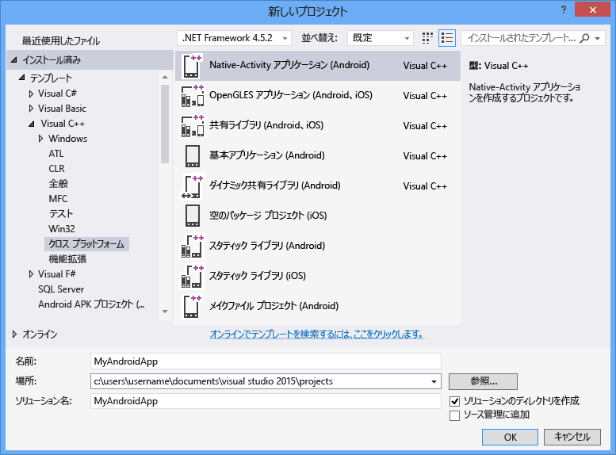

# Visual C++ を使ったクロスプラットフォーム アプリをビルドする
Visual C\+\+ for Cross\-Platform Mobile Development を使用すると、Android、iOS、および Windows デバイス向けのクロスプラットフォーム コードを構築できます。  これは、Visual C\+\+ を使用して iOS、Android、および Windows 用のコードをクロスプラットフォームで開発できるようにする、Visual Studio 2015 で使用可能なオプションの機能です。  
  
 Visual Studio を使用して、従来の Windows アプリケーション、ユニバーサル Windows アプリ、iOS、および Android の各プラットフォーム用に、標準 C\+\+ コードの共有ライブラリをビルドできます。  Visual C\+\+ と、Visual Studio に統合されたサード パーティ製ツールのみを使用して、Windows プラットフォームおよび Android プラットフォーム用のネイティブ アプリをビルドできます。  Mac コンピューターをお持ちの場合は、Visual Studio を使用して、Mac にビルドおよび配置された iOS アプリで C\+\+ コードを作成およびデバッグすることができます。  
  
> [!NOTE]
>  Visual C\+\+ for Cross\-Platform Mobile Development ですぐに利用できるサポートは、Android API レベル 19 および 21、対象となる Android 4.4 および 5.0 です。  その他の API レベルは、SDK Manager と一緒にインストールできます。  Visual Studio C\+\+ Android のデバッガーは、少なくとも Android API レベル 17 \(バージョン 4.2\) またはそれ以降で稼働している対象のエミュレーターまたはデバイスが必要です。  
  
 この記事では、Visual Studio 2015 の Visual C\+\+ for Cross\-Platform Mobile Development を使用してクロスプラットフォーム アプリの作成を始める方法を説明します。  
  
 [要件](#req)   
 [ツールの取得](#GetTools)  
 [Android NativeActivity プロジェクトの新規作成](#Create)  
 [既定の Android NativeActivity アプリのビルドと実行](#BuildHello)  
  
##   要件  
  
-   インストール要件については、「[Visual Studio 2015 のシステム要件](https://www.visualstudio.com/visual-studio-2015-system-requirements-vs)」を参照してください。  
  
    > [!IMPORTANT]
    >  Windows 7 または Windows Server 2008 R2 を使用している場合は、従来の Windows アプリケーション、Android NativeActivity アプリとコード ライブラリ、および iOS 用のアプリとコード ライブラリのためのコードを開発できますが、Windows ストア アプリまたはユニバーサル Windows アプリのコードは開発できません。  
  
 特定のデバイス プラットフォームのアプリをビルドするには、いくつかの追加要件があります。  
  
-   Visual Studio Emulator for Android および Windows Phone エミュレーターには、Hyper\-V を実行できるコンピューターが必要です。  詳細については、エミュレーターの「[システム要件](http://msdn.microsoft.com/ja-jp/4d5bb438-231a-4cd2-84b7-e9660b0e3baf)」を参照してください。  
  
-   Android SDK に付属している x86 Android エミュレーターは、Intel HAXM ドライバーを実行できるコンピューター向けに最適化されています。  このドライバーには、VT\-x および Execute Disable Bit をサポートしている Intel x64 プロセッサが必要です。  詳細については、「[Intel® Hardware Accelerated Execution Manager のインストール手順 \- Microsoft Windows](http://go.microsoft.com/fwlink/p/?LinkId=536385)」を参照してください。  
  
-   iOS 用アプリの構築には、iOS Developer Program アカウントと、Xcode 6 を実行できる Mac コンピューターが必要です。  
  
##   ツールの取得  
 Visual C\+\+ for Cross\-Platform Mobile Development は、Visual Studio 2015 に付属しているオプションのコンポーネントです。  Visual Studio を入手するには、「[Visual Studio 2015 ダウンロード](http://go.microsoft.com/fwlink/?linkid=517106)」のページにアクセスして、Visual Studio 2015 をインストールしてください。  
  
 Visual Studio 2015 のインストーラーには、クロスプラットフォーム モバイル開発をサポートするオプションが含まれています。  これには、Visual C\+\+ Mobile Development と、次の一般的なツールおよびソフトウェア開発キットをインストールするオプションが含まれます。  これらのオプションのほとんどは、クロスプラットフォームのサポートに必要なオープン ソースのソフトウェアです。  
  
-   Android Native Development Kit \(R10E、32 ビット\) は、Android のビルド プロセスに必要です。  
  
-   Android SDK、Apache Ant、および Java SE Development Kit は、Android のビルド プロセスに必要です。  
  
-   Microsoft Visual Studio Emulator for Android は、Android の開発に対応した高速のエミュレーターです。  
  
 詳細なインストール手順については、「[Visual C\+\+ for Cross\-Platform Mobile Development のインストール](../Topic/Install%20Visual%20C++%20for%20Cross-Platform%20Mobile%20Development.md)」を参照してください。  
  
 iOS 用のコードをビルドするには、ご使用の Mac でリモート ビルド エージェントをセットアップして構成し、Visual Studio 内でそれに接続する必要があります。  インストール手順と構成手順の詳細については、「[iOS を使用してビルドするためのツールのインストールおよび構成](../Topic/Install%20And%20Configure%20Tools%20to%20Build%20using%20iOS.md)」を参照してください。  
  
##   Android NativeActivity プロジェクトの新規作成  
 Visual C\+\+ for Cross\-Platform Mobile Development を使用すると、C\+\+ を使用して Android アプリ全体の作成、ビルド、実行、およびデバッグを実行できます。  Visual Studio には、作業の開始に役立つ Android Native Activity プロジェクトのテンプレートが含まれています。  
  
 このチュートリアルでは、最初に新しいプロジェクトを作成し、次に既定のアプリをビルドして実行します。  
  
 新しいプロジェクトを作成する前に、すべてのシステム要件を満たし、Visual Studio 用の Visual C\+\+ for Cross\-Platform Mobile Development をインストールしたことを確認します。  詳細については、「[Visual C\+\+ for Cross\-Platform Mobile Development のインストール](../Topic/Install%20Visual%20C++%20for%20Cross-Platform%20Mobile%20Development.md)」を参照してください。  
  
#### 新しいプロジェクトを作成するには  
  
1.  Visual Studio を開きます。  メニュー バーで **\[ファイル\]**、**\[新規\]**、**\[プロジェクト\]** の順にクリックします。  
  
2.  **\[新しいプロジェクト\]** ダイアログ ボックスの **\[テンプレート\]** で **\[Visual C\+\+\]**、**\[Cross Platform\]** の順に選択し、**\[Native\-Activity Application \(Android\)\]** テンプレートを選択します。  
  
3.  アプリに `MyAndroidApp` などの名前を付け、**\[OK\]** を選択します。  
  
       
  
     Visual Studio は新しいソリューションを作成し、ソリューション エクスプローラーを開きます。  
  
 新しい Android ネイティブ アクティビティ アプリのソリューションには、次の 2 つのプロジェクトが含まれています。  
  
-   **MyAndroidApp.NativeActivity** には、アプリが Android 上でネイティブ アクティビティとして動作するための参照とグルー コードが含まれています。  グルー コードからのエントリ ポイントの実装は main.cpp にあります。  プリコンパイル済みヘッダーは pch.h にあります。  アプリ プロジェクトは、共有ライブラリ \(.so\) ファイルにコンパイルされ、Packaging プロジェクトで使用されます。  
  
-   **MyAndroidApp.Packaging** は、Android デバイスまたはエミュレーターに配置するパッケージ化 \(.apk\) ファイルを作成します。  これには、リソースと、マニフェスト プロパティを設定する AndroidManifest.xml ファイルが含まれています。  Ant のビルド プロセスを制御する build.xml も含まれています。  それは既定でスタートアップ プロジェクトとして設定されているため、Visual Studio から直接、配置して実行できます。  
  
##   既定の Android NativeActivity アプリのビルドと実行  
 テンプレートによって生成されたアプリをビルドして実行し、インストールとセットアップを確認します。  既定では、テンプレートは Microsoft Visual Studio Emulator for Android でアプリを実行するために、ソリューション構成を Debug に設定し、ソリューション プラットフォームを x86 に設定します。  別の対象でアプリをテストする場合は、対象のエミュレーターを読み込むか、デバイスをコンピューターに接続します。  
  
#### 既定の NativeActivity アプリをビルドして実行するには  
  
1.  メニュー バーの **\[ビルド\]**、**\[ソリューションのビルド\]** の順にクリックします。  
  
     ソリューションに含まれる 2 つのプロジェクトのビルド プロセスの出力が **\[出力\]** ウィンドウに表示されます。  
  
2.  配置ターゲットとして、いずれかの VS エミュレーター プロファイルを選択します。  
  
     別のエミュレーターをインストールしてあるか、Android デバイスを接続してある場合は、配置対象のドロップダウン リストからそれらを選択できます。  
  
3.  F5 キーを押してデバッグを開始するか、Shift キーを押しながら F5 キーを押してデバッグなしで開始します。  
  
     Visual Studio Emulator for Android で、既定のアプリが次のように表示されます。  
  
       
  
    > [!TIP]
    >  Visual Studio によってエミュレーターが起動されます。コードを読み込んで配置するのに数秒かかります。  アプリが開始されると、ブレークポイントの設定や、デバッガーを使用したステップ実行、ローカルの確認、値のウォッチができるようになります。  
  
4.  Shift キーを押しながら F5 キーを押してデバッグを停止します。  
  
     エミュレーターは実行され続ける独立したプロセスです。  同じエミュレーターに対して、コードを何度も編集、コンパイル、配置できます。  
  
## 参照  
 [Visual Studio 2015 のダウンロード](http://go.microsoft.com/fwlink/?linkid=517106)